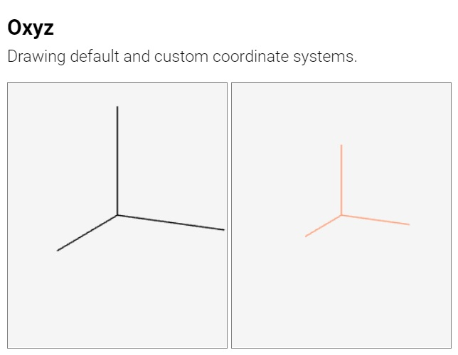

# Suica Examples

## Minimal example

[<kbd></kbd>](https://boytchev.github.io/suica/examples/minimal-example.html)

## Starting Suica examples

[<kbd></kbd>](https://boytchev.github.io/suica/examples/canvas-name.html)

[<kbd></kbd>](https://boytchev.github.io/suica/examples/canvas-size.html)

[<kbd></kbd>](https://boytchev.github.io/suica/examples/canvas-color.html)

[<kbd></kbd>](https://boytchev.github.io/suica/examples/canvas-color-dynamic.html)

[<kbd></kbd>](https://boytchev.github.io/suica/examples/oxyz.html)
