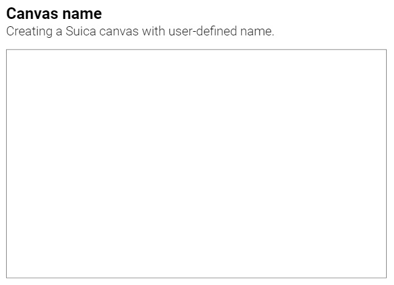
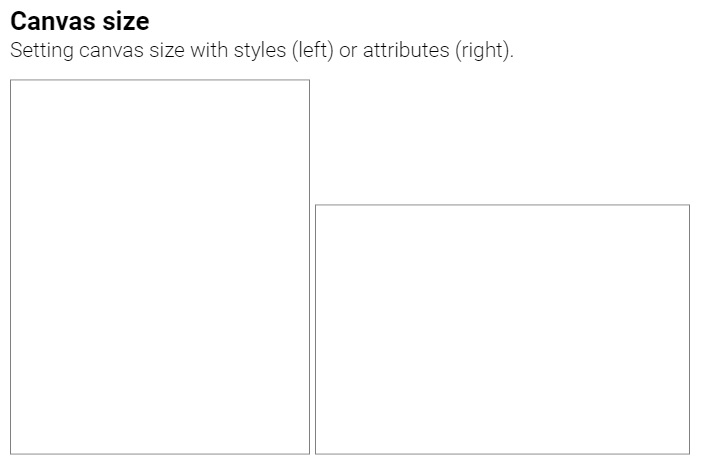
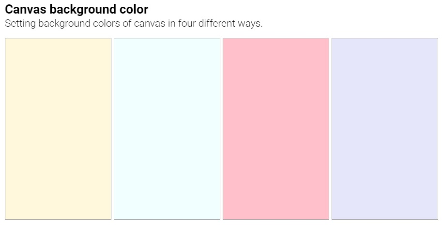
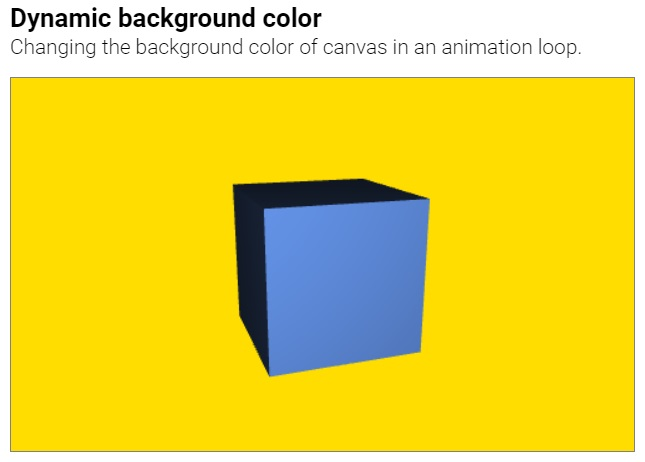

# Suica

## Table of contents

- [Minimal example](#minimal-example)
- [Starting Suica](#starting-suica) <small>[ [name](#canvas-name), [size](#canvas-size), [color](#canvas-color) ]</small>
- [Reference table](#reference-table)


## Minimal example

Suica provides a simple-to-write-and-easy-to-understand generation of basic 3D
graphics. This is achieved by axiomatic functionality which is sufficient to
build more complex 3D scenes and animations.  

Here is a minimal example showing a rotating cube in the browser (click on the
image to run the example):

[<kbd></kbd>](https://boytchev.github.io/suica/examples/minimal-example.html)

The complete code of this example is:

```html
<!DOCTYPE html>

<script src="suica.js"></script>

<suica>
	<cube>
	<demo>
</suica>
```

where `DOCTYPE` defines that the web page contains HTML5, `script` loads Suica,
`suica` creates the drawing canvas, `cube` adds a cube in it and `demo`
activates the demo mode.

_**Note**: Tools that check the validity of HTML in web pages should complain
about this minimal example, as it contains non-standard tags, skips some
essential tags and does not close all opened tags._


## Starting Suica

### Canvas name
Suica is a JavaScript library. It generates 3D images and animations in a canvas
inside the non-standard HTML tag `<suica>`. Each canvas created by Suica has a
name. By default the names are `suica0`, `suica1`, `suica2` and so on. If the
attribute `id` of `<suica>` is present, then its value is used as a name:

```html
<suica id="one">
```

[<kbd></kbd>](https://boytchev.github.io/suica/examples/canvas-name.html)

_**Note**: For each canvas Suica defines a global JS variable with the same
name. This variable can be used to access canvas properties and methods._


### Canvas size
The size of the canvas is defined by `width` and `height` either as CSS
properties (using CSS units), or as `<suica>` attributes (always in pixels).

```html
<suica style="width:15em; height:300px;">
```

```html
<suica width="300" height="200">
```

The following example defines two canvases with different sizes:

[<kbd></kbd>](https://boytchev.github.io/suica/examples/canvas-size.html)

_**Note**: CSS sizes have precedence over sizes set as attribute._


### Canvas color

The background color of a canvas can be set in four ways: as a CSS property, as
a tag attribute; as a standalone HTML tag and as a function.

```html
<suica style="background: linen;">
```

```html
<suica background="linen">
```

```html
<background color="linen">
```

```javascript
background('linen');
```

[<kbd></kbd>](https://boytchev.github.io/suica/examples/canvas-color.html)


The `background` function is used to change the canvas background color after
the creation of the canvas. The following example changes the color dynamically:

[<kbd></kbd>](https://boytchev.github.io/suica/examples/canvas-color-dynamic.html)


### Coordinate system

Suica uses Cartesian 3D coordinate system. The command `oxyz` draws an image of
the coordinate system, so its origin and axes are visible. The command is
available as HTML tag and JS function.

Definition:

```javascript
oxyz( size, color );
```

```html
<oxyz size="..." color="...">
```

Examples:

```javascript
oxyz( );
oxyz( 30 );
oxyz( 30, black );
```

```html
<oxyz>
<oxyz size="30">
<oxyz color="black">
<oxyz size="30" color="black">
```

[<kbd></kbd>](https://boytchev.github.io/suica/examples/oxyz.html)


### animate

Sets the animation user-defined function. This function is called every frame and has two parameters &ndash; total elapsed time `t` and elapsed time since previous frame `td`, bith measured in seconds.

```html
<animate src="loop">
```

```javascript
animate( loop );

function loop( t, dt ) {...}
```

## Properties
TBD

### Colors
TBD

## Reference table

| Element | HTML Tag | HTML Attribute | CSS Property | JS Code |
|---|:---:|:---:|:---:|:---:|
| suica canvas | yes | | | |
| suica canvas id | | yes | | |
| suica canvas width | | yes | yes | |
| suica canvas height | | yes | yes | |
| suica canvas background | yes | yes | yes | yes |
| oxyz | yes | | | yes |


---

January, 2022