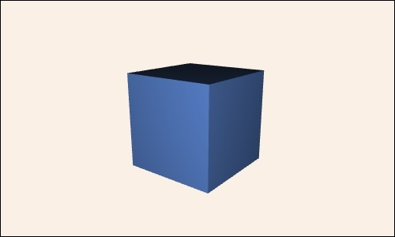

# Table of contents

- [**Initialization**](#initialization)
- [General methods](#general-methods)
	- [background](#background)
	- [oxyz](#oxyz)
	- [animate](#animate)
- [Properties](#properties)
	- [Colors](#colors)


# Initialization

Suica is a JavaScript library. It generates 3D images and animations in
a canvas inside a non-standard HTML tag `<suica>`. The HTML template of
a typical webpage with Suica might look like this:

```html
<!DOCTYPE html>
<html lang="en">
	<head>
		<script src="suica.js"></script>
	</head>

	<body>
		<suica ...></suica>
		<script>
			// JavaScript code using Suica
		</suica>
	</body>
</html>
```

The properties of the canvas can be defined either as tag attributes
or as CSS properties.

### Tag attributes

The `<suica>` tag may have attributes. They are all optional.

- `id` &ndash; unique indentifier used to address the canvas
- `width` &ndash; number for the width of the canvas (in pixels)
- `height` &ndash; number for the height of the canvas (in pixels)
- `background` &ndash; a string for the background color ([details](#colors))

|[Suica<br>attributes](https://boytchev.github.io/suica/examples/example-init-attr.html)|[](https://boytchev.github.io/suica/examples/example-init-attr.html)|
|---|---|

```html
<suica width="500" height="300" background="linen">
	<demo>
	<cube>
</suica>
```

### Style properties

The CSS style of `<suica>` also defines its properties. Suica extracts
these CSS properties:

- `width` &ndash; width of the canvas (CSS format)
- `height` &ndash; height of the canvas (CSS format)
- `background` &ndash; background color ([details](#colors))

The CSS properties for `<suica>` can be defined in a CSS file or
in a `<style>` tag.

|[Suica<br>CSS](https://boytchev.github.io/suica/examples/example-init-css.html)|[](https://boytchev.github.io/suica/examples/example-init-css.html)|
|---|---|

```html
<style>
	suica {
		width: 500px;
		height: 300px;
		background: linen;
	}
</style>
```

The CSS properties for `<suica>` can be defined in its `<style>` attribute.


|[Suica<br>Inline<br>CSS](https://boytchev.github.io/suica/examples/example-init-css-inline.html)|[](https://boytchev.github.io/suica/examples/example-init-css-inline.html)|
|---|---|

```html
<suica style="width:500px; height:300px; background:linen;">
 :
</suica>
</body>
```


# General methods

### background

Sets the background color of a Suica canvas.

```html
<suica-canvas style="background:white;">
  :
</suica-canvas>
```

```html
<background color="white">
```

```javascript
background( 'white' );
```

### oxyz

Draws the coordinate systems with specific length and color of axes.

```javascript
oxyz( );
oxyz( 30 );
oxyz( 30, 'black' );
```

```html
<oxyz>
<oxyz size="30">
<oxyz color="black">
<oxyz size="30" color="black">
```

### animate

Sets the animation user-defined function. This function is called every frame and has two parameters &ndash; total elapsed time `t` and elapsed time since previous frame `td`, bith measured in seconds.

```html
<animate src="loop">
```

```javascript
animate( loop );

function loop( t, dt ) {...}
```

# Properties
TBD

### Colors
TBD


---

January, 2022