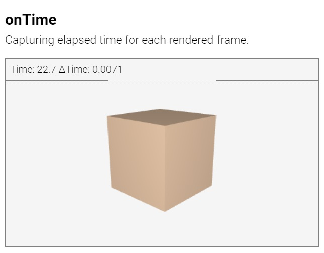

# Suica User Guide

## Table of contents

- [About](#about)
- [Activating Suica](#activating-suica)
	- [Tag &lt;suica&gt;](#tag-suica)
	- [Background color](#background-color)
	- [Coordinate system](#coordinate-system)
	- [Demo mode](#demo-mode)
	- [Animation loop](#animation-loop)
- [References](#reference-table)
	- [Code templates](#code-templates)
	- [Cross-table](#cross-table)


## About

**Suica is a JavaScript library** that provides a minimalistic approach to
mobile 3D graphics. Although Suica uses a limited set of 3D functionality, it is
a quick and easy way to make 3D scenes and animations. Here is a minimal example
of a rotating cube in the browser (*click on the image to run the example*):

[<kbd></kbd>](https://boytchev.github.io/suica/examples/minimal-example.html)

The complete code of this example is:

```html
<!DOCTYPE html>
<script src="suica.js"></script>
<suica>
	<cube>
	<demo>
</suica>
```

where `<!DOCTYPE>` defines that the web page contains HTML5, `<script>` loads
Suica, `<suica>` creates the drawing canvas, `<cube>` adds a cube in it and
`<demo>` activates the continuous rotation.

_**Note**: Tools that check the validity of HTML in web pages should complain
about Suica examples, as the minimalistic approach requires a non-standard use
of HTML tags._


## Activating Suica

Suica is distributed as `suica.js` or `suica.min.js` file and is loaded via the
`<script>` tag. Once loaded, the library will look for the HTML tag `<suica>`
and use it as a drawing canvas for 3D graphics. 


### Tag &lt;suica&gt;

The tag `<suica>` is the main Suica tag. It defines the drawing canvas. All
other Suica-specific HTML tags are recognized only if used between `<suica>` and
`</suica>`

```html
<suica>
   :
</suica>
```

The size of the canvas is set via attributes `width` and `height`. Sizes are
measured in pixels.

```html
<suica width="400" height="300">
```

Alternatively, sizes can be set as CSS properties (either inlined or not),
which may use any CSS unit:

```html
<suica style="width:15em; height:300px;">
```

Example of creating drawing canvases with different sizes.

[<kbd></kbd>](https://boytchev.github.io/suica/examples/tag-suica.html)


### Background color

The background color of the drawing canvas can be set in many ways. When the
canvas is created, its background color can be set via the attribute `background`:

```html
<suica background="linen">
```

Alternatively, CSS style can be used &ndash; via the property `background-color`
or just `background`:

```html
<suica style="background: linen;">
```
```html
<suica style="background-color: linen;">
```

The background color can be set via the custom tag `<background>`:

```html
<background color="linen">
```

Finally, the background color can be set via the function `background`:

```html
background( 'linen' );
```

Example of setting the background color. The last canvas uses Javascript to
change dynamically the background color.

[<kbd></kbd>](https://boytchev.github.io/suica/examples/background.html)


### Coordinate system

Suica uses Cartesian 3D coordinate system. The command *oxyz* draws the
coordinate system as a group of three segments. The parameters are *size* and
*color* of the segments (by default *30* and *black*). The command is available
as tag and function:

```html
<oxyz size="40" color="navy">
```

```javascript
oxyz( 40, 'navy' );
```

Example of drawing default and custom coordinate systems.

[<kbd></kbd>](https://boytchev.github.io/suica/examples/oxyz.html)


### Demo mode

The command `demo` turns on *demo mode*. In this mode the scene rotates
continuously. The parameters define the position of the viewer &ndash;
*distance* from the origin of the coordinate system and *altitude*.
The command is available as tag and function:

```html
<demo distance="120">
```

```javascript
demo( 100, 0 );
```

Example of turning on demo mode &ndash; i.e. automatic rotation of the 3D scene.

[<kbd></kbd>](https://boytchev.github.io/suica/examples/demo.html)


### Animation loop

The animation approach of Suica is to react every time when the browser is ready
to update the image on the canvas. The command `onTime` registers a user-defined
function that reacts whenever a new frame is required.

The user-defined function may have two parameters &ndash; total elapsed time *t* (since the start of Suica); and elapsed time since the previous frame *td*. Both parameters provide time values measured in seconds.

The `onTime` command is available as tag and function:

```html
<ontime src="loop">
```

```javascript
onTime( loop );

function loop( t, dt ) {...}
```

_**Note**: To remove already registered function use the function without a
parameter: `ontime()`._

The following example uses `onTime` to show the elapsed time *t* and *&Delta;t*:

[<kbd></kbd>](https://boytchev.github.io/suica/examples/ontime.html)


### Colors
TBD


## Reference table

### Code templates

#### Tag &lt;suica&gt;

- As tag atributes:
```html
<suica id="𝑠𝑡𝑟𝑖𝑛𝑔" width="𝑛𝑢𝑚𝑏𝑒𝑟" height="𝑛𝑢𝑚𝑏𝑒𝑟" background="𝑐𝑜𝑙𝑜𝑟">
```
- As inline style:
```html
<suica id="𝑠𝑡𝑟𝑖𝑛𝑔" style="width: 𝑐𝑠𝑠-𝑛𝑢𝑚𝑏𝑒𝑟; height: 𝑐𝑠𝑠-𝑛𝑢𝑚𝑏𝑒𝑟; background: 𝑐𝑜𝑙𝑜𝑟;">
```


#### Background color
- As tag atribute:
```html
<suica background="𝑐𝑜𝑙𝑜𝑟">
```
- As inline style:
```html
<suica style="background: 𝑐𝑜𝑙𝑜𝑟;">
```
- As style:
```html
<style>
   suica { background: 𝑐𝑜𝑙𝑜𝑟; }
</style>
<suica>
```
- As function:
```js
background( 𝑐𝑜𝑙𝑜𝑟 );
```


#### Coordinate system
- As tag:
```html
<oxyz size="𝑛𝑢𝑚𝑏𝑒𝑟" color="𝑐𝑜𝑙𝑜𝑟">
```
- As function:
```js
oxyz( 𝑠𝑖𝑧𝑒, 𝑐𝑜𝑙𝑜𝑟 );
```


#### Demo mode
- As tag:
```html
<demo distance="𝑛𝑢𝑚𝑏𝑒𝑟" altitude="𝑛𝑢𝑚𝑏𝑒𝑟">
```
- As function:
```js
demo( 𝑑𝑖𝑠𝑡𝑎𝑛𝑐𝑒, 𝑎𝑙𝑡𝑖𝑡𝑢𝑑𝑒 );
```


#### Animation loop
- As tag:
```html
<ontime src="𝑓𝑢𝑛𝑐𝑡𝑖𝑜𝑛-𝑛𝑎𝑚𝑒">
```
- As function:
```js
onTime( 𝑓𝑢𝑛𝑐𝑡𝑖𝑜𝑛-𝑛𝑎𝑚𝑒 );
```


### Cross-table

The cross-table elaborates the possible ways to set or modify given Suica element.

| Element | HTML Tag | HTML Attribute | CSS Property | JS Function |
|---|:---:|:---:|:---:|:---:|
| Suica canvas | yes | | | |
| &emsp; &ndash; name | | yes | | |
| &emsp; &ndash; width | | yes | yes | |
| &emsp; &ndash; height | | yes | yes | |
| Background color | yes | yes | yes | yes |
| Coordinate system | yes | | | yes |
| Demo mode | yes | | | yes |
| Animation loop | yes | | | yes |


---

January, 2022