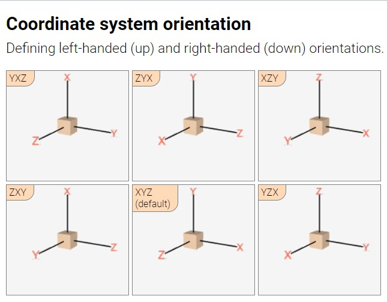
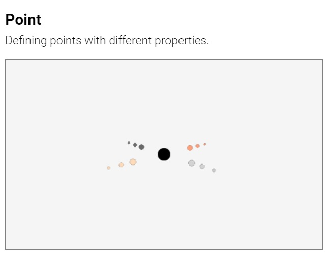

#  Suica User Guide

## Table of contents

- [About](#about)
- [Suica canvas](#drawing-canvas) [<small> [&lt;suica&gt;](#tag-suica) | [Background color](#background-color) | [Coordinate system](#coordinate-system) | [Demo mode](#demo-mode) | [Animation loop](#animation-loop) </small>] 
- [Objects](#objects)
    - [General properties](#general-properties) [<small> [definitions](#definitions) | [names](#names) | [positions](#positions) | [sizes](#sizes) | [colors](#colors) | [images](#images) </small>] 
	- [Basic objects](#basic-objects) [<small> [points](#points) | [cubes](#cubes) | [cube frames](#cube-frames) </small>]
- [Images and drawings](#images-and-drawings)
- [References](#reference-table)
	- [Code templates](#code-templates)
	- [List of examples](examples/EXAMPLES.md)


## About

**Suica is a JavaScript library** that provides a minimalistic approach to
mobile 3D graphics. Here is a minimal example of a rotating cube in the browser
(*click on the image to run the example*):

[<kbd></kbd>](https://boytchev.github.io/suica/examples/minimal-example.html)

The complete code of this example is:

```html
<!DOCTYPE html>
<script src="suica.js"></script>
<suica>
	<cube>
	<demo>
</suica>
```


Suica is built upon these principles:

- **MINIMAL**<br>Less is more ([details](https://en.wikipedia.org/wiki/Minimalism_(computing))). 

- **DUAL**<br>Objects can be defined as HTML tags or in JS code, and their
properties are defined as tag attributes or function parameters. Using HTML is
a declarative create-and-forget approach, while JS is more suitable for scenes
that require continuous changes.

- **OPTIONAL**<br>All object properties are optional and may be skipped. Due to the
nature of the HTML syntax tag attributes may have any order. However, the order
of function parameters is fixed and only the trailing parameters may be skipped.

- **UNIFORM**<br>Properties are consistent across all objects that share
them. For example, object color is defined and changed in the same way for
points, cubes and spheres.

Browsers have a standard way of reaction on non-standard web pages (e.g. missing
closing tags, unregistered custom tags, etc). This is heavily used in all Suica
examples. Tools that validate HTML pages may complain about Suica HTML code.


## Suica canvas

Suica is distributed as `suica.js` or `suica.min.js` file and is loaded via the
`<script>` tag. Once loaded, the library will look for HTML tags `<suica>` and
use them as drawing canvases for 3D graphics. Suica does not use JS modules in
order to allow easy local development.


### Tag &lt;suica&gt;

The main Suica tag is `<suica>`. It defines a 3D drawing canvas. All other
Suica-specific HTML tags are recognized only if used between `<suica>` and
`</suica>`

```html
<suica>
   <!-- all other Suica tags appear here-->
</suica>
```

The size of the canvas is set via attributes `width` and `height`. Sizes are
measured in pixels. The default size is 500&times;300 pixels. Alternatively,
sizes can be set as CSS properties (either inlined or not), which may use any
CSS unit.

Example of creating drawing canvases with different sizes:

```html
<suica width="400" height="300">
<suica style="width:15em; height:300px;">
```
[<kbd></kbd>](https://boytchev.github.io/suica/examples/tag-suica.html)

The orientation of the coordinate system is set via attribute `orientation`.
More information is available in section [Coordinate system](#coordinate-system).


### Background color

The background color of the drawing canvas can be set as HTML attribute, CSS
style (both inlined and non-inlined), HTML tag and JS function. By default the
background color is [white smoke](https://www.color-hex.com/color/f5f5f5).

```html
HTML/CSS:
<suica background="linen">
<suica style="background: linen;">
<background color="linen">
```
```js
JS:
background( 'linen' );
```

[<kbd></kbd>](https://boytchev.github.io/suica/examples/background.html)


### Coordinate system

The coordinate system in Suica is important as it controls how objects
[positions](#positions) and [sizes](#sizes) are defined. Suica uses Cartesian
3D coordinate system. The tag `<suica>` accepts attribute `orientation` with
values `XYZ`, `XZY`, `YXZ`, `YZX`, `ZXY` and `ZYX` (these are all possible
permutations of the letters *X*, *Y* and *Z*. Each orientation defines a
coordinate system in the following manner:

- the first axis points to the right
- the second axis points upwards
- the third axis point towards the viewer


The default orientation in Suica is *XYZ*. All examples in this user guide use
this orientation, unless explicitely stated that other orientations are used.

```html
HTML:
<suica orientation="xyz">
```
[<kbd></kbd>](https://boytchev.github.io/suica/examples/suica-orientation.html)

The coordinate system is an abstract object and it has no graphical
representation. The command `oxyz`, however, visualizes the system as three
segments with custom size and color. By default the size is 30 and the color
is [black](https://www.color-hex.com/color/000000).

```html
HTML:
<oxyz size="30" color="black">
```
```js
JS:
oxyz( 30, 'black' );
```

[<kbd></kbd>](https://boytchev.github.io/suica/examples/oxyz.html)


### Demo mode

The command `demo` turns on *demo mode* &ndash; atomatic scene rotation. The
parameters define the viewpoint position as distance from the origin of the
the coordinate system and altitude. By default the distance is 100 and the
altitude is 30.

```html
HTML:
<demo distance="100" altitude="30">
```
```js
JS:
demo( 100, 30 );
```

[<kbd></kbd>](https://boytchev.github.io/suica/examples/demo.html)


### Animation loop

The animation approach of Suica is to react every time when the browser is ready
to update the image on the canvas. The command `onTime` registers a user-defined
JS function that adjusts the 3D scene whenever a new frame is required. 

```html
HTML:
<ontime src="loop">
```
```js
JS:
onTime( loop ); // register a new ontime function
onTime( );      // unregister the current ontime function
```

This user-defined function has two parameters &ndash; elapsed times since the
start of Suica *t* and since the previous frame *td*. Both times are measured in
seconds.

```js
JS:
function loop( t, dt )
{
   // code that sets objects properties 
   // depending on times t and dt
}
```

[<kbd></kbd>](https://boytchev.github.io/suica/examples/ontime.html)


## Objects

This section describes the graphical objects in Suica.

### General properties

#### Definition

In Suica object may be created as HTML tag or via JS function.

```html
HTML:
<object param1="value1" param2="value2" ...>
```
```js
JS:
object( value1, value2, ... );
```

#### Names

When an HTML-ly created object is referenced, for example its properties are
modified in the animation loop, its name is given in the `id` property. The
following examples show two alternative ways to create named objects.

```html
HTML:
<point id="p" center="25,0,15">
```
```js
JS:
p = point( [25,0,15] );
```

#### Positions

The position of Suica objects in 3D space is maintained via the property
`center` &ndash; an array of three numbers [*x*, *y*, *z*] for the *x*, *y* and
*z* coordinates (in this order). The actual visual position depends on the
[orientation of the coordinate system](#coordinate-system).

```html
HTML:
<point center="25,0,15">
```
```js
JS:
point( [25,0,15] );

p = point( );
p.center = [25, 0, 15];
```

Properties `x`, `y` and `z` provide individual access to the elements of the position. 

```html
HTML:
<point x="25">
```
```js
JS:
p = point( );
p.x = 25;
```


#### Sizes

The size of Suica objects in 3D space is maintained via the property `size`
&ndash; an array of up to three numbers for object's *width*, *height* and
*depth*.

When *height* or *depth* is not provided, they are considered equal to *width*.
Thus, size 25 or [25] are both equivalent to [25,25,25], and size [25,10] is
equivalent to [25,10,25].

```html
HTML:
<cube size="25">
<cube size="25,10,15">
```
```js
JS:
cube( [0,0,0], 25 );
cube( [0,0,0], [25,10,15] );
```

The order *width*, *height* and *depth* is fixed and does not depend on the
[orientation of the coordinate system](#coordinate-system).


[<kbd></kbd>](https://boytchev.github.io/suica/examples/sizes.html) [<kbd></kbd>](https://boytchev.github.io/suica/examples/sizes-orientation.html)


Individual sizes can be set with the commands `width`, `height` and `depth`.
The following cubes are the same sizes:

```html
<cube size="3,15,40">
<cube width="3" height="15" depth="40">
```
```js
cube( [0,0,0], [3,15,40] );
a = cube( [0,0,0] );
a.width = 3;
a.height = 15;
a.depth = 40;
```

#### Colors

Colors in Suica can be expressed in a variety of ways. The [RGB scheme](https://www.w3schools.com/colors/colors_rgb.asp) represents colors as three
components *red*, *green* and *blue*, while the
[HSL scheme](https://www.w3schools.com/colors/colors_hsl.asp) components are
*hue*, *saturation* and *lightness*.


| Context | Descriptive<br>name | Hexadecimal<br>number | Normalized<br>RGB array | RGB<br>function | HSL<br>function |
|---|:---:|:---:|:---:|:---:|:---:|
| | <small>[List of color names](https://www.w3schools.com/colors/colors_names.asp)</small>| *RRGGBB*<br><small>*RR*,*GG*,*BB* &isin; [00,FF]</small> | *r*,*g*,*b*<br><small>*r*,*g*,*b* &isin; [0,1]</small> | rgb(*r*,*g*,*b*)<br><small>*r*,*g*,*b* &isin; [0,255] | hsl(*h*,*s*,*l*)<br><small>*h* &isin; [0,360], *s*,*l* &isin; [0,100]</small> |
| Tag<br>attribute | [crimson](https://www.color-name.com/crimson.color) | 0xDC143C | 0.86,&nbsp;0.08,&nbsp;0.24 | rgb(&nbsp;220,&nbsp;20,&nbsp;60&nbsp;) | hsl(&nbsp;348,&nbsp;91,&nbsp;86&nbsp;) |
| CSS<br>property | crimson | #DC143C | | rgb( 220, 20, 60 ) | hsl( 348, 91, 86 ) |
| JS<br>code | "crimson" | 0xDC143C | [0.86,&nbsp;0.08,&nbsp;0.24] | rgb(&nbsp;220,&nbsp;20,&nbsp;60) | hsl(&nbsp;348,&nbsp;91,&nbsp;86) |

#### Images

Images can be stamped on objects in Suica. The the property `image` accepts a
drawing or a texture image. For more information of how to generate a drawing
see section or load external image see section [Images and drawings](#images-and-drawings).

When an object has both `color` and `images`, the resulting color is the product
of the RGB normalized colors (i.e. color components r,g,b&isin;[0,1]). The
following tabel demonstrates some combinations of colors:

| Object color | Image color | Resulting color |
|---|---|---|
| Any<br><small>[R,G,B]</small> | Any<br><small>[r,g,b]</small> | Combined color<br><small>[R,G,B]&times;[r,g,b] = [R&times;r,G&times;g,B&times;b]</small> |
| White<br><small>[1,1,1]</small> | Any<br><small>[r,g,b]</small> | Image color<br><small>[1,1,1]&times;[r,g,b] = [r,g,b]</small> |
| Black<br><small>[0,0,0]</small> | Any<br><small>[r,g,b]</small> | Black<br><small>[0,0,0]&times;[r,g,b] = [0,0,0]</small> |
| Any<br><small>[R,G,B]</small> | White<br><small>[1,1,1]</small> | Object color<br><small>[R,G,B]&times;[1,1,1] = [R,G,B]</small> |
| Any<br><small>[R,G,B]</small> | Black<br><small>[0,0,0]</small> | Black<br><small>[R,G,B]&times;[0,0,0] = [0,0,0]</small> |
| Red<br><small>[R,0,0]</small> | Any<br><small>[r,g,b]</small> | Only the red component of the image color<br><small>[1,0,0]&times;[r,g,b] = [r,0,0]</small> |
| Yellow<br><small>[1,1,0]</small> | Cyan<br><small>[0,1,1]</small> | Green<br><small>[1,1,0]&times;[0,1,1] = [0,1,0]</small> |


## Basic objects

### Points

The object `point` represents a graphical point drawn as a small cirlce. Its
properties are `center`, `x`, `y` and `z` for position, `size`, `color` and
`image`:

```html
HTML:
<point center="25,0,15" size="10" color="red">
<point x="25" y="0" z="15" size="10" color="red">
```
```js
JS:
point( [25,0,15], 10, 'red' );
```

[<kbd></kbd>](https://boytchev.github.io/suica/examples/point.html)&emsp;[<kbd></kbd>](https://boytchev.github.io/suica/examples/point-cloud.html)

[<kbd></kbd>](https://boytchev.github.io/suica/examples/point-image.html)&emsp;


### Cubes

The object `cube` represents a solid cube. Its properties are `center`, `x`,
`y` and `z` for position, `size`, `width`, `height` and `depth` for size,
`color` and `image`:

```html
HTML:
<cube center="25,0,15" size="10">
<cube x="25" y="0" z="15">
```
```js
JS:
cube( [25,0,15], 10, 'red' );
```

[<kbd></kbd>](https://boytchev.github.io/suica/examples/cube.html)&emsp;[<kbd></kbd>](https://boytchev.github.io/suica/examples/cube-image.html)


_**Note**: To make a cuboid (rectangular parallelepiped) use different values
for width, height, depth (see [Sizes](#sizes))._


### Cube frames

The object `cubeFrame` represents a wireframed cube. Its properties are
`center`, `x`, `y` and `z` for position, `size`, `width`, `height` and `depth`
for size and `color`:

```html
HTML:
<cubeFrame center="25,0,15" size="10">
<cubeFrame x="25" y="0" z="15">
```
```js
JS:
cubeFrame( [25,0,15], 10, 'red' );
```

[<kbd></kbd>](https://boytchev.github.io/suica/examples/cubeFrame.html)&emsp;

_**Note**: To make a cuboid frame (rectangular parallelepiped) use different
values for width, height, depth (see [Sizes](#sizes))._


## Images and drawings

TBD


## Reference table


### Code templates

**Tag &lt;suica&gt;** with attributes and inline style:

```html
<suica id="𝑠𝑡𝑟𝑖𝑛𝑔" width="𝑛𝑢𝑚𝑏𝑒𝑟" height="𝑛𝑢𝑚𝑏𝑒𝑟" background="𝑐𝑜𝑙𝑜𝑟">

<suica id="𝑠𝑡𝑟𝑖𝑛𝑔" style="width: 𝑐𝑠𝑠-𝑛𝑢𝑚𝑏𝑒𝑟; height: 𝑐𝑠𝑠-𝑛𝑢𝑚𝑏𝑒𝑟; background: 𝑐𝑜𝑙𝑜𝑟;">
```


**Background color** as attribute, inline style, normal style and function:
```html
<suica background="𝑐𝑜𝑙𝑜𝑟">

<suica style="background: 𝑐𝑜𝑙𝑜𝑟;">

<style>
   suica { background: 𝑐𝑜𝑙𝑜𝑟; }
</style>
<suica>
```
```js
background( 𝑐𝑜𝑙𝑜𝑟 );
```


**Coordinate system** as tag and function:
```html
<oxyz size="𝑛𝑢𝑚𝑏𝑒𝑟" color="𝑐𝑜𝑙𝑜𝑟">
```
```js
oxyz( 𝑠𝑖𝑧𝑒, 𝑐𝑜𝑙𝑜𝑟 );
```


**Demo mode** as tag and function:
```html
<demo distance="𝑛𝑢𝑚𝑏𝑒𝑟" altitude="𝑛𝑢𝑚𝑏𝑒𝑟">
```
```js
demo( 𝑑𝑖𝑠𝑡𝑎𝑛𝑐𝑒, 𝑎𝑙𝑡𝑖𝑡𝑢𝑑𝑒 );
```


**Animation loop** as tag and function:
```html
<ontime src="𝑛𝑎𝑚𝑒">
```
```js
onTime( 𝑛𝑎𝑚𝑒 );
```


**Animation loop function**:
```js
𝑛𝑎𝑚𝑒( 𝑡, 𝑑𝑡 );
```


**Point** as tag and function:
```html
<point id="𝑛𝑎𝑚𝑒" center="𝑥,𝑦,𝑧" size="𝑠𝑖𝑧𝑒" color="𝑐𝑜𝑙𝑜𝑟">
<point id="𝑛𝑎𝑚𝑒" x="𝑥" y="𝑦" z="𝑧" size="𝑠𝑖𝑧𝑒" color="𝑐𝑜𝑙𝑜𝑟">
```
```js
point( [𝑥,𝑦,𝑧], 𝑠𝑖𝑧𝑒, 𝑐𝑜𝑙𝑜𝑟 );
```


**Cube** as tag and function:
```html
<cube id="𝑛𝑎𝑚𝑒" center="𝑥,𝑦,𝑧" size="𝑠𝑖𝑧𝑒" color="𝑐𝑜𝑙𝑜𝑟">
<cube id="𝑛𝑎𝑚𝑒" x="𝑥" y="𝑦" z="𝑧" size="𝑠𝑖𝑧𝑒" color="𝑐𝑜𝑙𝑜𝑟">
```
```js
cube( [𝑥,𝑦,𝑧], 𝑠𝑖𝑧𝑒, 𝑐𝑜𝑙𝑜𝑟 );
```


**CubeFrame** as tag and function:
```html
<cubeFrame id="𝑛𝑎𝑚𝑒" center="𝑥,𝑦,𝑧" size="𝑠𝑖𝑧𝑒" color="𝑐𝑜𝑙𝑜𝑟">
<cubeFrame id="𝑛𝑎𝑚𝑒" x="𝑥" y="𝑦" z="𝑧" size="𝑠𝑖𝑧𝑒" color="𝑐𝑜𝑙𝑜𝑟">
```
```js
cubeFrame( [𝑥,𝑦,𝑧], 𝑠𝑖𝑧𝑒, 𝑐𝑜𝑙𝑜𝑟 );
```


### List of examples

All examples are collected in a single page [here](examples/EXAMPLES.md)

---

February, 2022