##### [User guide](user-guide.md) &middot; [Suica](suica.md) &middot; [Objects](objects.md) &middot; [Properties](properties.md) &middot; **Drawings** &middot; [Events](events.md)

**Suica drawings** are 2D images generated directly in Suica, instead of being loaded from JPEG or PNG files. Usually drawings are applied onto 2D and 3D objects as [textures](https://en.wikipedia.org/wiki/Texture_mapping). Suica drawings are based on a simplified subset of [Canvas2D](https://developer.mozilla.org/en-US/docs/Web/API/CanvasRenderingContext2D) commands. 

# Table of contents
- [Introduction](#introduction)
	- <small>[Starting a drawing](#starting-a-drawing): [`drawing`](#drawing)</small>
	- <small>[The actual drawing](#the-actual-drawing)</small>
	- <small>[Applying drawings](#applying-drawings)</small>
- [Drawing shapes](#drawing-shapes)
	- <small>[Defining shapes](#defining-shapes): [`moveTo`](#moveto), [`lineTo`](#lineto), [`curveTo`](#curveto), [`arc`](#arc)  </small>
	- <small>[Outlined shapes](#oulined-shapes): [`stroke`](#stroke)</small>
	- <small>[Solid shapes](#solid-shapes): [`fill`](#fill)</small>
- [Drawing texts](#drawing-texts): <small>[`fillText`](#filltext)</small>
- [Advanced techniques](#advanced-techniques)
	- <small>[Sprites](#sprites)</small>
	- <small>[Dotted and dashed lines](#dotted-and-dashed-lines)</small>
	- <small>[Dynamic drawing](#dynamic-drawing): [`clear`](#clear)</small>


# Introduction

Suica drawings are created on a rectangular drawing canvas. The origin of the coordinate system of a drawing i.e. point (0,0) is at the bottom left corner of the canvas. The X axis extends to the right, Y extends to the top. All coordinates are measured in pixels.

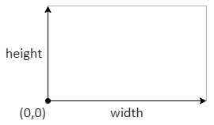

Following the main principles of Suica, a drawing can be created entirely in HTML or entirely in JavaScript. Usually HTML is used for static drawings, while JavaScript is used for both static and dynamic drawings. The other difference between HTML and JavaScript drawings is that in HTML names of commands are case-insensitive and parameters can be freely omitted or rearranged. In JavaScript, however, there is no need to type the names of the parameters. The following two examples demonstrate the same drawing generated in HTML and in JavaScript.

[<kbd>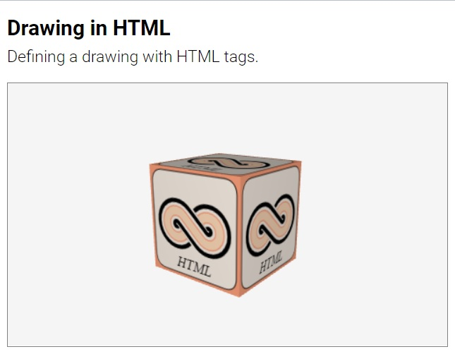</kbd>](../examples/drawing-html.html)
[<kbd>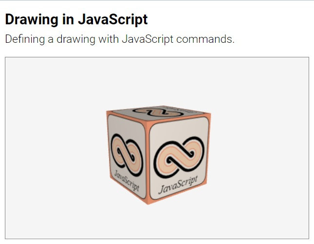</kbd>](../examples/drawing-js.html)


Using drawings in Suica is a three-step process:

- Step 1. Prepare a drawing canvas
- Step 2. Draw shapes or text
- Step 3. Apply it onto an object


## Starting a drawing

A drawing is created with the `drawing` command and then it is possible to draw shapes and text in it. The drawing canvas is cleared with `clear` command to remove all drawn shapes. 

#### drawing
```html
HTML:
<drawing id="𝘯𝘢𝘮𝘦" size="𝑤𝑖𝑑𝑡ℎ,ℎ𝑒𝑖𝑔ℎ𝑡" color="𝑐𝑜𝑙𝑜𝑟">
```
```js
JS:
𝘯𝘢𝘮𝘦 = drawing( 𝑤𝑖𝑑𝑡ℎ, ℎ𝑒𝑖𝑔ℎ𝑡, 𝑐𝑜𝑙𝑜𝑟 );
```

Command. Creates a drawing canvas. Parameters `width` and `height` set the canvas size in pixels. By default it is 32&times;32 pixels. If `height` is omitted, its is the same as `width`. Parameter `color` sets the background color of the canvas. If `color` is omitted, the background is transparent &ndash; i.e. when the drawing is mapped onto an object, the background areas will be transparent.

```html
HTML:
<drawing id="a">
<drawing id="b" size="32,48">
<drawing id="c" width="32" height="48">
```
```js
JS:
a = drawing( );
b = drawing( 32 );
c = drawing( 32, 48, 'crimson' );
```

The following examples demonstrate transparent versus non-transparent drawing canvases.

[<kbd>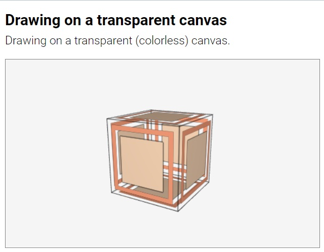</kbd>](../examples/drawing-transparent.html)
[<kbd>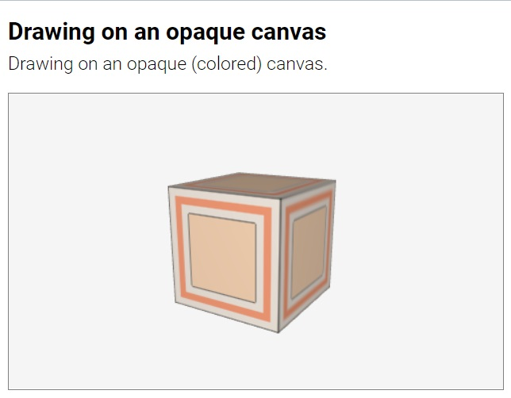</kbd>](../examples/drawing-opaque.html)


## The actual drawing

The actual drawing of shapes and texts in a drawing depends on how it is created. If a drawing is created in HTML, the drawing commands are placed as subtags in the main `<drawing>` tag.

```html
HTML:
<drawing id="a" width="100" height="100" color="lightsalmon">
   <moveTo center="10,10">
   <lineTo x="90">
   <lineTo y="90">
   <lineTo x="10">
   <lineTo y="10">
   <fill color="linen">
   <stroke color="black" width="1">
</drawing>
```

If a drawing is created in JavaScript, the drawing commands follow the `drawing` command.

```js
JS:
var a = drawing( 100, 100, 'lightsalmon' );
moveTo( 10, 10 );
lineTo( 90, 10 );
lineTo( 90, 90 );
lineTo( 10, 90 );
lineTo( 10, 10 );
fill( 'linen' );
stroke( 'black', 5 );
```

Drawing commands refer to the latest created drawing. If another drawing is used, its name must be set as a command prefix.

```js
JS:
var a = drawing( );
var b = drawing( );

a.moveTo( 10, 10 );
a.lineTo( 90, 90 );
a.stroke( 'black', 5 );

b.moveTo( 10, 90 );
b.lineTo( 10, 90 );
b.stroke( 'black', 5 );
```


## Applying drawings

A drawing is applied to an object via the [`image`](objects.md#image) property. The scale of a drawing is managed by the [`images`](objects.md#images) property. 

```html
HTML:
<drawing id="a"> ... </drawing>
<cube image="a" images="4,2">
```
```js
JS:
a = drawing( ... );
b = cube();
b.image = a;
b.images = [4, 2];
```

# Drawing shapes

The basic way to draw objects in a drawing is to draw outlined or solid shapes.


## Defining shapes

A shape is defined with a virtual pen moved along the boundary of the shape. The simplest way to define a shape is to move the virtual pen to the starting point of the shape and then move the pen along its boundary.

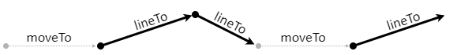

Shapes are define with the following commands:
- [`moveTo`](#moveto) &ndash; moves the pen
- [`lineTo`](#lineto) &ndash; adds a line segment
- [`curveTo`](#curveto) &ndash; adds a curved segment
- [`arc`](#arc) &ndash; adds a circular arc


#### moveTo
```html
HTML:
<moveTo center="𝑥,𝑦">
<moveTo x="𝑥" y="𝑦">
```
```js
JS:
moveTo( 𝑥, 𝑦 );
```

Command. Sets the position of the virtual pen. This command moves the pen from its current location to (`x`,`y`) without generating a shape segment. This is used to set the starting point of a shape boundary. By default, both *x* and *y* are 0. In HTML `center` can be split into individual parameters `x` and `y`.

```html
HTML:
<moveTo center="10,0">
<moveTo x="10" y="0">
```
```js
JS:
moveTo( 10, 0 );
```


	
#### lineTo
```html
HTML:
<lineTo center="𝑥,𝑦">
<lineTo x="𝑥" y="𝑦">
```
```js
JS:
lineTo( 𝑥, 𝑦 );
```

Command. Adds a line segment to the shape. This command moves the pen along a line from its current location to (`x`,`y`) and adds that line to the shape boundary. This is used to define straight segments of the shape. By default, both *x* and *y* are 0. In HTML `center` can be split into individual parameters `x` and `y`.

```html
HTML:
<lineTo center="10,0">
<lineTo x="10" y="0">
```
```js
JS:
lineTo( 10, 0 );
```

[<kbd>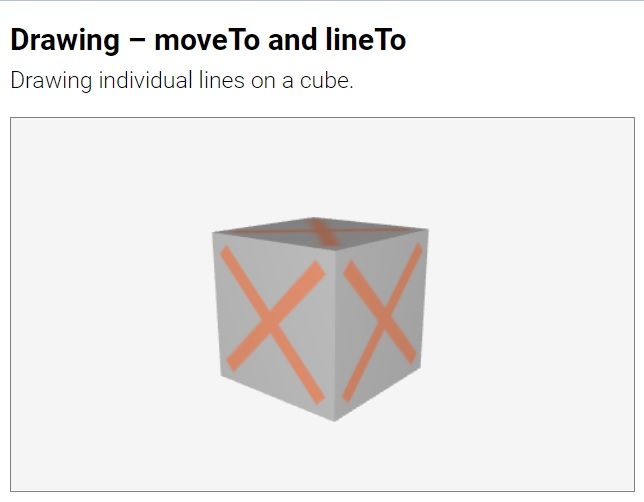</kbd>](../examples/drawing-moveto-lineto.html)


#### curveTo
```html
HTML:
<curveTo m="𝑚𝑥,𝑚𝑦" center="𝑥,𝑦">
<curveTo mx="𝑚𝑥" mt="𝑚𝑦" x="𝑥" y="𝑦">
```
```js
JS:
𝑑𝑟𝑎𝑤𝑖𝑛𝑔.curveTo( 𝑚𝑥, 𝑚𝑦, 𝑥, 𝑦 );
```

Command. Adds a curved segment to the shape. This command moves the pen along a curved line from its current location to (`x`,`y`) and adds that curve to the shape boundary. The line is [quadratic curve](https://mathworld.wolfram.com/QuadraticCurve.html) and is attracted towards point (`mx`, `my`), which is defined by the first pair of parameters of *curveTo*. By default all coordinates *mx*, *my*, *x* and *y* are 0. In HTML `center` can be split into individual parameters `x` and `y`; and `m` can be split into `mx` and `my`.

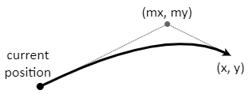

```html
HTML:
<curveTo m="10,0" center="20,15">
<curveTo mx="10" my="0" x="20" y="15">
```
```js
JS:
curveTo( 10, 0, 20, 15 );
```

[<kbd>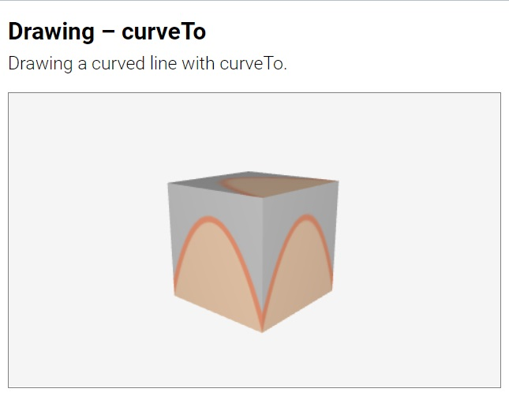</kbd>](../examples/drawing-curveto.html)

Complex shapes can be constructed by joining individual curves. The shape of a heart in the following example is composed of 6 connected curves.

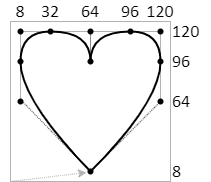

[<kbd>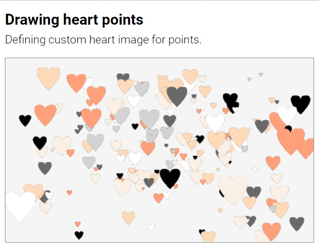</kbd>](../examples/drawing-heart-point.html)


#### arc
```html
HTML:
<arc center="𝑥,𝑦" radius="𝑛𝑢𝑚𝑏𝑒𝑟">
<arc center="𝑥,𝑦" radius="𝑛𝑢𝑚𝑏𝑒𝑟" from="𝑓𝑟𝑜𝑚𝐴𝑛𝑔𝑙𝑒" to="𝑡𝑜𝐴𝑛𝑔𝑙𝑒" cw="𝑡𝑟𝑢𝑒/𝑓𝑎𝑙𝑠𝑒">
```
```js
JS:
arc( 𝑥, 𝑦, 𝑟𝑎𝑑𝑖𝑢𝑠 );
arc( 𝑥, 𝑦, 𝑟𝑎𝑑𝑖𝑢𝑠, 𝑓𝑟𝑜𝑚𝐴𝑛𝑔𝑙𝑒, 𝑡𝑜𝐴𝑛𝑔𝑙𝑒, 𝑐𝑤 );
```

Command. Adds a circular arc to the shape. This command creates an arc of a circle with center (`x`,`y`) and given `radius`. The arc stars from angle `from` and ends at angle `to`, both measured in degrees, by default 0 and 360. Parameter `cw` sets the direction of the arc &ndash; either clockwise (if `cw` is true, this is by default) or counterclockwise (if `cw` is false). If the angles are omitted, a full circle is generated. 

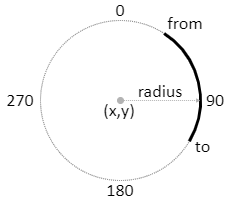


```html
HTML:
<arc center="10,0" radius="5">
<arc x="10" y="0" radius="5" from="0" to="180" ccw>
```
```js
JS:
arc( 10, 0, 5);
arc( 10, 0, 5, 0, 180, false);
```


[<kbd>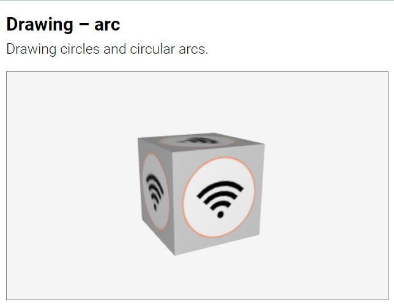</kbd>](../examples/drawing-arc.html)

In HTML `center` can be split into individual parameters `x` and `y`. Also in HTML the `cw` attribute has antagonist attribute `ccw`. If the values of `cw` or `ccw` are omitted, they are assumed to be *true*. The following commands are equivalent:

```html
HTML:
<arc x="10" y="0" radius="5" cw>
<arc x="10" y="0" radius="5" cw="true">
<arc x="10" y="0" radius="5" ccw="false">
```


## Outlined shapes

The outline of a shape is drawn with `stroke`. 

#### stroke
```html
HTML:
<stroke color="𝑐𝑜𝑙𝑜𝑟" width="𝑤𝑖𝑑𝑡ℎ" close="𝑐𝑙𝑜𝑠𝑒">
```
```js
JS:
stroke( 𝑐𝑜𝑙𝑜𝑟, 𝑤𝑖𝑑𝑡ℎ, 𝑐𝑙𝑜𝑠𝑒 );
```

Command. Draws a line around a shape. The line has given `color` and `width` (in pixels). If the `close` parameter is *true*, then a line is closed &ndash; its end is connected to its beginning. A `stroke` immediately after another `stroke` or [`fill`](#fill) reuses the same shape.

```html
HTML:
<stroke color="crimson">
<stroke color="crimson" width="10" close>
<stroke color="crimson" width="10" close="true">
```
```js
JS:
stroke( 'crimson' );
stroke( 'crimson', 10, true );
```

[<kbd>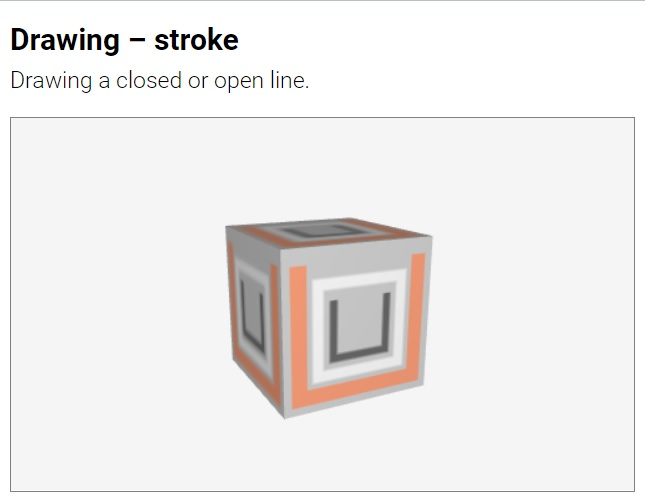</kbd>](../examples/drawing-stroke.html)
	
	
	
	
## Solid shapes

Solid shapes are drawn by `fill`.

#### fill
```html
HTML:
<fill color="𝑐𝑜𝑙𝑜𝑟">
```
```js
JS:
fill( 𝑐𝑜𝑙𝑜𝑟 );
```

Command. Fills a shape with the given `color`.  A `fill` immediately after another `fill` or [`stroke`](#stroke) reuses the same shape.

```html
HTML:
<fill color="crimson">
```
```js
JS:
fill( 'crimson' );
```
	
[<kbd>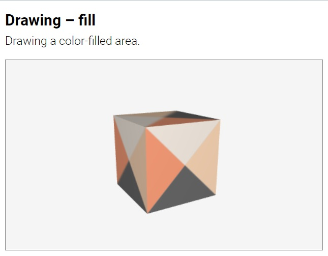</kbd>](../examples/drawing-fill.html)
[<kbd>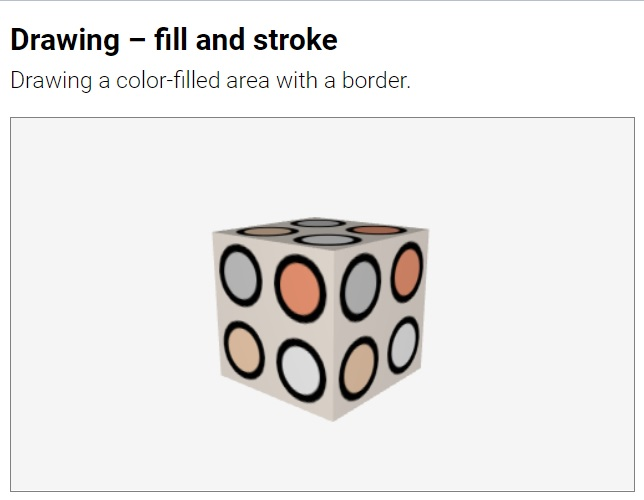</kbd>](../examples/drawing-fill-and-stroke.html)


# Drawing texts

Drawing texts is done with the `fillText` command.

#### fillText
```html
HTML:
<fillText center="𝑥,𝑦" text="𝑡𝑒𝑥𝑡" color="𝑐𝑜𝑙𝑜𝑟" font="𝑓𝑜𝑛𝑡">
<fillText x="𝑥" y="𝑦" text="𝑡𝑒𝑥𝑡" color="𝑐𝑜𝑙𝑜𝑟" font="𝑓𝑜𝑛𝑡">
```
```js
JS:
𝑑𝑟𝑎𝑤𝑖𝑛𝑔.fillText( 𝑥, 𝑦, 𝑡𝑒𝑥𝑡, 𝑐𝑜𝑙𝑜𝑟, 𝑓𝑜𝑛𝑡 );
```

Command. Draws a text. The `text` is drawn at given coordinates (`x`,`y`) with
given `color` and `font` style &ndash; a string with a [CSS font](https://developer.mozilla.org/en-US/docs/Web/CSS/font) description (the default font is `'20px Arial'`). In HTML `center` can be split into individual parameters `x` and `y`.

```html
HTML:
<fillText center="10,5" text="Sample text" color="crimson" font="bold 20px Courier">
```
```js
JS:
fillText( 10, 5, 'Sample text', 'crimson', 'bold 20px Courier' );
```	
	
[<kbd>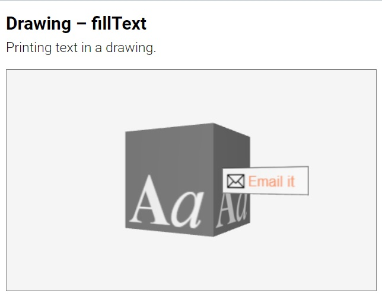</kbd>](../examples/drawing-filltext.html)
	
	
	
# Advanced techniques
	
## Sprites

[Sprites](https://en.wikipedia.org/wiki/Sprite_(computer_graphics)) are flat images that always face the user. They are drawn on the screen ignoring any rotation. In Suica sprites are created by applying drawings (and images) onto [points](#objects.md#point).

[<kbd>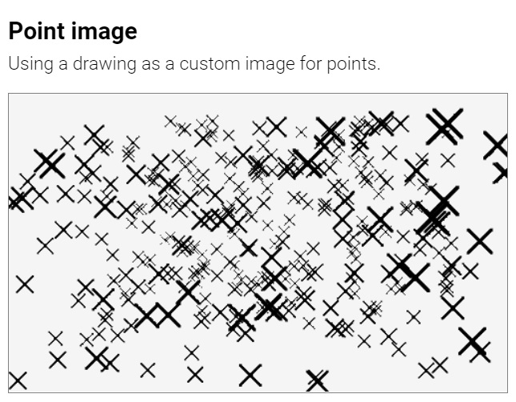</kbd>](../examples/drawing-custom-point.html)
[<kbd></kbd>](../examples/drawing-heart-point.html)


## Dotted and dashed lines

A drawing (or an image) can be applied onto [lines](#objects.md#line) or [wireframed objects](#objects.md#wireframe). In this case the drawing provides the color pattern for the segments. If a drawing uses a transparent background, this results in dotted and/or dashed lines.

[<kbd>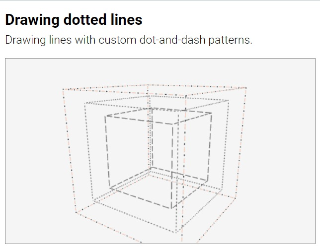</kbd>](../examples/drawing-dotted-lines.html)

## Dynamic drawing

A dynamic drawing is a drawing which images changes in real-time. A Suica drawing can be modified after it is applied to an object. This can be done only in JavaScript by accessing the [`image`](objects.md#image) property of the object.

```js
JS:
function onTime( )
{
   a.image.arc( 50, 50, random(10,30) );
   a.image.stroke( 'black', 1 );
   a.image.fill( 'white' );
}
```
[<kbd>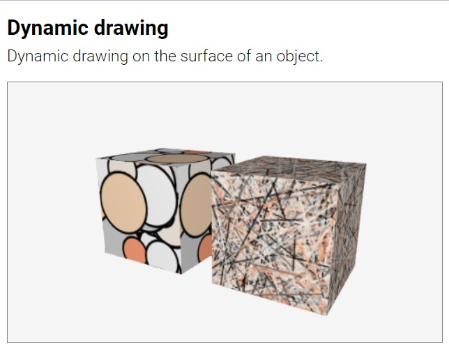</kbd>](../examples/dynamic-drawing.html)


In some cases, it is easier to redraw the canvas from scratch. One way to clear the canvas is to define a large shape over it and then [`fill`](#fill) the shape with a color. This can clear the canvas, but it cannot erase it to transparent. The command `clear` is the only way to clear the canvas to transparent. 


#### clear
```html
HTML:
<clear>
<clear color="𝑐𝑜𝑙𝑜𝑟">
```
```js
JS:
clear( );
clear( 𝑐𝑜𝑙𝑜𝑟 );
```

Command. Clears a drawing canvas. The canvas is filled with the given `color`. If `color` is omitted, the canvas is completely erased, i.e. cleared to transparent. 

```html
HTML:
<clear>
<clear color="crimson">
<clear background="crimson">
```
```js
JS:
clear( 'crimson' );
```

The following example demonstrates the use of `clear` to reset the drawing canvas to a background color or to transparent background.

[<kbd>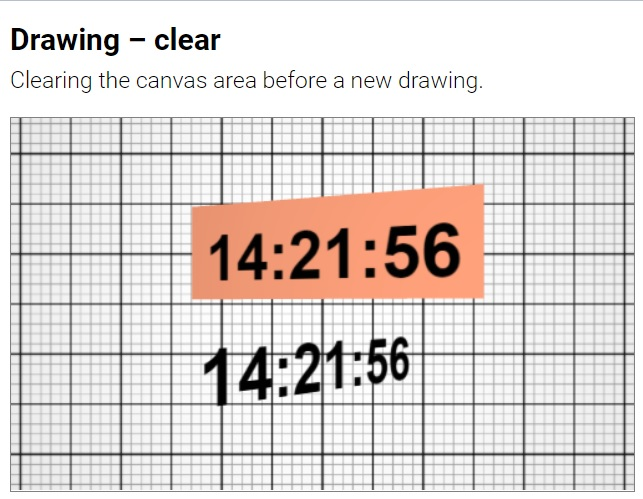</kbd>](../examples/drawing-clear.html)


<small>{{site.time | date: "%B, %Y"}}</small>