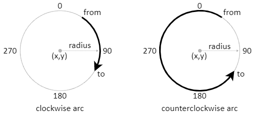

# arc

Command. Adds a circle оr a circular arc to the path.

#### Syntax:
```html
HTML:
<arc center="𝑥,𝑦" radius="𝑛𝑢𝑚𝑏𝑒𝑟">
<arc center="𝑥,𝑦" radius="𝑛𝑢𝑚𝑏𝑒𝑟" from="𝑓𝑟𝑜𝑚𝐴𝑛𝑔𝑙𝑒" to="𝑡𝑜𝐴𝑛𝑔𝑙𝑒" cw="𝑡𝑟𝑢𝑒/𝑓𝑎𝑙𝑠𝑒">
```

```js
JS:
𝑑𝑟𝑎𝑤𝑖𝑛𝑔.arc( 𝑥, 𝑦, 𝑟𝑎𝑑𝑖𝑢𝑠 );
𝑑𝑟𝑎𝑤𝑖𝑛𝑔.arc( 𝑥, 𝑦, 𝑟𝑎𝑑𝑖𝑢𝑠, 𝑓𝑟𝑜𝑚𝐴𝑛𝑔𝑙𝑒, 𝑡𝑜𝐴𝑛𝑔𝑙𝑒, 𝑐𝑤 );
𝑑𝑟𝑎𝑤𝑖𝑛𝑔.arc( x, y, radius, from, to, cw );
```


The `arc` command creates a circle or abn arc from a circle with center (`x`,`y`) and given
`radius`. The arc stars from angle `from` and ends at angle `to`. The direction
of drawing `cw` is either clockwise (`cw` is *true*) or counter-clockwise (`cw`
is *false*). Coordinates and radius are measured in pixels, angles are measured
in degrees. If the angles are not provided, a full circle is generated. In HTML `center` can be split into individual parameters `x` and `y`.

#### Code Examples:
```html
HTML:
<arc center="10,0" radius="5">
<arc x="10" y="0" radius="5" from="0" to="180" ccw>
```
```js
JS:
arc( 10, 0, 5 );
arc( 10, 0, 5, 0, 180, false );
```



#### Demo:
[<kbd></kbd>](../../examples/drawing-arc.html)

In HTML the direction of drawing is set by attribute `cw` or its antagonistic
attribute `ccw`. Their values are either *true* or *false*. If any of the
attributes is present, but has no value, it is assumed to be *true*. The
following commands are equivalent:

#### Code examples:
```html
HTML:
<arc x="10" y="0" radius="5" cw>
<arc x="10" y="0" radius="5" cw="true">
<arc x="10" y="0" radius="5" ccw="false">
```

In JavaSCript the direction of drawing is set only by `cw` and by default it is *true*.
