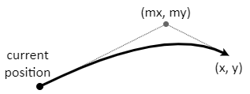
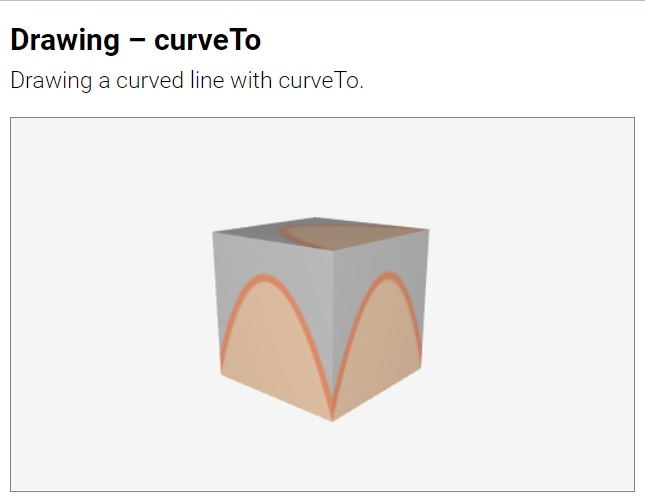

# curveTo

Command. Adds a curved segment to the path.

```html
HTML:
<curveTo m="𝑚𝑥,𝑚𝑦" center="𝑥,𝑦">
```
```js
JS:
𝑑𝑟𝑎𝑤𝑖𝑛𝑔.curveTo( 𝑚𝑥, 𝑚𝑦, 𝑥, 𝑦 );
```

The `curveTo` command moves the virtual pen along a curved line from its current
location to (`x`,`y`) and adds that curve to the current path. The line is
quadratic curve and is attracted towards point (`mx`, `my`). By default all
coordinates `mx`, `my`, `x` and `y` are 0. In HTML `center` can be split into
individual parameters `x` and `y`, and `m` can be split into `mx` and `my`.



```html
HTML:
<curveTo m="10,0" center="20,15">
<curveTo mx="10" my="0" x="20" y="15">
```
```js
JS:
curveTo( 10, 0, 20, 15 );
```

[<kbd></kbd>](../../examples/drawing-curveto.html)

A more complex curve can be constructed by joining individual curves. The shape
of a heart, for examples, can be constructed by 6 connected curves.


[<kbd></kbd>](../../examples/drawing-heart-point.html)
