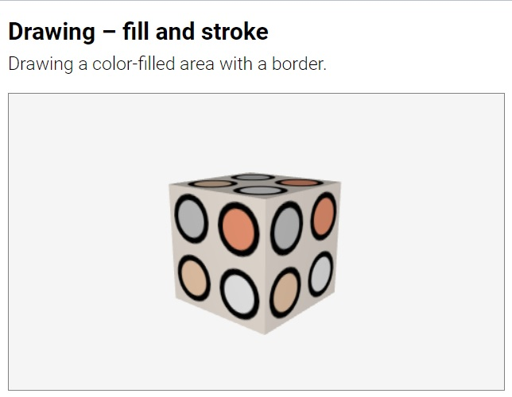

# fill

Command. Fills the area defined by a path.

```html
HTML:
<fill color="𝑐𝑜𝑙𝑜𝑟">
```
```js
JS:
fill( 𝑐𝑜𝑙𝑜𝑟 );
```

The command `fill` fills the area defined by a boundary path with the given
`color`.  A `fill` immediately after another `stroke` or `fill` reuses the
same path. 

```html
HTML:
<fill color="crimson">
```
```js
JS:
fill( 'crimson' );
```
	
[<kbd></kbd>](../../examples/drawing-fill.html)
[<kbd></kbd>](../../examples/drawing-fill-and-stroke.html)