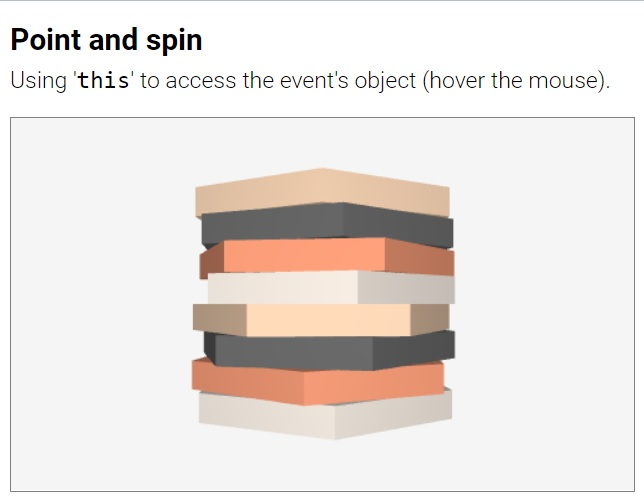
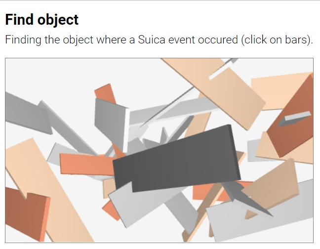

&nbsp;


**Suica events** are actions that happen 'outside' a Suica program and it is impossible to predict when they will happen. A typical example of an event is when users click, tap or touch Suica objects.


# Table of contents
- [Introduction](#introduction)
	- <small>[Motion events](#motion-events): `onPointerEnter`, `onPointerMove`, `onPointerLeave`</small>
	- <small>[Click events](#click-events): `onPointerDown`, `onPointerUp`, `onClick`</small>
	- <small>[Time events](#time-events): `onTime`</small>
	- <small>[Load events](#load-events): `onLoad`</small>
- [Working with events](#working-with-events)
	- <small>[Event listeners](#event-listeners): [`addEventListener`](#addeventlistener), [`removeEventListener`](#removeeventlistener)</small>
	- <small>[Pointer event handlers](#pointer-event-handlers): [`findPosition`](#findposition), [`findObject`](#findobject), [`findObjects`](#findobjects)</small>
	- <small>[Time event handlers](#time-event-handlers)</small>
	- <small>[Load event handlers](#load-event-handlers)</small>
	- <small>[Proactive events](#proactive-events): [`proactive`](#proactive)</small>


# Introduction

Suica supports a simplified model of events. It is similar to the traditional web page events, but are tuned for Suica objects. Suica supports *motion events*, *click events* and *time events*.

## Motion events

Motion events are `onPointerEnter`, `onPointerMove` and `onPointerLeave`. They occur when the pointer (mouse, stilus or finger) enters, moves over or leaves Suica canvas or Suica object.


## Click events

Click events are `onPointerDown`, `onPointerUp` and `onClick`. They occur when a pointer or its button is pressed, released or clicked over Suica canvas or Suica object.


## Time events

Time event is `onTime`. It occurs when the browser is ready for a new frame.

## Load events

Load event is `onLoad`. It occurs when a data resource is loaded.


# Working with events

An event is managed by two elements:

- **Event listener**: An HTML or JavaScript declaration that an object is interested in a specific event
- **Event handler**: A JavaScript user-defined function that is activated when an event occurs

Events that are not listened to, are ignored.


## Event listeners

In Suica event listeners can be set for Suica canvas and for individual Suica objects. For example, a canvas `onClick` event occurs when the user clicks anywhere in the canvas, while an object `onClick` event occurs when the user clicks on the image of the object. Similarly, a canvas `onPointerEnter` occurs when the pointer enters the canvas, while an object `onPointerEnter` occurs when the pointer enters the boundary of the object's image.

In HTML event listeners are set as attributes.

```html
HTML:
<𝑜𝑏𝑗𝑒𝑐𝑡 𝑒𝑣𝑒𝑛𝑡𝑁𝑎𝑚𝑒="𝑒𝑣𝑒𝑛𝑡𝐻𝑎𝑛𝑑𝑙𝑒𝑟">
```

The name of the attribute is the name of the event, which is case-insensitive and it can be with or without `on-` prefix. The value of the attribute is the name of the event handler function. The following code snippets install listeners of pointer click events to the whole Suica canvas and to a cube.

```html
HTML:
<suica click="clickOnCanvas">
<cube onClick="clickOnObject">
```

In JavaScript event listeners are set by `addEventListener` and removed by `removeEventListener`.


#### addEventListener
```js
JS:
𝑜𝑏𝑗𝑒𝑐𝑡.addEventListener( 𝑒𝑣𝑒𝑛𝑡𝑁𝑎𝑚𝑒, 𝑒𝑣𝑒𝑛𝑡𝐻𝑎𝑛𝑑𝑙𝑒𝑟 );
```
Function. Adds an event listener to specific `eventName` that triggers an `eventHandler` function. `eventName` is the case-insensitive name of the event with or without `on-` prefix, thus `pointerMove` and `onPointerMove` are considered the same event. Only one event handler per event per object can be set, i.e. setting another event handler will replace the previous one. Suica's `addEventListener` mimics to some extent the [DOM](https://developer.mozilla.org/en-US/docs/Web/API/Document_Object_Model)'s [addEventListener](https://developer.mozilla.org/en-US/docs/Web/API/EventTarget/addEventListener) which is used to set event listeners for HTML elements in a web page.

```js
JS:
suica.addEventListener( 'pointerMove', eventHandler );
obj.addEventListener( 'onPointerMove', eventHandler );
```

[<kbd></kbd>](../examples/events-event-listener.html)

In JavaScript an event listener can be set directly, but the event name must be `on-` prefixed and lowercased.

```js
JS:
// click, Click and onClick will not work
obj.onclick = eventHandler;
```


#### removeEventListener
```js
JS:
𝑜𝑏𝑗𝑒𝑐𝑡.removeEventListener( 𝑒𝑣𝑒𝑛𝑡𝑁𝑎𝑚𝑒 );
```
Function. Removes an event listener of specific `eventName`. `eventName` is the case-insensitive name of the event with or without `on-` prefix, thus `pointerMove` and `onPointerMove` are considered the same event. `removeEventListener`
mimics to some extent the [DOM](https://developer.mozilla.org/en-US/docs/Web/API/Document_Object_Model)'s
[removeEventListener](https://developer.mozilla.org/en-US/docs/Web/API/EventTarget/removeEventListener) which is used to remove event listeners for HTML elements in a web page. 

```js
JS:
suica.removeEventListener( 'pointerMove' );
obj.removeEventListener( 'onPointerMove' );
```

[<kbd></kbd>](../examples/events-one-time-listener.html)

In JavaScript an event listener can be removed directly by assigning a `null` value, but the event name must be `on-` prefixed and lowercased.

```js
JS:
// click, Click and onClick will not work
obj.onclick = null;
```


## Pointer event handlers

In Suica event handlers are defined only in JavaScript and they are functions that are activated from listeners when a specific event occurs. Often the name of the event handler is the same as the name of the corresponding event, although this is not enforced. These functions have optional, but predefined parameters.

All pointer-related events, these are `onPointerEnter`, `onPointerMove`, `onPointerLeave`, `onPointerDown`, `onPointerUp` and `onClick`, provide parameter `event` to their handlers.

```js
JS:
function 𝑒𝑣𝑒𝑛𝑡𝐻𝑎𝑛𝑑𝑙𝑒𝑟( 𝑒𝑣𝑒𝑛𝑡 ) 
{
  ...
}
```

The actual name of the parameter is user-defined, but traditionally *'event'* is used. The following snippet illustrates the definition of a event handler for `onPointerEnter` event. Note that both the function name and the parameter name are user-defined.

```js
JS:
function onPointerEnter( event )
{
	...
}
```

[<kbd></kbd>](../examples/events-suica-enter.html)

The `event` parameter describes the event and its structure is the same as DOM's [PointerEvent](https://developer.mozilla.org/en-US/docs/Web/API/PointerEvent). The parameter contains data about event time and place, mouse buttons, pressed keys, stilus tilt, finger pressure etc. These data can be used to implement drag-and-drop operations. Each event handler is run from within the object that reacted to the event. The system variable `this` in the event handler points to this object. This is used to identify the object when several objects share the same event handler.

```js
JS:
function onPointerMove( event )
{
   if( event.ctrlKey )
   {
      this.center = [0,0,0];
      this.color = 'crimson';
   }
}
```

[<kbd></kbd>](../examples/events-drag-and-drop.html)
[<kbd></kbd>](../examples/events-point-and-spin.html)


Additional Suica-specific data for pointer events is extracted from `event` by 
`findPosition`, `findObject` and `findObjects`.


#### findPosition
```js
JS:
𝑝𝑜𝑠 = findPosition( 𝑒𝑣𝑒𝑛𝑡 );
```
Function. Finds the position of a pointer event. The position is measured in pixels and is relative to the center of the Suica canvas. The function requires the `event` parameter of the event handler. The result is an array [`x`,`y`] of the position. `findPosition` is typically used with events of the Suica canvas.

```js
JS:
function onPointerMove( event )
{
	var pos = findPosition( event );
}
```

[<kbd></kbd>](../examples/events-find-position.html)

The returned position coincides with the Suica coordinate system when
[orthographic camera](#orthographic-camera) is used and the view point is not
changed with [demo](user-guide.md#demo) or [lookAt](user-guide.md#lookat).


#### findObject
```js
JS:
𝑜𝑏𝑗𝑒𝑐𝑡 = 𝑠𝑢𝑖𝑐𝑎.findObject( 𝑒𝑣𝑒𝑛𝑡 );
```
Function. Finds the Suica object where a pointer event occurred. The function requires the `event` parameter of the event handler. The result is the closest to the viewer Suica object that is at the position of the event, or `null` if no such object exists. `findObject` is typically used with events of the Suica canvas.

```js
JS:
function onPointerMove( event )
{
	var object = findObject( event );
}
```

[<kbd></kbd>](../examples/events-find-object.html)


#### findObjects
```js
JS:
𝑜𝑏𝑗𝑒𝑐𝑡𝑠 = 𝑠𝑢𝑖𝑐𝑎.findObjects( 𝑒𝑣𝑒𝑛𝑡 );
```
Function. Finds all Suica objects where a pointer event occured. The function requires the `event` parameter of the event handler. The result is a sorted list (from nearest to farthest with respect to the viewer) of all Suica objects that are at the position of the event, or an empty list `[]` if no such objects exist. `findObjects` is typically used with events of the Suica canvas.

```js
JS:
function onPointerMove( event )
{
	var object = findObjects( event );
}
```

[<kbd></kbd>](../examples/events-find-objects.html)


## Time event handlers

The time event `onTime` occurs when the browser is ready for a new frame. The browser tries to generate the event at regular time intervals, usually 60 or 30 times per second, but this is not guaranteed. The time event provides two parameters `t` and `dT` &ndash;  elapsed times since the start of Suica and since the previous frame. Both are measured in seconds, thus 2.3 means 2.3 seconds (2 seconds and 300 milliseconds).


```js
JS:
function onTime( t, dT )
{
	...
}
```

[<kbd></kbd>](../examples/events-ontime.html)


## Load event handlers

The load event `onLoad` occurs when a 3D [`model`](objects.md#model) or the font of a [`text3d`](objects.md#text3d) is loaded. The load event provides parameter `object` that is the object being loaded. This parameter is used when a load event handler is shared across several objects.


```js
JS:
function onLoad( object )
{
	...
}
```

The first example calculates the bounding boxes of 3D models. This uses the [`vertices`](properties.md#vertices) property that is available only when a model is completely loaded. The second example centers the 3D text after its font is loaded.

[<kbd></kbd>](../examples/events-onload-model.html)
[<kbd></kbd>](../examples/events-onload-text3d.html)


## Proactive events

Suica supports proactive mode for pointer motion events `onPointerEnter`, `onPointerMove` and `onPointerLeave`. This mode can be turned on with HTML attribute, HTML tag or JavaScript command.

#### proactive
```html
HTML:
<suica proactive>
<proactive>
```
```js
JS:
proactive( );
```
Command. Turns on proactive mode. Normal pointer motion events only occur when the pointer is moved into, over or out of an object. In proactive mode these events are triggered even when the pointer is stationary, but an object moves into, under or out of the pointer.

[<kbd></kbd>](../examples/events-proactive.html)

Proactive mode is resource consuming. For every frame all objects in Suica are tested against the pointer position. When a proactive event occurs Suica executes the assigned event handler and passes the latest pointer `event` structure as a parameter to the handler.
