##### [Suica tag](#suica) &middot; [Objects](#objects) &middot; [Properties](#properties) &middot; [Drawings](#drawings) &middot; [Events](#events)

# [Suica tag](suica.md)

## [Drawing canvas](suica.md#drawing-canvas)

[<kbd></kbd>](../examples/minimal-example.html)
[<kbd></kbd>](../examples/tag-suica.html)
[<kbd></kbd>](../examples/background.html)
[<kbd></kbd>](../examples/suica-orientation.html)

## [View point](suica.md#view-point)

[<kbd></kbd>](../examples/oxyz.html)
[<kbd></kbd>](../examples/demo.html)
[<kbd></kbd>](../examples/lookat.html)
[<kbd></kbd>](../examples/lookat-demo.html)
[<kbd></kbd>](../examples/lookat-navigation.html)
[<kbd></kbd>](../examples/lookat-navigation-vr.html)

## [Projections](suica.md#projections)

[<kbd>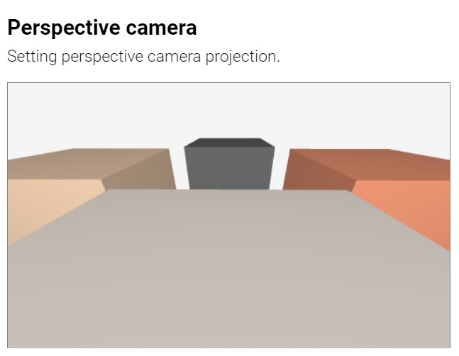</kbd>](../examples/camera-perspective.html)
[<kbd></kbd>](../examples/camera-orthographic.html)

## [Canvases](suica.md#canvses)

[<kbd></kbd>](../examples/camera-fullwindow.html)
[<kbd></kbd>](../examples/camera-fullscreen.html)

## [Cameras](suica.md#cameras)

[<kbd></kbd>](../examples/camera-stereo-wall-eyed.html)
[<kbd></kbd>](../examples/camera-stereo-cross-eyed.html)
[<kbd></kbd>](../examples/camera-anaglyph.html)
[<kbd></kbd>](../examples/camera-vr.html)

## [Video capturing](suica.md#video-capturing)

[<kbd></kbd>](../examples/capture-webm.html)
[<kbd></kbd>](../examples/capture-gif.html)

## [Questions and answers](suica.md#questions-and-answers)

[<kbd></kbd>](../examples/qa-property-modification.html)
[<kbd></kbd>](../examples/qa-attribute-modification.html)
[<kbd></kbd>](../examples/qa-attribute-modification-button.html)
[<kbd></kbd>](../examples/qa-custom-center.html)

# [Objects](objects.md)

## [Creating an object](objects.md#creating-an-object)

[<kbd></kbd>](../examples/object-html.html)
[<kbd></kbd>](../examples/object-js.html)
[<kbd></kbd>](../examples/allobjects.html)

## [Flat objects](objects.md#flat-objects)

[<kbd></kbd>](../examples/point.html)
[<kbd></kbd>](../examples/point-cloud.html)
[<kbd></kbd>](../examples/line.html)
[<kbd></kbd>](../examples/square.html)
[<kbd>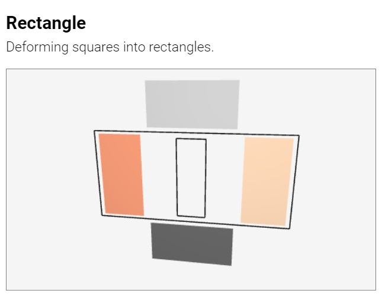</kbd>](../examples/square-rectangle.html)
[<kbd></kbd>](../examples/circle.html)
[<kbd></kbd>](../examples/circle-ellipse.html)
[<kbd></kbd>](../examples/polygon.html)

## [Spatial objects](objects.md#spatial-objects)

[<kbd></kbd>](../examples/cube.html)
[<kbd>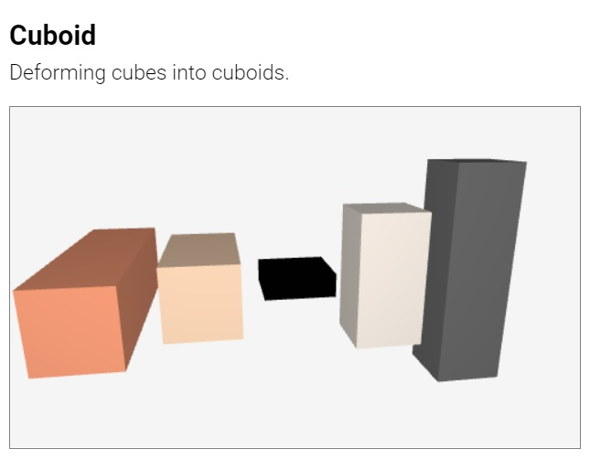</kbd>](../examples/cube-cuboid.html)
[<kbd></kbd>](../examples/sphere.html)
[<kbd></kbd>](../examples/sphere-spheroid.html)
[<kbd></kbd>](../examples/cylinder.html)
[<kbd></kbd>](../examples/cylinder-cylindroid.html)
[<kbd></kbd>](../examples/prism.html)
[<kbd></kbd>](../examples/cone.html)
[<kbd></kbd>](../examples/cone-conoid.html)
[<kbd></kbd>](../examples/pyramid.html)

## [Advanced objects](objects.md#advanced-objects)

[<kbd></kbd>](../examples/clone.html)
[<kbd></kbd>](../examples/clone-tag.html)

[<kbd></kbd>](../examples/group.html)
[<kbd></kbd>](../examples/group-tag.html)

[<kbd></kbd>](../examples/tube.html)
[<kbd></kbd>](../examples/tube-lathe.html)
[<kbd>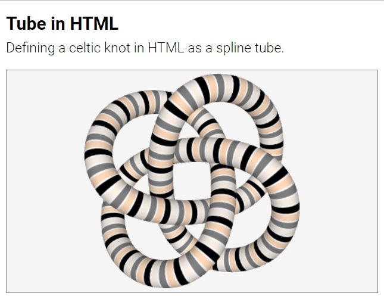</kbd>](../examples/tube-html.html)
[<kbd>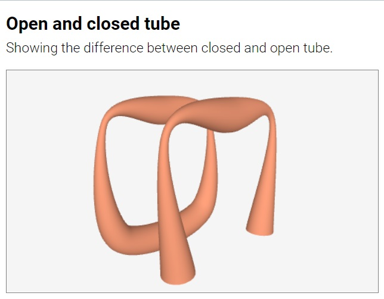</kbd>](../examples/tube-open-closed.html)
[<kbd></kbd>](../examples/tube-variations.html)
[<kbd></kbd>](../examples/tube-spline.html)
[<kbd></kbd>](../examples/tube-spline-explicit.html)
[<kbd>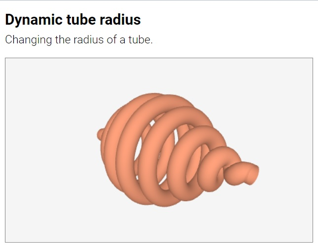</kbd>](../examples/tube-dynamic-radius.html)
[<kbd></kbd>](../examples/tube-dynamic-spline-radius.html)
[<kbd></kbd>](../examples/tube-dynamic.html)

[<kbd>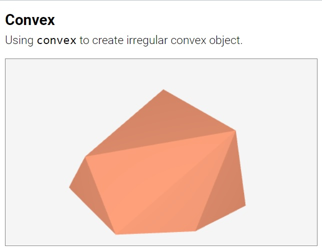</kbd>](../examples/convex.html)
[<kbd>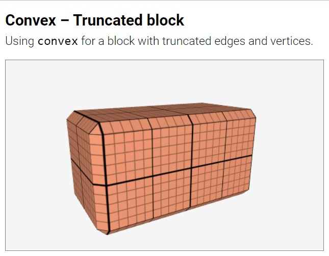</kbd>](../examples/convex-truncated-block.html)
[<kbd>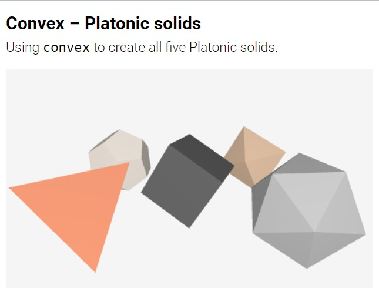</kbd>](../examples/convex-platonic-solids.html)
[<kbd>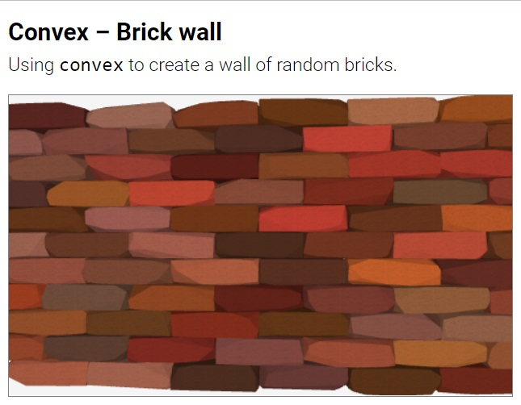</kbd>](../examples/convex-brick-wall.html)
[<kbd>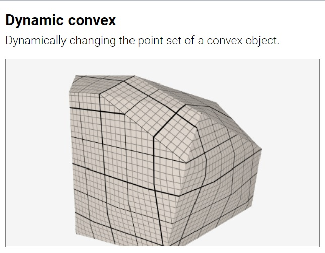</kbd>](../examples/convex-dynamic.html)
[<kbd></kbd>](../examples/convex-vertices.html)

[<kbd></kbd>](../examples/model.html)
[<kbd></kbd>](../examples/model-race.html)
[<kbd></kbd>](../examples/model-save.html)

[<kbd></kbd>](../examples/construct-union.html)
[<kbd></kbd>](../examples/construct-intersect.html)
[<kbd></kbd>](../examples/construct-subtract.html)
[<kbd></kbd>](../examples/construct-expression.html)
[<kbd>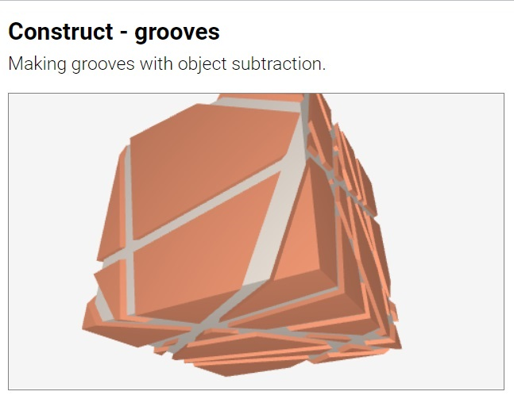</kbd>](../examples/construct-grooves.html)

[<kbd>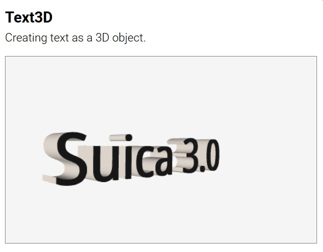</kbd>](../examples/text3d.html)
[<kbd>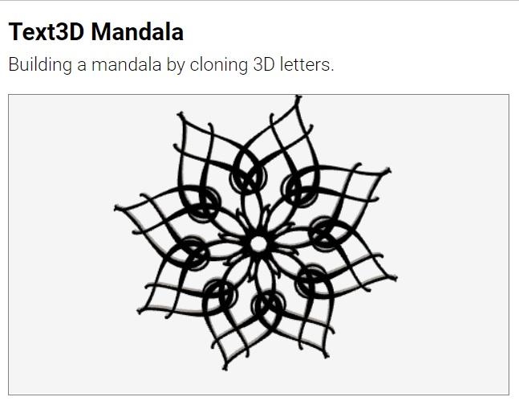</kbd>](../examples/text3d-mandala.html)
[<kbd>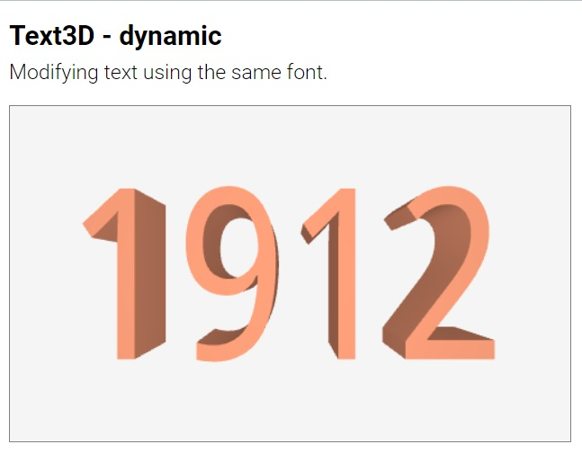</kbd>](../examples/text3d-dynamic.html)
[<kbd></kbd>](../examples/text3d-dynamic-font.html)

## [Invisibles](objects.md#invisibles)

[<kbd></kbd>](../examples/spline.html)
[<kbd></kbd>](../examples/spline-color.html)
[<kbd></kbd>](../examples/spline-size.html)
[<kbd>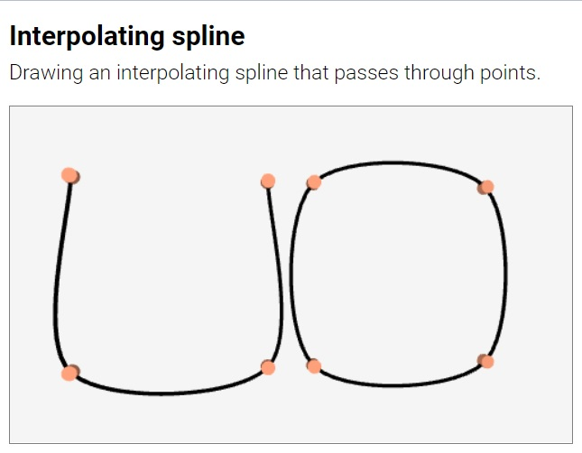</kbd>](../examples/spline-interpolating.html)
[<kbd></kbd>](../examples/spline-approximating.html)
[<kbd>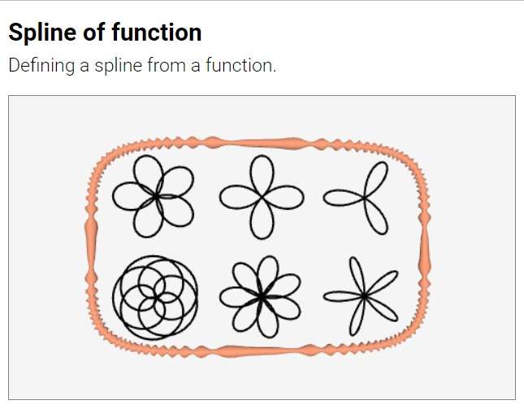</kbd>](../examples/spline-function.html)
[<kbd></kbd>](../examples/spline-html.html)

[<kbd></kbd>](../examples/splane-surface.html)
[<kbd></kbd>](../examples/splane.html)
[<kbd>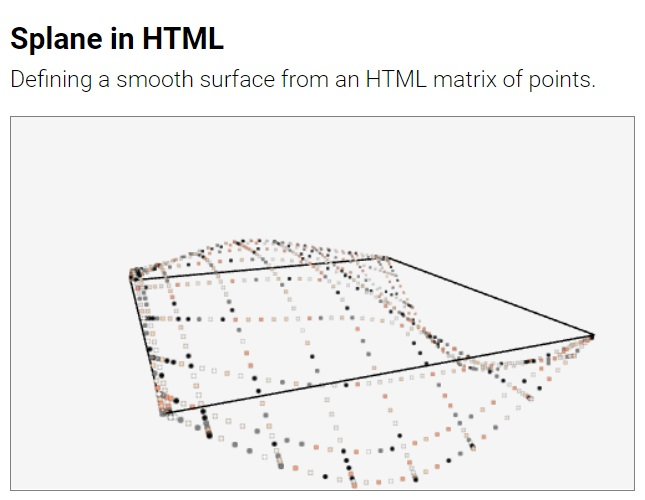</kbd>](../examples/splane-html.html)
[<kbd>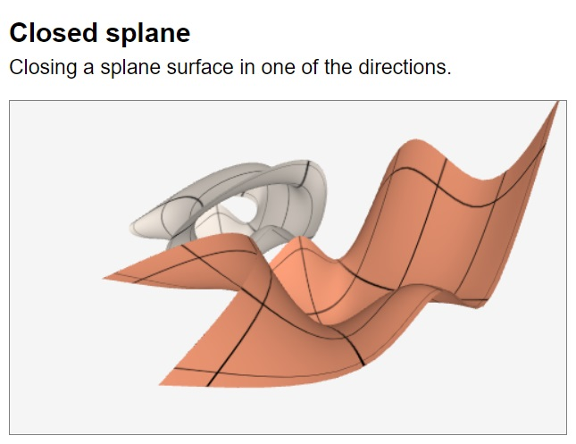</kbd>](../examples/splane-closed.html)
[<kbd>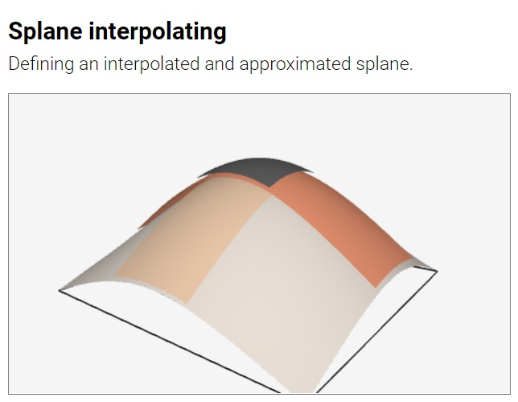</kbd>](../examples/splane-interpolating.html)

[<kbd></kbd>](../examples/scorm.html)

# [Properties](properties.md)

## [Multiple properties](properties.md#multiple-properties)

[<kbd></kbd>](../examples/style.html)

## [Geometrical properties](properties.md#geometrical-properties)

[<kbd></kbd>](../examples/object-as-position.html)
[<kbd></kbd>](../examples/sizes.html)
[<kbd></kbd>](../examples/sizes-orientation.html)
[<kbd></kbd>](../examples/spin.html)
[<kbd>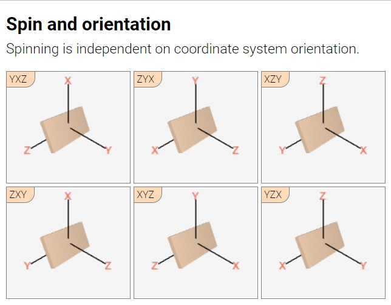</kbd>](../examples/spin-orientation.html)
[<kbd></kbd>](../examples/spin-angles.html)

## [Material properties](properties.md#material-properties)

[<kbd></kbd>](../examples/image-file.html)
[<kbd></kbd>](../examples/image-datauri.html)
[<kbd></kbd>](../examples/images.html)

# [Drawings](drawings.md)

## [Starting a drawing](drawings.md#starting-a-drawing)

[<kbd></kbd>](../examples/drawing-html.html)
[<kbd></kbd>](../examples/drawing-js.html)
[<kbd></kbd>](../examples/drawing-transparent.html)
[<kbd></kbd>](../examples/drawing-opaque.html)

## [Drawing shapes](drawings.md#drawing-shapes)

[<kbd></kbd>](../examples/drawing-moveto-lineto.html)
[<kbd></kbd>](../examples/drawing-curveto.html)
[<kbd></kbd>](../examples/drawing-heart-point.html)
[<kbd></kbd>](../examples/drawing-arc.html)
[<kbd></kbd>](../examples/drawing-stroke.html)
[<kbd></kbd>](../examples/drawing-fill.html)
[<kbd></kbd>](../examples/drawing-fill-and-stroke.html)

## [Drawing texts](drawings.md#drawing-texts)

[<kbd>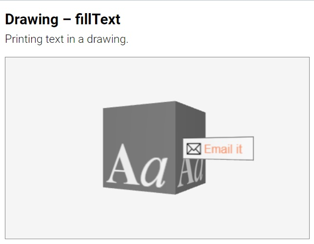</kbd>](../examples/drawing-filltext.html)
	
## [Advanced techniques](drawings.md#advanced-techniques)

[<kbd></kbd>](../examples/drawing-custom-point.html)
[<kbd>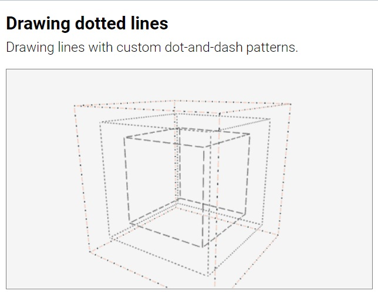</kbd>](../examples/drawing-dotted-lines.html)
[<kbd></kbd>](../examples/dynamic-drawing.html)
[<kbd></kbd>](../examples/drawing-clear.html)

# [Events](events.md)

## [Event listeners](#event-listeners)

[<kbd></kbd>](../examples/events-event-listener.html)
[<kbd></kbd>](../examples/events-one-time-listener.html)

## [Mouse event handlers](#mouse-event-handlers)

[<kbd></kbd>](../examples/events-suica-enter.html)
[<kbd></kbd>](../examples/events-drag-and-drop.html)
[<kbd></kbd>](../examples/events-point-and-spin.html)
[<kbd></kbd>](../examples/events-find-position.html)
[<kbd></kbd>](../examples/events-find-object.html)
[<kbd></kbd>](../examples/events-find-objects.html)

## [Time event handlers](#time-event-handlers)

[<kbd></kbd>](../examples/events-ontime.html)

## [Proactive events](#proactive-events)

[<kbd></kbd>](../examples/events-proactive.html)
