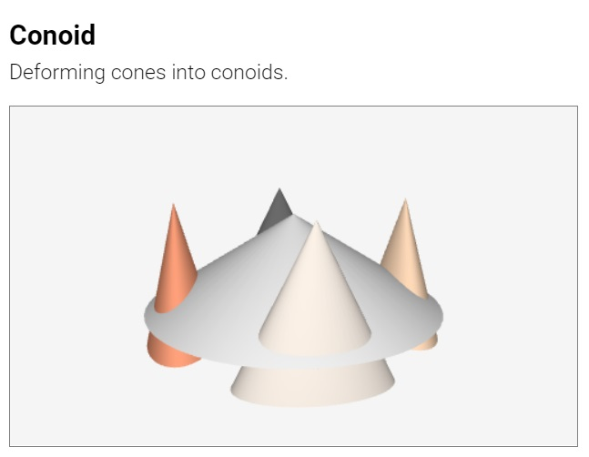
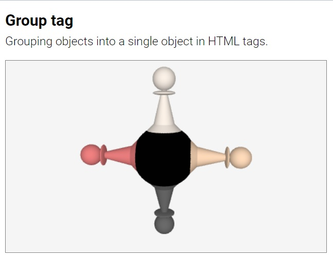
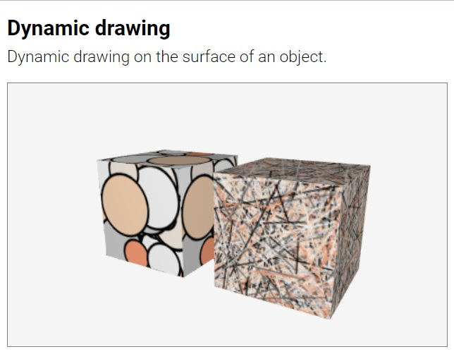
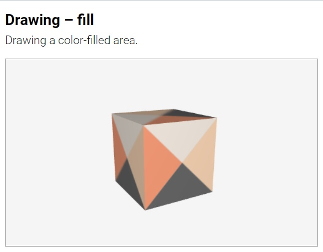
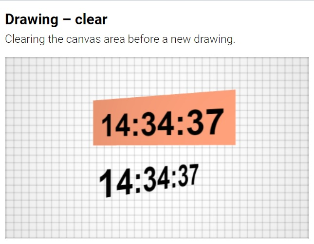
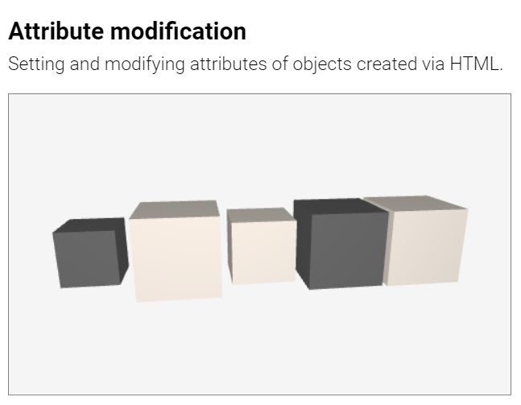

#  Suica Examples

[About](#about) |
[Suica](#suica-canvas) |
[Helpers](#helpers) |
[Cameras](#cameras) |
[Objects](#objects) |
[Properties](#objects-properties) |
[2D](#common-2d-objects) |
[3D](#common-3d-objects) |
[Advanced](#advanced-3d-objects) |
[Drawings](#drawings) |
[Events](#events) |
[Q&A](#questions-and-answers)

Click on an image to run the example.

## [About](user-guide.md#about)

[<kbd></kbd>](../examples/minimal-example.html)

## [Suica canvas](user-guide.md#suica-canvas)

[<kbd></kbd>](../examples/tag-suica.html)
[<kbd></kbd>](../examples/background.html)

[<kbd></kbd>](../examples/suica-orientation.html)

## [Helpers](user-guide.md#helpers)

[<kbd></kbd>](../examples/oxyz.html)
[<kbd></kbd>](../examples/demo.html)

[<kbd></kbd>](../examples/allobjects.html)

## [Cameras](user-guide.md#cameras)

[<kbd></kbd>](../examples/camera-perspective.html)
[<kbd></kbd>](../examples/camera-orthographic.html)

[<kbd></kbd>](../examples/camera-fullscreen.html)
[<kbd></kbd>](../examples/camera-fullwindow.html)

[<kbd></kbd>](../examples/camera-stereo-wall-eyed.html)
[<kbd></kbd>](../examples/camera-stereo-cross-eyed.html)

[<kbd></kbd>](../examples/camera-anaglyph.html)
[<kbd></kbd>](../examples/camera-vr.html)

[<kbd></kbd>](../examples/lookat.html)
[<kbd></kbd>](../examples/lookat-demo.html)

[<kbd></kbd>](../examples/lookat-navigation.html)
[<kbd></kbd>](../examples/lookat-navigation-vr.html)

## [Objects](user-guide.md#objects)

[<kbd></kbd>](../examples/object-html.html)
[<kbd></kbd>](../examples/object-js.html)

## [Objects properties](user-guide.md#properties)

[<kbd></kbd>](../examples/object-as-position.html)

[<kbd></kbd>](../examples/sizes.html)
[<kbd></kbd>](../examples/sizes-orientation.html)

[<kbd></kbd>](../examples/spin.html)
[<kbd></kbd>](../examples/spin-angles.html)

[<kbd></kbd>](../examples/spin-orientation.html)

[<kbd></kbd>](../examples/clone.html)
[<kbd></kbd>](../examples/clone-tag.html)

[<kbd></kbd>](../examples/style.html)
[<kbd></kbd>](../examples/image-file.html)

[<kbd></kbd>](../examples/image-datauri.html)
[<kbd></kbd>](../examples/images.html)

## [Common 2D objects](user-guide.md#common-2d-objects)

[<kbd></kbd>](../examples/point.html)
[<kbd></kbd>](../examples/point-cloud.html)

[<kbd></kbd>](../examples/line.html)

[<kbd></kbd>](../examples/square.html)
[<kbd></kbd>](../examples/square-rectangle.html)

[<kbd></kbd>](../examples/circle.html)
[<kbd></kbd>](../examples/circle-ellipse.html)

[<kbd></kbd>](../examples/polygon.html)

## [Common 3D objects](user-guide.md#common-3d-objects)

[<kbd></kbd>](../examples/cube.html)
[<kbd></kbd>](../examples/cube-cuboid.html)

[<kbd></kbd>](../examples/sphere.html)
[<kbd></kbd>](../examples/sphere-spheroid.html)

[<kbd></kbd>](../examples/cylinder.html)
[<kbd></kbd>](../examples/cylinder-cylindroid.html)

[<kbd></kbd>](../examples/prism.html)

[<kbd></kbd>](../examples/cone.html)
[<kbd></kbd>](../examples/cone-conoid.html)

[<kbd></kbd>](../examples/pyramid.html)

## [Advanced 3D objects](user-guide.md#advanced-3d-objects)

[<kbd></kbd>](../examples/group.html)
[<kbd></kbd>](../examples/group-tag.html)

## [Drawings](user-guide.md#drawings)

[<kbd></kbd>](../examples/drawing-html.html)
[<kbd></kbd>](../examples/drawing-js.html)

[<kbd></kbd>](../examples/drawing-transparent.html)
[<kbd></kbd>](../examples/drawing-opaque.html)

[<kbd></kbd>](../examples/drawing-custom-point.html)
[<kbd></kbd>](../examples/drawing-dotted-lines.html)

[<kbd></kbd>](../examples/dynamic-drawing.html)

[<kbd></kbd>](../examples/drawing-moveto-lineto.html)
[<kbd></kbd>](../examples/drawing-curveto.html)

[<kbd></kbd>](../examples/drawing-arc.html)
[<kbd></kbd>](../examples/drawing-heart-point.html)

[<kbd></kbd>](../examples/drawing-stroke.html)
[<kbd></kbd>](../examples/drawing-fill.html)

[<kbd></kbd>](../examples/drawing-fill-and-stroke.html)
[<kbd></kbd>](../examples/drawing-filltext.html)

[<kbd></kbd>](../examples/drawing-clear.html)

## [Events](user-guide.md#events)

[<kbd></kbd>](../examples/events-suica-enter.html)
[<kbd></kbd>](../examples/events-ontime.html)

[<kbd></kbd>](../examples/events-event-listener.html)
[<kbd></kbd>](../examples/events-one-time-listener.html)

[<kbd></kbd>](../examples/events-drag-and-drop.html)
[<kbd></kbd>](../examples/events-point-and-spin.html)

[<kbd></kbd>](../examples/events-find-position.html)

[<kbd></kbd>](../examples/events-find-object.html)
[<kbd></kbd>](../examples/events-find-objects.html)

## [Questions and answers](user-guide.md#questions-and-answers)

[<kbd></kbd>](../examples/qa-property-modification.html)
[<kbd></kbd>](../examples/qa-attribute-modification.html)

[<kbd></kbd>](../examples/qa-attribute-modification-button.html)
[<kbd></kbd>](../examples/qa-custom-center.html)

---

April, 2022