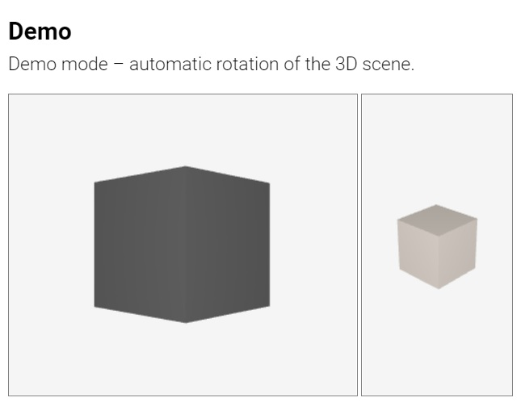
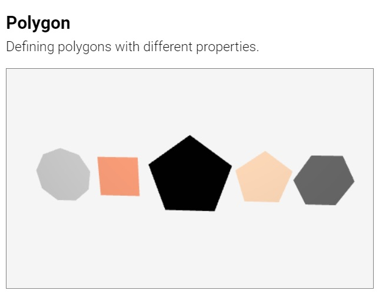
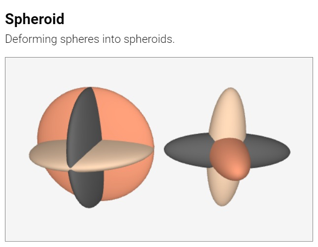
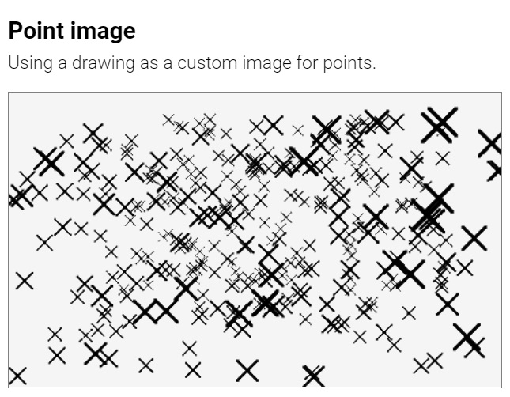

#  Suica Examples

Click on an image to run the example.

## [About](user-guide.md#about)

[<kbd></kbd>](https://boytchev.github.io/suica/examples/minimal-example.html)

## [Suica canvas](user-guide.md#suica-canvas)

[<kbd></kbd>](https://boytchev.github.io/suica/examples/tag-suica.html)
[<kbd></kbd>](https://boytchev.github.io/suica/examples/background.html)

[<kbd></kbd>](https://boytchev.github.io/suica/examples/suica-orientation.html)
[<kbd></kbd>](https://boytchev.github.io/suica/examples/ontime.html)

## [Helpers](user-guide.md#helpers)

[<kbd></kbd>](https://boytchev.github.io/suica/examples/oxyz.html)
[<kbd></kbd>](https://boytchev.github.io/suica/examples/demo.html)

## [Cameras](user-guide.md#cameras)

[<kbd></kbd>](https://boytchev.github.io/suica/examples/camera-perspective.html)
[<kbd></kbd>](https://boytchev.github.io/suica/examples/camera-orthographic.html)

[<kbd></kbd>](https://boytchev.github.io/suica/examples/camera-fullscreen.html)
[<kbd></kbd>](https://boytchev.github.io/suica/examples/camera-fullwindow.html)

[<kbd></kbd>](https://boytchev.github.io/suica/examples/camera-stereo-wall-eyed.html)
[<kbd></kbd>](https://boytchev.github.io/suica/examples/camera-stereo-cross-eyed.html)

[<kbd></kbd>](https://boytchev.github.io/suica/examples/camera-anaglyph.html)
[<kbd></kbd>](https://boytchev.github.io/suica/examples/camera-vr.html)

[<kbd></kbd>](https://boytchev.github.io/suica/examples/lookat.html)
[<kbd></kbd>](https://boytchev.github.io/suica/examples/lookat-demo.html)

[<kbd></kbd>](https://boytchev.github.io/suica/examples/lookat-navigation.html)
[<kbd></kbd>](https://boytchev.github.io/suica/examples/lookat-navigation-vr.html)

## [Objects](user-guide.md#objects)

[<kbd></kbd>](https://boytchev.github.io/suica/examples/object-html.html)
[<kbd></kbd>](https://boytchev.github.io/suica/examples/object-js.html)

## [Objects properties](user-guide.md#properties)

[<kbd></kbd>](https://boytchev.github.io/suica/examples/object-as-position.html)

[<kbd></kbd>](https://boytchev.github.io/suica/examples/sizes.html)
[<kbd></kbd>](https://boytchev.github.io/suica/examples/sizes-orientation.html)

[<kbd></kbd>](https://boytchev.github.io/suica/examples/spin.html)
[<kbd></kbd>](https://boytchev.github.io/suica/examples/spin-orientation.html)

[<kbd></kbd>](https://boytchev.github.io/suica/examples/clone.html)
[<kbd></kbd>](https://boytchev.github.io/suica/examples/style.html)

## [Common 2D objects](user-guide.md#common-2d-objects)

[<kbd></kbd>](https://boytchev.github.io/suica/examples/point.html)
[<kbd></kbd>](https://boytchev.github.io/suica/examples/point-cloud.html)

[<kbd></kbd>](https://boytchev.github.io/suica/examples/line.html)

[<kbd></kbd>](https://boytchev.github.io/suica/examples/square.html)
[<kbd></kbd>](https://boytchev.github.io/suica/examples/square-rectangle.html)

[<kbd></kbd>](https://boytchev.github.io/suica/examples/circle.html)
[<kbd></kbd>](https://boytchev.github.io/suica/examples/ellipse.html)

[<kbd></kbd>](https://boytchev.github.io/suica/examples/polygon.html)

## [Common 3D objects](user-guide.md#common-3d-objects)

[<kbd></kbd>](https://boytchev.github.io/suica/examples/cube.html)
[<kbd></kbd>](https://boytchev.github.io/suica/examples/cube-cuboid.html)

[<kbd></kbd>](https://boytchev.github.io/suica/examples/sphere.html)
[<kbd></kbd>](https://boytchev.github.io/suica/examples/sphere-spheroid.html)

[<kbd></kbd>](https://boytchev.github.io/suica/examples/cylinder.html)
[<kbd></kbd>](https://boytchev.github.io/suica/examples/cylinder-cylindroid.html)

[<kbd></kbd>](https://boytchev.github.io/suica/examples/prism.html)

[<kbd></kbd>](https://boytchev.github.io/suica/examples/cone.html)
[<kbd></kbd>](https://boytchev.github.io/suica/examples/cone-conoid.html)

[<kbd></kbd>](https://boytchev.github.io/suica/examples/pyramid.html)

## [Advanced 3D objects](user-guide.md#advanced-3d-objects)

[<kbd></kbd>](https://boytchev.github.io/suica/examples/group.html)

## [Images and drawings](user-guide.md#images-and-drawings)

[<kbd></kbd>](https://boytchev.github.io/suica/examples/point-image.html)
[<kbd></kbd>](https://boytchev.github.io/suica/examples/cube-image.html)

## [Questions and answers](user-guide.md#questions-and-answers)

[<kbd></kbd>](https://boytchev.github.io/suica/examples/qa-property-modification.html)
[<kbd></kbd>](https://boytchev.github.io/suica/examples/qa-attribute-modification.html)
[<kbd></kbd>](https://boytchev.github.io/suica/examples/qa-attribute-modification-button.html)

---

March, 2022