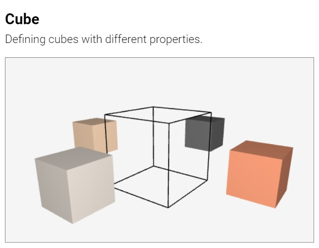
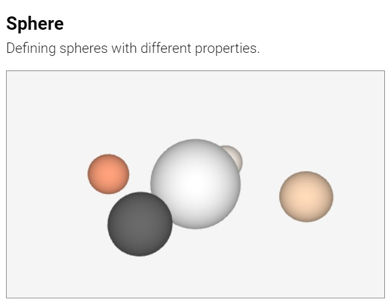
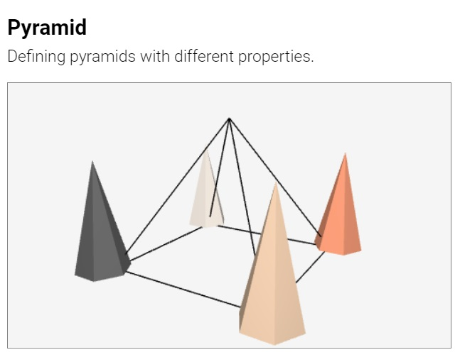
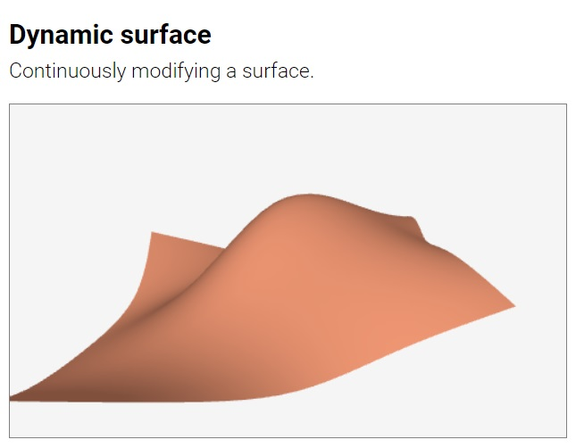
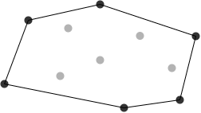
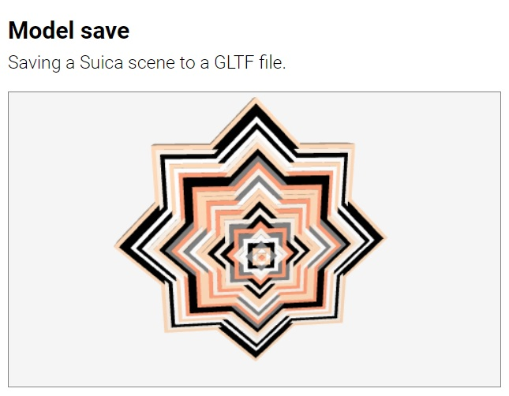
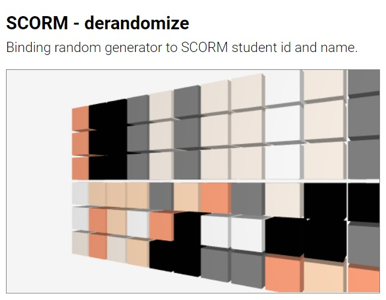

##### [Suica](suica.md) &middot; **Objects** &middot; [Properties](properties.md) &middot; [Drawings](drawings.md) &middot; [Events](events.md)

**Suica objects** are the core functionality of Suica. They are the elements that are used to construct 3D scenes. These objects are designed to provide a foundation for a diverse mobile computer graphics visualizations.

# Table of contents

- [Creating an object](#creating-an-object)
	-  <small>[Objects and variables](#objects-and-variables): [`id`](#id) [`allObjects`](#allobjects)</small>
- [Objects](#objects)
	- <small>[Flat objects](#flat-objects): [`point`](#point), [`line`](#line), [`square`](#square), [`circle`](#circle), [`polygon`](#polygon)</small>
	- <small>[Spatial objects](#spatial-objects): [`cube`](#cube), [`sphere`](#sphere), [`cylinder`](#cylinder), [`prism`](#prism), [`cone`](#cone), [`pyramid`](#pyramid)</small>
	- <small>[Advanced objects](#advanced-objects): [`clone`](#clone), [`group`](#group), [`tube`](#tube), [`surface`](#surface), [`convex`](#convex), [`model`](#model), [`construct`](#construct), [`text3d`](#text3d)</small>
	- <small>[Invisibles](#invisibles): [`spline`](#spline), [`splane`](#splane), [`scorm`](#scorm)</small>


# Creating an object

In Suica object is created via HTML tag or via JavaScript function. Each object has properties. In HTML the properties are provided as tag attributes in no specific order. In JavaScript the properties are provided as function parameters and the order is fixed. 

```html
HTML:
<𝘰𝘣𝘫𝘦𝘤𝘵 𝘱𝘳𝘰𝘱𝘦𝘳𝘵𝘺𝘕𝘢𝘮𝘦="𝘷𝘢𝘭𝘶𝘦" 𝘱𝘳𝘰𝘱𝘦𝘳𝘵𝘺𝘕𝘢𝘮𝘦="𝘷𝘢𝘭𝘶𝘦" ...>
```
```js
JS:
𝘰𝘣𝘫𝘦𝘤𝘵( 𝘷𝘢𝘭𝘶𝘦, 𝘷𝘢𝘭𝘶𝘦, ...);
```

The following examples show the same 3D scene created in HTML and in JavaScript.

[<kbd></kbd>](../examples/object-html.html)
[<kbd></kbd>](../examples/object-js.html)

Most Suica objects share the same basic properties for position, orientation, color and so on. More information about properties are in chapter [Suica properties](properties.md). Properties related to events are described in chapter [Suica events](events.md).

## Objects and variables

Suica keeps track of all created objects. They are created as JavaScript variables and stored in an internal Suica list of objects `allObjects`. When an object is created with an `id`, this object is also created as a global JavaScript variable. This allows to reuse or to reference the object later on.

#### id
```html
HTML:
<𝘰𝘣𝘫𝘦𝘤𝘵𝘕𝘢𝘮𝘦 id="𝘷𝘢𝘳𝘪𝘢𝘣𝘭𝘦𝘕𝘢𝘮𝘦">
```
```js
JS:
𝘷𝘢𝘳𝘪𝘢𝘣𝘭𝘦𝘕𝘢𝘮𝘦 = 𝘰𝘣𝘫𝘦𝘤𝘵𝘕𝘢𝘮𝘦( ... );
```

In HTML the name of an object is set in the `id` attribute. If the `id` is omitted, the object is created without a name. In JavaScript the name of an object is set by using the JavaScript way of creating variable.

Examples of named objects:
```html
HTML:
<point id="p" center="25,0,15">
```
```js
JS:
p = point( [25,0,15] );
```

Examples of anonymous objects:
```html
HTML:
<point center="25,0,15">
```
```js
JS:
point( [25,0,15] );
```

#### allObjects
```js
JS:
𝘢𝘳𝘳𝘢𝘺 = allObjects();
```
Function. Get a list of all graphical objects in a Suica canvas. The result of
the function is an array of these objects.

```js
JS:
list = allObjects( );
```

[<kbd></kbd>](../examples/allobjects.html)


# Objects

## Flat objects

Flat objects are all objects that can exist in a plane. These objects have at most two [dimensions](https://en.wikipedia.org/wiki/Dimension). [`point`](#point), [`line`](#line), [`square`](#square), [`circle`](#circle) and [`polygon`](#polygon).


### Point
```html
HTML:
<point id="𝑜𝑏𝑗𝑒𝑐𝑡" center="𝑥,𝑦,𝑧" size="𝑠𝑖𝑧𝑒" color="𝑐𝑜𝑙𝑜𝑟">
```
```js
JS:
𝑜𝑏𝑗𝑒𝑐𝑡 = point( [𝑥,𝑦,𝑧], 𝑠𝑖𝑧𝑒, 𝑐𝑜𝑙𝑜𝑟 );
```
Object. Represents a point. Its properties are [`center`](properties.md#center) (or [`x`](properties.md#x-y-z), [`y`](properties.md#x-y-z) and [`z`](properties.md#x-y-z)), [`size`](properties.md#size), [`color`](properties.md#color), [`image`](properties.md#image), [`images`](properties.md#images) and [`clone`](properties.md#clone). By default, a point is drawn as a small circle, but it can be changed with a custom [drawing](#drawings.md). In HTML all properties can be included in the `<point>` tag.

```html
HTML:
<point center="25,0,15">
<point center="25,0,15" size="10" color="crimson">
```
```js
JS:
point( [25,0,15] );
point( [25,0,15], 10, 'crimson' );
```

[<kbd></kbd>](../examples/point.html)&emsp;[<kbd></kbd>](../examples/point-cloud.html)


#### line
```html
HTML:
<line id="𝑜𝑏𝑗𝑒𝑐𝑡" from="𝑥,𝑦,𝑧" to="𝑥,𝑦,𝑧" color="𝑐𝑜𝑙𝑜𝑟">
```
```js
JS:
𝑜𝑏𝑗𝑒𝑐𝑡 = line( [𝑥,𝑦,𝑧], [𝑥,𝑦,𝑧], 𝑐𝑜𝑙𝑜𝑟 );
```
Object. Represents a straight segment. Its properties are `from` (or [`center`](properties.md#center)), `to`, [`color`](properties.md#color), [`image`](properties.md#image), [`images`](properties.md#images) and [`clone`](properties.md#clone). The properties `center` and `from` are synonyms and they set the starting point of the segment, while `to` sets the ending point. By default, a line is drawn as a solid line, but it can be changed with custom [drawing](#drawings.md). In HTML all properties can be included in the `<line>` tag.

```html
HTML:
<line center="25,0,15" to="100,-20,35">
<line from="25,0,15" to="100,-20,35">
```
```js
JS:
line( [25,0,15], [100,-20,35] );
point( [25,0,15], [100,-20,35], 'red' );
```

[<kbd></kbd>](../examples/line.html)


#### square
```html
HTML:
<square id="𝑜𝑏𝑗𝑒𝑐𝑡" center="𝑥,𝑦,𝑧" size="𝑤𝑖𝑑𝑡ℎ,ℎ𝑒𝑖𝑔ℎ𝑡" color="𝑐𝑜𝑙𝑜𝑟">
```
```js
JS:
𝑜𝑏𝑗𝑒𝑐𝑡 = 𝑠𝑢𝑖𝑐𝑎.square( [𝑥,𝑦,𝑧], [𝑤𝑖𝑑𝑡ℎ,ℎ𝑒𝑖𝑔ℎ𝑡], 𝑐𝑜𝑙𝑜𝑟 );
```
Object. Represents a regular square or a rectangle. Its properties are
[`center`](properties.md#center) (or [`x`](properties.md#x-y-z), [`y`](properties.md#x-y-z) and [`z`](properties.md#x-y-z)), [`size`](properties.md#size) (or [`width`](properties.md#width-height-depth) and [`height`](properties.md#width-height-depth)), [`color`](properties.md#color), [`spin`](properties.md#spin) (or [`spinH`](properties.md#spinh-spinv-spint), [`spinV`](properties.md#spinh-spinv-spint) and [`spinT`](properties.md#spinh-spinv-spint)), [`wireframe`](properties.md#wireframe), [`image`](properties.md#image), [`images`](properties.md#images) and [`clone`](properties.md#clone). In HTML all properties can be included in the `<square>` tag.

```html
HTML:
<square center="25,0,15">
<square size="10" color="crimson">
```
```js
JS:
square( [25,0,15] );
square( [0,0,0], 10, 'crimson' );
```

[<kbd></kbd>](../examples/square.html)
[<kbd></kbd>](../examples/square-rectangle.html)


#### circle
```html
HTML:
<circle id="𝑜𝑏𝑗𝑒𝑐𝑡" center="𝑥,𝑦,𝑧" size="𝑤𝑖𝑑𝑡ℎ,ℎ𝑒𝑖𝑔ℎ𝑡" color="𝑐𝑜𝑙𝑜𝑟">
```
```js
JS:
𝑜𝑏𝑗𝑒𝑐𝑡 = circle( [𝑥,𝑦,𝑧], [𝑤𝑖𝑑𝑡ℎ,ℎ𝑒𝑖𝑔ℎ𝑡], 𝑐𝑜𝑙𝑜𝑟 );
```
Object. Represents a circle or an ellipse. Its properties are [`center`](properties.md#center) (or [`x`](properties.md#x-y-z), [`y`](properties.md#x-y-z) and [`z`](properties.md#x-y-z)), [`size`](properties.md#size) (or [`width`](properties.md#width-height-depth) and [`height`](properties.md#width-height-depth)), [`color`](properties.md#color), [`spin`](properties.md#spin) (or [`spinH`](properties.md#spinh-spinv-spint), [`spinV`](properties.md#spinh-spinv-spint) and [`spinT`](properties.md#spinh-spinv-spint)), [`wireframe`](properties.md#wireframe),
[`image`](properties.md#image), [`images`](properties.md#images) and [`clone`](properties.md#clone). In HTML all properties can be included in the `<circle>` tag.

```html
HTML:
<circle center="25,0,15">
<circle size="10" color="crimson">
```
```js
JS:
circle( [25,0,15] );
circle( [0,0,0], 10, 'crimson' );
```

[<kbd></kbd>](../examples/circle.html)
[<kbd></kbd>](../examples/circle-ellipse.html)


#### polygon
```html
HTML:
<polygon id="𝑜𝑏𝑗𝑒𝑐𝑡" count="𝑐𝑜𝑢𝑛𝑡" center="𝑥,𝑦,𝑧" size="𝑤𝑖𝑑𝑡ℎ,ℎ𝑒𝑖𝑔ℎ𝑡" color="𝑐𝑜𝑙𝑜𝑟">
```
```js
JS:
𝑜𝑏𝑗𝑒𝑐𝑡 = polygon( 𝑐𝑜𝑢𝑛𝑡, [𝑥,𝑦,𝑧], [𝑤𝑖𝑑𝑡ℎ,ℎ𝑒𝑖𝑔ℎ𝑡], 𝑐𝑜𝑙𝑜𝑟 );
```
Object. Represents a regular polygon or an elliptical polygon. Its properties are `count`, [`center`](properties.md#center) (or [`x`](properties.md#x-y-z), [`y`](properties.md#x-y-z) and [`z`](properties.md#x-y-z)), [`size`](properties.md#size) (or [`width`](properties.md#width-height-depth) and [`height`](properties.md#width-height-depth)), [`color`](properties.md#color), [`spin`](properties.md#spin) (or [`spinH`](properties.md#spinh-spinv-spint), [`spinV`](properties.md#spinh-spinv-spint) and [`spinT`](properties.md#spinh-spinv-spint)), [`wireframe`](properties.md#wireframe), [`image`](properties.md#image), [`images`](properties.md#images) and [`clone`](properties.md#clone). The property `count` defines
the number of sides of the polygon. The properties `size`, `width` and `height` refer to the polygon circumscribed circle, rather than the polygon itself. In HTML all properties can be included in the `<polygon>` tag.

```html
HTML:
<polygon count="3" center="25,0,15">
<polygon count="5" size="10" color="crimson">
```
```js
JS:
polygon( 3, [25,0,15] ); // triangle
polygon( 5, [0,0,0], 10, 'crimson' ); // pentagon
```

[<kbd></kbd>](../examples/polygon.html)


# Spatial objects

The spatial objects represent common 3D geometrical shapes: [`cube`](#cube), [`sphere`](#sphere), [`cylinder`](#cylinder), [`prism`](#prism), [`cone`](#cone) and [`pyramid`](#pyramid). 

#### cube
```html
HTML:
<cube id="𝑜𝑏𝑗𝑒𝑐𝑡" center="𝑥,𝑦,𝑧" size="𝑤𝑖𝑑𝑡ℎ,ℎ𝑒𝑖𝑔ℎ𝑡,𝑑𝑒𝑝𝑡ℎ" color="𝑐𝑜𝑙𝑜𝑟">
```
```js
JS:
𝑜𝑏𝑗𝑒𝑐𝑡 = cube( [𝑥,𝑦,𝑧], [𝑤𝑖𝑑𝑡ℎ,ℎ𝑒𝑖𝑔ℎ𝑡,𝑑𝑒𝑝𝑡ℎ], 𝑐𝑜𝑙𝑜𝑟 );
```
Object. Represents a regular cube or a deformed cube (called *cuboid*). Its properties are [`center`](properties.md#center) (or [`x`](properties.md#x-y-z), [`y`](properties.md#x-y-z) and [`z`](properties.md#x-y-z)), [`size`](properties.md#size) (or [`width`](properties.md#width-height-depth), [`height`](properties.md#width-height-depth) and [`depth`](properties.md#width-height-depth)), [`color`](properties.md#color), [`spin`](properties.md#spin) (or [`spinH`](properties.md#spinh-spinv-spint), [`spinV`](properties.md#spinh-spinv-spint) and [`spinT`](properties.md#spinh-spinv-spint)), [`wireframe`](properties.md#wireframe), [`image`](properties.md#image), [`images`](properties.md#images) and [`clone`](properties.md#clone). In HTML all properties can be included in the `<cube>` tag.

```html
HTML:
<cube center="25,0,15">
<cube size="10" color="crimson">
```
```js
JS:
cube( [25,0,15] );
cube( [0,0,0], 10, 'crimson' );
```

[<kbd></kbd>](../examples/cube.html)
[<kbd></kbd>](../examples/cube-cuboid.html)


#### sphere
```html
HTML:
<sphere id="𝑜𝑏𝑗𝑒𝑐𝑡" center="𝑥,𝑦,𝑧" size="𝑤𝑖𝑑𝑡ℎ,ℎ𝑒𝑖𝑔ℎ𝑡,𝑑𝑒𝑝𝑡ℎ" color="𝑐𝑜𝑙𝑜𝑟">
```
```js
JS:
𝑜𝑏𝑗𝑒𝑐𝑡 = sphere( [𝑥,𝑦,𝑧], [𝑤𝑖𝑑𝑡ℎ,ℎ𝑒𝑖𝑔ℎ𝑡,𝑑𝑒𝑝𝑡ℎ], 𝑐𝑜𝑙𝑜𝑟 );
```
Object. Represents a regular sphere or a deformed sphere (spheroid). Its properties are [`center`](properties.md#center) (or [`x`](properties.md#x-y-z), [`y`](properties.md#x-y-z) and [`z`](properties.md#x-y-z)), [`size`](properties.md#size) (or [`width`](properties.md#width-height-depth), [`height`](properties.md#width-height-depth) and [`depth`](properties.md#width-height-depth)), [`color`](properties.md#color), [`spin`](properties.md#spin) (or [`spinH`](properties.md#spinh-spinv-spint), [`spinV`](properties.md#spinh-spinv-spint) and [`spinT`](properties.md#spinh-spinv-spint)), [`image`](properties.md#image), [`images`](properties.md#images) and [`clone`](properties.md#clone). In HTML all properties can be included in the `<sphere>` tag. 

```html
HTML:
<sphere center="25,0,15">
<sphere size="10" color="crimson">
```
```js
JS:
sphere( [25,0,15] );
sphere( [0,0,0], 10, 'crimson' );
```

[<kbd></kbd>](../examples/sphere.html)
[<kbd></kbd>](../examples/sphere-spheroid.html)


#### cylinder
```html
HTML:
<cylinder id="𝑜𝑏𝑗𝑒𝑐𝑡" center="𝑥,𝑦,𝑧" size="𝑤𝑖𝑑𝑡ℎ,ℎ𝑒𝑖𝑔ℎ𝑡,𝑑𝑒𝑝𝑡ℎ" color="𝑐𝑜𝑙𝑜𝑟">
```
```js
JS:
𝑜𝑏𝑗𝑒𝑐𝑡 = cylinder( [𝑥,𝑦,𝑧], [𝑤𝑖𝑑𝑡ℎ,ℎ𝑒𝑖𝑔ℎ𝑡,𝑑𝑒𝑝𝑡ℎ], 𝑐𝑜𝑙𝑜𝑟 );
```
Object. Represents a regular cylinder or a cylindroid (an elliptical cylinder). Its properties are [`center`](properties.md#center) (or [`x`](properties.md#x-y-z), [`y`](properties.md#x-y-z) and [`z`](properties.md#x-y-z)), [`size`](properties.md#size) (or [`width`](properties.md#width-height-depth), [`height`](properties.md#width-height-depth) and [`depth`](properties.md#width-height-depth)), [`color`](properties.md#color), [`spin`](properties.md#spin) (or [`spinH`](properties.md#spinh-spinv-spint), [`spinV`](properties.md#spinh-spinv-spint) and [`spinT`](properties.md#spinh-spinv-spint)), [`image`](properties.md#image), [`images`](properties.md#images) and [`clone`](properties.md#clone). In HTML all properties can be included in the `<cylinder>` tag.

```html
HTML:
<cylinder center="25,0,15">
<cylinder size="10" color="crimson">
```
```js
JS:
cylinder( [25,0,15] );
cylinder( [0,0,0], 10, 'crimson' );
```

[<kbd></kbd>](../examples/cylinder.html)
[<kbd></kbd>](../examples/cylinder-cylindroid.html)


#### prism
```html
HTML:
<prism id="𝑜𝑏𝑗𝑒𝑐𝑡" count="𝑐𝑜𝑢𝑛𝑡" center="𝑥,𝑦,𝑧" size="𝑤𝑖𝑑𝑡ℎ,ℎ𝑒𝑖𝑔ℎ𝑡,𝑑𝑒𝑝𝑡ℎ" color="𝑐𝑜𝑙𝑜𝑟">
```
```js
JS:
𝑜𝑏𝑗𝑒𝑐𝑡 = prism( 𝑐𝑜𝑢𝑛𝑡, [𝑥,𝑦,𝑧], [𝑤𝑖𝑑𝑡ℎ,ℎ𝑒𝑖𝑔ℎ𝑡,𝑑𝑒𝑝𝑡ℎ], 𝑐𝑜𝑙𝑜𝑟 );
```
Object. Represents a regular prism or prismoid (an elliptical prism). Its
properties are `count`, [`center`](properties.md#center) (or [`x`](properties.md#x-y-z), [`y`](properties.md#x-y-z) and [`z`](properties.md#x-y-z)), [`size`](properties.md#size) (or [`width`](properties.md#width-height-depth), [`height`](properties.md#width-height-depth) and [`depth`](properties.md#width-height-depth)), [`color`](properties.md#color), [`spin`](properties.md#spin) (or [`spinH`](properties.md#spinh-spinv-spint), [`spinV`](properties.md#spinh-spinv-spint) and [`spinT`](properties.md#spinh-spinv-spint)), [`wireframe`](properties.md#wireframe), [`image`](properties.md#image), [`images`](properties.md#images) and [`clone`](properties.md#clone). The property `count` defines the number of sides of the prism. In HTML all properties can be included in the `<prism>` tag.

```html
HTML:
<prism count="6" center="25,0,15">
<prism count="3" size="10" color="crimson">
```
```js
JS:
prism( 6, [25,0,15] );
prism( 3, [0,0,0], 10, 'crimson' );
```

[<kbd></kbd>](../examples/prism.html)


#### cone
```html
HTML:
<cone id="𝑜𝑏𝑗𝑒𝑐𝑡" center="𝑥,𝑦,𝑧" size="𝑤𝑖𝑑𝑡ℎ,ℎ𝑒𝑖𝑔ℎ𝑡,𝑑𝑒𝑝𝑡ℎ" color="𝑐𝑜𝑙𝑜𝑟">
```
```js
JS:
𝑜𝑏𝑗𝑒𝑐𝑡 = cone( [𝑥,𝑦,𝑧], [𝑤𝑖𝑑𝑡ℎ,ℎ𝑒𝑖𝑔ℎ𝑡,𝑑𝑒𝑝𝑡ℎ], 𝑐𝑜𝑙𝑜𝑟 );
```
Object. Represents a regular cone or conoid (an elliptical cone). Its properties are [`center`](properties.md#center) (or [`x`](properties.md#x-y-z), [`y`](properties.md#x-y-z) and [`z`](properties.md#x-y-z)), [`size`](properties.md#size) (or [`width`](properties.md#width-height-depth), [`height`](properties.md#width-height-depth) and [`depth`](properties.md#width-height-depth)), [`color`](properties.md#color), [`spin`](properties.md#spin) (or [`spinH`](properties.md#spinh-spinv-spint), [`spinV`](properties.md#spinh-spinv-spint) and [`spinT`](properties.md#spinh-spinv-spint)), [`image`](properties.md#image), [`images`](properties.md#images) and [`clone`](properties.md#clone). In HTML all properties can be included in the `<cone>` tag.

```html
HTML:
<cone center="25,0,15">
<cone size="10" color="crimson">
```
```js
JS:
cone( [25,0,15] );
cone( [0,0,0], 10, 'crimson' );
```

[<kbd></kbd>](../examples/cone.html)
[<kbd></kbd>](../examples/cone-conoid.html)


#### pyramid
```html
HTML:
<pyramid id="𝑜𝑏𝑗𝑒𝑐𝑡" count="𝑐𝑜𝑢𝑛𝑡" center="𝑥,𝑦,𝑧" size="𝑤𝑖𝑑𝑡ℎ,ℎ𝑒𝑖𝑔ℎ𝑡,𝑑𝑒𝑝𝑡ℎ" color="𝑐𝑜𝑙𝑜𝑟">
```
```js
JS:
𝑜𝑏𝑗𝑒𝑐𝑡 = pyramid( 𝑐𝑜𝑢𝑛𝑡, [𝑥,𝑦,𝑧], [𝑤𝑖𝑑𝑡ℎ,ℎ𝑒𝑖𝑔ℎ𝑡,𝑑𝑒𝑝𝑡ℎ], 𝑐𝑜𝑙𝑜𝑟 );
```
Object. Represents a regular pyramid or a pyramoid (an elliptical pyramid). Its properties are `count`, [`center`](properties.md#center) (or [`x`](properties.md#x-y-z), [`y`](properties.md#x-y-z) and [`z`](properties.md#x-y-z)), [`size`](properties.md#size) (or [`width`](properties.md#width-height-depth), [`height`](properties.md#width-height-depth) and [`depth`](properties.md#width-height-depth)), [`color`](properties.md#color), [`spin`](properties.md#spin) (or [`spinH`](properties.md#spinh-spinv-spint), [`spinV`](properties.md#spinh-spinv-spint) and [`spinT`](properties.md#spinh-spinv-spint)), [`wireframe`](properties.md#wireframe), [`image`](properties.md#image), [`images`](properties.md#images) and [`clone`](properties.md#clone). The property `count` defines the number of sides of the pyramid. In HTML all properties can be included in the `<pyramid>` tag.

```html
HTML:
<pyramid count="6" center="25,0,15">
<pyramid count="3" size="10" color="crimson">
```
```js
JS:
pyramid( 6, [25,0,15] );
pyramid( 3, [0,0,0], 10, 'crimson' );
```

[<kbd></kbd>](../examples/pyramid.html)


# Advanced objects

The advanced objects are constructed from other objects. They provide either a way to create more complex shapes, or a way to create objects in a different way.


#### clone
```html
HTML:
<clone id="𝑜𝑏𝑗𝑒𝑐𝑡" src="𝑡𝑒𝑚𝑝𝑙𝑎𝑡𝑒𝑂𝑏𝑗𝑒𝑐𝑡" center="𝑥,𝑦,𝑧"
       size="𝑤𝑖𝑑𝑡ℎ,ℎ𝑒𝑖𝑔ℎ𝑡,𝑑𝑒𝑝𝑡ℎ" color="𝑐𝑜𝑙𝑜𝑟" spin="𝘴𝘱𝘪𝘯𝘏,𝘴𝘱𝘪𝘯𝘝,𝘴𝘱𝘪𝘯𝘛">
```
```js
JS:
𝑜𝑏𝑗𝑒𝑐𝑡 = 𝑡𝑒𝑚𝑝𝑙𝑎𝑡𝑒𝑂𝑏𝑗𝑒𝑐𝑡.clone;
```
Object and read-only property. Generates a clone of the object. Cloning is used to generate objects from another template object by copying all its properties. In HTML the properties are `src`, [`center`](properties.md#center) (or [`x`](properties.md#x-y-z), [`y`](properties.md#x-y-z) and [`z`](properties.md#x-y-z)), [`size`](properties.md#size) (or [`width`](properties.md#width-height-depth), [`height`](properties.md#width-height-depth) and [`depth`](properties.md#width-height-depth)), [`color`](properties.md#color) and [`spin`](properties.md#spin) (or [`spinH`](properties.md#spinh-spinv-spint), [`spinV`](properties.md#spinh-spinv-spint) and [`spinT`](properties.md#spinh-spinv-spint)). The value of `src` is the name of the template object. If not omitted, the other properties override the properties copied from the template object.
```html
HTML:
<cube id="a" size="15">
<clone id="b" src="a">
```

In JavaScript `clone` is a read-only property. When it is read, it creates a clone of the object.
```js
JS:
a = cube( [0,0,0], 25 );
b = a.clone;
```

[<kbd></kbd>](../examples/clone.html)
[<kbd></kbd>](../examples/clone-tag.html)

Cloning a [group](#group) also clones all its objects.


#### group
```html
HTML:
<group id="𝘨𝘳𝘰𝘶𝘱𝘖𝘣𝘫𝘦𝘤𝘵" center="𝑥,𝑦,𝑧" size="𝑤𝑖𝑑𝑡ℎ,ℎ𝑒𝑖𝑔ℎ𝑡,𝑑𝑒𝑝𝑡ℎ" color="𝑐𝑜𝑙𝑜𝑟" spin="𝘴𝘱𝘪𝘯𝘏,𝘴𝘱𝘪𝘯𝘝,𝘴𝘱𝘪𝘯𝘛">
   <𝘤𝘩𝘪𝘭𝘥𝘖𝘣𝘫𝘦𝘤𝘵 ...>
   <𝘤𝘩𝘪𝘭𝘥𝘖𝘣𝘫𝘦𝘤𝘵 ...>
   :
</group>
```
```js
JS:
𝘨𝘳𝘰𝘶𝘱𝘖𝘣𝘫𝘦𝘤𝘵 = group( 𝘤𝘩𝘪𝘭𝘥𝘖𝘣𝘫𝘦𝘤𝘵, 𝘤𝘩𝘪𝘭𝘥𝘖𝘣𝘫𝘦𝘤𝘵, ... );
𝘨𝘳𝘰𝘶𝘱𝘖𝘣𝘫𝘦𝘤𝘵.add( 𝘤𝘩𝘪𝘭𝘥𝘖𝘣𝘫𝘦𝘤𝘵, 𝘤𝘩𝘪𝘭𝘥𝘖𝘣𝘫𝘦𝘤𝘵, ... );
```
Object. Represents a collection of objects grouped into a single object. A group can be positioned, scaled, rotated and colored as other objects. In HTML its properties are [`center`](properties.md#center) (or [`x`](properties.md#x-y-z), [`y`](properties.md#x-y-z) and [`z`](properties.md#x-y-z)), [`size`](properties.md#size) (or [`width`](properties.md#width-height-depth), [`height`](properties.md#width-height-depth) and [`depth`](properties.md#width-height-depth)), [`color`](properties.md#color), [`spin`](properties.md#spin) (or [`spinH`](properties.md#spinh-spinv-spint), [`spinV`](properties.md#spinh-spinv-spint) and [`spinT`](properties.md#spinh-spinv-spint)) and [`clone`](properties.md#clone). The child objects are defined as tags within the `<group>` tag. In JavaScript the child objects are provided are parameters or added with the method `add`. 

```html
HTML:
<group center="0,-10,0">
   <sphere y="25" size="10">
   <cone size="12,25">
</group>
```
```js
JS:
group(
   sphere( [0,25,0], 10 ),
   cone( [0,0,0], [12,25] )
);
```

[<kbd></kbd>](../examples/group.html)
[<kbd></kbd>](../examples/group-tag.html)

A group is a special object, and some aspects of group management are:
- A group has own [`center`](properties.md#center), [`size`](properties.md#size) and [`spin`](properties.md#spin). Values of `size` of a group are scale factors, not sizes. Centers and spins of objects in a group are relative to the group's `center` and `spin`.
- A group can be extended with new objects with the method `add`.
- Cloning a group will also clone all its objects, setting `color` of a group sets it to all its objects overwriting their individual colors.


#### tube
```html
HTML:
<tube id="𝑜𝑏𝑗𝑒𝑐𝑡" center="𝑥,𝑦,𝑧" curve="𝑐𝑢𝑟𝑣𝑒" radius="𝑟𝑎𝑑𝑖𝑢𝑠" count="𝑡𝑢𝑏𝑢𝑙𝑎𝑟,𝑟𝑎𝑑𝑖𝑎𝑙"
      size="𝑤𝑖𝑑𝑡ℎ,ℎ𝑒𝑖𝑔ℎ𝑡,𝑑𝑒𝑝𝑡ℎ" color="𝑐𝑜𝑙𝑜𝑟">
```
```js
JS:
𝑜𝑏𝑗𝑒𝑐𝑡 = tube( [𝑥,𝑦,𝑧], 𝑐𝑢𝑟𝑣𝑒, 𝑟𝑎𝑑𝑖𝑢𝑠, 𝘤𝘰𝘶𝘯𝘵, [𝑤𝑖𝑑𝑡ℎ,ℎ𝑒𝑖𝑔ℎ𝑡,𝑑𝑒𝑝𝑡ℎ], 𝑐𝑜𝑙𝑜𝑟 );
```
Object. Represents a tubular object along a straight or a curved line. Its properties are [`center`](properties.md#center) (or [`x`](properties.md#x-y-z), [`y`](properties.md#x-y-z) and [`z`](properties.md#x-y-z)), `curve`, `radius`, `count`, [`size`](properties.md#size) (or [`width`](properties.md#width-height-depth), [`height`](properties.md#width-height-depth) and [`depth`](properties.md#width-height-depth)), [`color`](properties.md#color), [`spin`](properties.md#spin) (or [`spinH`](properties.md#spinh-spinv-spint), [`spinV`](properties.md#spinh-spinv-spint) and [`spinT`](properties.md#spinh-spinv-spint)), [`image`](properties.md#image), [`images`](properties.md#images) and [`clone`](properties.md#clone). In HTML all properties can be included in the `<tube>` tag.

Tubes can also model [solids of revolution](https://en.wikipedia.org/wiki/Solid_of_revolution), also known as lathe shapes.


Parameter `curve` is a [`spline`](suica.md#spline) function but can also be an array of points or user-defined function *f(u)* on which spline is automatically constructed:

```html
HTML:
<tube curve="knot" radius="4" count="300">
```
```js
JS:
tube( [0,0,0], [[50,0,0], [-50,0,0]], 5, 2 );
```

[<kbd></kbd>](../examples/tube.html)
[<kbd></kbd>](../examples/tube-lathe.html)
[<kbd></kbd>](../examples/tube-html.html)


Parameter `radius` defines the radius of a tube. It is used in case there is no radius encoded in the spline curve itself. If the spline points are 3D, then the `radius` parameter is used as a constant radius of the whole tube

```js
JS:
function curve3D( u )
{
   return [
      10*u, // x
      0,    // y
      0     // z
	];
}
tube( [0,0,0], curve3D, 5 ); // radius=5, taken from tube
```

If the spline points are 4D, then the 4th coordinate is used as radius and the `radius` parameter is ignored.

```js
JS:
function curve4D( u )
{
   return [
      10*u, // x
      0,    // y
      0,    // z
      1     // radius
	];
}
tube( [0,0,0], curve4D, 5 ); // radius=1, taken from curve4D
```


Parameter `count` defines the granularity of the tube. It is either a number for the number of segments along the tube (i.e. *tubular* segments) or an array of two numbers for the number of *tubular* and *radial* segments. Higher number of segments results in a smoother curve, but it takes more memory space and processing time. By default, the tubular segments are 60 and the radial segments are 20.


Tubes adhere to the other properties of splines &ndash; whether they are open or closed; and interpolating or approximating.

[<kbd></kbd>](../examples/tube-open-closed.html)
[<kbd></kbd>](../examples/tube-variations.html)

[<kbd></kbd>](../examples/tube-spline.html)
[<kbd></kbd>](../examples/tube-spline-explicit.html)

Tubes support dynamic change of their curve and curve radius. This is performance intensive operation, as it recalculates all vertices of the tube. Recalculation is done whenever the properties `curve` or `radius` are changed.

```js
JS:
spiral = tube( [0,0,0], curve, 1 );
		
suica.ontime = function( t )
{
   spiral.radius = 3+2.8*Math.sin(4*t);
}
```
		
[<kbd></kbd>](../examples/tube-dynamic-radius.html)
[<kbd></kbd>](../examples/tube-dynamic-spline-radius.html)

[<kbd></kbd>](../examples/tube-dynamic.html)


#### surface
```html
HTML:
<surface id="𝑜𝑏𝑗𝑒𝑐𝑡" center="𝑥,𝑦,𝑧" curve="𝑐𝑢𝑟𝑣𝑒" count="𝑢-𝑐𝑜𝑢𝑛𝑡,𝑣-𝑐𝑜𝑢𝑛𝑡"
      size="𝑤𝑖𝑑𝑡ℎ,ℎ𝑒𝑖𝑔ℎ𝑡,𝑑𝑒𝑝𝑡ℎ" color="𝑐𝑜𝑙𝑜𝑟">
```
```js
JS:
𝑜𝑏𝑗𝑒𝑐𝑡 = surface( [𝑥,𝑦,𝑧], 𝑐𝑢𝑟𝑣𝑒, [𝑢-𝑐𝑜𝑢𝑛𝑡,𝑣-𝑐𝑜𝑢𝑛𝑡], [𝑤𝑖𝑑𝑡ℎ,ℎ𝑒𝑖𝑔ℎ𝑡,𝑑𝑒𝑝𝑡ℎ], 𝑐𝑜𝑙𝑜𝑟 );
```
Object. Represents a thin curved surface. Its properties are [`center`](properties.md#center) (or [`x`](properties.md#x-y-z), [`y`](properties.md#x-y-z) and [`z`](properties.md#x-y-z)), `curve`, `count`, [`size`](properties.md#size) (or [`width`](properties.md#width-height-depth), [`height`](properties.md#width-height-depth) and [`depth`](properties.md#width-height-depth)), [`color`](properties.md#color), [`spin`](properties.md#spin) (or [`spinH`](properties.md#spinh-spinv-spint), [`spinV`](properties.md#spinh-spinv-spint) and [`spinT`](properties.md#spinh-spinv-spint)), [`image`](properties.md#image), [`images`](properties.md#images) and [`clone`](properties.md#clone). In HTML all properties can be included in the `<surface>` tag.

Parameter `curve` is defines a curved surface and is a [`splane`](suica.md#splane) function but can also be a matrix of points or user-defined function *f(u,v)* on which splane is automatically constructed:

```html
HTML:
<surface curve="
   -35,0,-35; -10,-20,-35; 10, 20,-35; 35,0,-35 |
   -35,0,-10; -10, 20,-10; 10,-20,-10; 35,0,-10 |
   -35,0, 10; -10, 20, 10; 10,-20, 10; 35,0, 10 |
   -35,0, 35; -10,-20, 35; 10, 20, 35; 35,0, 35 ">
```
```js
JS:
surface( [0,-10,0],
   [
      [[-35,0,-35], [-5,0,-35], [5,0,-35], [35,0,-35]],
      [[-35,0,-5], [-5,50,-5], [5,50,-5], [35,0,-5]],
      [[-35,0, 5], [-5,50, 5], [5,50, 5], [35,0, 5]],
      [[-35,0, 35], [-5,0, 35], [5,0, 35], [35,0, 35]]
   ] );
```

[<kbd></kbd>](../examples/surface.html)

Parameter `count` defines the granularity of the surface. It is either a number for the number of segments along both directions or an array of two numbers for *u=*segments and *v-*segments. Higher number of segments results in a smoother surface, but it takes more memory space and processing time. By default, the surface is `count` is 40.

[<kbd></kbd>](../examples/surface-count.html)

Surfaces support dynamic change of their curve. This is performance intensive operation, as it recalculates all vertices of the surface. Recalculation is done whenever the properties `curve` is changed.

```js
JS:
s = surface( [0,0,0], points, 1 );
		
suica.ontime = function( t )
{
   s.points = [...];
}
```

[<kbd></kbd>](../examples/surface-dynamic.html)

A surface reuses properties of approximating splanes &ndash; like stitching surfaces together or defininf surfaces that are closed in *u-* or *v-*direction.

[<kbd></kbd>](../examples/surface-patches.html)
[<kbd></kbd>](../examples/surface-torus.html)

When the `curve` parameter of `surface` is a function, its first two parameters *u,v* have values in the range [0,1]. The result of the function is an array with the coordinates of a 3D point. It is possible to use two additional parameters to the function, but in this case it must be wrapped in a [`splane`][#splane-function].

```js
JS:
function bell( u, v )
{
   return [70*u-35,3*Math.sin(20*u*v),70*v-35];
}
		
surface( [0,0,0], bell, 100 );
```

[<kbd></kbd>](../examples/surface-parametric.html)
[<kbd></kbd>](../examples/surface-texture.html)


#### convex
```html
HTML:
<convex id="𝑜𝑏𝑗𝑒𝑐𝑡" src="𝑥,𝑦,𝑧; ..." size="𝑤𝑖𝑑𝑡ℎ,ℎ𝑒𝑖𝑔ℎ𝑡,𝑑𝑒𝑝𝑡ℎ" color="𝑐𝑜𝑙𝑜𝑟">
```
```js
JS:
𝑜𝑏𝑗𝑒𝑐𝑡 = convex( [[𝑥,𝑦,𝑧],...], [𝑤𝑖𝑑𝑡ℎ,ℎ𝑒𝑖𝑔ℎ𝑡,𝑑𝑒𝑝𝑡ℎ], 𝑐𝑜𝑙𝑜𝑟 );
```
Object. Constructs a [convex hull](https://en.wikipedia.org/wiki/Convex_hull) or a [convex polyhedron](https://en.wikipedia.org/wiki/Polyhedron) on a set of points. The `src` parameter of `convex` is a set of points in 3D. The shape of the object is the minimal shape that wraps these points. Not all points from `src` are vertices of the convex object. Other properties are `vertices`, [`center`](properties.md#center) (or [`x`](properties.md#x-y-z), [`y`](properties.md#x-y-z) and [`z`](properties.md#x-y-z)), [`size`](properties.md#size) (or [`width`](properties.md#width-height-depth), [`height`](properties.md#width-height-depth) and [`depth`](properties.md#width-height-depth)), [`color`](properties.md#color), [`spin`](properties.md#spin) (or [`spinH`](properties.md#spinh-spinv-spint), [`spinV`](properties.md#spinh-spinv-spint) and [`spinT`](properties.md#spinh-spinv-spint)), [`image`](properties.md#image), [`images`](properties.md#images) and [`clone`](properties.md#clone). In HTML all properties except `vertices` can be included in the `<convex>` tag.



```html
HTML:
<convex src="1,1,1; 1,-1,-1; -1,1,-1; -1,-1,1" size="10" color="lightsalmon">
```
```js
JS:
convex( [[1,1,1], [1,-1,-1], [-1,1,-1], [-1,-1,1]], 10, 'lightsalmon' );
```

[<kbd></kbd>](../examples/convex.html)
[<kbd></kbd>](../examples/convex-truncated-block.html)

The five [Platonic solids](https://en.wikipedia.org/wiki/Platonic_solid) are convex regular polyhedrons and can be constructed with `convex`.

[<kbd></kbd>](../examples/convex-platonic-solids.html)

In JavaScript the property `center` is not included as a parameter. However, it can be set individually in order to move the convex object to another position.

[<kbd></kbd>](../examples/convex-brick-wall.html)

The `src` property can be reset &ndash; this changes the shape of the object. The algorithm that generates a convex hull over a set of points has a non-linear average complexity of O(n log(n)). The actual time needed for generating a hull depends on the number of points and the complexity of the resulting shape. When a convex shape is constructed, its vertices are stored in the read-only`vertices` property.

[<kbd></kbd>](../examples/convex-dynamic.html)
[<kbd></kbd>](../examples/convex-vertices.html)
---


#### model
```html
HTML:
<model id="𝑜𝑏𝑗𝑒𝑐𝑡" src="𝘧𝘪𝘭𝘦𝘕𝘢𝘮𝘦" center="𝑥,𝑦,𝑧" size="𝑤𝑖𝑑𝑡ℎ,ℎ𝑒𝑖𝑔ℎ𝑡,𝑑𝑒𝑝𝑡ℎ">
```
```js
JS:
𝑜𝑏𝑗𝑒𝑐𝑡 = model( 𝘧𝘪𝘭𝘦𝘕𝘢𝘮𝘦, [𝑥,𝑦,𝑧], [𝑤𝑖𝑑𝑡ℎ,ℎ𝑒𝑖𝑔ℎ𝑡,𝑑𝑒𝑝𝑡ℎ] );
```
Object. Loads an external model. The `src` parameter is a file name of a model in [GLTF or GLB format](http://en.wikipedia.org/wiki/GlTF). GLTF is a text format, GLB is a binary format. Similar to external [images](properties.md#image), models can be loaded only from HTTP addresses. Other properties are [`center`](properties.md#center) (or [`x`](properties.md#x-y-z), [`y`](properties.md#x-y-z) and [`z`](properties.md#x-y-z)), [`size`](properties.md#size) (or [`width`](properties.md#width-height-depth), [`height`](properties.md#width-height-depth) and [`depth`](properties.md#width-height-depth)), [`spin`](properties.md#spin) (or [`spinH`](properties.md#spinh-spinv-spint), [`spinV`](properties.md#spinh-spinv-spint) and [`spinT`](properties.md#spinh-spinv-spint)) and [`clone`](properties.md#clone). In HTML all properties can be included in the `<model>` tag.

When a model is loaded, its structure is not made of Suica objects. The `size` of a model is the scale factor, which is multiplied with the actual size of the model.


```html
HTML:
<model src="tractor.glb" size="10">
```
```js
JS:
model( 'tractor.glb', 10 );
```

[<kbd></kbd>](../examples/model.html)
[<kbd></kbd>](../examples/model-race.html)


#### model.save
```js
JS:
model.save( 𝘧𝘪𝘭𝘦𝘕𝘢𝘮𝘦, [𝑜𝑏𝑗𝑒𝑐𝑡,...] );
```
Method. Save 3D objects into external GLTF or GLB file. The `fileName` parameter is the desired file name. Its extension must be either `.gltf` or `.glb`. The second parameter is an array of Suica objects so save. If the parameter is omitted, all objects are saved (as if [`allObjects`](#allObjects) is used).

When objects are save to external file they are transformed into a GLFT structure. When such file is read, it is recreated as a single Suica object &ndash; i.e. the original Suica objects used for the file are not distinguishable. Objects events are not saved to GLTF.

[<kbd></kbd>](../examples/model-save.html)


#### construct
```html
HTML:
<construct id="𝑜𝑏𝑗𝑒𝑐𝑡" src="𝘦𝘹𝘱𝘳𝘦𝘴𝘴𝘪𝘰𝘯" center="𝑥,𝑦,𝑧" size="𝑤𝑖𝑑𝑡ℎ,ℎ𝑒𝑖𝑔ℎ𝑡,𝑑𝑒𝑝𝑡ℎ" color="𝑐𝑜𝑙𝑜𝑟">
```
```js
JS:
𝑜𝑏𝑗𝑒𝑐𝑡 = construct( 𝘦𝘹𝘱𝘳𝘦𝘴𝘴𝘪𝘰𝘯, [𝑤𝑖𝑑𝑡ℎ,ℎ𝑒𝑖𝑔ℎ𝑡,𝑑𝑒𝑝𝑡ℎ], 𝑐𝑜𝑙𝑜𝑟 );
```
Object. Constructs an object with [Constructive Solid Geometry (CSG)](https://en.wikipedia.org/wiki/Constructive_solid_geometry) operations. The `src` parameter is a CSG expression. Other properties are [`center`](properties.md#center) (or [`x`](properties.md#x-y-z), [`y`](properties.md#x-y-z) and [`z`](properties.md#x-y-z)), [`size`](properties.md#size) (or [`width`](properties.md#width-height-depth), [`height`](properties.md#width-height-depth) and [`depth`](properties.md#width-height-depth)), [`spin`](properties.md#spin) (or [`spinH`](properties.md#spinh-spinv-spint), [`spinV`](properties.md#spinh-spinv-spint) and [`spinT`](properties.md#spinh-spinv-spint)) and [`clone`](properties.md#clone). In HTML all properties can be included in the `<construct>` tag. The `size` of a model is the scale factor, which is multiplied with the actual size of the model.

The CSG expressions are made of CSG operations and Suica objects. The CSG operations are:
- `A+B`: Union. Constructs an object containing both A and B. `A+B` is the same as `B+A`.
- `A-B`: Substraction. Constructs an object containing A but with B removed.  `A-B` is not the same as `B-A`.
- `A*B`: Intersection. Constructs an object containing the common parts of A and B.  `A*B` is the same as `B*A`.


Operations have the default mathematical precedence: calculations are from left to right, but `*` is calculated before `+` and `-`. Parenthesis `(...)` are used to change the precedence. For example, `A-B*C+D` is calculated as `(A-(B*C))+D`, which is dfferent from `(A-B)*C+D`. The data in CSG are the names of Suica objects, array notation (e.g. `a[2]` is allowed).


```html
HTML:
<cube id="box">
<sphere id="ball">
<construct src="box-ball">
```
```js
JS:
box = cube();
ball = sphere();
construct( 'box-ball' );
```

[<kbd></kbd>](../examples/construct-union.html)
[<kbd></kbd>](../examples/construct-subtract.html)
[<kbd></kbd>](../examples/construct-intersect.html)
[<kbd></kbd>](../examples/construct-subtract.html)

Suica CSG uses experimental [CSG library](https://github.com/looeee/threejs-csg) and have some limitations:
- CSG operations are not fast. Round objects, like spheres, are processed very slow. A general advice is to build offline the object once, save it as GLB file with [`model.save`](#model-save) and then use [`model`](#model) to load it online.
- CSG operation are not bug-free. In some situations the resulting object might be with wrong or missing faces. In other situations the construction process may break with an error. In such cases the only possibility is to try and use simpler shapes or to perform the operations in a dedicated modelling software.

The next example carves 10 grooves on a cube. When the grooves are 20, the construction breaks.

[<kbd></kbd>](../examples/construct-grooves.html)


#### text3d
```html
HTML:
<text3d id="𝑜𝑏𝑗𝑒𝑐𝑡" text="𝘵𝘦𝘹𝘵" font="𝘧𝘰𝘯𝘵𝘕𝘢𝘮𝘦" center="𝑥,𝑦,𝑧" size="𝑤𝑖𝑑𝑡ℎ,ℎ𝑒𝑖𝑔ℎ𝑡,𝑑𝑒𝑝𝑡ℎ" color="𝘤𝘰𝘭𝘰𝘳">
```
```js
JS:
𝑜𝑏𝑗𝑒𝑐𝑡 = text3d( 𝘵𝘦𝘹𝘵, 𝘧𝘰𝘯𝘵𝘕𝘢𝘮𝘦, [𝑥,𝑦,𝑧], [𝑤𝑖𝑑𝑡ℎ,ℎ𝑒𝑖𝑔ℎ𝑡,𝑑𝑒𝑝𝑡ℎ], 𝘤𝘰𝘭𝘰𝘳 );
```
Object. Creates 3D text. The text is set in `text` parameter and the font name &ndash; in `font`. The font must be a file in [JSON format](http://en.wikipedia.org/wiki/JSON) with shapes of individual font characters. Similar to external [images](properties.md#image), fonts can be loaded only from HTTP addresses. Other properties are [`center`](properties.md#center) (or [`x`](properties.md#x-y-z), [`y`](properties.md#x-y-z) and [`z`](properties.md#x-y-z)), [`size`](properties.md#size) (or [`width`](properties.md#width-height-depth), [`height`](properties.md#width-height-depth) and [`depth`](properties.md#width-height-depth)), [`spin`](properties.md#spin) (or [`spinH`](properties.md#spinh-spinv-spint), [`spinV`](properties.md#spinh-spinv-spint) and [`spinT`](properties.md#spinh-spinv-spint)), [`image`](properties.md#image), [`images`](properties.md#images) and [`clone`](properties.md#clone). In HTML all properties can be included in the `<text3d>` tag.

The `width` of a 3D text is a scale factor, so the actual full width depends on the characters in `text`.


```html
HTML:
<text3d text="example" font="arial.json" size="20,20,2">
```
```js
JS:
text3d( 'example', 'arial.json', [0,0,0], [20,20,2] );
```

[<kbd></kbd>](../examples/text3d.html)
[<kbd></kbd>](../examples/text3d-mandala.html)

Updating the `text` property discards the current 3D text shape and regenerates a new 3D text shape. Updating the `font` property loads a new JSON file and then discards and regenerates the 3D text shape. Suica caches fonts, thus using the same font file in several `text3d` objects will load it only once. There are only two fonts available in Suica site:

- Droid Sans Regular<br><small>[`https://boytchev.github.io/suica/assets/fonts/droid/droid_sans_regular.typeface.json`](https://boytchev.github.io/suica/assets/fonts/droid/droid_sans_regular.typeface.json)</small>
- Great Vibes Regular<br><small>[`https://boytchev.github.io/suica/assets/fonts/TypeSETit/Great%20Vibes_Regular.json`](https://boytchev.github.io/suica/assets/fonts/TypeSETit/Great%20Vibes_Regular.json)</small>

JSON files with other fonts or with other characters (e.g. Cyrillic or Kanji) can be created with [Facetype.js](https://gero3.github.io/facetype.js/).

[<kbd></kbd>](../examples/text3d-dynamic.html)
[<kbd></kbd>](../examples/text3d-dynamic-font.html)


# Invisibles

Invisibles are abstract constructions used to calculated object shape, position and motion, or to support communication with other tools.

## Spline

#### spline points
```html
HTML:
<spline src="𝑥,𝑦,𝑧;..." 𝑐𝑙𝑜𝑠𝑒𝑑="..." 𝑜𝑝𝑒𝑛="..." 𝑖𝑛𝑡𝑒𝑟𝑝𝑜𝑙𝑎𝑡𝑖𝑛𝑔="..." 𝑎𝑝𝑝𝑟𝑜𝑥𝑖𝑚𝑎𝑡𝑖𝑛𝑔="...">
```
```js
JS:
spline( [[𝑥,𝑦,𝑧],...], 𝑐𝑙𝑜𝑠𝑒𝑑, 𝑖𝑛𝑡𝑒𝑟𝑝𝑜𝑙𝑎𝑡𝑖𝑛𝑔 );
```
Function. Implements [splines](https://en.wikipedia.org/wiki/Spline_(mathematics)) by defining a function that for generating smoothly varying values. The first parameter of `spline` is an array of points. The result is a function *f(u)* where *u* &isin; [0,1]. The result of *f(u)* is a point along the curve where *u*=0 corresponds to the beginning of the curve, *u*=1 corresponds to the end of the curve and intermediate values of *u* correspond to intermediate points on the curve.


```html
HTML:
<spline id="s" src="0,0,0; 100,0,0; 0,100,0">
```

```js
JS:
s = spline( [[0,0,0], [100,0,0], [0,100,0]] );

a = s(0);   // beginning
b = s(0.5); // middle
c = s(1);   // end
```

[<kbd></kbd>](../examples/spline.html)

Typically a spline is used to define a curve in the space and get coordinates of points on this curve. However, in Suica splines can be used to smooth any set of numerical values, like colors or sizes.

[<kbd></kbd>](../examples/spline-color.html)
[<kbd></kbd>](../examples/spline-size.html)

Splines have two additional parameters &ndash; `closed` and `interpolating`.

If `closed` is `true` the spline curve is closed, i.e. the last point is connected back to the first point. This is used to define smooth loops. If `closed` is `false`, then the line is not closed. By default `closed` is *false*. When a spline is defined in HTML, `close` can be set either by `close` attribute, or by the opposite alternative `open` attribute. If the value of `close` is omitted, or if it is `yes`, `true` or `1`, the spline is closed. If the value of `open` is omitted, or if it is `yes`, `true` or `1`, the spline is open.

```js
JS:
s = spline( [...], true );
```

```html
HTML:
<spline id="s" src="..." closed>
<spline id="s" src="..." closed="true">
<spline id="s" src="..." open="false">
```

The parameter `interpolating` defines the style of the curve. If it is `true`, the spline curve goes through the points (i.e. it interpolates them). If it is `false`, the spline curve goes near the points as if it is pulled by them (i.e. it approximates the points). Approximation splines tend to appear smaller and smoother.

When a spline is defined in HTML, `interpolating` can be set either by `interpolating` attribute, or by `apploximating` attribute, similar to how attributes *closed* and *open* are used.

```js
JS:
s = spline( [...], true, true );
```

```html
HTML:
<spline id="s" src="..." interpolating>
<spline id="s" src="..." interpolating="true">
<spline id="s" src="..." apploximating="false">
```

[<kbd></kbd>](../examples/spline-interpolating.html)
[<kbd></kbd>](../examples/spline-approximating.html)


#### spline function
```html
HTML:
<spline src="𝑓𝑢𝑛𝑐𝑡𝑖𝑜𝑛𝑁𝑎𝑚𝑒">
```
```js
JS:
spline( 𝑓𝑢𝑛𝑐𝑡𝑖𝑜𝑛𝑁𝑎𝑚𝑒, 𝑝𝑎𝑟𝑎𝑚1, 𝑝𝑎𝑟𝑎𝑚2 );
// where:
function 𝑓𝑢𝑛𝑐𝑡𝑖𝑜𝑛𝑁𝑎𝑚𝑒 (𝑢, 𝑝𝑎𝑟𝑎𝑚1, 𝑝𝑎𝑟𝑎𝑚2) {...}
```
Instead of an array of points, `spline` can also accept a function, although technically it is not a spline any more. This function should have 1, 2 or 3 parameters. The first parameter is compusory and it `u` &isin; [0,1]. The other two parameters are optional and they are function-specific. The result of this function must be an array of 3 or 4 values, corresponding to a point along the curve defined by this function.

```js
JS:
function flower( u, k=3, n=2 )
{
   u = n*Math.PI*u;
   return [
      Math.cos(u) + Math.cos(k*u), // x
      Math.sin(u) - Math.sin(k*u), // y
      0                            // z
   ];
}

s = spline( flower, 2 );
```
	
If a function is passed to a spline in HTML form, it is with only one patameter:

```html
HTML:
<spline id="s" src="flower">
```
	
[<kbd></kbd>](../examples/spline-function.html)
[<kbd></kbd>](../examples/spline-html.html)


## Splane

#### splane points
```html
HTML:
<spline src="𝑥,𝑦,𝑧;..." 𝑐𝑙𝑜𝑠𝑒𝑑="..." 𝑜𝑝𝑒𝑛="..." 𝑖𝑛𝑡𝑒𝑟𝑝𝑜𝑙𝑎𝑡𝑖𝑛𝑔="..." 𝑎𝑝𝑝𝑟𝑜𝑥𝑖𝑚𝑎𝑡𝑖𝑛𝑔="...">
```
```js
JS:
splane( [[[𝑥,𝑦,𝑧],...],...], 𝑐𝑙𝑜𝑠𝑒𝑑, 𝑖𝑛𝑡𝑒𝑟𝑝𝑜𝑙𝑎𝑡𝑖𝑛𝑔 );
```
Function. Implements spline surfaces by defining a function that for generating smoothly varying 3D coordinates. The first parameter of `splane` is a matrix of  points. The result is a function *f(u,v)* where *u* &isin; [0,1] and *v* &isin; [0,1]. The result of *f(u,v)* is a point on the surface where (*u,v*)=(0,0) corresponds to one corner of the surface and (*u,v*)=(1,1) corresponds to the opposite corner.


Suica implements cubic splines and the minimal matrix of points is 4&times;4. In HTML a matrix is a string, rows are separated by `|`, points are separated by `;` and coordinates are separated by `,`. In JavaScript a matrix is defined as array of rows, each row is an array of points and a point is an array of 3 coordinates. 

```html
HTML:
" x₀₀,y₀₀,z₀₀; x₁₀,y₁₀,z₁₀; ... |
  x₀₁,y₀₁,z₀₁; x₁₁,y₁₁,z₁₁; ... |
  ...
"
```
```js
JS:
[
  [[x₀₀,y₀₀,z₀₀], [x₁₀,y₁₀,z₁₀], ...],
  [[x₀₁,y₀₁,z₀₁], [x₁₁,y₁₁,z₁₁], ...],
  ...
]
```


The matrix of points define the oveall shape of the surface and its wrinkles. If the matrix is larger than 4&times;4 it is split into overlapping 4&times;4 submatrices and each of them defines a patch of the surface.

[<kbd></kbd>](../examples/splane-surface.html)


The splane object creates function *f(u,v)* that can be used to get the coordinates of a point on the splane surface.

[<kbd></kbd>](../examples/splane.html)
[<kbd></kbd>](../examples/splane-html.html)

Splanes have two additional parameters &ndash; `closed` and `interpolating`. They are both array of two elements: the first one is for *u*-direction, the second one &ndash; for *v*-direction.

If an element of `closed` is `true` the splane surface is closed in that direction, i.e. the last point is connected back to the first point. If an element of `closed` is `false`, then the surface is not closed. By default `closed` is `false,false`. When a spline is defined in HTML, `close` can be set either by `close` attribute, or by the opposite alternative `open` attribute. If the value of `close` is omitted, or if it is `yes`, `true` or `1`, the spline is closed. If the value of `open` is omitted, or if it is `yes`, `true` or `1`, the spline is open.

```js
JS:
s = splane( [...], [true,false] );
```
```html
HTML:
<splane id="s" src="..." closed>
<splane id="s" src="..." closed="true,false">
<splane id="s" src="..." open="false,true">
```

[<kbd></kbd>](../examples/splane-closed.html)

The parameter `interpolating` defines the style of the surface in both directions. If anb element is `true`, the splane goes from end-to-end in this direction (i.e. it is interpolating). If it is `false`, the splane is generated only on the central part (i.e. it approximating).


When a spline is defined in HTML, `interpolating` can be set either by `interpolating` attribute, or by `apploximating` attribute, similar to how attributes *closed* and *open* are used.

Approximation is used to stitch splane together. Two splanes can be stitched if they are approximating across the stitching zone and there are three rows (or columns) of common points. The following image demonstrates stitching along the *u*-direction.


Approximation and interpolation can be controlled independently on each direction. If a spline is approximating in both directions, only the central portion of the surface is generated. The next examples shows *u*-, *v*- and *uv*- approximating surfaces on top of *uv*-interpolating surface.

[<kbd></kbd>](../examples/splane-interpolating.html)


#### splane function
```html
HTML:
<splane src="𝑓𝑢𝑛𝑐𝑡𝑖𝑜𝑛𝑁𝑎𝑚𝑒">
```
```js
JS:
splane( 𝑓𝑢𝑛𝑐𝑡𝑖𝑜𝑛𝑁𝑎𝑚𝑒, 𝑝𝑎𝑟𝑎𝑚1, 𝑝𝑎𝑟𝑎𝑚2 );
// where:
function 𝑓𝑢𝑛𝑐𝑡𝑖𝑜𝑛𝑁𝑎𝑚𝑒 (𝑢, 𝑣, 𝑝𝑎𝑟𝑎𝑚1, 𝑝𝑎𝑟𝑎𝑚2) {...}
```
Instead of a matrix of points, `splane` can also accept a function. This function should have 2, 3 or 4 parameters. The first two parameters are compusory and they are `u` &isin; [0,1] and `v` &isin; [0,1]. The other two parameters are optional and they are function-specific. The result of this function must be an array of 3 values, corresponding to a point on the surface defined by this function.

```js
JS:
function nSine( u, v, k )
{
	return [
		55*(u-0.5), //x
		k*(Math.sin(10*u)+Math.sin(10*v)), //y
		55*(v-0.5) //z
	];
}

surface( [0,0,0], splane(nSine,5), [210,210], 1, 'lightsalmon' ); 
```
	
[<kbd></kbd>](../examples/splane-function.html)


## SCORM

**SCORM** stands for [Shareable Content Object Reference Model](https://en.wikipedia.org/wiki/Sharable_Content_Object_Reference_Model). This is a set of standards that define the structure of educational content that can be used in various [learning management systems](https://en.wikipedia.org/wiki/Learning_management_system) (LMS). SCORM modules are provided as ZIP files that contain lessons, quizzes, images and other teaching materials. 

When Suica is used in a SCORM module, it can retrieve data about the student (e.g. id and name) and also set data (e.g. score). The following example runs Suica outside LSM, so SCORM data is not available.

[<kbd></kbd>](../examples/scorm.html)

More information about Suica SCORM modules will be available in [The collection of Suica SCORM modules](https://boytchev.github.io/scorm/).

#### scorm
```js
JS:
scorm
```
Variable. Implements sharable content objects. Suica uses `scorm` to manage communication with a LMS via SCORM.

#### scorm.api
```js
JS:
scorm.api
```
Property. Interface to SCORM Run-time API. This property defines methods for run-time access to SCORM functions. The functions are listed in [SCORM 1.2 API Signature](https://scorm.com/scorm-explained/technical-scorm/run-time/run-time-reference/#section-2) and they are `LMSInitialize`, `LMSFinish`, `LMSGetValue`, `LMSSetValue`, `LMSCommit`, `LMSGetLastError` and `LMSGetErrorString`. Details about these functions are available in [Overview of the SCORM Run-Time environment](https://scorm.com/scorm-explained/technical-scorm/run-time/). 

Suica always defines `scorm`, but if `scorm.api` is empty, then the SCORM functionality is not available.

```js
JS:
if( scorm.api )
{
   // Suica is running in SCORM module
}
else
{
   // Suica is NOT running in SCORM module
}
```

#### scorm.getValue
```js
JS:
scorm.getValue( 𝘯𝘢𝘮𝘦 );
```
Function. Retrieves the value of SCORM property `name`. If such property does not exist the return value is an empty string. The possible values of `name` are listed in [SCORM 1.2 Data Model](https://scorm.com/scorm-explained/technical-scorm/run-time/run-time-reference/#section-2).

The following example retrieves the student id, which is stored in SCORM property `cmi.core.student_id`.

```js
JS:
var studentId = scorm.getValue( 'cmi.core.student_id' );
```


#### scorm.setValue
```js
JS:
scorm.setValue( 𝘯𝘢𝘮𝘦, 𝘷𝘢𝘭𝘶𝘦 );
```
Function. Sets the `value` of SCORM property `name`. Some properties, like student's name, are read-only and their values cannot be modified.

The following example sets the student's score in the LMS. The score is stored in SCORM property `cmi.core.score.raw`.

```js
JS:
scorm.setValue( 'cmi.core.score.raw', 30 );
```


#### scorm.studentId
```js
JS:
scorm.studentId
```
Property. This is the read-only SCORM property `cmi.core.student_id`. It gets the student's id. It is equivalent to `scorm.getValue( 'cmi.core.student_id' )`.


#### scorm.studentName
```js
JS:
scorm.studentName
```
Property. This is the read-only SCORM property `cmi.core.student_name`. It getsthe student's name. It is equivalent to `scorm.getValue( 'cmi.core.student_name' )`.


#### scorm.score
```js
JS:
scorm.score
```
Property. This is SCORM property `cmi.core.score.raw`. It gets or sets the student's score. It is equivalent to `scorm.getValue( 'cmi.core.score.raw' )` or `scorm.setValue( 'cmi.core.score.raw',... )`.


#### scorm.derandomize
```js
JS:
scorm.derandomize( 𝘴𝘦𝘦𝘥𝘝𝘢𝘭𝘶𝘦 )
```
Functions. Resets the generator of pseudo-random numbers in Suica. This function uses [`scorm.studentId`](#scormstudentid), [`scorm.studentName`](#scormstudentname) and `seedValue` to reset or derandomize the [`random`](suica.md#random) function. After derandomization, the generator produces the same sequence of pseudo-random values.

Function `scorm.derandomize` is used to generate individual persistent sequence of pseudo-random values for each student.

The next example demonstrates the derandomization effect. The lower three rows of cubes are randomly colored at every execution. The upper three rows, although randomly coloured, will have the same colors every time.

[<kbd></kbd>](../examples/scorm-derandomize.html)
