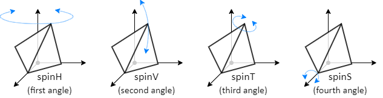
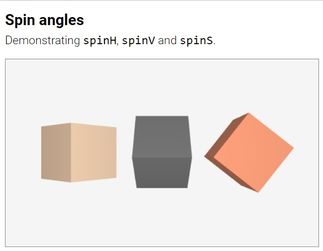

&nbsp;


By design Suica attempts to use the same properties for all objects as much as it is reasonable. This document describes the properties that are common to many objects. 

# Table of contents

- [Introduction](#introduction)
	- <small>[Setting properties](#setting-properties): [`its`](#its)</small>
	- <small>[Multiple properties](#multiple-properties): [`style`](#style)</small>
- [Geometrical properties](#geometrical-properties)
	- <small>[Position](#position): [`center`](#center), [`x`](#x-y-z), [`y`](#x-y-z), [`z`](#x-y-z), [`randomIn`](#randomin), [`randomOn`](#randomon), [`objectPosition`](#objectposition), [`screenPosition`](#screenposition)</small>
	- <small>[Size](#size): [`size`](#size-1), [`width`](#width-height-depth), [`height`](#width-height-depth), [`depth`](#width-height-depth)</small>
	- <small>[Orientation](#orientation): [`spin`](#spin), [`spinH`](#spinh-spinv-spint-spins), [`spinV`](#spinh-spinv-spint-spins), [`spinT`](#spinh-spinv-spint-spins), [`spinS`](#spinh-spinv-spint-spins)</small>
- [Material properties](#material-properties)
	- <small>[Color](#color): [`color`](#color)</small>
	- <small>[Visibility](#visibility): [`visible`](#visible), [`hidden`](#hidden)</small>
	- <small>[Texture](#texture): [`image`](#image), [`images`](#images)</small>
	- <small>[Wire-frame](#wire-frame): [`wireframe`](#wireframe-1)</small>
- [Three.js properties](#threejs-properties): <small>[`vertices`](#vertices) [`threejs`](#threejs) [`intersectData`](#intersectdata)</small>


# Introduction

Suica objects have properties, like size and color, that specify how they are created and how they are shown on the screen. All properties of Suica objects are optional. When a property is not set, Suica uses its default value. Properties can be defined in several ways:

## Setting properties

In HTML all properties are set as tag attributes. The names of the properties are case-insensitive. The order of attributes is arbitrary. A property set in HTML cannot be changed with another HTML tag.
```html
HTML:
<cube center="20,0,5" color="crimson">
<cube color="blue" center="10,30,15">
```

In JavaScript all properties are set as properties of JavaScript objects, i.e. using the dot notation. The order of setting properties is arbitrary. The names of the properties are case-sensitive.
```js
JS:
a = cube();
a.center = [20,0,5];
a.color = 'crimson';
b = cube();
b.color = 'blue';
b.center = [10,30,15];
```

Suica defines a system variable `its` that is an alternative way to attach properties.

#### its
```js
JS:
its.property = value;
```
Variable. Points to the latest created object. This variable is used to define properties of an object without using its name. This includeс anonymous objects.

```js
JS:
cube();
its.size = [40,30,30];
its.color = 'white';
```
[<kbd></kbd>](../examples/its.html)


Some properties are use so often, that they are included as parameters of the functions that create objects. In this case the names of the properties are not used, but the order of parameters is fixed. Only the trailing parameters can be omitted.

In the next example the value 100 is the `size` of the cube. It is included in the code, because the creation of a cube is done with function [`cube(center,size,color)`](objects.md#cube).

```js
JS:
cube( [20,0,5], 100, 'crimson' );
cube( [10,30,15], 100, 'blue' );
```


## Multiple properties

In JavaScript a group of properties can be represented as a JavaScript object. They can be applied to an object with `style`.

#### Style
```js
JS:
object.style( {property:value, property:value, …} );
style( object, {property:value, property:value, …} );
```
Function. Sets a group of properties of an object. The properties are defined as a set of *name:value* pairs. New, custom user-defined properties are allowed. As `style` returns the same object, styling can be chained.

```js
JS:
sphere().style( {x:15, size:20, color:'peachpuff'} );
sphere().style( {x:15} ).style( {size:20} ).style( {color:'peachpuff'} );
```

[<kbd></kbd>](../examples/style.html)


# Geometrical properties

The geometrical properties of Suica objects define their relation with the 3D space &ndash; i.e. their position, size and orientation. These three properties correspond to the fundamental geometrical transformations: [translation](https://en.wikipedia.org/wiki/Translation_(geometry)), [scaling](https://en.wikipedia.org/wiki/Scaling_(geometry)) and [rotation](https://en.wikipedia.org/wiki/Rotation_(mathematics)).


## Position

All Suica objects are placed in 3D space. The position is defined by a special central point of the object, called `center`, which is not necessarily the geometrical center. This point serves as a handle. When it is moved, the whole object is moved. Properties `x`, `y` and `z` provide access to individual coordinates of `center`.


An exceptional object is the [`line`](#line) &ndash; it has no central point, because it is defined by two points.


#### center
```html
HTML:
<objectName center="x,y,z">
```
```js
JS:
objectName( ..., [x,y,z], ... );
object.center = [x,y,z];
```
Property. Defines object position in 3D space. Property `center` is an array of three numbers [`x`, `y`, `z`] for the x, y and z coordinates (in this order). The actual visual position depends on the orientation of the [coordinate system](#coordinate-system). All coordinates are optional. Default values are 0.

```html
HTML:
<point center="25,0,15">
```
```js
JS:
point( [25,0,15] );

p = point( );
p.center = [25, 0, 15];
```

An object can be used as a center of another object. 

```html
HTML:
<cube id="a" x="-20">
<cube id="b" x="20">
<line from="a" to="b">
```
```js
JS:
a = cube( [20,0,0] );
b = cube( [-20,0,0] );
line( a, b );
```
[<kbd></kbd>](../examples/object-as-position.html)


#### x, y, z
```html
HTML:
<objectName x="x" y="y" z="z">
```
```js
JS:
object.x = x;
object.y = y;
object.z = z;
```
Properties. The individual x, y or z coordinates of the object position in 3D space. These properties provide an alternative access to object `center`. They are often use to modify one of the coordinates keeping the other two unchanged.

```html
HTML:
<point x="25" y="10" z="15">
```
```js
JS:
p = point( );
p.x = 25;
p.y = 10;
p.z = 15;
```

#### randomIn
```js
JS:
𝑝𝑜𝑠 = object.randomIn;
𝑝𝑜𝑠 = randomIn( object );
```
Property. Generates a random position inside an object. Every time this property is accessed, it generates a random position inside the bondary of an object. The distribution of generated positions is uniform. The position, size, and orientation of the object is considered. The returned value of `randomIn` is an array [`x`,`y`,`z`] of coordinates of 3D point.

This property is available in [`line`](objects.md#line), [`square`](objects.md#square), [`circle`](objects.md#circle), [`cube`](objects.md#cube) and [`sphere`](objects.md#sphere) objects. For `line` it is quivalent to `randomOn`. Squares, circles, cubes and spheres can be scaled into rectangles, ellipses, cuboids and spheroids.

[<kbd></kbd>](../examples/randominon-line.html)
[<kbd></kbd>](../examples/randomin-rectangle.html)
[<kbd></kbd>](../examples/randomin-cuboid.html)
[<kbd></kbd>](../examples/randomin-spheroid.html)


#### randomOn
```js
JS:
𝑝𝑜𝑠 = object.randomOn;
𝑝𝑜𝑠 = randomOn( object );
```
Property. Generates a random position on an object. Every time this property is accessed, it generates a random position on the bondary of an object. The distribution of generated positions is uniform (and almost uniform for spheroids). The position, size, and orientation of the object is considered. The returned value of `randomOn` is an array [`x`,`y`,`z`] of coordinates of 3D point.

This property is available in [`line`](objects.md#line), [`square`](objects.md#square), [`circle`](objects.md#circle), [`cube`](objects.md#cube) and [`sphere`](objects.md#sphere) objects. For `line` it is quivalent to `randomIn`. Squares, circles, cubes and spheres can be scaled into rectangles, ellipses, cuboids and spheroids

[<kbd></kbd>](../examples/randomon-rectangle.html)
[<kbd></kbd>](../examples/randomon-ellipse.html)
[<kbd></kbd>](../examples/randomon-cuboid.html)
[<kbd></kbd>](../examples/randomon-spheroid.html)


#### objectPosition
```js
JS:
pos = object.objectPosition( localOffset );
```
Function. Calculates global coordinates. This function takes a 3D point relative to an object's coordinate system is returns their global coordinates. This can be used to get the position of an object that is rotated in space.

The returned value of `objectPosition` is an array [`x`,`y`,`z`] of coordinates of 3D point. By default, the 3D point used by `objectPosition` is the `center` of the object. However, this point could be modified by the optional parameter `localOffset`. If `localOffset` is provided, it is added to the 3D coordinates. The local offset uses the orientation of the object.


[<kbd></kbd>](../examples/object-position.html)
[<kbd></kbd>](../examples/object-position-closest.html)


#### screenPosition
```js
JS:
pos = object.screenPosition( localOffset, globalOffset );
```
Function. Calculates screen coordinates. This function takes a 3D point in Suica 3D space and calculates its 2D screen coordinates relative to the Suica drawing canvas. This can be used to position HTML elements over specific graphical coordinates and objects.

The returned value of `screenPosition` is an array of [`x`,`y`,`z`]. The first two elements [`x`,`y`] are coordinates of a pixel relative to the top-left corner of the Suica canvas. The third element `z` denotes the distance to the screen and is not measured in pixels.

[<kbd></kbd>](../examples/screen-position.html)

By default, the 3D point used by `screenPosition` is the `center` of the object. However, this point could be modified by the optional parameters `localOffset` and `globalOffset`. If `localOffset` is provided, it is added to the 3D coordinates. The local offset uses the orientation of the object. This is equivalent to using [`objectPosition`](#objectposition). Then, if `globalOffset` is provided, it modifies the 3D point position. The global offset uses the Suica coordinate system and is not dependent on object's orientation. Finally, the 3D point coordinates are transformed to screen coordinates.


 
[<kbd></kbd>](../examples/screen-position-local.html)
[<kbd></kbd>](../examples/screen-position-global.html)
 
The following two examples demonstrate additional features of `screenPosition`. The first example adds HTML elements on the vertices of a Suica object, but the elements themselves do not consider the depth (i.e. the distance from the viewer). The second example uses the third element of `screenPosition` to modify the size of the HTML elements.

[<kbd></kbd>](../examples/screen-position-no-depth.html)
[<kbd></kbd>](../examples/screen-position-depth.html)


## Size

All objects in Suica have size. It determines the visual appearance of the object &ndash; how big or small it is. In 3D space the size is also 3D and it defines the width, height and depth of the object. When the depth of an object is not set, it is assumed to be the same as the width.

There are several exceptional objects: [`line`](#line) has no size; [`point`](#point) has a single size; all flat objects, like [`square`](#square), have two sizes &ndash; width and height, but no depth; [`group`](#group) uses its size as a scale factor, not as an actual size.  


#### size
```html
HTML:
<objectName size="width,height,depth">
```
```js
JS:
objectName( ..., width, ... );
objectName( ..., [width,height,depth], ... );
object.size = width;
object.size = [width,height,depth];
```
Property. The size of a Suica object. Property `size` that defines how big is the objects along its dimensions. If `size` is a single number, then the object is uniformly sized. Generally, `size` is an array of at least one and up to three numbers for object's width, height and depth. Their order does not depend on the orientation of [the coordinate system](#coordinate-system). Thus, height corresponds to the axis that is upwards.


```html
HTML:
<cube size="25">
<cube size="25,10">
<cube size="25,10,15">
```
```js
JS:
cube( pos, 25 );
cube( pos, [25] );
cube( pos, [25,10] );
cube( pos, [25,10,15] );
```


[<kbd></kbd>](../examples/sizes.html)
[<kbd></kbd>](../examples/sizes-orientation.html)


#### width, height, depth
```html
HTML:
<objectName width="width" height="height" depth="depth">
```
```js
JS:
object.width = width;
object.height = height;
object.depth = depth;
```
Properties. The individual width, height and depth of an object. These properties provide an alternative access to object `size`. 

```html
HTML:
<cube width="3" height="15" depth="40">
```
```js
JS:
a = cube( );
a.width = 3;
a.height = 15;
a.depth = 40;
```


## Orientation

The orientation of objects in Suica refers to their rotation. Like positions in 3D, rotations in 3D can be represented by three numbers &ndash; rotation angles around three axes that pass through the object `center`.

There is a significant difference between handling positions and orientations. The order of rotations is important as different order will produce different final orientation. Suica adopts one specific order, which is close to how people would describe the individual rotations.

The property for orientation is `spin`. Individual rotations are in properties `spinH`, `spinV`, `spinT` and `spinS`.

Angle `spinH` (*H* from *horizontal*) defines horizontal rotation around the global vertical axis. Angle `spinV` (*V* from *vertical*) define vertical rotation away from the vertical axis. Angle `spinT` (*T* from *torsion*) defines rotation of the object around it own vertical axis. Angle `spinS` (*S* from *spin*) defines rotation of the object around it own forward axis.




#### spin
```html
HTML:
<objectName spin="spinH">
<objectName spin="spinH,spinV,spinT,spinS">
```
```js
JS:
object.spin = spinH;
object.spin = [spinH,spinV,spinT,spinS];
```
Property. Defines the rotation of an object in respect to its own axes. The value of `spin` is either an angle or an array of up to four angles [`spinH`, `spinV`, `spinT`, `spinS`]. All angles are measured in degrees.

```html
HTML:
<cube spin="45,90,180">
```
```js
JS:
a = cube( );
a.spin = [45,90,180];
```


The spin is independent on the orientation of [the coordinate system](#coordinate-system). However, due to the default orientation of flat and non-flat objects, orientation along coordinate system axes differ. For example, if a square has a spin [&alpha;, &beta;, &gamma;, 0], a pyramid on that square should have spin [&alpha;, &beta;+90, &gamma;, 0].

[<kbd></kbd>](../examples/spin.html)
[<kbd></kbd>](../examples/spin-orientation.html)


#### spinH, spinV, spinT, spinS
```html
HTML:
<objectName spinH="spinH" spinV="spinV" spinT="spinT" spinS="spinS">
```
```js
JS:
object.spinH = spinH;
object.spinV = spinV;
object.spinT = spinT;
object.spinS = spinS;
```
Properties. The individual rotation angles of an object. These properties provide an alternative access to object `spin`. The order of application of rotation is fixed and does not depend on the order of setting individual angles.

```html
HTML:
<cube spinH="45" spinV="90" spinT="180" spinS="30">
```
```js
JS:
a = cube( );
a.spinH = 45;
a.spinV = 90;
a.spinT = 180;
a.spinS = 30;
```

[<kbd></kbd>](../examples/spin-angles.html)


# Material properties

The material properties of Suica objects define their visual styling, like colors and textures. These properties are used to give the feeling of object being made of specific material.


#### color
```html
HTML:
<objectName color="color">
```
```js
JS:
objectName( ..., color, ... );
object.color = color;
```

Property. Defines the color of a graphical object. Color in Suica can be expressed in a variety of ways. The [RGB scheme](https://www.w3schools.com/colors/colors_rgb.asp) represents colors as three components *red*, *green* and *blue*, while the [HSL scheme](https://www.w3schools.com/colors/colors_hsl.asp) components are
*hue*, *saturation* and *lightness*.
```js
'colorName'
#FFFFFF                     // 000000..FFFFFF
0xFFFFFF                    // 000000..FFFFFF
'red,green,blue'             // 0..1
[red,green,blue]             // 0..1
rgb(red,green,blue)          // 0..255
hsl(hue,saturation,lightness)  // 0..360, 0..100, 0..100
```

The following table elaborates how colors are set in HTML, CSS and JavaScript values.

| Context | Descriptive<br>name | Hexadecimal<br>number | Normalized<br>RGB array | RGB<br>function | HSL<br>function |
|---|:---:|:---:|:---:|:---:|:---:|
| | <small>[List of color names](https://www.w3schools.com/colors/colors_names.asp)</small>| *RRGGBB*<br><small>*RR*,*GG*,*BB* &isin; [00,FF]</small> | *r*,*g*,*b*<br><small>*r*,*g*,*b* &isin; [0,1]</small> | rgb(*r*,*g*,*b*)<br><small>*r*,*g*,*b* &isin; [0,255] | hsl(*h*,*s*,*l*)<br><small>*h* &isin; [0,360], *s*,*l* &isin; [0,100]</small> |
| Tag<br>attribute | <small>[crimson](https://www.color-name.com/crimson.color)</small> | <small>0xDC143C</small> | <small>0.86,&nbsp;0.08,&nbsp;0.24</small> | <small>rgb(&nbsp;220,&nbsp;20,&nbsp;60&nbsp;)</small> | <small>hsl(&nbsp;348,&nbsp;91,&nbsp;86&nbsp;)</small> |
| CSS<br>property | <small>crimson</small> | <small>#DC143C</small> | | <small>rgb( 220, 20, 60 )</small> | <small>hsl( 348, 91, 86 )</small> |
| JS<br>code | <small>"crimson"</small> | <small>0xDC143C</small> | <small>[0.86,&nbsp;0.08,&nbsp;0.24]</small> | <small>rgb(&nbsp;220,&nbsp;20,&nbsp;60)</small> | <small>hsl(&nbsp;348,&nbsp;91,&nbsp;86&nbsp;)</small> |

Setting the `color` of a [group](#group) sets it to all its objects.


## Visibility

The visibility of a Suica object indicates whether the object is drawn. Two antagonistic properties control visibility &ndash; [`visible`](#visible) and [`hidden`](#hidden).

#### visible
```html
HTML:
<objectName visible>
<objectName visible="true/false">
```
```js
JS:
object.visible = true/false;
```

Property. Defines whether to draw an object. By default, objects in Suica are visible. Values *yes* and *1* are considered `true`, values *no* and *0* are considered `false`. In HTML the value of `visible` can be omitted and this assumes it is `true`. Note, that an object with `visible` set to `true` is not necessarily visible in the drawing canvas. A visible object might still be invisible if it is outside the drawing canvas, behind the viewer or hidden behind (or in) another larger object.

```html
HTML:
<cube size="30" visible>
<cube size="30" visible="true">
```
```js
JS:
a = cube( [0,0,0], 30);
a.visible = true;
```
[<kbd></kbd>](../examples/visible.html)

#### hidden
```html
HTML:
<objectName hidden>
<objectName hidden="true/false">
```
```js
JS:
object.hidden = true/false;
```

Property. Defines whether to omit drawing an object. By default, objects in Suica are not hidden. Values *yes* and *1* are considered `true`, values *no* and *0* are considered `false`. In HTML the value of `hidden` can be omitted and this assumes it is `true`. Note, that an object with `hidden` set to `false` is not necessarily visible in the drawing canvas. A visible object might still be invisible if it is outside the drawing canvas, behind the viewer or hidden behind (or in) another larger object.

```html
HTML:
<cube size="30" hidden>
<cube size="30" hidden="true">
```
```js
JS:
a = cube( [0,0,0], 30);
a.hidden = true;
```


## Texture

[Textures](https://en.wikipedia.org/wiki/Texture_mapping) are 2D images that are applied onto 2D and 3D objects. Textures are generally used to decorate objects with visual details. Suica supports two sources for textures &ndash; external image files and [drawings](drawings.md) generated with Suica. The properties that implement textures in Suica are `image` and `images`.

#### image
```html
HTML:
<objectName image="drawing">
<objectName image="url">
```
```js
JS:
object.image = drawing;
object.image = image;
object.image = 'url';
```
Property. Decorates object surface with an image. Images can be stamped onto Suica object via the property `image`. The property accepts a drawing or a texture image. For examples of how to use drawings see chapter [Drawings](drawings.md). 

```html
HTML:
<cube id="a" image="https://boytchev.github.io/suica/assets/textures/flower.jpg">
```
```js
JS:
a.image = 'https://boytchev.github.io/suica/assets/textures/flower.jpg';
a.image = image( 'https://boytchev.github.io/suica/assets/textures/flower.jpg' );
```

[<kbd></kbd>](../examples/image-file.html)
[<kbd></kbd>](../examples/image-datauri.html)


When an object has both `color` and `image`, the resulting color is the product of the RGB normalized colors (i.e. components r,g,b&isin;[0,1]) of the color and the image pixels. If the object color is [R,G,B] and the image color is [r,g,b], then the combined color is [R,G,B]&times;[r,g,b] = [R&times;r,G&times;g,B&times;b].
The following table shows some combinations of colors:

| Object color | Image color | Resulting color |
|---|---|---|
| White<br><small>[1,1,1]</small> | Any<br><small>[r,g,b]</small> | Image color<br><small>[1,1,1]&times;[r,g,b] = [r,g,b]</small> |
| Black<br><small>[0,0,0]</small> | Any<br><small>[r,g,b]</small> | Black<br><small>[0,0,0]&times;[r,g,b] = [0,0,0]</small> |
| Any<br><small>[R,G,B]</small> | White<br><small>[1,1,1]</small> | Object color<br><small>[R,G,B]&times;[1,1,1] = [R,G,B]</small> |
| Any<br><small>[R,G,B]</small> | Black<br><small>[0,0,0]</small> | Black<br><small>[R,G,B]&times;[0,0,0] = [0,0,0]</small> |
| Red<br><small>[R,0,0]</small> | Any<br><small>[r,g,b]</small> | Only the red component of the image color<br><small>[1,0,0]&times;[r,g,b] = [r,0,0]</small> |
| Yellow<br><small>[1,1,0]</small> | Cyan<br><small>[0,1,1]</small> | Green<br><small>[1,1,0]&times;[0,1,1] = [0,1,0]</small> |

Due to a security mechanism in browsers &ndash; [Same-origin policy](https://developer.mozilla.org/en-US/docs/Web/Security/Same-origin_policy) (SOP) and [Cross-origin resource sharing](https://developer.mozilla.org/en-US/docs/Glossary/CORS) (CORS), a file can be used as image only if it is located in the same online domain; or the image host allows cross-origin requests. An image file can be used in these cases:

- the image file is in the same domain as the Suica file and is accessed by
`http://` or `https://` protocols
- the image file is hosted on a server that allows anonymous access to images
- the image file is accessed through a [local host](https://en.wikipedia.org/wiki/Localhost) from `http://localhost`
- the image is encoded in the URL itself as [Data URI/URL](https://developer.mozilla.org/en-US/docs/Web/HTTP/Basics_of_HTTP/Data_URIs) from `data:` scheme
- CORS is disabled in the browser configuration (not recommended)
- an old SOP-less and CORS-less browser is used (not recommended)

Suica provides a limited set of images that can be used for textures. They can be accessed from URL `https://boytchev.github.io/suica/assets/textures/` e.g. `https://boytchev.github.io/suica/assets/textures/flower.jpg`.

<kbd>
	
	<br>
	flower.jpg
</kbd>
<kbd>
	
	<br>
	blobs.jpg
</kbd>
<kbd>
	
	<br>
	tile.png
</kbd>
<kbd>
	
	<br>
	grid.png
</kbd>
<kbd>
	
	<br>
	plate_normal.jpg
</kbd>


#### images
```html
HTML:
<objectName images="count">
<objectName images="countX,countY">
```
```js
JS:
object.images = count;
object.images = [countX, countY];
```
Property. Defines the number of copies of a drawing or image across the surface
of an object. If the value of *images* is a number, it defines the number of copies in both
horizontal and vertical direction. If the value is an array, the first element
if for the horizontal direction and the second is for the vertical direction.

```html
HTML:
<cube id="a" images="2">
<cube id="b" images="2,3">
```
```js
JS:
a.images = 2;
a.images = [2,3];
```

[<kbd></kbd>](../examples/images.html)


## Wire-frame

A [wire-frame model](https://en.wikipedia.org/wiki/Wire-frame_model) is an object which is visualized with lines. These lines are most often edges of the object's shape. Suica implements wire-frame models as a mode &ndash; i.e. an object can be switched to wire-frame mode with the `wireframe` property.

Only objects with edges have wireframe mode &ndash; [`square`](objects.md#square), [`circle`](objects.md#circle), [`polygon`](objects.md#polygon), [`cube`](objects.md#cube), [`prism`](objects.md#prism) and [`pyramid`](objects.md#pyramid).

#### wireframe
```html
HTML:
<objectName wireframe>
<objectName wireframe="true/false">
```
```js
JS:
object.wireframe = true/false;
```

Property. Defines whether to visualize an object as wireframe. By default, objects in Suica are drawn with solid surfaces. The property `wireframe` is used to change surface visualization into wireframe mode &ndash; i.e. only edges are drawn. Values *yes* and *1* are considered `true`, values *no* and *0* are considered `false`. In HTML the value of `wireframe` can be omitted and this assumes it is `true`.

```html
HTML:
<cube size="30" wireframe>
<cube size="30" wireframe="true">
```
```js
JS:
a = cube( [0,0,0], 30);
a.wireframe = true;
```


# Three.js properties

Suica is based on Three.js and Three.js functionality is available alongside Suica. Every visible Suica object has a property `threejs` that is the Three.js object created by Suica.


#### vertices
```js
JS:
object.vertices
```
Property. Provides access to object vertices. This property is read-only. It contains an array of all vertices of an object converted into global 3D coordinates. The native local coordinates of the object can be accessed via [`threejs.geometry`](#threejs). If the object is a group or a model, `vertices` collects vertices of all nested objects. If the object is a model, its vertices are not immediately available &ndash; they are availabe after the [`onLoad`](events.md#load-event-handlers) event.

[<kbd></kbd>](../examples/vertices.html)
[<kbd></kbd>](../examples/vertices-convex.html)
[<kbd></kbd>](../examples/vertices-group.html)
[<kbd></kbd>](../examples/vertices-model.html)


#### threejs
```js
JS:
object.threejs
```
Property. Provides access to underlying Three.js object and its properties. This access allows the direct modification or setting of materials and geometries using Three.js objects.

```js
JS:
a.threejs.geometry = new THREE.IcosahedronGeometry(1);
a.threejs.material.color = 'linen';
a.threejs.material = new THREE.MeshPhongMaterial({color:'linen',shininess:100});
```

[<kbd></kbd>](../examples/threejs-geometry.html)
[<kbd></kbd>](../examples/threejs-material.html)

When materials and properties are set via `threejs`, they may interfere with Suica properties.

| Three.js property | Interfering Suica properties |
|---|---|
| `threejs.position` | [`center`](#center), [`x`](#x-y-z), [`y`](#x-y-z), [`z`](#x-y-z) |
| `threejs.rotation` | [`spin`](#spin), [`spinH`](#spinh-spinv-spint-spins), [`spinV`](#spinh-spinv-spint-spins), [`spinT`](#spinh-spinv-spint-spins), [`spinS`](#spinh-spinv-spint-spins) |
| `threejs.scale` | [`size`](#size-1), [`width`](#width-height-depth), [`height`](#width-height-depth), [`depth`](#width-height-depth) |
| `threejs.material.color` | [`color`](#color) |
| `threejs.material.map` | [`image`](#image), [`images`](#images) |


#### intersectData
```js
JS:
object.intersectData
```
Property. Provides access to underlying Three.js intersect data. The value of `intersectData` is set only if an object is selected by [`findObject`](events.md#findobject) or [`findObjects`](events.md#findobjects). It contains the data passed from Three.js as a result of raycasting intersection, like `point` (coordinates of the intersection point) and `distance` (distance to the intersection point. For more details of other elements of `intersectData` see [Raycaster.intersectObject](https://threejs.org/docs/#api/en/core/Raycaster.intersectObject).

