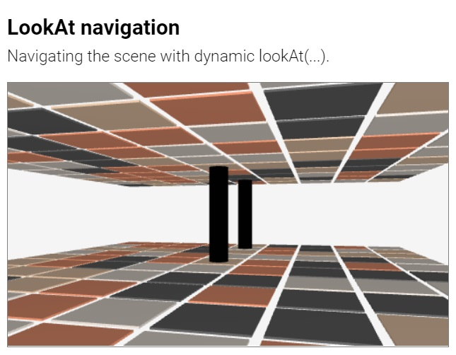

##### **Suica** &middot; [Objects](objects.md) &middot; [Properties](properties.md) &middot; [Drawings](drawings.md) &middot; [Events](events.md) &middot; [References](references.md)

**Suica is a JavaScript library** that provides a minimal, dual, optional and uniform approach to mobile 3D graphics. 


# Table of contents

- [Introduction](#introduction)
	- <small>[Drawing canvas](#drawing-canvas): [`suica`](#suica), [`background`](#background),  [`orientation`](#orientation), [`proactive`](#proactive)</small>
	- <small>[TODO: Creating scenes](#creating-scenes)</small>
	- <small>[TODO: Creating animations](#creating-animations)</small>
- [TODO: Views and cameras](#views-and-cameras)
    - <small>[TODO: View point](#view-point): [`oxyz`](#oxyz), [`demo`](#demo), [`lookAt`](#lookat)</small>
	- <small>[TODO: Projections](#projections): [`perspective`](#perspective-camera) | [`orthographic`](#orthographic-camera)</small>
	- <small>[TODO: Screen and window](#screen-and-window): [`fullScreen`](#full-screen-camera) | [`fullWindow`](#full-window-camera)</small>
	- <small>[TODO: VR](#vr): [`stereo`](#stereo-camera), [`anaglyph`](#anaglyph-camera), [`vr`](#vr-camera)</small>
- [Additional commands](#additional-commands)
	- <small>[General functions](#functions): [`radians`](#radians), [`degrees`](#degrees), [`random`](#random)</small>
- [TODO References](#references) [<small> [reference](reference-guide.md) | [examples](examples.md) | [images](#available-images) | [libraries](#external-libraries) | [Suica 1](#suica-1)  | [tester](#tester) | [Q&A](#questions-and-answers) </small>] 


# Introduction

Suica is a JavaScript library for creating 3D scenes that work or various platforms. Only a browser with a GPU support is needed. Suica is built upon these principles:

- **MINIMAL**<br>Less is more ([details](https://en.wikipedia.org/wiki/Minimalism)). 

- **DUAL**<br>Scenes can be defined in HTML or in JavaScript. Or in both.

- **OPTIONAL**<br>All properties of 2D and 3D graphical objects are optional. 

- **UNIFORM**<br>Features are consistent across all objects that share them.


## Drawing canvas

Suica creates 3D images and animations in a web page. Suica is distributed as `suica.js` or `suica.min.js` file and is loaded via the `<script>` tag. Once loaded, it scans for HTML tags `<suica>` and uses them as drawing canvases. Suica does not use JS modules in order to allow easier local development in educational environments.

The general structure of a web page that uses Suica needs a few tags. The tag `<script>` with attrbute `src` pointing to the Suica library loads and activates Suica. The drawing canvas is defined with `<suica>` tag inside `<body>`. The part of the scene that is created in HTML is inside this `<suica>` tag. The part of the scene that is created with JavaScript commands is inside a separate `<script>` tag.


```html
<!DOCTYPE html>
<html lang="en">
<head>
   <!-- Loading and activating Suica -->
   <script src="suica.js"></script>
</head>

<body>
   <suica>
      <!-- Suica tags describing a 3D scene -->
   </suica>

   <script>
      // Suica JavaScript code describing 3D scene or animation
   </script>
</body>
</html>
```

Suica can create 3D object only inside Suica canvas. It is created with HTML tag `<suica>`.


#### suica
```html
HTML:
<suica id="𝑠𝑢𝑖𝑐𝑎" width="𝑤𝑖𝑑𝑡ℎ" height="ℎ𝑒𝑖𝑔ℎ𝑡" ...>
```
Tag and variable. As a tag it defines a 3D drawing canvas. `<suica>` is the main Suica tag. All other Suica-specific HTML tags are recognized only if used between `<suica>` and `</suica>`. The name of the Suica canvas is set in the `id` attribute. The size of the canvas is set via attributes `width` and `height`. Sizes are measured in pixels. The default size is 500&times;300 pixels. Alternatively, sizes can be set as CSS properties (either inlined or not), which may use any CSS unit.

Example of creating drawing canvases with different sizes:

```html
HTML:
<suica width="400" height="300">

HTML+CSS:
<suica style="width:15em; height:300px;">
```
[<kbd></kbd>](../examples/tag-suica.html)

The drawing canvas has additional properties, that can be set as HTML attributes of `<suica>`, as standalone HTML tags inside `<suica>...</suica>` or as JavaScript commands in `<script>...</script>`.

As a global vairbale `suica` references the last created Suica instance. It is used to access the Suica canvas if it has no name.


#### background
```html
HTML:
<suica background="𝑐𝑜𝑙𝑜𝑟">

HTML:
<background color="𝑐𝑜𝑙𝑜𝑟">

HTML+CSS:
<suica style="background:𝑐𝑜𝑙𝑜𝑟;">

```
```css
CSS:
suica {
   background: 𝑐𝑜𝑙𝑜𝑟;
}
```
```js
JS:
background( 𝑐𝑜𝑙𝑜𝑟 );
```
Property and command. Defines the background color of the Suica canvas. It can be set as HTML attribute, CSS style (both inlined and non-inlined), HTML tag and JavaScript function. By default the background color is [white smoke](https://www.color-hex.com/color/f5f5f5).

```html
HTML/CSS:
<suica background="linen">
<suica style="background: linen;">
<background color="linen">
```
```js
JS:
background( 'linen' );
```

[<kbd></kbd>](../examples/background.html)


#### orientation
```html
HTML:
<suica orientation="𝑥𝑦𝑧">
```
Property. Controls how objects [positions](properties.md#position) and [sizes](properties.md#size) are defined. Suica uses Cartesian 3D coordinate system. The tag `<suica>` accepts attribute `orientation` with values `XYZ`, `XZY`, `YXZ`, `YZX`, `ZXY` and `ZYX` (these are all possible permutations of the letters *X*, *Y* and *Z*). Each orientation defines a coordinate system in the following manner:

- the first axis points to the right
- the second axis points upwards
- the third axis point towards the viewer


The default orientation in Suica is `XYZ`. All examples in this user guide use this orientation, unless explicitely stated that other orientations are used.

```html
HTML:
<suica orientation="xyz">
```
[<kbd></kbd>](../examples/suica-orientation.html)


#### proactive
```html
HTML:
<suica proactive>
<proactive>
```
```js
JS:
𝑠𝑢𝑖𝑐𝑎.proactive( );
```
Property and command. Turns on proactive mode for mouse motion events. These events occur when the mouse pointer is moved over an object, or when an object is moved under the mouse pointer. For details see [proactive events](events.md#proactive).


## Creating scenes

TODO


## Creating animations

TODO


# Views and cameras

Suica provides several commands and modes to set and control how a 3D scene is rendered on the drawing canvas.


## View point


#### oxyz
```html
HTML:
<oxyz size="𝑠𝑖𝑧𝑒" color="𝑐𝑜𝑙𝑜𝑟">
```
```js
JS:
oxyz( 𝑠𝑖𝑧𝑒, 𝑐𝑜𝑙𝑜𝑟 );
```

Command. Vizualizes the coordinate system. The coordinate system is an abstract object and it has no graphical representation. The command `oxyz` visualizes the system as three segments with custom size and color. By default `size` is 30 and `color` is [black](https://www.color-hex.com/color/000000).

```html
HTML:
<oxyz size="30" color="black">
```
```js
JS:
oxyz( 30, 'black' );
```

[<kbd></kbd>](../examples/oxyz.html)


#### demo
```html
HTML:
<demo distance="𝑑𝑖𝑠𝑡𝑎𝑛𝑐𝑒" altitude="𝑎𝑙𝑡𝑖𝑡𝑢𝑑𝑒">
```
```js
JS:
demo( 𝑑𝑖𝑠𝑡𝑎𝑛𝑐𝑒, 𝑎𝑙𝑡𝑖𝑡𝑢𝑑𝑒 );
```
Command. Turns on *demo mode* &ndash; atomatic scene rotation. The parameters `distance` and `altitude` define the viewpoint position as distance from the origin of the the coordinate system and altitude. By default `distance` is 100 and `altitude` is 30.

```html
HTML:
<demo distance="100" altitude="30">
```
```js
JS:
demo( 100, 30 );
```

[<kbd></kbd>](../examples/demo.html)


#### lookAt
```html
HTML:
<lookat from="𝑓𝑟𝑜𝑚" to="𝑡𝑜" up="𝑢𝑝">
```
```js
JS:
lookAt( 𝑓𝑟𝑜𝑚, 𝑡𝑜, 𝑢𝑝 );
```

Command. Defines the viewing position and orientation. The command `lookAt` takes three parameters: `from` is a 3D location for the viewing position (the camera is placed there), `to` is a 3D position of the viewing target (the camera is facing it), and `up` is a vector defining the head orientation (the direction that is considered upwards). By default the target position is (0,0,0), and the up direction corresponds to the up axis of the coordinate system.

```html
HTML:
<lookat from="100,10,50">
<lookat from="100,10,50" to="0,0,10" up="1,0,0">
```
```js
JS:
lookAt( [100,10,50] );
lookAt( [100,10,50], [0,0,10], [1,0,0] );
```

[<kbd></kbd>](../examples/lookat.html)

The command [`demo`](#demo) can be simulated and enriched by `lookAt` &ndash; i.e. adding dynamic change of distance and elevation to the default rotation.

[<kbd></kbd>](../examples/lookat-demo.html)


To implement a navigation (walking or flying) in a 3D scene the viewing position must be modified in the animation loop.

[<kbd></kbd>](../examples/lookat-navigation.html)
[<kbd></kbd>](../examples/lookat-navigation-vr.html)


## General functions

#### radians
```js
JS:
radians( 𝑑𝑒𝑔𝑟𝑒𝑒𝑠 );
```
Function. Converts degrees into radians.

```js
JS:
rad = radians( 120 );
```


#### degrees
```js
JS:
degrees( 𝑟𝑎𝑑𝑖𝑎𝑛𝑠 );
```
Function. Converts radians into degrees.

```js
JS:
deg = degrees( 3.14159 );
```


#### random
```js
JS:
random( 𝑓𝑟𝑜𝑚, 𝑡𝑜 );
random( [𝑎, 𝑏, 𝑐, ...] );
```

Function. Generates a pseudo-random floating-point number in a range or picks a random value from an array of values.

```js
JS:
a = random( 5, 10 ); // from 5 to 10
a = random( [1, 2, 3, 4] ); // from the list
```


---
---
---
---
---
---


### Cameras

A camera in Suica is a colelctive term that refers to how a scene is visualized
on the screen. A camera may define a projection (perspective or orthographic),
canvas span (normal span, full-window or full-screen) and stereoscopic mode
(mono, stereo, anaglyph and vr). Some cameras can be combined, others are
mutually exclusive. The following illustration shows available camera
combinations.


#### Perspective camera

Property and command. Sets a perspective camera projection. Objects further
away appear smaller. The perspective is defined by three numbers &ndash; *near*
distance , *far* distance  and *field of view* angle.

The *near* and *far* distances (by default 1 and 1000) define the depth span of
the viewing area. Objects and part of objects outside this area are not drawn.
If *near* and *far* are too close, this may truncate some objects; it they are
too far away, this may reduce the precision of overlapping distant objects.

The *field of view* angle is measured in degrees (by default 40&deg;) and
defines the vertical span of the viewing area. Smaller angles make objects
appear bigger and reduce the perspective effect; larger angles make objects
appear smaller and increases the perspective effect.

A valid perspective requires that 0<*near*<*far* and 0&deg;<*field of view*<180&deg;.

```html
HTML:
<suica perspective>
<suica perspective="1,1000,40">
```
```js
JS:
perspective( );
perspective( 1, 1000, 40 );
```

[<kbd></kbd>](../examples/camera-perspective.html)


#### Orthographic camera

Property and command. Sets an orthographic camera projection. Objects do not
change their visual size depending on how close or distant they are. The
orthographic camera is defined by two numbers &ndash; *near* and *far* distances.
By default they are 0 and 1000; and rhey define the depth span of the viewing
area. Objects and part of objects outside this area are not drawn. If *near* and
*far* are too close, this may truncate some objects; it they are too far away,
this may reduce the precision of overlapping distant objects.

A valid orthographic projection requires that 0&leq;*near*<*far*.

```html
HTML:
<suica orthographic>
<suica orthographic="0,1000">
```
```js
JS:
orthographic( );
orthographic( 0, 1000 );
```

[<kbd></kbd>](../examples/camera-orthographic.html)


#### Full screen camera

Property and command. Allows Suica to go into full screen mode. Using full
screen camera adds a button at the bottom of the canvas. If the button says
`[ENTER FULLSCREEN]` the user must click it to enter full screen mode. If full
screen is not supported, the button says `[FULLSCREEN NOT SUPPORTED]`. 

```html
HTML:
<suica fullscreen>
```
```js
JS:
fullScreen( );
```

[<kbd></kbd>](../examples/camera-fullscreen.html)

_**Note.** To exit full screen mode press `Esc` or follow the browser's
instructions._


#### Full window camera

Property and command. Allows Suica to go into full window mode. 

```html
HTML:
<suica fullwindow>
```
```js
JS:
fullWindow( );
```

[<kbd></kbd>](../examples/camera-fullwindow.html)


#### Stereo camera

Property and command. Sets a stereo camera projection. The scene is projected
twice &ndash; side-by-side, once for each of the eyes. The stereo effect is
controlled by *distance* parameter, which determines the simulated distance
between the eyes. By default it is 5. Values closer to 0 will decrease the
stereo effect.

Both positive and negative distances are allowed. Positive distances correspond
to wall-eyed viewing or vewing with a smartphone and low-end stereoscopic
glasses. Negative distances swap left and right images and correspond to
cross-eyed viewing.

```html
HTML:
<suica stereo>
<suica stereo="1">
<suica stereo="-1">
```
```js
JS:
stereo( );
stereo( 1 ); // wall-eyed
stereo( -1 ); // cross-eyed
```

[<kbd></kbd>](../examples/camera-stereo-wall-eyed.html)
[<kbd></kbd>](../examples/camera-stereo-cross-eyed.html)


#### Anaglyph camera

Property and command. Sets an [anaglyph](https://en.wikipedia.org/wiki/Anaglyph_3D)
camera projection. The scene is projected twice with different colors, suited for
red-cyan glasses. The anaglyph effect is controlled by *distance* parameter,
which determines the focal distance. By default it is 5. Smaller values will
increase the anaglyphic effect, larger values will decrease it.

```html
HTML:
<suica anaglyph>
<suica anaglyph="5">
```
```js
JS:
anaglyph( );
anaglyph( 5 );
```

[<kbd></kbd>](../examples/camera-anaglyph.html)


#### VR camera

Property and command. Allows Suica to go into emmersive 3D environment. Using a
VR camera adds a button at the bottom of the canvas. If the button says
`[ENTER VR]` the user must click it to enter VR mode. If VR is not supported,
the button says `[VR NOT SUPPORTED]`. 

```html
HTML:
<suica vr>
```
```js
JS:
vr( );
```

[<kbd></kbd>](../examples/camera-vr.html)

_**Note.** Currently the VR camera does not provide access to the controllers._

_**Note.** VR mode is not supported in local HTML files._


## Functions


## References

### Reference guide

A reference guide and code templates are collected [here](reference-guide.md)

### List of examples

All examples are collected in a single page [here](examples.md)

### Available images

This is a list of available images in Suica. They can be accessed from URL
`https://boytchev.github.io/suica/textures/` e.g. `https://boytchev.github.io/suica/textures/flower.jpg`.

<kbd>
	
	<br>
	flower.jpg
</kbd>
<kbd>
	
	<br>
	blobs.jpg
</kbd>
<kbd>
	
	<br>
	tile.png
</kbd>
<kbd>
	
	<br>
	grid.png
</kbd>

### External libraries

Suica uses several external libraries.

- [**Three.js** &ndash; JavaScript 3D Library](https://threejs.org/) provides the graphical backbone of Suica. It
is used at runtime, so `three.min.js` file must be present alongside `suica.js`
or `suica.min.js`.

- [**JSMin** &ndash; JavaScript Minification Filter](https://github.com/douglascrockford/JSMin) is
used in the development process to generate minified `suica.min.js` from the
original `suica.js` file. 

Other tools and site that might be usful to Suica users:

- [**EasyGIF** &ndash; Image to Data URI converter](https://ezgif.com/image-to-datauri)
can convert image to Data URI in order to avoid SOP and CORS issues. There are
many other web services for such conversion, like [Site24x7](https://www.site24x7.com/tools/image-to-datauri.html),
[Online Image Tools](https://onlineimagetools.com/convert-image-to-data-uri),
[Online JPG Tools](https://onlinejpgtools.com/convert-jpg-to-data-uri),
[webSemantics](https://websemantics.uk/tools/image-to-data-uri-converter/),
[Base64 Image](https://www.base64-image.de/) and others.

### Tester

A rudimentery tester for Suica is availble [here](../test/test.html).
It runs predefined test cases and compares the produced images.

It reports the percentage of match:

- A match of 90% or more is considered normal.
- A match between 70% and 90% is most likely due to some rendering fluctuations
and a visual inspection is recommended.
- A match below 70% most likely indicates a problem and a visula inspection is
required.

Because timings cannot be set absolutely, some test cases may not produce the
expected result. In this case run the tester another time to check whether the
result is consistent.


### Suica 1

The previous version of Suica is [Suica 1](https://github.com/boytchev/Suica-1).
It uses WebGL directly (i.e. without Three.js). It is made available as a legacy.
The latest version is Suica 1.12. Suica 1 is not maintained any more.


### Questions and answers
- [How to change the attribute of an object created in HTML?](#how-to-change-the-attribute-of-an-object-created-in-html)
- [How to change the center of an object in respect to the object?](#how-to-change-the-center-of-an-object-in-respect-to-the-object)

#### How to change the attribute of an object created in HTML?

The prefered way is to create the object with a name in attribute `id`. Suica
will create a global variable with that name, which can be modified. The
alternative way is to modify the attribute itself with a string value.

```html
HTML:
<cube id="a">
```
```js
JS:
// using object properties
a.size = 10;

// using tag attributes
cube = document.getElementsByTagName( 'cube' )[0];
cube.setAttribute( 'size', 10 );
```

[<kbd></kbd>](../examples/qa-property-modification.html)
[<kbd></kbd>](../examples/qa-attribute-modification.html)
[<kbd></kbd>](../examples/qa-attribute-modification-button.html)


#### How to change the center of an object in respect to the object?

The center of an object is important point as translation, scaling and rotation
is done in respect to the center. To define a custom center of an object it can
be put in a group. Then the center of the group can be used instead of a custom
object center.


```js
JS:
p = group( pyramid([0,0,30]) );
p.spin = [0,45];
```

[<kbd></kbd>](../examples/qa-custom-center.html)


---

May, 2022