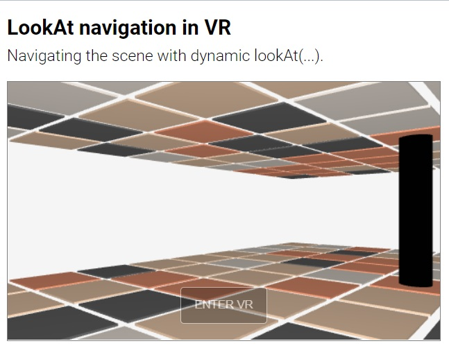
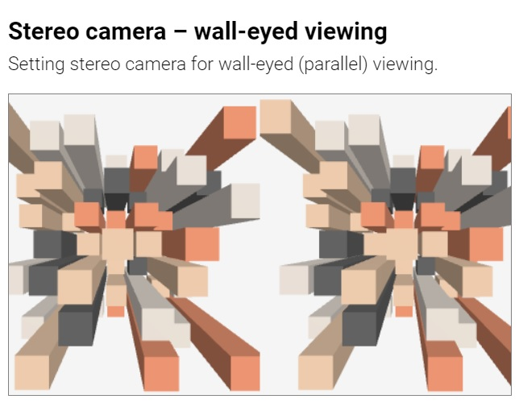
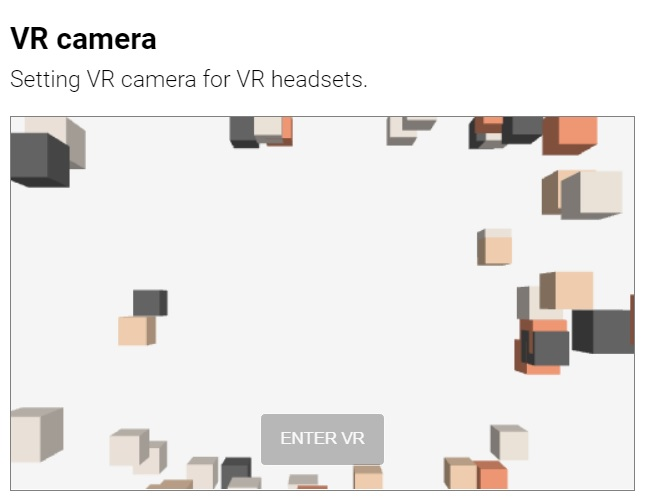
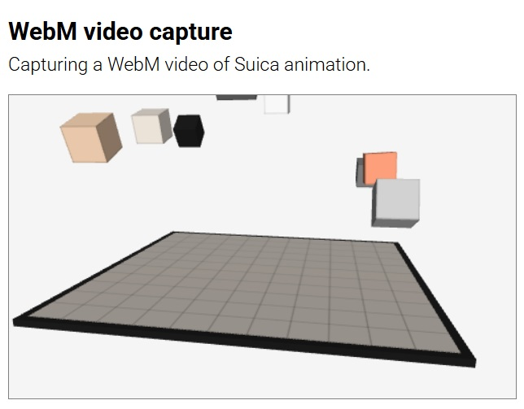
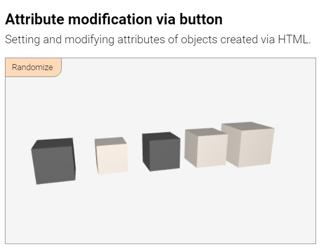
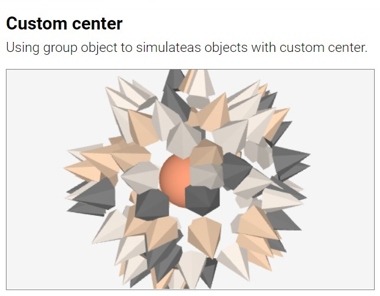

##### **Suica** &middot; [Objects](objects.md) &middot; [Properties](properties.md) &middot; [Drawings](drawings.md) &middot; [Events](events.md)

**Suica is a JavaScript library** that provides a minimal, dual, optional and uniform approach to mobile 3D graphics. 


# Table of contents

- [Introduction](#introduction)
	- <small>[Drawing canvas](#drawing-canvas): [`suica`](#suica), [`background`](#background),  [`orientation`](#orientation), [`proactive`](#proactive)</small>
	- <small>[Creating scenes](#creating-scenes)</small>
	- <small>[Creating animations](#creating-animations)</small>
- [Viewing 3D](#viewing-3d)
    - <small>[View point](#view-point): [`oxyz`](#oxyz), [`demo`](#demo), [`lookAt`](#lookat)</small>
	- <small>[Projections](#projections): [`perspective`](#perspective), [`orthographic`](#orthographic)</small>
	- <small>[Canvases](#canvses): [`fullScreen`](#fullscreen), [`fullWindow`](#fullwindow)</small>
	- <small>[Cameras](#cameras): [`stereo`](#stereo), [`anaglyph`](#anaglyph), [`vr`](#vr)</small>
- [Additional commands](#additional-commands)
	- <small>[General functions](#functions): [`radians`](#radians), [`degrees`](#degrees), [`random`](#random)</small>
	- <small>[Video capturing](#video-capturing): [`capture`](#capture)</small>
- [Questions and answers](#questions-and-answers)


# Introduction

Suica is a JavaScript library for creating 3D scenes that work or various platforms. Only a browser with a GPU support is needed. Suica is built upon these principles:

- **MINIMAL**<br>Less is more ([details](https://en.wikipedia.org/wiki/Minimalism)). 

- **DUAL**<br>Scenes can be defined in HTML or in JavaScript. Or in both.

- **OPTIONAL**<br>All properties of 2D and 3D graphical objects are optional. 

- **UNIFORM**<br>Features are consistent across all objects that share them.


## Drawing canvas

Suica creates 3D images and animations in a web page. Suica is distributed as `suica.js` and is loaded via the `<script>` tag. Once loaded, it scans for HTML tags `<suica>` and uses them as drawing canvases. Suica does not use JS modules in order to allow easier local development in educational environments.

The general structure of a web page that uses Suica needs a few tags. The tag `<script>` with attribute `src` pointing to the Suica library loads and activates Suica. The drawing canvas is defined with `<suica>` tag inside `<body>`. The part of the scene that is created in HTML is inside this `<suica>` tag. The part of the scene that is created with JavaScript commands is inside a separate `<script>` tag.


```html
<!DOCTYPE html>
<html lang="en">
<head>
   <!-- Loading and activating Suica -->
   <script src="suica.js"></script>
</head>

<body>
   <suica>
      <!-- Suica tags describing a 3D scene -->
   </suica>

   <script>
      // Suica JavaScript code describing 3D scene or animation
   </script>
</body>
</html>
```

Suica can create 3D object only inside Suica canvas. It is created with HTML tag `<suica>`.


#### suica
```html
HTML:
<suica id="𝑠𝑢𝑖𝑐𝑎" width="𝑤𝑖𝑑𝑡ℎ" height="ℎ𝑒𝑖𝑔ℎ𝑡" ...>
```
Tag and variable. As a tag it defines a 3D drawing canvas. `<suica>` is the main Suica tag. All other Suica-specific HTML tags are recognized only if used between `<suica>` and `</suica>`. The name of the Suica canvas is set in the `id` attribute. The size of the canvas is set via attributes `width` and `height`. Sizes are measured in pixels. The default size is 500&times;300 pixels. Alternatively, sizes can be set as CSS properties (either inlined or not), which may use any CSS unit.

Example of creating drawing canvases with different sizes:

```html
HTML:
<suica width="400" height="300">

HTML+CSS:
<suica style="width:15em; height:300px;">
```
[<kbd></kbd>](../examples/tag-suica.html)

The drawing canvas has additional properties, that can be set as HTML attributes of `<suica>`, as standalone HTML tags inside `<suica>...</suica>` or as JavaScript commands in `<script>...</script>`.

As a global variable `suica` references the last created Suica instance. It is used to access the Suica canvas if it has no name.


#### background
```html
HTML:
<suica background="𝑐𝑜𝑙𝑜𝑟">

HTML:
<background color="𝑐𝑜𝑙𝑜𝑟">

HTML+CSS:
<suica style="background:𝑐𝑜𝑙𝑜𝑟;">

```
```css
CSS:
suica {
   background: 𝑐𝑜𝑙𝑜𝑟;
}
```
```js
JS:
background( 𝑐𝑜𝑙𝑜𝑟 );
```
Property and command. Defines the background color of the Suica canvas. It can be set as HTML attribute, CSS style (both inlined and non-inlined), HTML tag and JavaScript function. By default, the background color is [white smoke](https://www.color-hex.com/color/f5f5f5).

```html
HTML/CSS:
<suica background="linen">
<suica style="background: linen;">
<background color="linen">
```
```js
JS:
background( 'linen' );
```

[<kbd></kbd>](../examples/background.html)


#### orientation
```html
HTML:
<suica orientation="𝑥𝑦𝑧">
```
Property. Controls how objects [positions](properties.md#position) and [sizes](properties.md#size) are defined. Suica uses Cartesian 3D coordinate system. The tag `<suica>` accepts attribute `orientation` with values `XYZ`, `XZY`, `YXZ`, `YZX`, `ZXY` and `ZYX` (these are all possible permutations of the letters *X*, *Y* and *Z*). Each orientation defines a coordinate system in the following manner:

- the first axis points to the right
- the second axis points upwards
- the third axis point towards the viewer


The default orientation in Suica is `XYZ`. All examples in this user guide use this orientation, unless explicitly stated that other orientations are used.

```html
HTML:
<suica orientation="xyz">
```
[<kbd></kbd>](../examples/suica-orientation.html)


#### proactive
```html
HTML:
<suica proactive>
<proactive>
```
```js
JS:
𝑠𝑢𝑖𝑐𝑎.proactive( );
```
Property and command. Turns on proactive mode for mouse motion events. These events occur when the mouse pointer is moved over an object, or when an object is moved under the mouse pointer. For details see [proactive events](events.md#proactive).


## Creating scenes

Graphical scenes in Suica can be created in HTML or in JavaScript. Independent on how objects are created, they are always visualized in the `<suica>` tag. The following table compares both approaches. Most of the differences are caused by inherent properties of HTML and JavaScript.

||HTML scenes|JavaScript scenes|
|---|---|---|
|Application|Static scenes|Static and dynamic scenes|
|Names of entities|Case-insensitive|Case-sensitive|
|[Objects](#objects.md)|Defined as HTML tags|Defined as JS functions|
|[Object properties](#properties.md)|Defined as named tag attributes, arbitrary order, any property can e omitted|Defined as anonymous parameters, fixed order, only trailing parameters can be omitted|
|Object modification|Cannot be modified|Can be modified|


HTML definitions are more suitable for static scenes. Objects are declared with HTML tags, and their properties are attributes in these tags. For example, a cube is defined as:

```html
HTML:
<cube center="25,0,15" size="10" color="crimson">
```

A scene is defined as a sequence of HTML tags for each object in the scene. These tags must be enclosed in the `<suica>` tag. The following example creates a scene with a cube and a sphere.

```html
HTML:
<suica>
   <cube center="25,0,15" size="10" color="crimson">
   <sphere size="15" color="yellow">
</suica>
```

Suica does not require that all tags are properly closed. Exceptions are `<suica>`, [`<group>`](objects.md#group) and [`<drawing>`](drawings.md#drawing) tags &ndash; they are containers and their exact content is important for Suica. Unclosed tags will make HTML validators scream in horror.

When a scene is defined in JavaScript, all objects are created with functions inside a `<script>` tag outside the `<suica>` tag.
```html
HTML/JS:
<suica></suica>
<script>
   cube( [25,0,15], 10, 'crimson' );
   sphere( [0,0,0], 15, 'yellow' );
</script>
```

JavaScript commands that create object in several canvases can be placed in a single `<script>` tag.
```html
HTML/JS:
<suica id="a"></suica>
<suica id="b"></suica>
<script>
   a.cube( [25,0,15], 10, 'crimson' );
   b.sphere( [0,0,0], 15, 'yellow' );
</script>
```


## Creating animations

In Suica animations are implemented in JavaScript. Animation in a mobile platform is controlled by browser ticks. For each tick the browser notifies the user application which must provide one frame from the animation. Thus, a motion from point A to point B is split into numerous small steps that eventually end up to B. Each small step is processed individually and separately from all other steps of the motion.


Browsers try to keep ticks at consistent speed, measured in [frames per seconds](https://en.wikipedia.org/wiki/Frame_rate). The result of this approach is that the actual fps can vary and is not guaranteed.

The command [`demo`](#demo) provides a default system animation. It can be defined in HTML or in JavaScript.

Custom animations in Suica are bound to [`onTime`](events.md#ontime) event &ndash; i.e. for each frame the `onTime` event is generated. If there is event listener, it will be called with two parameters &ndash; the current time `t` and the elapsed time since the previous frame `dT`.

A typical code that spins a cube in response to onTime event ticks is:

```html
HTML/JS:
<suica ontime="tick">
   <cube id="a">
</suica>

<script>
   function tick( t, dt )
   {
      a.spinV = t;
   }
</script>
```

It is important to split motion into separate steps. If multiple motions are defined in a single step, they will be merged in a visually single motion. The following example will spin the cube from 0&deg; to 90&deg; but the motion will be invisible to the user. A frame will be created only at the end of `tick`, when the cube's spin is 90&deg;, for intermediate angles there will be no frames.


```html
HTML/JS:
<suica ontime="tick">
   <cube id="a">
</suica>

<script>
   function tick( t, dt )
   {
      for( var i=0; i<=90; i++ )
		a.spinV = i;
   }
</script>
```

# Viewing 3D

Suica provides several commands and modes to set and control how a 3D scene is rendered on the drawing canvas. The following table shows how different projections, cameras and canvas sizes can be combined. The default mode for Suica is 3D mode with perspective projection, normal camera and canvas rendering.

|Mode|Projection|Camera|Canvas|
|---|---|---|---|
|3D mode|Perspective|Normal, stereo or anaglyph|Canvas, window or screen|
|2D mode|Orthographic|Always normal|Canvas, window or screen|
|VR mode|Always perspective|Always stereo|Always screen|


## View point


#### oxyz
```html
HTML:
<oxyz size="𝑠𝑖𝑧𝑒" color="𝑐𝑜𝑙𝑜𝑟">
```
```js
JS:
oxyz( 𝑠𝑖𝑧𝑒, 𝑐𝑜𝑙𝑜𝑟 );
```

Command. Visualizes the coordinate system. The coordinate system is an abstract object and it has no graphical representation. The command `oxyz` visualizes the system as three segments with custom size and color. By default, `size` is 30 and `color` is [black](https://www.color-hex.com/color/000000).

```html
HTML:
<oxyz size="30" color="black">
```
```js
JS:
oxyz( 30, 'black' );
```

[<kbd></kbd>](../examples/oxyz.html)


#### demo
```html
HTML:
<demo distance="𝑑𝑖𝑠𝑡𝑎𝑛𝑐𝑒" altitude="𝑎𝑙𝑡𝑖𝑡𝑢𝑑𝑒" speed="𝘴𝘱𝘦𝘦𝘥">
```
```js
JS:
demo( 𝑑𝑖𝑠𝑡𝑎𝑛𝑐𝑒, 𝑎𝑙𝑡𝑖𝑡𝑢𝑑𝑒, 𝘴𝘱𝘦𝘦𝘥 );
```
Command. Turns on *demo mode* &ndash; automatic scene rotation. The parameters `distance` and `altitude` define the viewpoint position as distance from the origin of the coordinate system and altitude. By default, `distance` is 100 and `altitude` is 30. Parameter `speed` sets the rotation speed. The default speed is 1 radian per second (i.e. approximately 6.3 seconds for full revolution).

```html
HTML:
<demo distance="100" altitude="30">
```
```js
JS:
demo( 100, 30 );
```

[<kbd></kbd>](../examples/demo.html)


#### lookAt
```html
HTML:
<lookat from="𝑓𝑟𝑜𝑚" to="𝑡𝑜" up="𝑢𝑝">
```
```js
JS:
lookAt( 𝑓𝑟𝑜𝑚, 𝑡𝑜, 𝑢𝑝 );
```

Command. Defines the viewing position and orientation. The command `lookAt` takes three parameters: `from` is a 3D location for the viewing position (the camera is placed there), `to` is a 3D position of the viewing target (the camera is facing it), and `up` is a vector defining the head orientation (the direction that is considered upwards). By default, the target position is (0,0,0), and the up direction corresponds to the up axis of the coordinate system.

```html
HTML:
<lookat from="100,10,50">
<lookat from="100,10,50" to="0,0,10" up="1,0,0">
```
```js
JS:
lookAt( [100,10,50] );
lookAt( [100,10,50], [0,0,10], [1,0,0] );
```

[<kbd></kbd>](../examples/lookat.html)

The command [`demo`](#demo) can be simulated and enriched by `lookAt` &ndash; i.e. adding dynamic change of distance and elevation to the default rotation.

[<kbd></kbd>](../examples/lookat-demo.html)


To implement a navigation (walking or flying) in a 3D scene the viewing position must be modified in the animation loop.

[<kbd></kbd>](../examples/lookat-navigation.html)
[<kbd></kbd>](../examples/lookat-navigation-vr.html)


## Projections

A projection is required to visualize a 3D shape onto a 2D screen. Suica supports two types of projections: `perspective` and `orthographic`. By default, `perspective` is used.

#### perspective
```html
HTML:
<suica perspective="𝑛𝑒𝑎𝑟,𝑓𝑎𝑟,𝑓𝑜𝑣">
<perspective near="𝑛𝑒𝑎𝑟" far="𝑓𝑎𝑟" fov="𝑓𝑜𝑣">
```
```js
JS:
perspective( 𝑛𝑒𝑎𝑟, 𝑓𝑎𝑟, 𝑓𝑜𝑣 );
```

Property and command. Sets a perspective camera projection. Objects further away appear smaller. The perspective is defined by `near` distance, `far` distance and `field of view` angle.

The `near` and `far` distances (by default 1 and 1000) define the depth span of the viewing area. Objects and part of objects outside this area are not drawn. The `field of view` angle is measured in degrees (by default 40&deg;) and it defines the vertical span of the viewing area. Smaller angles make objects appear bigger and reduce the perspective effect; larger angles make objects appear smaller and increases the perspective effect.

A valid perspective requires that 0<`near`<`far` and 0&deg;<`field of view`<180&deg;.

```html
HTML:
<suica perspective>
<suica perspective="1,1000,40">
```
```js
JS:
perspective( );
perspective( 1, 1000, 40 );
```

[<kbd></kbd>](../examples/camera-perspective.html)


#### orthographic
```html
HTML:
<suica orthographic="𝑛𝑒𝑎𝑟,𝑓𝑎𝑟">
<orthographic near="𝑛𝑒𝑎𝑟" far="𝑓𝑎𝑟">
```
```js
JS:
orthographic( 𝑛𝑒𝑎𝑟, 𝑓𝑎𝑟 );
```
Property and command. Sets an orthographic camera projection. Objects do not change their visual size depending on how close or distant they are. The orthographic camera is defined by `near` and `far` distances. By default, they are 0 and 1000; and they define the depth span of the viewing area. Objects and part of objects outside this area are not drawn. 

A valid orthographic projection requires that 0&leq;`near`<`far`.

```html
HTML:
<suica orthographic>
<suica orthographic="0,1000">
```
```js
JS:
orthographic( );
orthographic( 0, 1000 );
```

[<kbd></kbd>](../examples/camera-orthographic.html)


## Canvases

Suica always draws only inside the `<suica>` tag. The size of the drawing canvas determines the size of the generated visuals. Although this size can be controlled via CSS and JavaScript, Suica provides a quick way to switch into full window and full screen.


#### fullWindow
```html
HTML:
<suica fullwindow>
<fullwindow>
```
```js
JS:
fullWindow( );
```
Property and command. Sets the size of the drawing canvas to match the size of the browser's window. 

[<kbd></kbd>](../examples/camera-fullwindow.html)


#### fullScreen
```html
HTML:
<suica fullscreen>
<fullscreen>
```
```js
JS:
fullScreen( );
```

Property and command. Asks Suica to go into full screen mode. Using full screen mode adds a button at the bottom of the canvas. If the button says `[ENTER FULLSCREEN]` the user must click it to enter full screen mode. If full screen is not supported, the button says `[FULLSCREEN NOT SUPPORTED]`. 

To exit full screen mode press `Esc` or follow the browser's instruction shown at the time of activating the mode.


[<kbd></kbd>](../examples/camera-fullscreen.html)


## Cameras

Suica supports several virtual stereo cameras. They split the image of the scene into two images &ndash; one for the left eye and another one for the right eye. Both images are then combined into a single image, shown on the screen. Viewing such stereo images requires additional hardware like 3D glasses or special viewing techniques like cross-eyed viewing.

The `stereo` camera implements wall-eyed and cross-eyed viewing, as well as stereoscopic glasses that use user's smartphone as screen. The `anaglyph` camera produces images for anaglyph red-cyan glasses. The `vr` camera can be used only with VR headsets.


#### stereo
```html
HTML:
<suica stereo="𝑑𝑖𝑠𝑡𝑎𝑛𝑐𝑒">
<stereo distance="𝑑𝑖𝑠𝑡𝑎𝑛𝑐𝑒">
```
```js
JS:
stereo( 𝑑𝑖𝑠𝑡𝑎𝑛𝑐𝑒 );
```

Property and command. Sets a stereo camera. The scene is drawn twice &ndash; side-by-side, once for each of the eyes. The stereo effect is controlled by `distance` parameter, which determines the stereo effect. By default, it is 5. Values closer to 0 decreases the stereo effect.

Both positive and negative distances are allowed. Positive distances correspond to wall-eyed viewing or viewing with a smartphone and low-end stereoscopic glasses. Negative distances swap left and right images and correspond to cross-eyed viewing.

```html
HTML:
<suica stereo>
<suica stereo="1">
<suica stereo="-1">
```
```js
JS:
stereo( );
stereo( 1 ); // wall-eyed
stereo( -1 ); // cross-eyed
```

[<kbd></kbd>](../examples/camera-stereo-wall-eyed.html)
[<kbd></kbd>](../examples/camera-stereo-cross-eyed.html)


#### anaglyph
```html
HTML:
<suica anaglyph="𝑑𝑖𝑠𝑡𝑎𝑛𝑐𝑒">
<anaglyph distance="𝑑𝑖𝑠𝑡𝑎𝑛𝑐𝑒">
```
```js
JS:
anaglyph( 𝑑𝑖𝑠𝑡𝑎𝑛𝑐𝑒 );
```

Property and command. Sets an [anaglyph](https://en.wikipedia.org/wiki/Anaglyph_3D) stereo camera. The scene is projected twice with different colors, suited for red-cyan glasses. The anaglyph effect is controlled by the `distance` parameter, which determines the focal distance. By default, it is 5. Smaller values will increase the anaglyphic effect, larger values will decrease it.

```html
HTML:
<suica anaglyph>
<suica anaglyph="5">
```
```js
JS:
anaglyph( );
anaglyph( 5 );
```

[<kbd></kbd>](../examples/camera-anaglyph.html)


#### vr
```html
HTML:
<suica vr>
<vr>
```
```js
JS:
vr( );
```

Property and command. Allows Suica to go into immersive 3D environment. Using a VR stereo camera adds a button at the bottom of the canvas. If the button says `[ENTER VR]` the user must click it to enter VR mode. If VR is not supported, the button says `[VR NOT SUPPORTED]`. 

Currently the VR camera in Suica does not provide access to the controllers. Also, VR mode is not supported when the HTML file is loaded locally from `file:`.

```html
HTML:
<suica vr>
```
```js
JS:
vr( );
```

[<kbd></kbd>](../examples/camera-vr.html)


## General functions

#### radians
```js
JS:
radians( 𝑑𝑒𝑔𝑟𝑒𝑒𝑠 );
```
Function. Converts degrees into radians.

```js
JS:
rad = radians( 120 );
```


#### degrees
```js
JS:
degrees( 𝑟𝑎𝑑𝑖𝑎𝑛𝑠 );
```
Function. Converts radians into degrees.

```js
JS:
deg = degrees( 3.14159 );
```


#### random
```js
JS:
random( 𝑓𝑟𝑜𝑚, 𝑡𝑜 );
random( [𝑎, 𝑏, 𝑐, ...] );
```

Function. Generates a pseudo-random floating-point number in a range or picks a random value from an array of values.

```js
JS:
a = random( 5, 10 ); // from 5 to 10
a = random( [1, 2, 3, 4] ); // from the list
```

To generate a fixed user-dependent sequence of pseudo-random  values use [`scorm.derandomize`](objects.md#scormdenormalize).


## Video capturing

Suica provided internal mechanism for recording Suica animations into [WebM files](https://en.wikipedia.org/wiki/WebM) or [animated GIFs](https://en.wikipedia.org/wiki/GIF#Animated_GIF). The actual capturing is done by [CCapture.js](https://github.com/spite/ccapture.js). Using JavaScript for video recording has its inherent limitations, so such recording is not appropriate for capturing large video files (the meaning *large* depends on the available system resources).

#### capture
```js
JS:
capture( 𝘴𝘳𝘤, 𝘵𝘪𝘮𝘦, 𝘧𝘱𝘴, 𝘧𝘰𝘳𝘮𝘢𝘵, 𝘴𝘬𝘪𝘱𝘍𝘳𝘢𝘮𝘦𝘴 );
```
```html
HTML:
<capture src="𝘴𝘳𝘤" time="𝘵𝘪𝘮𝘦" fps="𝘧𝘱𝘴" format="𝘧𝘰𝘳𝘮𝘢𝘵" skipFrames="𝘴𝘬𝘪𝘱𝘍𝘳𝘢𝘮𝘦𝘴">
```
Function. Initiates video capturing. Parameter `src` provides the name of the video file. If `src` is an empty string `''` the name is automatically generated from the name of the HTML file that runs the code. The desired duration of the video is `time` seconds at `fps` frames per seconds. By default, they are set to 10 seconds and 30 fps. When `format` is `webm` then `capture` creates a WebM video file; if it is `gif` &ndash; an animated GIF. Parameter `𝘴𝘬𝘪𝘱𝘍𝘳𝘢𝘮𝘦𝘴` defines the number of video frames to skip before starting capturing. This is used when the scene is not ready at the time of initiating video capture.

```js
JS:
capture( );
capture( 'myfile', 10, 30 );
capture( 'anigif', 10, 30, 'gif' );
```
```html
HTML:
<capture>
<capture src="myfile" time="10" fps="30">
<capture src="anigif" format="gif">
```


[<kbd></kbd>](../examples/capture-webm.html)
[<kbd></kbd>](../examples/capture-gif.html)

The videos created by these two examples are: [webm](../examples/capture-webm.webm) and [gif](../examples/capture-gif.gif).

А small status line is shown in the top-left corner of the browser window when a video capturing starts. It shows the file format, the number of captured frames and the elapsed time. The rendering time during capturing is accommodated to the speed of capturing, i.e. if the video frame is large and capturing is slow, the animation is slowed down. The status line is removed when the capturing is done, and the browser initiates downloading of the captured video file. Depending on the browser settings the file might be automatically downloaded in a predefined download folder, or a pop-up window will ask the user to select download folder.


# Questions and answers

- [How to change the attribute of an object created in HTML?](#how-to-change-the-attribute-of-an-object-created-in-html)
- [How to change the center of an object in respect to the object?](#how-to-change-the-center-of-an-object-in-respect-to-the-object)


## How to change the attribute of an object created in HTML?

The preferred way is to create the object with a name in attribute `id`. Suica will create a global variable with that name, which can be modified. The alternative way is to modify the attribute itself with a string value.

```html
HTML:
<cube id="a">
```
```js
JS:
// using object properties
a.size = 10;

// using tag attributes
cube = document.getElementsByTagName( 'cube' )[0];
cube.setAttribute( 'size', 10 );
```

[<kbd></kbd>](../examples/qa-property-modification.html)
[<kbd></kbd>](../examples/qa-attribute-modification.html)
[<kbd></kbd>](../examples/qa-attribute-modification-button.html)


## How to change the center of an object in respect to the object?

The center of an object is important point as translation, scaling and rotation is done in respect to the center. To define a custom center of an object it can be put in a group. Then the center of the group can be used instead of a custom object center.


```js
JS:
p = group( pyramid([0,0,30]) );
p.spin = [0,45];
```

[<kbd></kbd>](../examples/qa-custom-center.html)