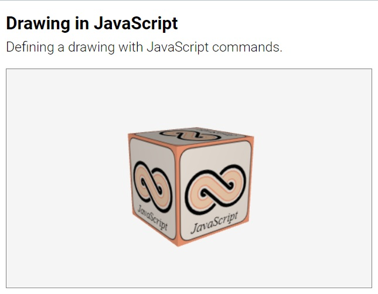
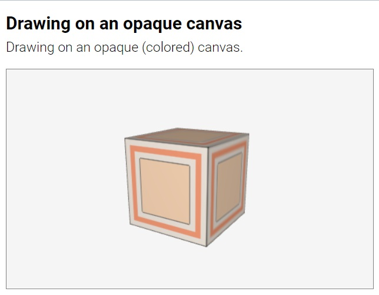
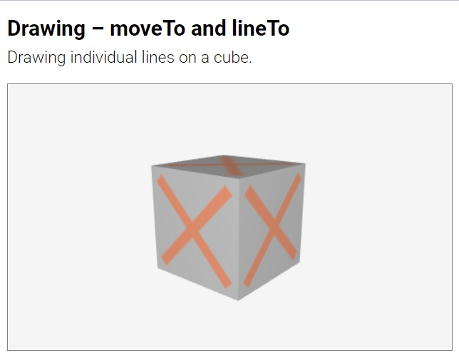
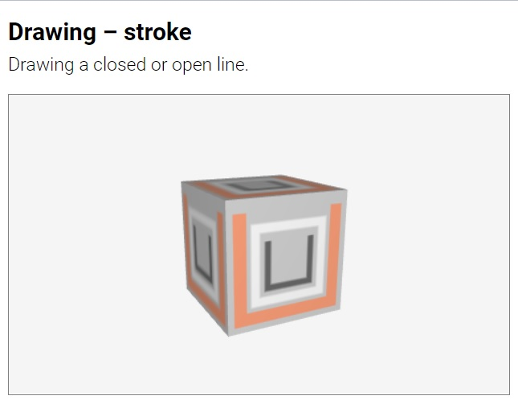

##### [About](#about) &middot; [Suica canvas](#suica-canvas) &middot; [Objects](#objects) &middot; **Drawings** &middot; [Events](#events) &middot; [Functions](#functions) &middot; [References](#references)

**Suica drawings** are 2D images generated in directly in Suica, instead of being
loaded from JPEG or PNG files. Usually drawings are stamped onto 2D and 3D
objects as [textures](https://en.wikipedia.org/wiki/Texture_mapping). Suica
drawings are based on [Canvas2D](https://developer.mozilla.org/en-US/docs/Web/API/CanvasRenderingContext2D),
but they provide simplified set of commands. 

## Table of contents
- [About Suica drawings](#about-suica-drawings)
	- <small>[Creating drawings](#creating-drawings)</small>
	- <small>[Working with drawings](#working-with-drawings)</small>
	- <small>[Using drawings](#using-drawings)</small>
- [Paths](#paths)
	- <small>[Straight lines](#straight-lines)</small>
	- <small>[Curved lines](#curved-lines)</small>
- [Painting](#painting)
	- <small>[Stroking and filling a path](#stroking-and-filling-a-path)</small>
	- <small>[Painting text](#painting-text)</small>
	- <small>[Resetting the canvas](#resetting-the-canvas)</small>


# About drawings

Suica drawings are created on a rectangular drawing canvas. A virtual pen traces a path on the canvas. This path can be stroked by drawing a line over it; or its contents can be filled with a color.

The coordinate system of a drawing has origin (0,0) at the bottom left side of the canvas. The X axis extends to the right, Y extends to the top.


Following the main pricipals of Suica, a drawing can be created entirely in HTML or entirely in JavaScript. Usually HTML is used for static drawings, while JavaSCript is used for both static and dynamic drawings. The following two examples demonstrate the same drawing generated in HTML and in JavaScript.

[<kbd></kbd>](../examples/drawing-html.html)
[<kbd></kbd>](../examples/drawing-js.html)

Using drawings in Suica is fairly straighforward process:

1. Create a drawing canvas
2. Define a path
3. Stroke and/or fill the path
4. Map the drawing onto an object


# Creating drawings


#### drawing
```html
HTML:
<drawing id="𝘯𝘢𝘮𝘦" size="𝑤𝑖𝑑𝑡ℎ,ℎ𝑒𝑖𝑔ℎ𝑡" color="𝑐𝑜𝑙𝑜𝑟">
```
```js
JS:
𝘯𝘢𝘮𝘦 = drawing( 𝑤𝑖𝑑𝑡ℎ, ℎ𝑒𝑖𝑔ℎ𝑡, 𝑐𝑜𝑙𝑜𝑟 );
```

Command. Creates a 2D drawing canvas. Parameters `width` and `height` set the
drawings canvas size in pixels. By default it is 32&times;32 pixels. If `height`
is omitted, its is the same as `width`. Parameter `color` sets the background
color of the canvas. If `color` is omitted, the background is transparent
&ndash; i.e. when the drawing is mapped onto an objects, the background areas
will be transparent.

```html
HTML:
<drawing id="a">
<drawing id="b" size="32,48">
<drawing id="c" width="32" height="48">
```
```js
JS:
a = drawing( );
b = drawing( 32 );
c = drawing( 32, 48, 'crimson' );
```

[<kbd></kbd>](../examples/drawing-transparent.html)
[<kbd></kbd>](../examples/drawing-opaque.html)

## Working with a drawing

When a drawing is given a name via attribute `ID` in HTML or when a drawing is
initialized and stored in a variable, this variable has commands for drawing on
the canvas.

```html
HTML:
<drawing id="a">
```
```js
JS:
a.moveTo( 10, 10 );
a.lineTo( 20, 20 );
a.stroke( 'crimson' );
```

A drawing is applied to an object via the [image](#image) property and can be
updated both before and after this assignment. The scale of
a drawing is managed by the [images](#images) property. 

[<kbd></kbd>](../examples/dynamic-drawing.html)


Drawings can be applied to points and lines. For points the drawings act like
sprites &ndash; they are not subject to orientation and they always face the
screen. For lines drawings are used to created dot-and-dash patterns.

[<kbd></kbd>](../examples/drawing-custom-point.html)
[<kbd></kbd>](../examples/drawing-dotted-lines.html)

## Using a drawing


# Paths


## Straight lines

The simplest way of creating a path is to move the virtual pen to the path
starting position and then define a sequence of straight segments.


#### ```moveTo```
```html
HTML:
<moveto center="𝑥,𝑦">
<moveto x="𝑥" y="𝑦">
```
```js
JS:
moveTo( 𝑥, 𝑦 );
```

Command. Sets the position of the virtual pen. This command moves the pen from
its current location to (`x`,`y`) without generating a path. This is used to set
the starting point of a path. By default the both *x* and *y* are 0. In HTML
`center` can be split into individual parameters `x` and `y`.


```html
HTML:
<moveTo center="10,0">
<moveTo x="10" y="0">
```
```js
JS:
moveTo( 10, 0 );
```
	
#### ```lineTo```
```html
HTML:
<lineto center="𝑥,𝑦">
<lineto x="𝑥" y="𝑦">
```
```js
JS:
lineTo( 𝑥, 𝑦 );
```

Command. Adds a line segment to the path. This command moves the virtual pen
along a straight line from its current location to (`x`,`y`) and adds that line
to the current path. This is used to define straignt line sections of the path.
By default the both *x* and *y* are 0. In HTML `center` can be split into
individual parameters `x` and `y`.

```html
HTML:
<lineTo center="10,0">
<lineTo x="10" y="0">
```
```js
JS:
lineTo( 10, 0 );
```

[<kbd></kbd>](../examples/drawing-moveto-lineto.html)


## Curved lines
		
#### ```curveTo```

Command. Adds a curved segment to the path. This command moves the virtual pen
along a curved line from its current location to (`x`,`y`) and adds that curve
to the current path. The line is quadratic curve and is attracted towards point
(`mx`, `my`), which is defined by the first pair of parameters of *curveTo*.
By default all coordinates *mx*, *my*, *x* and *y* are 0.


```html
HTML:
<curveTo m="10,0" center="20,15">
<curveTo mx="10" my="0" x="20" y="15">
```
```js
JS:
curveTo( 10, 0, 20, 15 );
```

[<kbd></kbd>](../examples/drawing-curveto.html)

A more complex curve can be constructed by joining individual curves. The shape
of a heart, for examples, can be constructed by 6 connected curves.


[<kbd></kbd>](../examples/drawing-heart-point.html)


#### Arc

Command. Adds a circle оr a circular arc to the path. This command creates an
arc from a circle with center (`x`,`y`) and `radius`. The arc stars from angle
`from` and ends at angle `to`. The last parameter is direction of drawing &ndash;
either clockwise or counter-clockwise. Coordinates and radius are measured in
pixels, angles are measured in degrees. If the angles are not provided, a full
circle is generated. 

```html
HTML:
<arc center="10,0" radius="5">
<arc x="10" y="0" radius="5" from="0" to="180" ccw>
```
```js
JS:
arc( 10, 0, 5);
arc( 10, 0, 5, 0, 180, false);
```

The coordinate system of a drawing has origin (0,0) at the bottom left side of
the canvas. The X axis extends to the right, Y extends to the top.


[<kbd></kbd>](../examples/drawing-arc.html)

In HTML the direction of drawing is set by attributes `cw` or `ccw` which values
are either *true* or *false*. If the attributes have no values, they are assumed
to be *true*. The following commanda are equivalent:

```html
HTML:
<arc x="10" y="0" radius="5" cw>
<arc x="10" y="0" radius="5" cw="true">
<arc x="10" y="0" radius="5" ccw="false">
```

In JS the direction of drawing is set by the last 6th parameter of *arc* that
corresponds to *cw* and by default is *true*.

#### Stroke

Command. Draws a line over the current path. The line has given `color` and 
`width`. If the `close` parameter is *true*, then the end of the path is
conneted to the beginning of the path. A *stroke* immediately after another
*stroke* or *fill* will reuse the same path.

```html
HTML:
<stroke color="crimson">
<stroke color="crimson" width="10" close>
<stroke color="crimson" width="10" close="true">
```
```js
JS:
stroke( 'crimson' );
stroke( 'crimson', 10, true );
```

[<kbd></kbd>](../examples/drawing-stroke.html)
	
	
#### Fill

Command. Fills the area defined by a path. The area is filled with the given
`color`.  A *fill* immediately after another *stroke* or *fill* will reuse the
same path. 

```html
HTML:
<fill color="crimson">
```
```js
JS:
fill( 'crimson' );
```
	
[<kbd></kbd>](../examples/drawing-fill.html)
[<kbd></kbd>](../examples/drawing-fill-and-stroke.html)


#### FillText

Command. Draws a text. The `text` is drawn at given coordinates (`x`,`y`) with
given `color` and `font` style. The *font* parameter is a string with a
[CSS font](https://developer.mozilla.org/en-US/docs/Web/CSS/font) description.

```html
HTML:
<fillText center="10,5" text="Sample text" color="crimson" font="bold 20px Courier">
```
```js
JS:
fillText( 10, 5, 'Sample text', 'crimson', 'bold 20px Courier' );
```	
	
[<kbd></kbd>](../examples/drawing-filltext.html)
	
	
#### Clear

Command. Clears a drawing canvas. The drawing canvas is filled with the given
`color` if it is provided, or is cleared to transparent if it is not provided.
Next commands after *clear* start a new path.

```html
HTML:
<clear>
<clear color="crimson">
<clear background="crimson">
```
```js
JS:
clear( 'crimson' );
```
	
[<kbd></kbd>](../examples/drawing-clear.html)

---

May, 2022