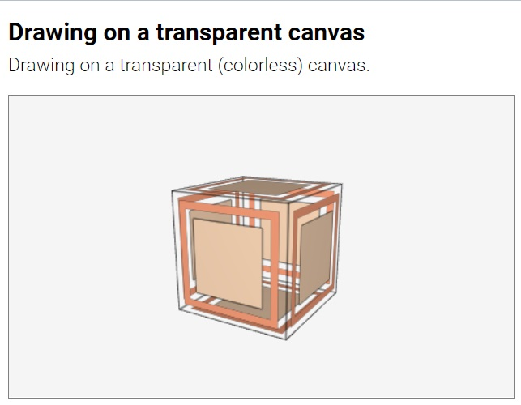
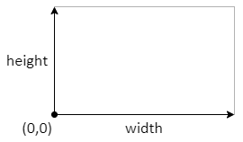
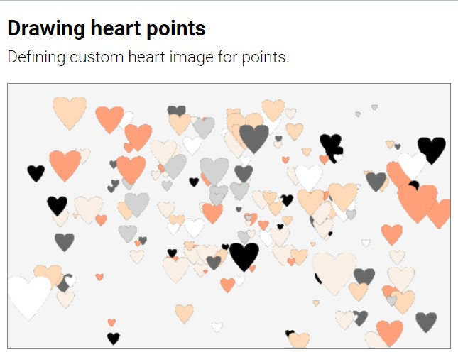
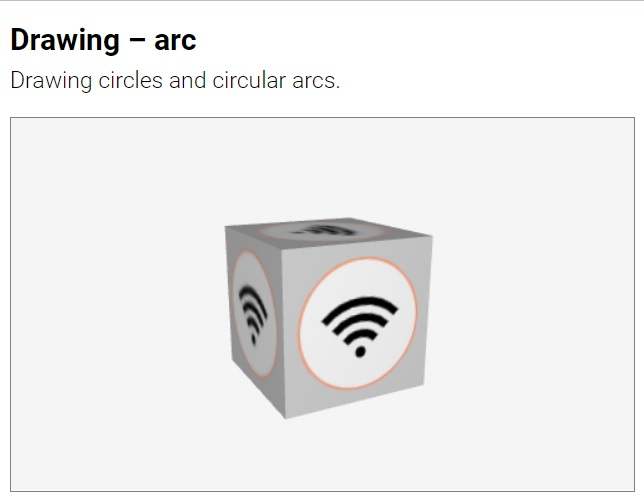

# Drawings

<small>[Suica](#suica-canvas) | [Objects](#objects) | Drawings | [Events](#events) | [Functions](#functions) | [References](#references)</small>

Suica drawings are 2D images generated in Suica (instead of being loaded from
JPEG or PNG files) that can be stamped onto 2D and 3D objects. Suica
drawings are based on [Canvas2D](https://developer.mozilla.org/en-US/docs/Web/API/CanvasRenderingContext2D). 


- [**Drawing**](#drawing)
- [**Paths**](#paths)
	- [moveTo](#moveto)
	- [lineTo](#lineto)
	- [curveTo](#curveto)
	- [arc](#arc)
- [**Stroke and fill**](#stroke-and-fill)
	- [stroke](#stroke)
	- [fill](#fill)
	- [fillText](#filltext)
	- [clear](#clear)


# Drawing

Command. Defines a 2D drawing canvas. 

#### Syntax:

> ```html
HTML:
<drawing id="𝘯𝘢𝘮𝘦" size="𝑤𝑖𝑑𝑡ℎ,ℎ𝑒𝑖𝑔ℎ𝑡" color="𝑐𝑜𝑙𝑜𝑟">
```
> ```js
JS:
𝘯𝘢𝘮𝘦 = drawing( 𝑤𝑖𝑑𝑡ℎ, ℎ𝑒𝑖𝑔ℎ𝑡, 𝑐𝑜𝑙𝑜𝑟 );
```

Parameter `id` sets the name of the canvas (and also the name of the variable
that holds the canvas). This name is used when the drawing is applied to the
surface of an object's [image](user-guide-properties.md#image) or when the
drawing is updated.

Parameter `size` sets the canvas size in pixels. If `height` is not provided, it
is assumed to be the same as `width`. By default the drawing canvas is
32&times;32 pixels. In HTML `size` can be split into individual parameters
`width` and `height`.

Parameter `color` sets the initial background color of the canvas. If `colour`
is set, the background of the canvas is filled with this color; otherwise it is
kept transparent.

```html
HTML:
<drawing id="pic">
<drawing id="pic" size="32,48">
<drawing id="pic" width="32" height="48">
```
```js
JS:
var a = drawing( 32 );
var b = drawing( 32, 48, 'crimson' );
```

A drawing can be constructed in HTML or in JavaScript. Modifications of existing
drawing can be done only in JavaScript.

[<kbd></kbd>](../examples/drawing-html.html)
[<kbd></kbd>](../examples/drawing-js.html)

The transparancy of a drawing is used when it is applied to an object. Areas of
the object surface are transparent if they correspond to transparent areas of
the drawing.

[<kbd></kbd>](../examples/drawing-transparent.html)
[<kbd></kbd>](../examples/drawing-opaque.html)

Apart from 2D and 3D objects drawings can be applied to points and lines. For
points the drawings act like [sprites](https://en.wikipedia.org/wiki/Sprite_(computer_graphics))
&ndash; they are not subject to orientation and they always face the screen. For
lines the drawings are used to create dot-and-dash patterns.

[<kbd></kbd>](../examples/drawing-custom-point.html)
[<kbd></kbd>](../examples/drawing-dotted-lines.html)

A drawing is applied to an object via the [image](#image) property and can be
updated both before and after this assignment. The scale of
a drawing is managed by the [images](#images) property. 

[<kbd></kbd>](../examples/dynamic-drawing.html)


# Paths

Suica drawings are based on [Canvas2D](https://developer.mozilla.org/en-US/docs/Web/API/CanvasRenderingContext2D)
and are made of stroked lines and filled areas. A virtual pen defines a path on
the canvas. This path can be *stroked* by drawing a line over it; or its
contents can be *filled* with a color.

The coordinate system of a drawing canvas has origin (0,0) at the bottom left
side of the canvas. The X axis extends to the right, Y extends to the top.



## MoveTo

Command. Sets the position of the virtual. This command moves the virtual
pen from its current location to (`x`,`y`) without generating a path. This is
used to set the starting point of a line or to start a new line, that is not
connected to the current line. By default the both *x* and *y* are 0.


```html
HTML:
<moveTo center="10,0">
<moveTo x="10" y="0">
```
```js
JS:
moveTo( 10, 0 );
```
	
## LineTo

Command. Adds a line segment to the path. This command moves the virtual pen
along a straight line from its current location to (`x`,`y`) and adds that line
to the current path. This is used to define straignt line sections of the path.
By default the both *x* and *y* are 0.

```html
HTML:
<lineTo center="10,0">
<lineTo x="10" y="0">
```
```js
JS:
lineTo( 10, 0 );
```

[<kbd></kbd>](../examples/drawing-moveto-lineto.html)
		
## CurveTo

Command. Adds a curved segment to the path. This command moves the virtual pen
along a curved line from its current location to (`x`,`y`) and adds that curve
to the current path. The line is quadratic curve and is attracted towards point
(`mx`, `my`), which is defined by the first pair of parameters of *curveTo*.
By default all coordinates *mx*, *my*, *x* and *y* are 0.


```html
HTML:
<curveTo m="10,0" center="20,15">
<curveTo mx="10" my="0" x="20" y="15">
```
```js
JS:
curveTo( 10, 0, 20, 15 );
```

[<kbd></kbd>](../examples/drawing-curveto.html)

A more complex curve can be constructed by joining individual curves. The shape
of a heart, for examples, can be constructed by 6 connected curves.


[<kbd></kbd>](../examples/drawing-heart-point.html)


## Arc

Command. Adds a circle оr a circular arc to the path. This command creates an
arc from a circle with center (`x`,`y`) and `radius`. The arc stars from angle
`from` and ends at angle `to`. The last parameter is direction of drawing &ndash;
either clockwise or counter-clockwise. Coordinates and radius are measured in
pixels, angles are measured in degrees. If the angles are not provided, a full
circle is generated. 

```html
HTML:
<arc center="10,0" radius="5">
<arc x="10" y="0" radius="5" from="0" to="180" ccw>
```
```js
JS:
arc( 10, 0, 5);
arc( 10, 0, 5, 0, 180, false);
```

The coordinate system of a drawing has origin (0,0) at the bottom left side of
the canvas. The X axis extends to the right, Y extends to the top.


[<kbd></kbd>](../examples/drawing-arc.html)

In HTML the direction of drawing is set by attributes `cw` or `ccw` which values
are either *true* or *false*. If the attributes have no values, they are assumed
to be *true*. The following commanda are equivalent:

```html
HTML:
<arc x="10" y="0" radius="5" cw>
<arc x="10" y="0" radius="5" cw="true">
<arc x="10" y="0" radius="5" ccw="false">
```

In JS the direction of drawing is set by the last 6th parameter of *arc* that
corresponds to *cw* and by default is *true*.

## Stroke

Command. Draws a line over the current path. The line has given `color` and 
`width`. If the `close` parameter is *true*, then the end of the path is
conneted to the beginning of the path. A *stroke* immediately after another
*stroke* or *fill* will reuse the same path.

```html
HTML:
<stroke color="crimson">
<stroke color="crimson" width="10" close>
<stroke color="crimson" width="10" close="true">
```
```js
JS:
stroke( 'crimson' );
stroke( 'crimson', 10, true );
```

[<kbd></kbd>](../examples/drawing-stroke.html)
	
	
## Fill

Command. Fills the area defined by a path. The area is filled with the given
`color`.  A *fill* immediately after another *stroke* or *fill* will reuse the
same path. 

```html
HTML:
<fill color="crimson">
```
```js
JS:
fill( 'crimson' );
```
	
[<kbd></kbd>](../examples/drawing-fill.html)
[<kbd></kbd>](../examples/drawing-fill-and-stroke.html)


## FillText

Command. Draws a text. The `text` is drawn at given coordinates (`x`,`y`) with
given `color` and `font` style. The *font* parameter is a string with a
[CSS font](https://developer.mozilla.org/en-US/docs/Web/CSS/font) description.

```html
HTML:
<fillText center="10,5" text="Sample text" color="crimson" font="bold 20px Courier">
```
```js
JS:
fillText( 10, 5, 'Sample text', 'crimson', 'bold 20px Courier' );
```	
	
[<kbd></kbd>](../examples/drawing-filltext.html)
	
	
## Clear

Command. Clears a drawing canvas. The drawing canvas is filled with the given
`color` if it is provided, or is cleared to transparent if it is not provided.
Next commands after *clear* start a new path.

```html
HTML:
<clear>
<clear color="crimson">
<clear background="crimson">
```
```js
JS:
clear( 'crimson' );
```
	
[<kbd></kbd>](../examples/drawing-clear.html)

---

May, 2022