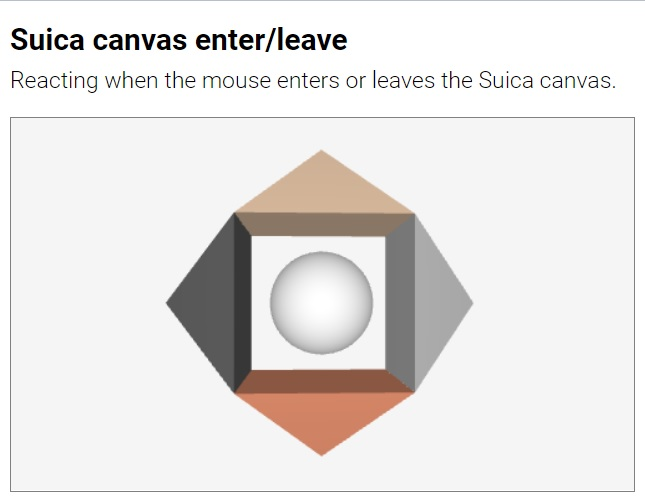
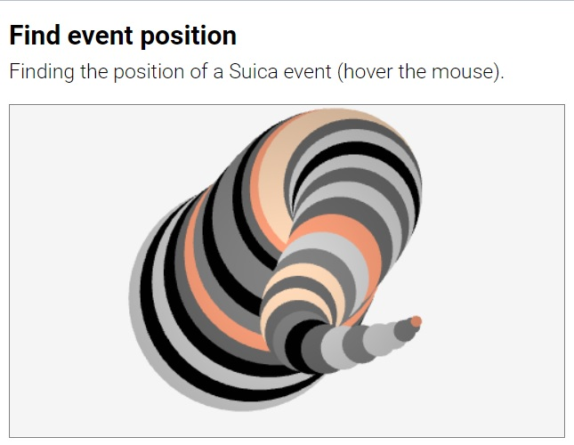

# Suica Events

<small>[Suica](user-guide-suica.md) | [Properties](user-guide-properties.md) | [Objects](user-guide-objects.md) | [Drawings](user-guide-drawings.md) | Events | [Functions](user-guide-functions.md) | [References](user-guide-references.md)</small>

- [**Events**](#events)
	- [Listeners](#event-listeners)
	- [Handlers](#event-handlers)
	- [Proactive](#proactive-events)
- [**Event data**](#event-data)
	- [findPosition](#findposition)
	- [findObject](#findobject)
	- [findObjects](#findobjects)


# Events

An event is something that happens 'outside' a Suica program at unknown moment
of time. For example, when the user clicks on an object with the mouse, this is
an event. Suica reimplements a part of the web page events system onto Suica
objects.

Suica supports motion, click and time events.

- **Motion events** are `onМouseEnter`, `onМouseMove` and `onМouseLeave`. They
occur when the mouse enters, moves over or leaves Suica canvas or Suica object.


- **Click events** are `onMouseDown`, `onMouseUp` and `onClick`. They occur when
a mouse button is pressed, released or clicked over Suica canvas or Suica object.


- **Time event** is `onTime`. It occurs when the browser is ready for a new frame.

An event is managed by two elements:

- **Event listener**: A declaration that an object is interested in a specific event
- **Event handler**: A user-defind function that is activated when an event occurs

All events that are not listened to, are ignored.


## Event listeners

In Suica event listeners can be set for Suica canvas and for individual Suica
objects. For example, a canvas `onClick` event occurs when the user clicks
anywhere in the canvas, while an object `onClick` event occurs when the user
clicks on the image of the object. Similarily, a canvas `onMouseEnter` occurs
when the mouse cursor enters the canvas, while an object `onMouseEnter` occurs
when the cursors enters the boundary of the object's image.

In HTML event listeners are set as attributes. The name of the attribute is
the name of the event, which is case-insensitive and it can be with or without
*on-* prefix. The value of the attribute is the name of the event handler
function.

```html
HTML:
<suica click="eventHandler">...</suica>
<cube onClick="eventHandler">...</suica>
```

In JavaScript event listeners ar set by [addEventListener](#addeventlistener).
The name of the event is case-insensitive and it can be with or without
*on-* prefix. The event handler is a function name without parentheses.

```js
JS:
suica.addEventListener( 'click', eventHandler );
cube.addEventListener( 'onClick', eventHandler );
```

In JavaScript an event listener can be set directly, but the event name must be
*on-* prefixed and lowercased.

```js
JS:
// click, Click and onClick will not work
suica.onclick = eventHandler;
cube.onclick = eventHandler;
```

Event listeners are removed by [removeEventListener](#removeeventlistener) or by
assigning a null value.

```js
JS:
suica.removeEventListener( 'click' );
cube.onclick = null;
```


## Event handlers

In Suica event handlers are user functions that are activated by listeners when
a specific event is detected. Often the name of the event handler is the same as
the name of the corresponding event, although this is not enforced.

For mouse events the optional parameter `event` contains data about the event.
It is used by [findPosition](#findposition), [findObject](#findobject) and
[findObjects](#findobjects).

```js
JS:
function onMouseMove( event )
{
	...
}
```

[<kbd></kbd>](../examples/events-suica-enter.html)


For time events the optional parameters `t` and `dT` are elapsed times since the
start of Suica and since the previous frame. Both are measured in seconds.
Although browsers strive to provide consistens frame speed, it is not guaranteed
that `dT` is constant.

```js
JS:
function onTime( t, dT )
{
	...
}
```

[<kbd></kbd>](../examples/events-ontime.html)


## addEventListener

Function. Registers an event listener.

```js
JS:
𝑠𝑢𝑖𝑐𝑎.addEventListener( 𝑒𝑣𝑒𝑛𝑡𝑁𝑎𝑚𝑒, 𝑒𝑣𝑒𝑛𝑡𝐻𝑎𝑛𝑑𝑙𝑒𝑟 );
𝑜𝑏𝑗𝑒𝑐𝑡.addEventListener( 𝑒𝑣𝑒𝑛𝑡𝑁𝑎𝑚𝑒, 𝑒𝑣𝑒𝑛𝑡𝐻𝑎𝑛𝑑𝑙𝑒𝑟 );
```

The function `addEventListener` registers an event listener to specific `eventName`
that triggers an `eventHandler`. The function mimics the [DOM](https://developer.mozilla.org/en-US/docs/Web/API/Document_Object_Model)'s
[addEventListener](https://developer.mozilla.org/en-US/docs/Web/API/EventTarget/addEventListener)
which is used to set event listeners for HTML elements in a web page. However,
there are several differences:

- The value of `eventName` is the name of the event with or without `on-` prefix,
thus `mouseMove` and `onMouseMove` are considered the same event.
- Only one `eventHandler` per `eventName` per object can be set, i.e. setting another
event handler will replace the previous one.
- There is no third parameter for the additional event options.

```js
JS:
s.addEventListener( 'mouseMove', eventHandler );
o.addEventListener( 'onMouseMove', eventHandler );
```

[<kbd></kbd>](../examples/events-event-listener.html)


## removeEventListener

Function. Removes an event listener.


```js
JS:
𝑠𝑢𝑖𝑐𝑎.removeEventListener( 𝑒𝑣𝑒𝑛𝑡𝑁𝑎𝑚𝑒 );
𝑜𝑏𝑗𝑒𝑐𝑡.removeEventListener( 𝑒𝑣𝑒𝑛𝑡𝑁𝑎𝑚𝑒 );
```


The function `removeEventListener` removes the event handle of specific 
`eventName`. The function mimics the [DOM](https://developer.mozilla.org/en-US/docs/Web/API/Document_Object_Model)'s
[removeEventListener](https://developer.mozilla.org/en-US/docs/Web/API/EventTarget/removeEventListener)
which is used to remove event listeners for HTML elements in a web page. However,
there are several differences:

- The `eventName` is the name of the event with or without `on-` prefix,
thus `mouseMove` and `onMouseMove` are considered the same event
- There is no second and third parameters

```js
JS:
s.removeEventListener( 'mouseMove' );
s.removeEventListener( 'onMouseMove' );
```

[<kbd></kbd>](../examples/events-one-time-listener.html)


## Proactive events

Suica supports proactive mode for mouse motion events `onМouseEnter`,
`onМouseMove` and `onМouseLeave`. This mode can be turned on with HTML attribute,
HTML tag or JavaScript command.

```html
HTML:
<suica proactive>
<proactive>
```
```js
JS:
proactive( );
```

Normal mouse motion events only occur when the mouse is moved into, over or out
of an object. In proactive mode these events are triggered even when the mouse
is stationary, but an object moves into, under or out of te mouse pointer.

[<kbd></kbd>](../examples/events-proactive.html)

Proactive mode is resource consuming, because for every frame (usually 60 times per second) objects in Suica are tested against the mouse position. When a
proactive event occurs Suica executes the assigned event handler and passes the
latest mouse event structure as a parameter to the handler.


# Event data

An event handler can retrieve additional information about an event.

A mouse event handler has a parameter, typically called *event*,
that contains information about the event itself. For mouse events this
parameter is [MouseEvent](https://developer.mozilla.org/en-US/docs/Web/API/MouseEvent).
It contains data about event time and place, mouse buttons, pressed keys, etc.
These data is used to implement drag-and-drop operations or to improve the
hicam-computer interaction.

Each event handler is run from within the object that reacted to the event.
The system variable `this` in the event handler points to this object. This is
used to identify the object when several objects share the same event handler.

Additional Suica-specific data can be extracted from the event by 
[findPosition](#findposition), [findObject](#findobject) and [findObjects](#findobjects).


```js
JS:
function onMouseMove( event )
{
   if( event.ctrlKey )
   {
      this.center = [0,0,0];
      this.color = 'crimson';
   }
}
```

[<kbd></kbd>](../examples/events-drag-and-drop.html)
[<kbd></kbd>](../examples/events-point-and-spin.html)

The `onTime` event is not a mouse event and does not receive *event* parameter. Instead the `onTime`'s handler has parameters `t` and `dT`.


## findPosition

Function. Finds the position of an event.

```js
JS:
findPosition( 𝑚𝑜𝑢𝑠𝑒𝐸𝑣𝑒𝑛𝑡 );
```

The `findPosition` function finds the position where a mouse event is registered.
The position is measured in pixels and it is relative to the center of the Suica
canvas. The function requires the `event` parameter of the event handler. The
result is an array `[x,y]` of the position. `findPosition` is typically used with events of the Suica canvas.

```js
JS:
function onMouseMove( event )
{
	var pos = findPosition( event );
}
```

[<kbd></kbd>](../examples/events-find-position.html)

The returned position coincides with the Suica coordinate system when
[orthographic camera](#orthographic-camera) is used and the view point is not
changed with [demo](#demo) or [lookAt](#lookat).


## findObject

Function. Finds the Suica object at the mouse pointer.

```js
JS:
findObject( 𝑚𝑜𝑢𝑠𝑒𝐸𝑣𝑒𝑛𝑡 );
```

The `findObject` function uses the evend data of a mouse event handler and
finds the closest to the user Suica object that is at the mouse pointer.
If no such object exists, the function returns `null`. `findObject` is typically
used with events of the Suica canvas.

```js
JS:
function onMouseMove( event )
{
	var object = findObject( event );
}
```

[<kbd></kbd>](../examples/events-find-object.html)


## findObjects

Function. Finds all Suica objects at the mouse pointer.

```js
JS:
findObjects( 𝑚𝑜𝑢𝑠𝑒𝐸𝑣𝑒𝑛𝑡 );
```

The `findObjects` function uses the evend data of a mouse event handler and
finds all Suica object that are at the mouse pointer. The result is a sorted
list (from nearest to farthest) of all found objects or an empty list `[]` if
no such objects are found. `findObjects` is typically used with events of the
Suica canvas.

```js
JS:
function onMouseMove( event )
{
	var objects = findObjects( event );
}
```

[<kbd></kbd>](../examples/events-find-objects.html)

---

May, 2022