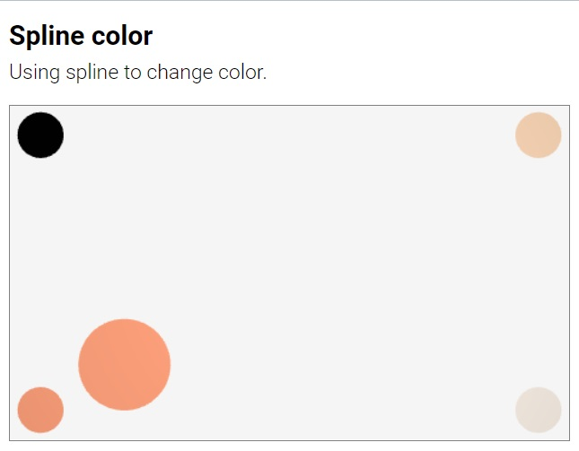
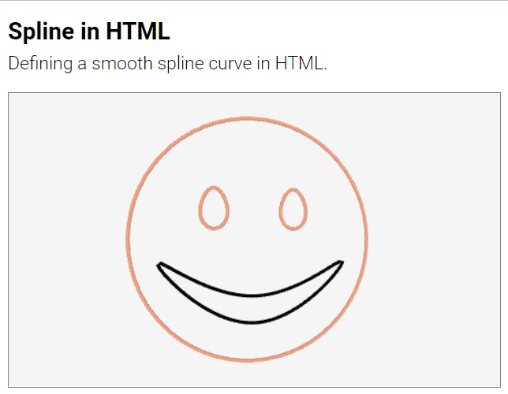

#  Suica Functions

<small>[Suica](user-guide-suica.md) | [Properties](user-guide-properties.md) | [Objects](user-guide-objects.md) | [Drawings](user-guide-drawings.md) | [Events](user-guide-events.md) | Functions | [References](user-guide-references.md)</small>

- [**Numeric functions**](#numeric-functions)
	- [radians](#radians)
	- [degrees](#degrees)
	- [random](#random)
- [**Styling functions**](#styling-functions)
	- [style](#style)
	- [its](#its)
- [**Curves and surfaces**](#curves-and-surfaces)
	- [spline](#spline)


	
	
# Numeric functions

## radians

Function. Converts degrees into radians.

```js
JS:
radians( 𝑑𝑒𝑔𝑟𝑒𝑒𝑠 );
```

```js
JS:
rad = radians( 120 );
```


### degrees

Function. Converts radians into degrees.

```js
JS:
degrees( 𝑟𝑎𝑑𝑖𝑎𝑛𝑠 );
```

```js
JS:
deg = degrees( 3.14159 );
```


### random

Function. Generates a pseudo-random number.

```js
JS:
random( 𝑓𝑟𝑜𝑚, 𝑡𝑜 );
random( [𝑎, 𝑏, 𝑐, ...] );
```

The `random` function generates a floating-point number in a range or picks a random value from an array of values.

```js
JS:
a = random( 5, 10 ); // from 5 to 10
a = random( [1, 2, 3, 4] ); // from the list
```


# Styling functions

## Style

Function. Sets Suica object style.

```js
JS:
style( 𝑜𝑏𝑗𝑒𝑐𝑡, {𝑝𝑟𝑜𝑝𝑒𝑟𝑡𝑦:𝑣𝑎𝑙𝑢𝑒, 𝑝𝑟𝑜𝑝𝑒𝑟𝑡𝑦:𝑣𝑎𝑙𝑢𝑒, …} );
```

The `style` function set or modifies a group of properties of an object.
Although the object is intedned to be a Suica object and the properties &ndash;
Suica properties, `style` can work with non-Suica objects and properties too.

```js
JS:
style( sphere(), {x:15, size:20, color:'peachpuff'} );
```


### its

Variable. `its` is a reference to the last created object. It is usually used
when the object has no name, or when its name is an expression.

```js
JS:
sphere();
its.x = 15;
its.size = 20;
its.color = 'peachpuff';
```

[<kbd></kbd>](../examples/its.html)


# Curves and surfaces

## Spline

The `spline` function implements [spline](https://en.wikipedia.org/wiki/Spline_(mathematics))
curves. Suica supports two methods for defining splines: via points and via a function.

### spline (from points)

Function. Implements a spline curve based on points.

```html
HTML:
<spline id="𝑛𝑎𝑚𝑒" src="𝑥,𝑦,𝑧;..." 𝑐𝑙𝑜𝑠𝑒𝑑="..." 𝑜𝑝𝑒𝑛="..." 𝑖𝑛𝑡𝑒𝑟𝑝𝑜𝑙𝑎𝑡𝑖𝑛𝑔="..." 𝑎𝑝𝑝𝑟𝑜𝑥𝑖𝑚𝑎𝑡𝑖𝑛𝑔="...">
```
```js
JS:
𝑛𝑎𝑚𝑒 = spline( 𝑝𝑜𝑖𝑛𝑡𝑠, 𝑐𝑙𝑜𝑠𝑒𝑑, 𝑖𝑛𝑡𝑒𝑟𝑝𝑜𝑙𝑎𝑡𝑖𝑛𝑔 );
```

The `spline` function defines a smooth curve based on an array of points `src`. The
result of `spline` is a function *f(u)* where *u* &isin; [0,1]. Function *f(u)*
calculates a point along the curve where *u*=0 corresponds to the beginning of
the curve, *u*=1 corresponds to the end of the curve and intermediate values of
*u* correspond to intermediate points on the curve.


In HTML the points represented as a semicolon-comma separated list. Points are
semicolon-separated, while coordinates in a point are comma-separated:
```"𝑥,𝑦,𝑧; 𝑥,𝑦,𝑧; 𝑥,𝑦,𝑧; ..."```.
In JavaScript the points are an array of array of coordinates: ```[[𝑥,𝑦,𝑧], [𝑥,𝑦,𝑧], [𝑥,𝑦,𝑧], ...]```.


```html
HTML:
<spline id="s" src="0,0,0; 100,0,0; 0,100,0">
```

```js
JS:
s = spline( [[0,0,0], [100,0,0], [0,100,0]] );

a = s(0);   // beginning
b = s(0.5); // middle
c = s(1);   // end
```

[<kbd></kbd>](../examples/spline.html)

Typically a spline is used to define a curve in the space and get coordinates of
points on this curve. However, in Suica splines can be used to smooth any set of
numerical values, like colors or sizes.

[<kbd></kbd>](../examples/spline-color.html)
[<kbd></kbd>](../examples/spline-size.html)

Splines have two additional parameters &ndash; `closed` and `interpolating`.

If parameter `closed` is *true* the spline curve is closed, i.e. the last point is
connected back to the first point. This is used to define smooth loops. If
`closed` is *false*, then the line is not closed. By default `closed` is *false*.

When a spline is defined in HTML, `closed` can be set either by `closed` attribute,
or by `open` attribute. If the attribute `closed` exist without a value, or if its
value is *yes*, *true* or *1*, the spline is closed. If the attribute `open`
exist without value, or if its value is *yes*, *true* or *1*, the spline is open.

```html
HTML:
<spline id="s" src="..." closed>
<spline id="s" src="..." closed="true">
<spline id="s" src="..." open="false">
```

```js
JS:
s = spline( [...], true );
```

The parameter `interpolating` defines the style of the curve. If it is *true*,
the spline curve goes through the points (i.e. it interpolates them). If it is
*false*, the spline curve goes near the points as if it is pulled by them (i.e.
it approximates the points). Approximation splines tend to appear smaller and
smoother.

When a spline is defined in HTML, `interpolating` can be set either by
`interpolating` attribute, or by `apploximating` attribute, similar to how
attributes `closed` and `open` are used.

```html
HTML:
<spline id="s" src="..." interpolating>
<spline id="s" src="..." interpolating="true">
<spline id="s" src="..." apploximating="false">
```

```js
JS:
s = spline( [...], true, true );
```

[<kbd></kbd>](../examples/spline-interpolating.html)
[<kbd></kbd>](../examples/spline-approximating.html)


### spline (from function)

Function. Implements a curve based on function.

```js
JS:
spline( 𝑓𝑢𝑛𝑐𝑡𝑖𝑜𝑛𝑁𝑎𝑚𝑒, 𝑝𝑎𝑟𝑎𝑚1, 𝑝𝑎𝑟𝑎𝑚2 );
```
where *functionName* is defined as:
```js
function 𝑓𝑢𝑛𝑐𝑡𝑖𝑜𝑛𝑁𝑎𝑚𝑒 (𝑢, 𝑝𝑎𝑟𝑎𝑚1, 𝑝𝑎𝑟𝑎𝑚2)
{
   ...
}
```

The `spline` function can uses another function as a generator of points, although
technically it is not a spline any more. This other function should have 1, 2 or 3
parameters. The first parameter is compusory and it is *u* &isin; [0,1]. The other
two parameters are optional and they are function-specific. The result of this
function must be an array of 3 or 4 values, corresponding to a point along the
curve defined by this function.

```js
JS:
function flower( u, k=3, n=2 )
{
	u = n*Math.PI*u;
	return [
		Math.cos(u) + Math.cos(k*u), // x
		Math.sin(u) - Math.sin(k*u), // y
		0                            // z
	];
}

s = spline( flower, 2 );
```
	
If a function is passed to a spline in HTML form, it has only one patameter:

```html
HTML:
<spline id="s" src="flower">
```
	
[<kbd></kbd>](../examples/spline-function.html)
[<kbd></kbd>](../examples/spline-html.html)


---

May, 2022