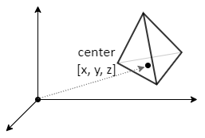
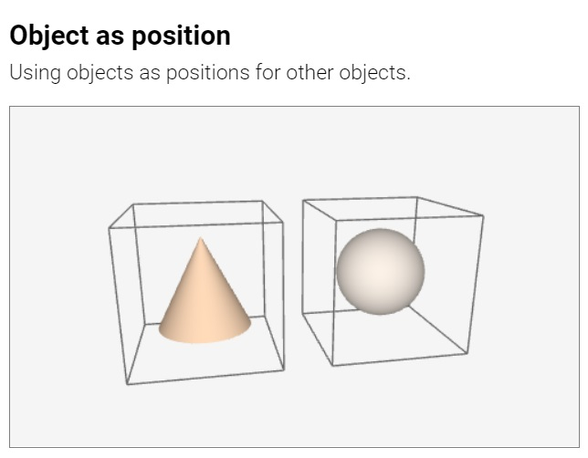
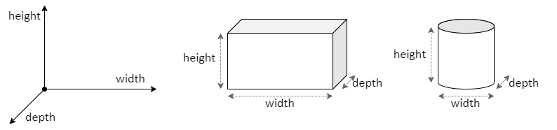
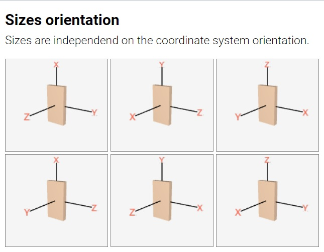
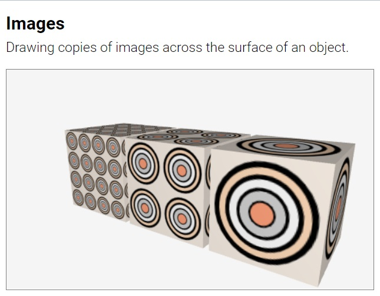
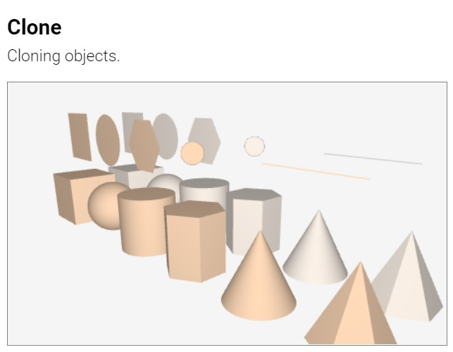
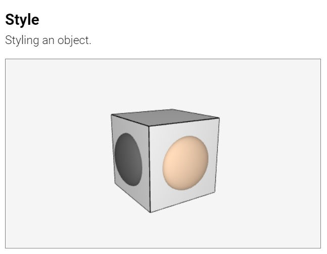
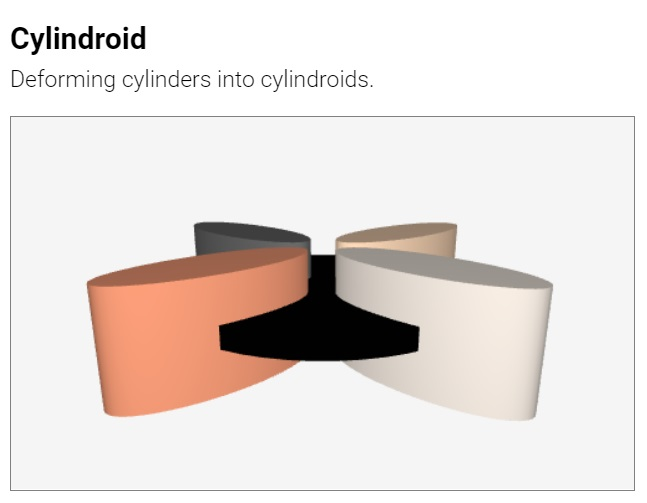
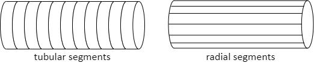
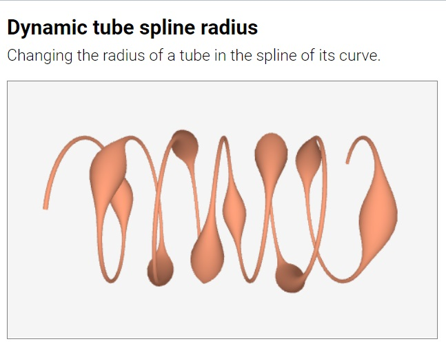

##### [About](#about) &middot; [Suica canvas](#suica-canvas) &middot; Objects &middot; [Drawings](user-guide-drawings.md) &middot; [Events](user-guide-events.md) &middot; [References](#references)

**Suica objects** are the core functionality of Suica. They are the objects that are used to construct 3D scenes. These object are designed to provide a foundation for a diverse mobile computer graphics visualizations.

# Table of contents

- [Creating an object](#creating-an-object)
	-  <small>[Objects and variables](#objects-and-variables): [`id`](#id)</small>
- [Object properties](#object-properties)
	- <small>[Position](#position): [`center`](#center), [`x`](#x-y-z), [`y`](#x-y-z), [`z`](#x-y-z)</small>
	- <small>[Size](#size): [`size`](#size-1), [`width`](#width-height-depth), [`height`](#width-height-depth), [`depth`](#width-height-depth)</small>
	- <small>[Orientation](#orientation): [`spin`](#spin), [`spinH`](#spinH), [`spinV`](#spinV), [`spinT`](#spinT), </small>
	- <small>[Decoration](#decoration): [`color`](#color), [`image`](#image), [`images`](#images), [`wireframe`](#wireframe), [`style`](#style)</small>
- [Objects](#objects)
	- <small>[Primitive objects](#primitive-objects): [`point`](#point), [`line`](#line)</small>
	- <small>[Flat objects](#flat-objects): [`square`](#square), [`circle`](#circle), [`polygon`](#polygon)</small>
	- <small>[3D objects](#3D-objects): [`cube`](#cube), [`sphere`](#sphere), [`cylinder`](#cylinder), [`prism`](#prism), [`cone`](#cone), [`pyramid`](#pyramid)</small>
	- <small>[Advanced objects](#advanced-objects): [`clone`](#clone), [`group`](#group), [`tube`](#tube)</small>


## Creating an object

In Suica object may be created as HTML tag or via JavaScript function. Each object has properties, however, they are all optional. In HTML the properties are provided as tag attributes in no specific order. In JavaScript the properties are provided as function parameters and the order is fixed.

```html
HTML:
<𝘰𝘣𝘫𝘦𝘤𝘵𝘕𝘢𝘮𝘦 𝘱𝘳𝘰𝘱𝘦𝘳𝘵𝘺𝘕𝘢𝘮𝘦="𝘷𝘢𝘭𝘶𝘦" 𝘱𝘳𝘰𝘱𝘦𝘳𝘵𝘺𝘕𝘢𝘮𝘦="𝘷𝘢𝘭𝘶𝘦" ...>
```
```js
JS:
𝘰𝘣𝘫𝘦𝘤𝘵𝘕𝘢𝘮𝘦( 𝘷𝘢𝘭𝘶𝘦, 𝘷𝘢𝘭𝘶𝘦, ...);
```

The following examples show the same 3D scene created in HTML and in JavaScript.

[<kbd></kbd>](../examples/object-html.html)
[<kbd></kbd>](../examples/object-js.html)

Most Suica objects share the same basic properties for [position](#position), [orientation](#orientation),
[size](#size), [color](#color) and so on. Some objects have specific properties. Properties related to events are described in chapter [Suica events](user-guide-events).

### Objects and variables

Suica keeps track of all created objects. They are created as JavaScript variables and stored in an internal Suica list of objects. When an object is created with a name, this object is also created as a global JavaScript variable. This allows to reuse or to reference the object later on.

#### id
```html
HTML:
<𝘰𝘣𝘫𝘦𝘤𝘵𝘕𝘢𝘮𝘦 id="𝘷𝘢𝘳𝘪𝘢𝘣𝘭𝘦𝘕𝘢𝘮𝘦">
```
```js
JS:
𝘷𝘢𝘳𝘪𝘢𝘣𝘭𝘦𝘕𝘢𝘮𝘦 = 𝘰𝘣𝘫𝘦𝘤𝘵𝘕𝘢𝘮𝘦( ... );
```

In HTML the name of an object is set in the `id` attribute. In JavaScript the name of an object is set by using the JavaScript way of creating variable.

```html
HTML:
<point id="p" center="25,0,15">
```
```js
JS:
p = point( [25,0,15] );
```


# Object properties

By design Suica attempts to use the same properties for all objects as much as it is reasonable. This section describes the properties that are common to many obects. 

## Position

All Suica objects are placed in 3D space. The position is defined by a special central point of the object. When the center is set to a given position in 3D space, the whole object is positioned there. The position of a Suica object is set by the property `center` or by individual properties for coordinates `x`, `y` and `z`.



An exceptional object is the [`line`](#line) &ndash; it has no central point, because it is defined by two points.


#### center
```html
HTML:
<𝑜𝑏𝑗𝑒𝑐𝑡 center="𝘹,𝘺,𝘻">
```
```js
JS:
𝑜𝑏𝑗𝑒𝑐𝑡( ..., [𝘹,𝘺,𝘻], ... );
𝑜𝑏𝑗𝑒𝑐𝑡.center = [𝘹,𝘺,𝘻];
```
Property. Defines object position in 3D space. Property `center` is an array of three numbers [*x*, *y*, *z*] for the *x*, *y* and *z* coordinates (in this order). The actual visual position depends on the orientation of the [coordinate system](#coordinate-system). All coordinates are optional. Default values are 0.

```html
HTML:
<point center="25,0,15">
```
```js
JS:
point( [25,0,15] );

p = point( );
p.center = [25, 0, 15];
```

In JavaScript the center of many but not all objects is the first parameter.

An object can be used as a center of another object. 

```html
HTML:
<cube id="a" x="-20">
<cube id="b" x="20">
<line from="a" to="b">
```
```js
JS:
a = cube( [20,0,0] );
b = cube( [-20,0,0] );
line( a, b );
```
[<kbd></kbd>](../examples/object-as-position.html)


#### x, y, z
```html
HTML:
<𝑜𝑏𝑗𝑒𝑐𝑡 x="𝘹" y="𝘺" z="𝘻">
```
```js
JS:
𝑜𝑏𝑗𝑒𝑐𝑡.x = 𝘹;
𝑜𝑏𝑗𝑒𝑐𝑡.y = 𝘺;
𝑜𝑏𝑗𝑒𝑐𝑡.z = 𝘻;
```
Properties. The individual x, y or z coordinates of the object position in 3D space. These properties provide an alternative access to object `center`.

```html
HTML:
<point x="25" y="10" z="15">
```
```js
JS:
p = point( );
p.x = 25;
p.y = 10;
p.z = 15;
```


## Size

All objects in Suica have size. It determins the visual appearance of the object &ndash; how big or small it is. In 3D space the size is also 3D and it defines width, height and depth of the object. When the depth of an object is not set, it is assumed to be the same as the width.

There are several exceptional objects: [`line`](#line) has no size; [`point`](#point) has a single size; all flat objects, like [`square`](#square), have two sizes &ndash; width and height, but no depth; [`group`](#group)uses its size as a scale factor, not as an actual size.  


#### Size
```html
HTML:
<𝑜𝑏𝑗𝑒𝑐𝑡 size="𝑤𝑖𝑑𝑡ℎ">
<𝑜𝑏𝑗𝑒𝑐𝑡 size="𝑤𝑖𝑑𝑡ℎ,ℎ𝑒𝑖𝑔ℎ𝑡">
<𝑜𝑏𝑗𝑒𝑐𝑡 size="𝑤𝑖𝑑𝑡ℎ,ℎ𝑒𝑖𝑔ℎ𝑡,𝑑𝑒𝑝𝑡ℎ">
```
```js
JS:
𝑜𝑏𝑗𝑒𝑐𝑡( ..., 𝑤𝑖𝑑𝑡ℎ, ... );
𝑜𝑏𝑗𝑒𝑐𝑡( ..., [𝑤𝑖𝑑𝑡ℎ], ... );
𝑜𝑏𝑗𝑒𝑐𝑡( ..., [𝑤𝑖𝑑𝑡ℎ,ℎ𝑒𝑖𝑔ℎ𝑡], ... );
𝑜𝑏𝑗𝑒𝑐𝑡( ..., [𝑤𝑖𝑑𝑡ℎ,ℎ𝑒𝑖𝑔ℎ𝑡,𝑑𝑒𝑝𝑡ℎ], ... );
𝑜𝑏𝑗𝑒𝑐𝑡.size = 𝑤𝑖𝑑𝑡ℎ;
𝑜𝑏𝑗𝑒𝑐𝑡.size = [𝑤𝑖𝑑𝑡ℎ];
𝑜𝑏𝑗𝑒𝑐𝑡.size = [𝑤𝑖𝑑𝑡ℎ,ℎ𝑒𝑖𝑔ℎ𝑡];
𝑜𝑏𝑗𝑒𝑐𝑡.size = [𝑤𝑖𝑑𝑡ℎ,ℎ𝑒𝑖𝑔ℎ𝑡,𝑑𝑒𝑝𝑡ℎ];
```
Property. The size of a Suica object. Property `size` that defines how big is the objects along its dimensions. If `size` is a single number, then the object is uniformly sized. Generally, `size` is an array of up to three numbers for object's width, height and depth. Their order does not depend on the orientation of [the coordinate system](#coordinate-system). Thus height corresponds to the axis that is upwards.




```html
HTML:
<cube size="25">
<cube size="25,10">
<cube size="25,10,15">
```
```js
JS:
cube( pos, 25 );
cube( pos, [25] );
cube( pos, [25,10] );
cube( pos, [25,10,15] );
```


[<kbd></kbd>](../examples/sizes.html)
[<kbd></kbd>](../examples/sizes-orientation.html)


#### width, height, depth)
```html
HTML:
<𝑜𝑏𝑗𝑒𝑐𝑡 width="𝘸𝘪𝘥𝘵𝘩" height="𝘩𝘦𝘪𝘨𝘩𝘵" depth="𝘥𝘦𝘱𝘵𝘩">
```
```js
JS:
𝑜𝑏𝑗𝑒𝑐𝑡.width = 𝘸𝘪𝘥𝘵𝘩;
𝑜𝑏𝑗𝑒𝑐𝑡.height = 𝘩𝘦𝘪𝘨𝘩𝘵;
𝑜𝑏𝑗𝑒𝑐𝑡.depth = 𝘥𝘦𝘱𝘵𝘩;
```
Properties. The individual width, height and depth of an object. These properties provide an alternative access to object `size`. 

```html
<cube size="3,15,40">
<cube width="3" height="15" depth="40">
```
```js
cube( pos, [3,15,40] );
a = cube( );
a.width = 3;
a.height = 15;
a.depth = 40;
```


#### Spin

Property. Defines the rotation of an object in respect to its own axes. The
value of `spin` is either an angle or an array of up to three angles [`spinH`, `spinV`, `spinT`].
All angles are measured in degrees.

Angle *spinH* (*H* from *horizontal*) defines horizontal rotation around the
global vertical axis. Angle *spinV* (*V* from *vertical*) define vertical
rotation away from the vertical axis. Angle *spinT* (*T* from *torsion*) defines
rotation of the object around it own vertical axis..


The spin is independent on the orientation of the coordinate system. However,
due to the default orientation of flat and non-flat objects, orientation along
coordinate system axes differ. For example, if a square has a spin [&alpha;, &beta;, &gamma;],
a pyramid on that square should have spin [&alpha;, &beta;+90, &gamma;].

[<kbd></kbd>](../examples/spin.html)
[<kbd></kbd>](../examples/spin-angles.html)

[<kbd></kbd>](../examples/spin-orientation.html)


#### Color

Property. Defines the color of a graphical object. Color in Suica can be
expressed in a variety of ways. The [RGB scheme](https://www.w3schools.com/colors/colors_rgb.asp) represents colors as three
components *red*, *green* and *blue*, while the
[HSL scheme](https://www.w3schools.com/colors/colors_hsl.asp) components are
*hue*, *saturation* and *lightness*.


| Context | Descriptive<br>name | Hexadecimal<br>number | Normalized<br>RGB array | RGB<br>function | HSL<br>function |
|---|:---:|:---:|:---:|:---:|:---:|
| | <small>[List of color names](https://www.w3schools.com/colors/colors_names.asp)</small>| *RRGGBB*<br><small>*RR*,*GG*,*BB* &isin; [00,FF]</small> | *r*,*g*,*b*<br><small>*r*,*g*,*b* &isin; [0,1]</small> | rgb(*r*,*g*,*b*)<br><small>*r*,*g*,*b* &isin; [0,255] | hsl(*h*,*s*,*l*)<br><small>*h* &isin; [0,360], *s*,*l* &isin; [0,100]</small> |
| Tag<br>attribute | [crimson](https://www.color-name.com/crimson.color) | 0xDC143C | 0.86,&nbsp;0.08,&nbsp;0.24 | rgb(&nbsp;220,&nbsp;20,&nbsp;60&nbsp;) | hsl(&nbsp;348,&nbsp;91,&nbsp;86&nbsp;) |
| CSS<br>property | crimson | #DC143C | | rgb( 220, 20, 60 ) | hsl( 348, 91, 86 ) |
| JS<br>code | "crimson" | 0xDC143C | [0.86,&nbsp;0.08,&nbsp;0.24] | rgb(&nbsp;220,&nbsp;20,&nbsp;60) | hsl(&nbsp;348,&nbsp;91,&nbsp;86) |

_**Note**: Setting the color of object [group](#group) sets it to all its objects._


#### Wireframe

Property. Defines whether to visualize objects as wireframes. By default objects
in Suica are drawn with solid surfaces. The property `wireframe` is used to
change switch surface visualization into wireframe mode &ndash; i.e. only edges
are drawn.

To turn on wireframe mode set the property to `true`, `yes` or `1`. When used as
HTML attributes, the value may be omitted. To turn off wireframe mode set the
property to `false`, `no` or `0`.

```html
HTML:
<cube size="30" wireframe>
<cube size="30" wireframe="true">
```
```js
JS:
a = cube( [0,0,0], 30);
a.wireframe = true;
```

_**Note**. Not all objects have wireframe mode._


#### Image

Property. Decorates object surface with an image. Images can be stamped onto
Suica object via the property `image`. The property accepts a drawing or a
texture image. For more information of how to generate a drawing instead of
loading an image file see section [Drawings](#drawings). 

```html
HTML:
<cube id="a" image="https://boytchev.github.io/suica/textures/flower.jpg">
```
```js
JS:
a.image = 'https://boytchev.github.io/suica/textures/flower.jpg';
a.image = image( 'https://boytchev.github.io/suica/textures/flower.jpg' );
```

[<kbd></kbd>](../examples/image-file.html)
[<kbd></kbd>](../examples/image-datauri.html)


When an object has both `color` and `image`, the resulting color is the product
of the RGB normalized colors (i.e. components r,g,b&isin;[0,1]) of the color and
the image pixels. If the object color is [R,G,B] and the image color is [r,g,b],
then the combined color is [R,G,B]&times;[r,g,b] = [R&times;r,G&times;g,B&times;b].
The following tabel shows some combinations of colors:

| Object color | Image color | Resulting color |
|---|---|---|
| White<br><small>[1,1,1]</small> | Any<br><small>[r,g,b]</small> | Image color<br><small>[1,1,1]&times;[r,g,b] = [r,g,b]</small> |
| Black<br><small>[0,0,0]</small> | Any<br><small>[r,g,b]</small> | Black<br><small>[0,0,0]&times;[r,g,b] = [0,0,0]</small> |
| Any<br><small>[R,G,B]</small> | White<br><small>[1,1,1]</small> | Object color<br><small>[R,G,B]&times;[1,1,1] = [R,G,B]</small> |
| Any<br><small>[R,G,B]</small> | Black<br><small>[0,0,0]</small> | Black<br><small>[R,G,B]&times;[0,0,0] = [0,0,0]</small> |
| Red<br><small>[R,0,0]</small> | Any<br><small>[r,g,b]</small> | Only the red component of the image color<br><small>[1,0,0]&times;[r,g,b] = [r,0,0]</small> |
| Yellow<br><small>[1,1,0]</small> | Cyan<br><small>[0,1,1]</small> | Green<br><small>[1,1,0]&times;[0,1,1] = [0,1,0]</small> |

Due to a security mechanism in browsers &ndash; [Same-origin policy](https://developer.mozilla.org/en-US/docs/Web/Security/Same-origin_policy)
(SOP) and [Cross-origin resource sharing](https://developer.mozilla.org/en-US/docs/Glossary/CORS) (CORS),
a file can be used as image only if it is located in the same online domain;
or the image host allows cross-origin requests. An image file can be used in
these cases:

- the image file is in the same domain as the Suica file and is accessed by
`http://` or `https://` protocols
- the image file is hosted on a server that allows anonymous access to images
- the image file is accessed through a [local host](https://en.wikipedia.org/wiki/Localhost) from `http://localhost`
- the image is encoded in the URL itself as [Data URI/URL](https://developer.mozilla.org/en-US/docs/Web/HTTP/Basics_of_HTTP/Data_URIs) from `data:` scheme
- CORS is disabled in the browser configuration (not recommended)
- an old SOP-less and CORS-less browser is used (not recommended)

For online tools to generate Data URI from images see section
[External libraries](#external-libraries).

#### Images

Property. Defines the number of copies of a drawing or image across the surface
of an object. For more information of how to generate a drawing or use an image
see section [Drawings](#idrawings).

If the value of *images* is a number, it defines the number of copies in both
horizontal and vertical direction. If the value is an array, the first element
if for the horizontal direction and the second is for the vertical direction.

```html
HTML:
<cube id="a" images="2">
<cube id="b" images="2,3">
```
```js
JS:
a.images = 2;
a.images = [2,3];
```

[<kbd></kbd>](../examples/images.html)


#### Clone

Readonly property. Generates a clone of the object. Whenever the value of `clone`
is retrieved, it is a clone of the object. Cloning is used to generate objects
from a single object-template.

```html
HTML:
<cube id="a" size="15">
<clone id="b" src="a">
```
```js
JS:
a = cube( [0,0,0], 25 );
b = a.clone;
```

[<kbd></kbd>](../examples/clone.html)
[<kbd></kbd>](../examples/clone-tag.html)

_**Note**: Cloning an object [group](#group) also clones all its objects._


#### Style

Method. Sets a group of properties of an object. The properties are defined as a
set of *name:value* pairs. New, custom user-defined properties are allowed. 
As `style` return the same object, styling can be chained.

```js
JS:
sphere().style( {x:15, size:20, color:'peachpuff'} );
sphere().style( {x:15} ).style( {size:20} ).style( {color:'peachpuff'} );
```

[<kbd></kbd>](../examples/style.html)

_**Note**. Style can also be used as a [function](#style-1)._


## Common 2D objects

The common 2D objects represents flat 1D and 2D shapes, like points, squares,
circles and so on. Their constructions requires to set just a few properties.
Some of the objects have framed variants, where only their edges are drawn with
lines.

_**Note:** The width of the lines is 1 pixel and this limitation is set in the
underlying technology._


### Point

Object. Represents a point. Its properties are `center` (or `x`, `y` and `z`),
`size`, `color`, `image`, `images` and `clone`. By default a point is drawn as a small cirlce, but
it can be changed with custom [drawing](#images-and-drawings).

```html
HTML:
<point center="25,0,15">
<point center="25,0,15" size="10" color="crimson">
```
```js
JS:
point( [25,0,15] );
point( [25,0,15], 10, 'crimson' );
```

[<kbd></kbd>](../examples/point.html)&emsp;[<kbd></kbd>](../examples/point-cloud.html)


### Line

Object. Represents a straight segment. Its properties are `center` (or `from`),
`to`, `color`, `image`, `images` and `clone`. The properties `center` and `from` are synonyms and
they set the starting point of the segment, while `to` sets the ending point. By
default a line is drawn as a solid line, but it can be changed with custom
[drawing](#images-and-drawings).

```html
HTML:
<line center="25,0,15" to="100,-20,35">
<line from="25,0,15" to="100,-20,35">
```
```js
JS:
line( [25,0,15], [100,-20,35] );
point( [25,0,15], [100,-20,35], 'red' );
```

[<kbd></kbd>](../examples/line.html)

_**Note**: Lines have no properties x, y, z, size, width, height and depth._


### Square

Object. Represents a regular square or a rectangle. Its properties are
`center` (or `x`, `y` and `z`), `size` (or `width` and `height`), `color`, `spin`, 
`wireframe`, `image`, `images` and `clone`. 

```html
HTML:
<square center="25,0,15">
<square size="10" color="crimson">
```
```js
JS:
square( [25,0,15] );
square( [0,0,0], 10, 'crimson' );
```

[<kbd></kbd>](../examples/square.html)
[<kbd></kbd>](../examples/square-rectangle.html)


### Circle

Object. Represents a circle or an ellipse. Its properties are `center` (or `x`,
`y` and `z`), `size` (or `width` and `height`), `color`, `spin`, `wireframe`,
`image`, `images` and `clone`. 

```html
HTML:
<circle center="25,0,15">
<circle size="10" color="crimson">
```
```js
JS:
circle( [25,0,15] );
circle( [0,0,0], 10, 'crimson' );
```

[<kbd></kbd>](../examples/circle.html)
[<kbd></kbd>](../examples/circle-ellipse.html)


### Polygon

Object. Represents a regular polygon or an elliptical polygon. Its properties
are `count`, `center` (or `x`, `y` and `z`), `size` (or `width` and `height`),
`color`, `spin`, `wireframe`, `image`, `images` and `clone`. The property `count` defines
the number of sides of the polygon.

```html
HTML:
<polygon count="3" center="25,0,15">
<polygon count="5" size="10" color="crimson">
```
```js
JS:
polygon( 3, [25,0,15] ); // triangle
polygon( 5, [0,0,0], 10, 'crimson' ); // pentagon
```

[<kbd></kbd>](../examples/polygon.html)

_**Note:** Properties size, width and height refer to the polygon circumscribed
circle, rather than the polygon itself._


## Common 3D objects

The common 3D objects represents shapes, like cubes, spheres, and so on. Their
constructions requires to set just a few properties. Some of the objects have
framed variants, where only their edges are drawn with lines.

_**Note:** The width of the lines is 1 pixel and this limitation is set in the
underlying technology._

### Cube

Object. Represents a regular cube or a deformed cube (called *cuboid*).
Its properties are `center` (or `x`, `y` and `z`), `size` (or `width`, `height`
and `depth`), `color`, `spin`, `wireframe`, `image`, `images` and `clone`. 

```html
HTML:
<cube center="25,0,15">
<cube size="10" color="crimson">
```
```js
JS:
cube( [25,0,15] );
cube( [0,0,0], 10, 'crimson' );
```

[<kbd></kbd>](../examples/cube.html)
[<kbd></kbd>](../examples/cube-cuboid.html)


### Sphere

Object. Represents a regular sphere or a deformed sphere (spheroid). Its
properties are `center` (or `x`, `y` and `z`), `size` (or `width`, `height`
and `depth`), `color`, `spin`, `image`, `images` and `clone`. 

```html
HTML:
<sphere center="25,0,15">
<sphere size="10" color="crimson">
```
```js
JS:
sphere( [25,0,15] );
sphere( [0,0,0], 10, 'crimson' );
```

[<kbd></kbd>](../examples/sphere.html)
[<kbd></kbd>](../examples/sphere-spheroid.html)


### Cylinder

Object. Represents a regular cylinder or a cylindroid (an elliptical cylinder).
Its properties are `center` (or `x`, `y` and `z`), `size` (or `width`, `height`
and `depth`), `color`, `spin`, `image`, `images` and `clone`. 

```html
HTML:
<cylinder center="25,0,15">
<cylinder size="10" color="crimson">
```
```js
JS:
cylinder( [25,0,15] );
cylinder( [0,0,0], 10, 'crimson' );
```

[<kbd></kbd>](../examples/cylinder.html)
[<kbd></kbd>](../examples/cylinder-cylindroid.html)


### Prism

Object. Represents a regular prism or prismoid (an elliptical prism). Its
properties are `count`, `center` (or `x`, `y` and `z`), `size` (or `width`,
`height` and `depth`), `color`, `spin`, `wireframe`, `image`, `images` and `clone`. The
property `count` defines the number of sides of the prism.

```html
HTML:
<prism count="6" center="25,0,15">
<prism count="3" size="10" color="crimson">
```
```js
JS:
prism( 6, [25,0,15] );
prism( 3, [0,0,0], 10, 'crimson' );
```

[<kbd></kbd>](../examples/prism.html)


### Cone

Object. Represents a regular cone or conoid (an elliptical cone). Its properties
are `center` (or `x`, `y` and `z`), `size` (or `width`, `height` and `depth`),
`color`, `spin`, `image`, `images` and `clone`. 

```html
HTML:
<cone center="25,0,15">
<cone size="10" color="crimson">
```
```js
JS:
cone( [25,0,15] );
cone( [0,0,0], 10, 'crimson' );
```

[<kbd></kbd>](../examples/cone.html)
[<kbd></kbd>](../examples/cone-conoid.html)


### Pyramid

Object. Represents a regular pyramid or a pyramoid (an elliptical pyramid). Its
properties are `count`, `center` (or `x`, `y` and `z`), `size` (or `width`,
`height` and `depth`), `color`, `spin`, `wireframe`, `image`, `images` and `clone`. The
property `count` defines the number of sides of the pyramid.

```html
HTML:
<pyramid count="6" center="25,0,15">
<pyramid count="3" size="10" color="crimson">
```
```js
JS:
pyramid( 6, [25,0,15] );
pyramid( 3, [0,0,0], 10, 'crimson' );
```

[<kbd></kbd>](../examples/pyramid.html)


# Advanced objects

The advanced objects are constructed from other objects. They provide more complex shapes.


## Group

Object. Represents a collection of objects grouped into a single object. A group
can be positioned, scaled, rotated and colored as other objects. Its properties
are `center` (or `x`, `y` and `z`), `size` (or `width`, `height` and `depth`),
`color`, `spin` and `clone`; it has method `add`.

```html
HTML:
<group center="0,-10,0">
   <sphere y="25" size="10">
   <cone size="12,25">
</group>
```
```js
JS:
group(
   sphere( [0,25,0], 10 ),
   cone( [0,0,0], [12,25] )
);
```

[<kbd></kbd>](../examples/group.html)
[<kbd></kbd>](../examples/group-tag.html)

A group is a special objects, and some aspects of group management are:
- A group has own center, size and spin. Values of `size` of a group are scale
factors, not sizes. Centers and spins of objects in a group are relative to the
group's center and spin.
- Group objects are defined between `<group>` and `</group>` tags or as
parameters to `group(...)`. A group can be extended with new objects with
`add(...)`.
- Cloning a group will also clone all its objects, setting `color` of a group
sets it to all its objects overwriting their individual colors.


### Tube

Object. Represents a tubular object along a straight or a curved line. Its
properties are `center` (or `x`, `y` and `z`), `curve`, `radius`, `count`,
`size` (or `width`, `height` and `depth`), `color`, `spin` and `clone`. Tubes
can also model [solids of revolution](https://en.wikipedia.org/wiki/Solid_of_revolution), also known as lathe shapes.


The curve is a [spline](#spline) function but can also be an array of points or
user-defined function *f(u)* on which spline is automatically constructed:

```html
HTML:
<tube curve="knot" radius="4" count="300">
```
```js
JS:
tube( [0,0,0], [[50,0,0], [-50,0,0]], 5, 2 );
```

[<kbd></kbd>](../examples/tube.html)
[<kbd></kbd>](../examples/tube-lathe.html)
[<kbd></kbd>](../examples/tube-html.html)


The `radius` of a tube is the third parameter. It is used in case there is no
radius encoded in the spline curve itself:

- if the spline points are 3D, then the *radius* parameter is used as a constant radius of the whole tube

```js
JS:
function curve3D( u )
{
   return [
      10*u, // x
      0,    // y
      0     // z
	];
}
tube( [0,0,0], curve3D, 5 ); // radius=5, taken from tube
```

- if the spline points are 4D, then the 4th coordinate is used as radius and the *radius* parameter is ignored

```js
JS:
function curve4D( u )
{
   return [
      10*u, // x
      0,    // y
      0,    // z
      1     // radius
	];
}
tube( [0,0,0], curve4D, 5 ); // radius=1, taken from curve4D
```


The *count* parameter defines the granularity of the tube. It is either a number
for the number of segments along the tube (i.e. tubular segments) or an array of
two numbers for the number of tubural and radial segments. Higher number of
segments results in smoother curve, but takes more memory space and processing
time. By default the tubural segments are 60 and the radial segments are 20.



The tube adheres to the other properties of splines &ndash; whether they are
open or closed; and interpolating or approximating.

[<kbd></kbd>](../examples/tube-open-closed.html)
[<kbd></kbd>](../examples/tube-variations.html)

[<kbd></kbd>](../examples/tube-spline.html)
[<kbd></kbd>](../examples/tube-spline-explicit.html)

Tubes allow dynamic change of their curve and curve radius. This is performance
intensive operation, as it recalculates all vertices of the tube. Recalculation
is done whenever the *curve* or *radius* property of a tube is assigned a value.

```js
JS:
spiral = tube( [0,0,0], curve, 1 );
		
suica.ontime = function( t )
{
   spiral.radius = 3+2.8*Math.sin(4*t);
}
```
		
[<kbd></kbd>](../examples/tube-dynamic-radius.html)
[<kbd></kbd>](../examples/tube-dynamic-spline-radius.html)

[<kbd></kbd>](../examples/tube-dynamic.html)

---

May, 2022