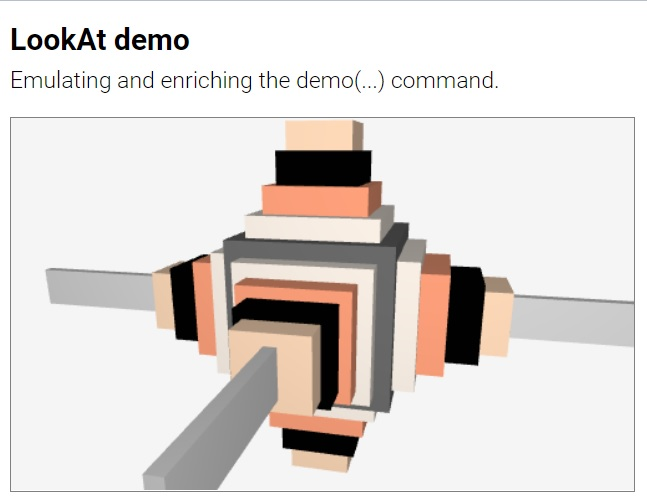
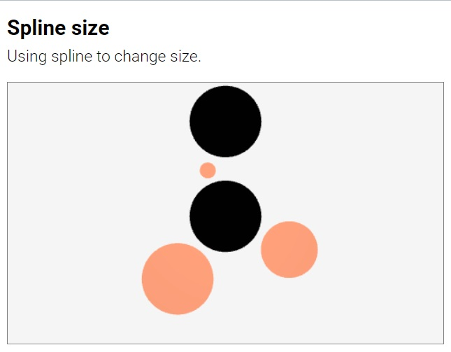

# Table of contents

- [About](#about) [<small> [Home](../README.md) | [License](../LICENSE) </small>] 
- [Suica canvas](#suica-canvas) [<small> [&lt;suica&gt;](#tag-suica) | [background](#background) | [orientation](#orientation) | [proactive](#proactive) </small>] 
    - [Helpers](#helpers) [<small> [oxyz](#oxyz) | [demo](#demo) | [allObjects](#allobjects) </small>]
    - [Cameras](#cameras) [<small> [perspective](#perspective-camera) | [orthographic](#orthographic-camera) | [full screen](#full-screen-camera) | [full window](#full-window-camera)  | [stereo](#stereo-camera) | [anaglyph](#anaglyph-camera) | [vr](#vr-camera) | [lookAt](#lookat) </small>] 
- [Functions](#functions) [<small> [radians](#radians) | [degrees](#degrees) | [random](#random) | [style](#style-1) | [spline](#spline) </small>]
- [References](#references) [<small> [reference](reference-guide.md) | [examples](examples.md) | [images](#available-images) | [libraries](#external-libraries) | [Suica 1](#suica-1)  | [tester](#tester) | [Q&A](#questions-and-answers) </small>] 


## About

**Suica is a JavaScript library** that provides a minimalistic approach to
mobile 3D graphics. Here is a minimal example of a rotating cube in the browser
(*click on the image to run the example*):

[<kbd></kbd>](../examples/minimal-example.html)

The complete code of this example is:

```html
<!DOCTYPE html>
<script src="suica.js"></script>
<suica>
	<cube>
	<demo>
</suica>
```


Suica is built upon these principles:

- **MINIMAL**<br>Less is more ([details](https://en.wikipedia.org/wiki/Minimalism_(computing))). 

- **DUAL**<br>Objects can be defined as HTML tags or in JS code, and their
properties are defined as tag attributes or function parameters. Using HTML is
a declarative create-and-forget approach, while JS is more suitable for scenes
that require continuous changes.

- **OPTIONAL**<br>All object properties are optional and may be skipped. Due to the
nature of the HTML syntax tag attributes may have any order. However, the order
of function parameters is fixed and only the trailing parameters may be skipped.

- **UNIFORM**<br>Properties are consistent across all objects that share
them. For example, object color is defined and changed in the same way for
points, cubes and spheres.

Browsers have a standard way of reaction on non-standard web pages (e.g. missing
closing tags, unregistered custom tags, etc). This is heavily used in all Suica
examples. Tools that validate HTML pages may complain about Suica HTML code.

_**Note.** Three.js and other libraries are included in this repository to safeguard
against incompatibilities with future versions. They are not a part of Suica._


## Suica canvas

Suica is distributed as `suica.js` or `suica.min.js` file and is loaded via the
`<script>` tag. Once loaded, the library will look for HTML tags `<suica>` and
use them as drawing canvases for 3D graphics. Suica does not use JS modules in
order to allow easy local development.


### Tag &lt;suica&gt;

Tag and variable. Defines a 3D drawing canvas. `<suica>` is the main Suica tag.
All other Suica-specific HTML tags are recognized only if used between `<suica>`
and `</suica>`

```html
<suica>
   <!-- all other Suica tags appear here-->
</suica>
```

The size of the canvas is set via attributes `width` and `height`. Sizes are
measured in pixels. The default size is 500&times;300 pixels. Alternatively,
sizes can be set as CSS properties (either inlined or not), which may use any
CSS unit.

Example of creating drawing canvases with different sizes:

```html
<suica width="400" height="300">
<suica style="width:15em; height:300px;">
```
[<kbd></kbd>](../examples/tag-suica.html)

The orientation of the coordinate system is set via attribute `orientation`.
More information is available in section [Coordinate system](#coordinate-system).

The global variable `suica` is set to reference the last created Suica instance.
It is used to access the Suica canvas if it has no name.


### Background

Property and command. Defines the background color of the
Suica canvas. It can be set as HTML attribute, CSS style (both inlined and
non-inlined), HTML tag and JS function. By default the background color is
[white smoke](https://www.color-hex.com/color/f5f5f5).

```html
HTML/CSS:
<suica background="linen">
<suica style="background: linen;">
<background color="linen">
```
```js
JS:
background( 'linen' );
```

[<kbd></kbd>](../examples/background.html)


### Orientation

Property. Controls how objects [positions](#position) and [sizes](#size) are
defined. Suica uses Cartesian 3D coordinate system. The tag `<suica>` accepts
attribute `orientation` with values `XYZ`, `XZY`, `YXZ`, `YZX`, `ZXY` and `ZYX`
(these are all possible permutations of the letters *X*, *Y* and *Z*. Each
orientation defines a coordinate system in the following manner:

- the first axis points to the right
- the second axis points upwards
- the third axis point towards the viewer


The default orientation in Suica is *XYZ*. All examples in this user guide use
this orientation, unless explicitely stated that other orientations are used.

```html
HTML:
<suica orientation="xyz">
```
[<kbd></kbd>](../examples/suica-orientation.html)


### Proactive

Property and command. Turns on proactive mode for mouse motion events. These
events occur when the mouse pointer is moved over an object, or when an object
is moved under the mouse pointer. For details see section [Proactive events](#proactive-events).


### Helpers

Helpers are functions that provide supplimentary functionality. They are
supposed to aid fast prototyping.


#### Oxyz

Command. Vizualizes the coordinate system. The coordinate system is an abstract
object and it has no graphical representation. The command `oxyz`, however,
visualizes the system as three segments with custom size and color. By default
the size is 30 and the color is [black](https://www.color-hex.com/color/000000).

```html
HTML:
<oxyz size="30" color="black">
```
```js
JS:
oxyz( 30, 'black' );
```

[<kbd></kbd>](../examples/oxyz.html)


### Demo

Command. Turns on *demo mode* &ndash; atomatic scene rotation. The
parameters define the viewpoint position as distance from the origin of the
the coordinate system and altitude. By default the distance is 100 and the
altitude is 30.

```html
HTML:
<demo distance="100" altitude="30">
```
```js
JS:
demo( 100, 30 );
```

[<kbd></kbd>](../examples/demo.html)


### allObjects

Function. Get a list of all graphical objects in a Suica canvas. The result of
the function is an array of these objects.

```js
JS:
list = allObjects( );
```

[<kbd></kbd>](../examples/allobjects.html)


### Cameras

A camera in Suica is a colelctive term that refers to how a scene is visualized
on the screen. A camera may define a projection (perspective or orthographic),
canvas span (normal span, full-window or full-screen) and stereoscopic mode
(mono, stereo, anaglyph and vr). Some cameras can be combined, others are
mutually exclusive. The following illustration shows available camera
combinations.


#### Perspective camera

Property and command. Sets a perspective camera projection. Objects further
away appear smaller. The perspective is defined by three numbers &ndash; *near*
distance , *far* distance  and *field of view* angle.

The *near* and *far* distances (by default 1 and 1000) define the depth span of
the viewing area. Objects and part of objects outside this area are not drawn.
If *near* and *far* are too close, this may truncate some objects; it they are
too far away, this may reduce the precision of overlapping distant objects.

The *field of view* angle is measured in degrees (by default 40&deg;) and
defines the vertical span of the viewing area. Smaller angles make objects
appear bigger and reduce the perspective effect; larger angles make objects
appear smaller and increases the perspective effect.

A valid perspective requires that 0<*near*<*far* and 0&deg;<*field of view*<180&deg;.

```html
HTML:
<suica perspective>
<suica perspective="1,1000,40">
```
```js
JS:
perspective( );
perspective( 1, 1000, 40 );
```

[<kbd></kbd>](../examples/camera-perspective.html)


#### Orthographic camera

Property and command. Sets an orthographic camera projection. Objects do not
change their visual size depending on how close or distant they are. The
orthographic camera is defined by two numbers &ndash; *near* and *far* distances.
By default they are 0 and 1000; and rhey define the depth span of the viewing
area. Objects and part of objects outside this area are not drawn. If *near* and
*far* are too close, this may truncate some objects; it they are too far away,
this may reduce the precision of overlapping distant objects.

A valid orthographic projection requires that 0&leq;*near*<*far*.

```html
HTML:
<suica orthographic>
<suica orthographic="0,1000">
```
```js
JS:
orthographic( );
orthographic( 0, 1000 );
```

[<kbd></kbd>](../examples/camera-orthographic.html)


#### Full screen camera

Property and command. Allows Suica to go into full screen mode. Using full
screen camera adds a button at the bottom of the canvas. If the button says
`[ENTER FULLSCREEN]` the user must click it to enter full screen mode. If full
screen is not supported, the button says `[FULLSCREEN NOT SUPPORTED]`. 

```html
HTML:
<suica fullscreen>
```
```js
JS:
fullScreen( );
```

[<kbd></kbd>](../examples/camera-fullscreen.html)

_**Note.** To exit full screen mode press `Esc` or follow the browser's
instructions._


#### Full window camera

Property and command. Allows Suica to go into full window mode. 

```html
HTML:
<suica fullwindow>
```
```js
JS:
fullWindow( );
```

[<kbd></kbd>](../examples/camera-fullwindow.html)


#### Stereo camera

Property and command. Sets a stereo camera projection. The scene is projected
twice &ndash; side-by-side, once for each of the eyes. The stereo effect is
controlled by *distance* parameter, which determines the simulated distance
between the eyes. By default it is 5. Values closer to 0 will decrease the
stereo effect.

Both positive and negative distances are allowed. Positive distances correspond
to wall-eyed viewing or vewing with a smartphone and low-end stereoscopic
glasses. Negative distances swap left and right images and correspond to
cross-eyed viewing.

```html
HTML:
<suica stereo>
<suica stereo="1">
<suica stereo="-1">
```
```js
JS:
stereo( );
stereo( 1 ); // wall-eyed
stereo( -1 ); // cross-eyed
```

[<kbd></kbd>](../examples/camera-stereo-wall-eyed.html)
[<kbd></kbd>](../examples/camera-stereo-cross-eyed.html)


#### Anaglyph camera

Property and command. Sets an [anaglyph](https://en.wikipedia.org/wiki/Anaglyph_3D)
camera projection. The scene is projected twice with different colors, suited for
red-cyan glasses. The anaglyph effect is controlled by *distance* parameter,
which determines the focal distance. By default it is 5. Smaller values will
increase the anaglyphic effect, larger values will decrease it.

```html
HTML:
<suica anaglyph>
<suica anaglyph="5">
```
```js
JS:
anaglyph( );
anaglyph( 5 );
```

[<kbd></kbd>](../examples/camera-anaglyph.html)


#### VR camera

Property and command. Allows Suica to go into emmersive 3D environment. Using a
VR camera adds a button at the bottom of the canvas. If the button says
`[ENTER VR]` the user must click it to enter VR mode. If VR is not supported,
the button says `[VR NOT SUPPORTED]`. 

```html
HTML:
<suica vr>
```
```js
JS:
vr( );
```

[<kbd></kbd>](../examples/camera-vr.html)

_**Note.** Currently the VR camera does not provide access to the controllers._

_**Note.** VR mode is not supported in local HTML files._


#### lookAt

Command. Defines the viewing position and orientation. LookAt takes three
parameters: *from* is a 3D location for the viewing position (i.e. the camera is
placed there), *to* is a 3D position of the viewing target (i.e. the came is
facing it), and *up* is a vector defining the head orientation (i.e. the
direction that is considered upwards). By default the target position is (0,0,0)
and the up direction corresponds to the up axis of the coordinate system.

```html
HTML:
<lookat from="100,10,50">
<lookat from="100,10,50" to="0,0,10" up="1,0,0">
```
```js
JS:
lookAt( [100,10,50] );
lookAt( [100,10,50], [0,0,10], [1,0,0] );
```

[<kbd></kbd>](../examples/lookat.html)

The command [demo](#demo) can be simulated and enriched by *lookAt* &ndash; i.e.
adding dynamic change of distance and elevation to the default rotation.

[<kbd></kbd>](../examples/lookat-demo.html)


To implement a navigation (walking or flying) in a 3D scene the viewing position
must be modified in the animation loop.

[<kbd></kbd>](../examples/lookat-navigation.html)
[<kbd></kbd>](../examples/lookat-navigation-vr.html)


## Functions

### Radians

Function. Converts degrees into radians.

```js
JS:
rad = radians( 120 );
```

### Degrees

Function. Converts radians into degrees.

```js
JS:
deg = degrees( 3.14159 );
```

### Random

Function. Generates a pseudo-random floating-point number in a range or picks a random value from an array of values.

```js
JS:
a = random( 5, 10 ); // from 5 to 10
a = random( [1, 2, 3, 4] ); // from the list
```

### Style

Function. Sets a group of properties of an object. The properties are note
necessarily Suica properties.

```js
JS:
style( sphere(), {x:15, size:20, color:'peachpuff'} );
```

### Spline

Function. Implements [splines](https://en.wikipedia.org/wiki/Spline_(mathematics))
by defining a function that for generating smoothly varying values. The first
parameter of `spline` is an array of points. The result is a function *f(u)* 
where *u* &isin; [0,1]. The result of *f(u)* is a point along the curve where
*u*=0 corresponds to the beginning of the curve, *u*=1 corresponds to the end
of the curve and intermediate values of *u* correspond to intermediate points
on the curve.


```html
HTML:
<spline id="s" src="0,0,0; 100,0,0; 0,100,0">
```

```js
JS:
s = spline( [[0,0,0], [100,0,0], [0,100,0]] );

a = s(0);   // beginning
b = s(0.5); // middle
c = s(1);   // end
```

[<kbd></kbd>](../examples/spline.html)

Typically a spline is used to define a curve in the space and get coordinates of
points on this curve. However, in Suica splines can be used to smooth any set of
numerical values, like colors or sizes.

[<kbd></kbd>](../examples/spline-color.html)
[<kbd></kbd>](../examples/spline-size.html)

Splines have two additional parameters &ndash; `closed` and `interpolating`.

If parameter *closed* is *true* the spline curve is closed, i.e. the last point is
connected back to the first point. This is used to define smooth loops. If
*closed* is *false*, then the line is not closed. By default *closed* is *false*.

When a spline is defined in HTML, *close* can be set either by `close` attribute,
or by `open` attribute. If the attribute *close* exist without value, or if its
value is *yes*, *true* or *1*, the spline is closed. If the attribute *open*
exist without value, or if its value is *yes*, *true* or *1*, the spline is open.

```js
JS:
s = spline( [...], true );
```

```html
HTML:
<spline id="s" src="..." closed>
<spline id="s" src="..." closed="true">
<spline id="s" src="..." open="false">
```

The parameter *interpolating* defines the style of the curve. If it is *true*,
the spline curve goes through the points (i.e. it interpolates them). If it is
*false*, the spline curve goes near the points as if it is pulled by them (i.e.
it approximates the points). Approximation splines tend to appear smaller and
smoother.

When a spline is defined in HTML, *interpolating* can be set either by
`interpolating` attribute, or by `apploximating` attribute, similar to how
attributes *closed* and *open* are used.

```js
JS:
s = spline( [...], true, true );
```

```html
HTML:
<spline id="s" src="..." interpolating>
<spline id="s" src="..." interpolating="true">
<spline id="s" src="..." apploximating="false">
```

[<kbd></kbd>](../examples/spline-interpolating.html)
[<kbd></kbd>](../examples/spline-approximating.html)


Instead of an array of points, `spline` can also accept a function, although
technically it is not a spline any more. This function should have 1, 2 or 3
parameters. The first parameter is compusory and it *u* &isin; [0,1]. The other
two parameters are optional and they are function-specific. The result of this
function must be an array of 3 or 4 values, corresponding to a point along the
curve defined by this function.

```js
JS:
function flower( u, k=3, n=2 )
{
	u = n*Math.PI*u;
	return [
		Math.cos(u) + Math.cos(k*u), // x
		Math.sin(u) - Math.sin(k*u), // y
		0                            // z
	];
}

s = spline( flower, 2 );
```
	
If a function is passed to a spline in HTML form, it is with only one patameter:

```html
HTML:
<spline id="s" src="flower">
```
	
[<kbd></kbd>](../examples/spline-function.html)
[<kbd></kbd>](../examples/spline-html.html)


## References

### Reference guide

A reference guide and code templates are collected [here](reference-guide.md)

### List of examples

All examples are collected in a single page [here](examples.md)

### Available images

This is a list of available images in Suica. They can be accessed from URL
`https://boytchev.github.io/suica/textures/` e.g. `https://boytchev.github.io/suica/textures/flower.jpg`.

<kbd>
	
	<br>
	flower.jpg
</kbd>
<kbd>
	
	<br>
	blobs.jpg
</kbd>
<kbd>
	
	<br>
	tile.png
</kbd>
<kbd>
	
	<br>
	grid.png
</kbd>

### External libraries

Suica uses several external libraries.

- [**Three.js** &ndash; JavaScript 3D Library](https://threejs.org/) provides the graphical backbone of Suica. It
is used at runtime, so `three.min.js` file must be present alongside `suica.js`
or `suica.min.js`.

- [**JSMin** &ndash; JavaScript Minification Filter](https://github.com/douglascrockford/JSMin) is
used in the development process to generate minified `suica.min.js` from the
original `suica.js` file. 

Other tools and site that might be usful to Suica users:

- [**EasyGIF** &ndash; Image to Data URI converter](https://ezgif.com/image-to-datauri)
can convert image to Data URI in order to avoid SOP and CORS issues. There are
many other web services for such conversion, like [Site24x7](https://www.site24x7.com/tools/image-to-datauri.html),
[Online Image Tools](https://onlineimagetools.com/convert-image-to-data-uri),
[Online JPG Tools](https://onlinejpgtools.com/convert-jpg-to-data-uri),
[webSemantics](https://websemantics.uk/tools/image-to-data-uri-converter/),
[Base64 Image](https://www.base64-image.de/) and others.

### Tester

A rudimentery tester for Suica is availble [here](../test/test.html).
It runs predefined test cases and compares the produced images.

It reports the percentage of match:

- A match of 90% or more is considered normal.
- A match between 70% and 90% is most likely due to some rendering fluctuations
and a visual inspection is recommended.
- A match below 70% most likely indicates a problem and a visula inspection is
required.

Because timings cannot be set absolutely, some test cases may not produce the
expected result. In this case run the tester another time to check whether the
result is consistent.


### Suica 1

The previous version of Suica is [Suica 1](https://github.com/boytchev/Suica-1).
It uses WebGL directly (i.e. without Three.js). It is made available as a legacy.
The latest version is Suica 1.12. Suica 1 is not maintained any more.


### Questions and answers
- [How to change the attribute of an object created in HTML?](#how-to-change-the-attribute-of-an-object-created-in-html)
- [How to change the center of an object in respect to the object?](#how-to-change-the-center-of-an-object-in-respect-to-the-object)

#### How to change the attribute of an object created in HTML?

The prefered way is to create the object with a name in attribute `id`. Suica
will create a global variable with that name, which can be modified. The
alternative way is to modify the attribute itself with a string value.

```html
HTML:
<cube id="a">
```
```js
JS:
// using object properties
a.size = 10;

// using tag attributes
cube = document.getElementsByTagName( 'cube' )[0];
cube.setAttribute( 'size', 10 );
```

[<kbd></kbd>](../examples/qa-property-modification.html)
[<kbd></kbd>](../examples/qa-attribute-modification.html)
[<kbd></kbd>](../examples/qa-attribute-modification-button.html)


#### How to change the center of an object in respect to the object?

The center of an object is important point as translation, scaling and rotation
is done in respect to the center. To define a custom center of an object it can
be put in a group. Then the center of the group can be used instead of a custom
object center.


```js
JS:
p = group( pyramid([0,0,30]) );
p.spin = [0,45];
```

[<kbd></kbd>](../examples/qa-custom-center.html)


---

May, 2022