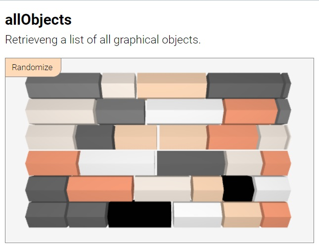
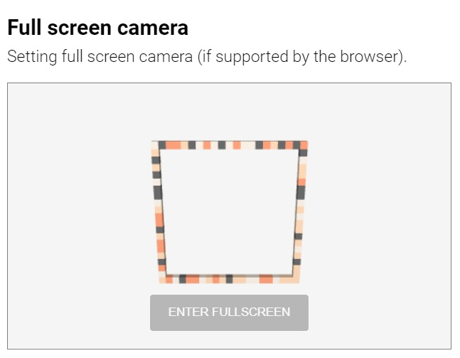
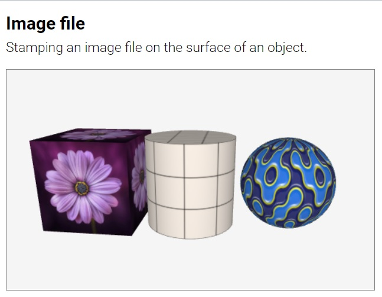
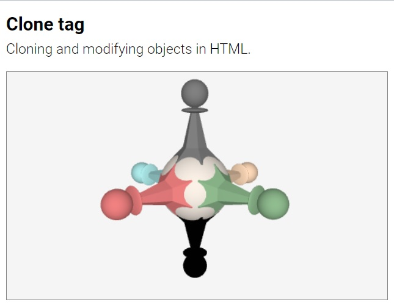
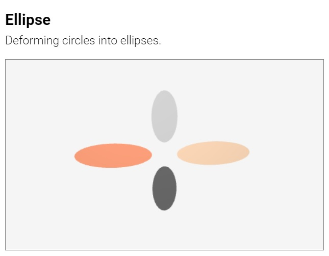
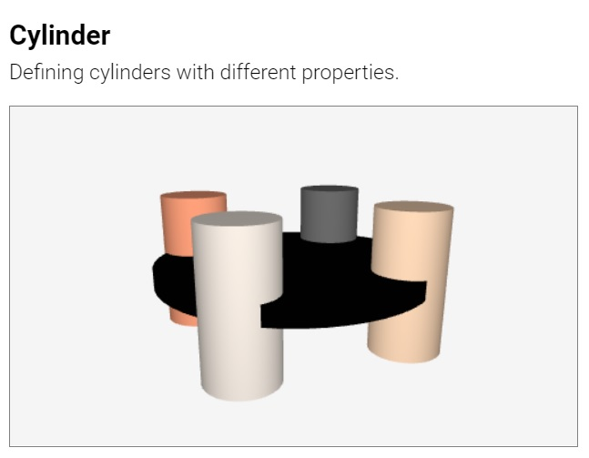
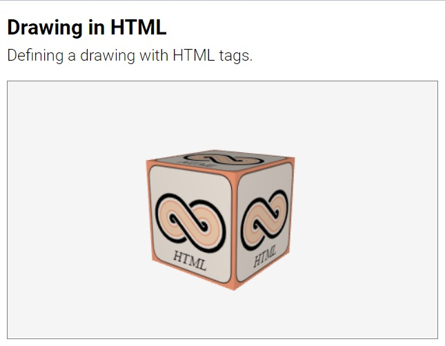
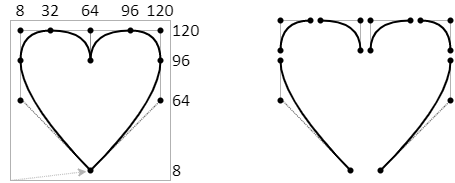
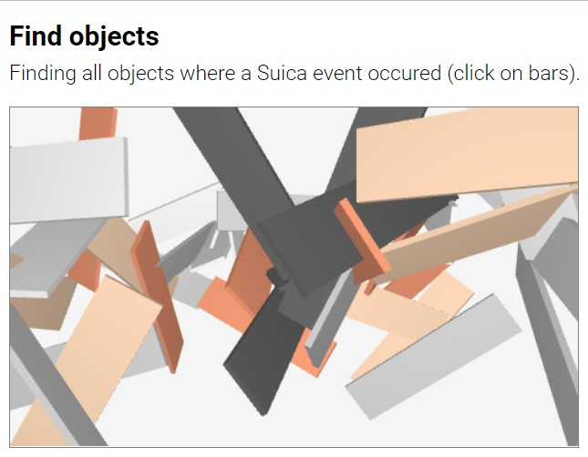

#  Suica User Guide

## Table of contents

- [About](#about) [<small> [Home](../README.md) | [License](../LICENSE) </small>] 
- [Suica canvas](#suica-canvas) [<small> [&lt;suica&gt;](#tag-suica) | [background](#background) | [orientation](#orientation) | [proactive](#proactive) </small>] 
    - [Helpers](#helpers) [<small> [oxyz](#oxyz) | [demo](#demo) | [allObjects](#allobjects) </small>]
    - [Cameras](#cameras) [<small> [perspective](#perspective-camera) | [orthographic](#orthographic-camera) | [full screen](#full-screen-camera) | [full window](#full-window-camera)  | [stereo](#stereo-camera) | [anaglyph](#anaglyph-camera) | [vr](#vr-camera) | [lookAt](#lookat) </small>] 
- [Objects](#objects)
    - [Definition](#definition) [<small> [position](#position-center-x-y-z) | [size](#size-size-width-height-depth) | [spin](#spin) | [color](#color) | [wireframe](#wireframe) | [image](#image) | [images](#images) | [clone](#clone)  | [style](#style) </small>] 
	- [Common 2D objects](#common-2d-objects) [<small> [point](#point) | [line](#line) | [square](#square) | [circle](#circle) | [polygon](#polygon) </small>]
	- [Common 3D objects](#common-3d-objects) [<small> [cube](#cube) | [sphere](#sphere) | [cylinder](#cylinder) | [prism](#prism) | [cone](#cone) | [pyramid](#pyramid) </small>]
	- [Advanced 3D objects](#advanced-3d-objects) [<small> [group](#group) </small>]
- [Drawings](#drawings) [<small> [drawing](#drawing) | [moveTo](#moveto) | [lineTo](#lineto) | [curveTo](#curveto) | [arc](#arc) | [stroke](#stroke) | [fill](#fill) | [fillText](#filltext) | [clear](#clear) </small>] 
- [Events](#events)
    - [Event workflow](#event-workflow) [<small> [listeners](#event-listeners) | [handlers](#event-handlers) </small> | [proactive](#proactive-events) </small> ]
	- [Event data](#event-data) [<small> [findPosition](#findposition) | [findObject](#findobject) | [findObjects](#findobjects) </small>]
- [Functions](#functions) [<small> [radians](#radians) | [degrees](#degrees) | [random](#random) | [style](#style-1) </small>]
- [References](#references) [<small> [reference](reference-guide.md) | [examples](examples.md) | [images](#available-images) | [libraries](#external-libraries) | [Q&A](#questions-and-answers) </small>] 


## About

**Suica is a JavaScript library** that provides a minimalistic approach to
mobile 3D graphics. Here is a minimal example of a rotating cube in the browser
(*click on the image to run the example*):

[<kbd></kbd>](../examples/minimal-example.html)

The complete code of this example is:

```html
<!DOCTYPE html>
<script src="suica.js"></script>
<suica>
	<cube>
	<demo>
</suica>
```


Suica is built upon these principles:

- **MINIMAL**<br>Less is more ([details](https://en.wikipedia.org/wiki/Minimalism_(computing))). 

- **DUAL**<br>Objects can be defined as HTML tags or in JS code, and their
properties are defined as tag attributes or function parameters. Using HTML is
a declarative create-and-forget approach, while JS is more suitable for scenes
that require continuous changes.

- **OPTIONAL**<br>All object properties are optional and may be skipped. Due to the
nature of the HTML syntax tag attributes may have any order. However, the order
of function parameters is fixed and only the trailing parameters may be skipped.

- **UNIFORM**<br>Properties are consistent across all objects that share
them. For example, object color is defined and changed in the same way for
points, cubes and spheres.

Browsers have a standard way of reaction on non-standard web pages (e.g. missing
closing tags, unregistered custom tags, etc). This is heavily used in all Suica
examples. Tools that validate HTML pages may complain about Suica HTML code.

_**Note.** Three.js and other libraries are included in this repository to safeguard
against incompatibilities with future versions. They are not a part of Suica._


## Suica canvas

Suica is distributed as `suica.js` or `suica.min.js` file and is loaded via the
`<script>` tag. Once loaded, the library will look for HTML tags `<suica>` and
use them as drawing canvases for 3D graphics. Suica does not use JS modules in
order to allow easy local development.


### Tag &lt;suica&gt;

Tag. Defines a 3D drawing canvas. `<suica>` is the main Suica tag is . All other
Suica-specific HTML tags are recognized only if used between `<suica>` and
`</suica>`

```html
<suica>
   <!-- all other Suica tags appear here-->
</suica>
```

The size of the canvas is set via attributes `width` and `height`. Sizes are
measured in pixels. The default size is 500&times;300 pixels. Alternatively,
sizes can be set as CSS properties (either inlined or not), which may use any
CSS unit.

Example of creating drawing canvases with different sizes:

```html
<suica width="400" height="300">
<suica style="width:15em; height:300px;">
```
[<kbd></kbd>](../examples/tag-suica.html)

The orientation of the coordinate system is set via attribute `orientation`.
More information is available in section [Coordinate system](#coordinate-system).


### Background

Property and command. Defines the background color of the
Suica canvas. It can be set as HTML attribute, CSS style (both inlined and
non-inlined), HTML tag and JS function. By default the background color is
[white smoke](https://www.color-hex.com/color/f5f5f5).

```html
HTML/CSS:
<suica background="linen">
<suica style="background: linen;">
<background color="linen">
```
```js
JS:
background( 'linen' );
```

[<kbd></kbd>](../examples/background.html)


### Orientation

Property. Controls how objects [positions](#position) and [sizes](#size) are
defined. Suica uses Cartesian 3D coordinate system. The tag `<suica>` accepts
attribute `orientation` with values `XYZ`, `XZY`, `YXZ`, `YZX`, `ZXY` and `ZYX`
(these are all possible permutations of the letters *X*, *Y* and *Z*. Each
orientation defines a coordinate system in the following manner:

- the first axis points to the right
- the second axis points upwards
- the third axis point towards the viewer


The default orientation in Suica is *XYZ*. All examples in this user guide use
this orientation, unless explicitely stated that other orientations are used.

```html
HTML:
<suica orientation="xyz">
```
[<kbd></kbd>](../examples/suica-orientation.html)


### Proactive

Property and command. Turns on proactive mode for mouse motion events. These
events occur when the mouse pointer is moved over an object, or when an object
is moved under the mouse pointer. For details see section [Proactive events](#proactive-events).


### Helpers

Helpers are functions that provide supplimentary functionality. They are
supposed to aid fast prototyping.


#### Oxyz

Command. Vizualizes the coordinate system. The coordinate system is an abstract
object and it has no graphical representation. The command `oxyz`, however,
visualizes the system as three segments with custom size and color. By default
the size is 30 and the color is [black](https://www.color-hex.com/color/000000).

```html
HTML:
<oxyz size="30" color="black">
```
```js
JS:
oxyz( 30, 'black' );
```

[<kbd></kbd>](../examples/oxyz.html)


### Demo

Command. Turns on *demo mode* &ndash; atomatic scene rotation. The
parameters define the viewpoint position as distance from the origin of the
the coordinate system and altitude. By default the distance is 100 and the
altitude is 30.

```html
HTML:
<demo distance="100" altitude="30">
```
```js
JS:
demo( 100, 30 );
```

[<kbd></kbd>](../examples/demo.html)


### allObjects

Function. Get a list of all graphical objects in a Suica canvas. The result of
the function is an array of these objects.

```js
JS:
list = allObjects( );
```

[<kbd></kbd>](../examples/allobjects.html)


### Cameras

A camera in Suica is a colelctive term that refers to how a scene is visualized
on the screen. A camera may define a projection (perspective or orthographic),
canvas span (normal span, full-window or full-screen) and stereoscopic mode
(mono, stereo, anaglyph and vr). Some cameras can be combined, others are
mutually exclusive. The following illustration shows available camera
combinations.


#### Perspective camera

Property and command. Sets a perspective camera projection. Objects further
away appear smaller. The perspective is defined by three numbers &ndash; *near*
distance , *far* distance  and *field of view* angle.

The *near* and *far* distances (by default 1 and 1000) define the depth span of
the viewing area. Objects and part of objects outside this area are not drawn.
If *near* and *far* are too close, this may truncate some objects; it they are
too far away, this may reduce the precision of overlapping distant objects.

The *field of view* angle is measured in degrees (by default 40&deg;) and
defines the vertical span of the viewing area. Smaller angles make objects
appear bigger and reduce the perspective effect; larger angles make objects
appear smaller and increases the perspective effect.

A valid perspective requires that 0<*near*<*far* and 0&deg;<*field of view*<180&deg;.

```html
HTML:
<suica perspective>
<suica perspective="1,1000,40">
```
```js
JS:
perspective( );
perspective( 1, 1000, 40 );
```

[<kbd></kbd>](../examples/camera-perspective.html)


#### Orthographic camera

Property and command. Sets an orthographic camera projection. Objects do not
change their visual size depending on how close or distant they are. The
orthographic camera is defined by two numbers &ndash; *near* and *far* distances.
By default they are 0 and 1000; and rhey define the depth span of the viewing
area. Objects and part of objects outside this area are not drawn. If *near* and
*far* are too close, this may truncate some objects; it they are too far away,
this may reduce the precision of overlapping distant objects.

A valid orthographic projection requires that 0&leq;*near*<*far*.

```html
HTML:
<suica orthographic>
<suica orthographic="0,1000">
```
```js
JS:
orthographic( );
orthographic( 0, 1000 );
```

[<kbd></kbd>](../examples/camera-orthographic.html)


#### Full screen camera

Property and command. Allows Suica to go into full screen mode. Using full
screen camera adds a button at the bottom of the canvas. If the button says
`[ENTER FULLSCREEN]` the user must click it to enter full screen mode. If full
screen is not supported, the button says `[FULLSCREEN NOT SUPPORTED]`. 

```html
HTML:
<suica fullscreen>
```
```js
JS:
fullScreen( );
```

[<kbd></kbd>](../examples/camera-fullscreen.html)

_**Note.** To exit full screen mode press `Esc` or follow the browser's
instructions._


#### Full window camera

Property and command. Allows Suica to go into full window mode. 

```html
HTML:
<suica fullwindow>
```
```js
JS:
fullWindow( );
```

[<kbd></kbd>](../examples/camera-fullwindow.html)


#### Stereo camera

Property and command. Sets a stereo camera projection. The scene is projected
twice &ndash; side-by-side, once for each of the eyes. The stereo effect is
controlled by *distance* parameter, which determines the simulated distance
between the eyes. By default it is 5. Values closer to 0 will decrease the
stereo effect.

Both positive and negative distances are allowed. Positive distances correspond
to wall-eyed viewing or vewing with a smartphone and low-end stereoscopic
glasses. Negative distances swap left and right images and correspond to
cross-eyed viewing.

```html
HTML:
<suica stereo>
<suica stereo="1">
<suica stereo="-1">
```
```js
JS:
stereo( );
stereo( 1 ); // wall-eyed
stereo( -1 ); // cross-eyed
```

[<kbd></kbd>](../examples/camera-stereo-wall-eyed.html)
[<kbd></kbd>](../examples/camera-stereo-cross-eyed.html)


#### Anaglyph camera

Property and command. Sets an [anaglyph](https://en.wikipedia.org/wiki/Anaglyph_3D)
camera projection. The scene is projected twice with different colors, suited for
red-cyan glasses. The anaglyph effect is controlled by *distance* parameter,
which determines the focal distance. By default it is 5. Smaller values will
increase the anaglyphic effect, larger values will decrease it.

```html
HTML:
<suica anaglyph>
<suica anaglyph="5">
```
```js
JS:
anaglyph( );
anaglyph( 5 );
```

[<kbd></kbd>](../examples/camera-anaglyph.html)


#### VR camera

Property and command. Allows Suica to go into emmersive 3D environment. Using a
VR camera adds a button at the bottom of the canvas. If the button says
`[ENTER VR]` the user must click it to enter VR mode. If VR is not supported,
the button says `[VR NOT SUPPORTED]`. 

```html
HTML:
<suica vr>
```
```js
JS:
vr( );
```

[<kbd></kbd>](../examples/camera-vr.html)

_**Note.** Currently the VR camera does not provide access to the controllers._

_**Note.** VR mode is not supported in local HTML files._


#### lookAt

Command. Defines the viewing position and orientation. LookAt takes three
parameters: *from* is a 3D location for the viewing position (i.e. the camera is
placed there), *to* is a 3D position of the viewing target (i.e. the came is
facing it), and *up* is a vector defining the head orientation (i.e. the
direction that is considered upwards). By default the target position is (0,0,0)
and the up direction corresponds to the up axis of the coordinate system.

```html
HTML:
<lookat from="100,10,50">
<lookat from="100,10,50" to="0,0,10" up="1,0,0">
```
```js
JS:
lookAt( [100,10,50] );
lookAt( [100,10,50], [0,0,10], [1,0,0] );
```

[<kbd></kbd>](../examples/lookat.html)

The command [demo](#demo) can be simulated and enriched by *lookAt* &ndash; i.e.
adding dynamic change of distance and elevation to the default rotation.

[<kbd></kbd>](../examples/lookat-demo.html)


To implement a navigation (walking or flying) in a 3D scene the viewing position
must be modified in the animation loop.

[<kbd></kbd>](../examples/lookat-navigation.html)
[<kbd></kbd>](../examples/lookat-navigation-vr.html)


## Objects

This section describes the graphical objects in Suica.


### Definition

In Suica object may be created as HTML tag or via JavaScript function. Each
object has properties, however, they are all optional. In HTML the properties
are provided as tag attributes in no specific order. In JavaScript the
properties are provided as function parameters and the order is fixed.

```html
HTML:
<object attribute1="value1" properties2="value2" ...>
```
```js
JS:
object( value1, value2, ... );
```

Objects with names are created as JavaScript variables. In HTML the name is
taken from the `id` attribute. 

```html
HTML:
<point id="p" center="25,0,15">
```
```js
JS:
p = point( [25,0,15] );
```

[<kbd></kbd>](../examples/object-html.html)
[<kbd></kbd>](../examples/object-js.html)

Most Suica objects share the same basic properties, like position, orientation,
size, color and so on. Some objects have specific properties.

Properties related to events are described in section [Events](#events).


#### Position (center, x, y, z)

Properties. Define the position of a Suica object in 3D space. Propery `center`
is an array of three numbers [*x*, *y*, *z*] for the *x*, *y* and *z*
coordinates (in this order). The actual visual position depends on the
orientation of the (coordinate system](#coordinate-system). All coordinates are
optional. Default values are 0.

```html
HTML:
<point center="25,0,15">
```
```js
JS:
point( [25,0,15] );

p = point( );
p.center = [25, 0, 15];
```

There are alternative properties `x`, `y` and `z` that provide individual access
to the elements of the position. 

```html
HTML:
<point x="25">
```
```js
JS:
p = point( );
p.x = 25;
```

_**Note**: The object [line](#line) is an exception. It has `from` as synonym of
`center`, and it has no `x`, `y` and `z`._

An object as be passed as a center of another object. In this case its center
is used. 

```html
HTML:
<cubeFrame id="a" x="-20">
<cubeFrame id="b" x="20">
<line from="a" to="b">
```
```js
JS:
a = cubeFrame( [20,0,0] );
b = cubeFrame( [-20,0,0] );
line( a, b );
```
[<kbd></kbd>](../examples/object-as-position.html)

#### Size (size, width, height, depth)

Properties. The size of a Suica object in 3D space is maintained via the
property `size` that defines how big is the objects along its dimensions. If
size is a single number, that the object if uniformly big. If object's size
varies than the property is an array of three numbers for object's *width*,
*height* and *depth*. The order *width*, *height* and *depth* is fixed and does
not depend on the [orientation of the coordinate system](#coordinate-system).
Thus height corresponds to the axis that is upwards.


Flat objects like squares and circles have no depth.

_**Note <small><sup>1</sup></small>**: Omitting the depth property of a 3D object makes its depth the same
as its width. This maintains uniform horizontal size._

_**Note <small><sup>2</sup></small>**: The object [line](#line) has no size,
width, height and depth._

_**Note <small><sup>3</sup></small>**: The object [group](#group) uses size as
a scale factor, npt as an actual size._

```html
HTML:
<cube size="25">
<cube size="25,10">
<cube size="25,10,15">
```
```js
JS:
cube( [0,0,0], 25 );
cube( [0,0,0], [25,10] );
cube( [0,0,0], [25,10,15] );
```


[<kbd></kbd>](../examples/sizes.html)
[<kbd></kbd>](../examples/sizes-orientation.html)


Alternative access to the size is with the properties `width`, `height` and
`depth`. 

```html
<cube size="3,15,40">
<cube width="3" height="15" depth="40">
```
```js
cube( [0,0,0], [3,15,40] );
a = cube( [0,0,0] );
a.width = 3;
a.height = 15;
a.depth = 40;
```

#### Spin

Property. Defines the rotation of an object in respect to its own axes. The
value of `spin` is either an angle or an array of up to three angles [`spinH`, `spinV`, `spinT`].
All angles are measured in degrees.

Angle *spinH* (*H* from *horizontal*) defines horizontal rotation around the
global vertical axis. Angle *spinV* (*V* from *vertical*) define vertical
rotation away from the vertical axis. Angle *spinT* (*T* from *torsion*) defines
rotation of the object around it own vertical axis..


The spin is independent on the orientation of the coordinate system. However,
due to the default orientation of flat and non-flat objects, orientation along
coordinate system axes differ. For example, if a square has a spin [&alpha;, &beta;, &gamma;],
a pyramid on that square should have spin [&alpha;, &beta;+90, &gamma;].

[<kbd></kbd>](../examples/spin.html)
[<kbd></kbd>](../examples/spin-angles.html)

[<kbd></kbd>](../examples/spin-orientation.html)


#### Color

Property. Defines the color of a graphical object. Color in Suica can be
expressed in a variety of ways. The [RGB scheme](https://www.w3schools.com/colors/colors_rgb.asp) represents colors as three
components *red*, *green* and *blue*, while the
[HSL scheme](https://www.w3schools.com/colors/colors_hsl.asp) components are
*hue*, *saturation* and *lightness*.


| Context | Descriptive<br>name | Hexadecimal<br>number | Normalized<br>RGB array | RGB<br>function | HSL<br>function |
|---|:---:|:---:|:---:|:---:|:---:|
| | <small>[List of color names](https://www.w3schools.com/colors/colors_names.asp)</small>| *RRGGBB*<br><small>*RR*,*GG*,*BB* &isin; [00,FF]</small> | *r*,*g*,*b*<br><small>*r*,*g*,*b* &isin; [0,1]</small> | rgb(*r*,*g*,*b*)<br><small>*r*,*g*,*b* &isin; [0,255] | hsl(*h*,*s*,*l*)<br><small>*h* &isin; [0,360], *s*,*l* &isin; [0,100]</small> |
| Tag<br>attribute | [crimson](https://www.color-name.com/crimson.color) | 0xDC143C | 0.86,&nbsp;0.08,&nbsp;0.24 | rgb(&nbsp;220,&nbsp;20,&nbsp;60&nbsp;) | hsl(&nbsp;348,&nbsp;91,&nbsp;86&nbsp;) |
| CSS<br>property | crimson | #DC143C | | rgb( 220, 20, 60 ) | hsl( 348, 91, 86 ) |
| JS<br>code | "crimson" | 0xDC143C | [0.86,&nbsp;0.08,&nbsp;0.24] | rgb(&nbsp;220,&nbsp;20,&nbsp;60) | hsl(&nbsp;348,&nbsp;91,&nbsp;86) |

_**Note**: Setting the color of object [group](#group) sets it to all its objects._


#### Wireframe

Property. Defines whether to visualize objects as wireframes. By default objects
in Suica are drawn with solid surfaces. The property `wireframe` is used to
change switch surface visualization into wireframe mode &ndash; i.e. only edges
are drawn.

To turn on wireframe mode set the property to `true`, `yes` or `1`. When used as
HTML attributes, the value may be omitted. To turn off wireframe mode set the
property to `false`, `no` or `0`.

```html
HTML:
<cube size="30" wireframe>
<cube size="30" wireframe="true">
```
```js
JS:
a = cube( [0,0,0], 30);
a.wireframe = true;
```

_**Note**. Not all objects have wireframe mode._


#### Image

Property. Decorates object surface with an image. Images can be stamped onto
Suica object via the property `image`. The property accepts a drawing or a
texture image. For more information of how to generate a drawing instead of
loading an image file see section [Drawings](#drawings). 

```html
HTML:
<cube id="a" image="https://boytchev.github.io/suica/textures/flower.jpg">
```
```js
JS:
a.image = 'https://boytchev.github.io/suica/textures/flower.jpg';
a.image = image( 'https://boytchev.github.io/suica/textures/flower.jpg' );
```

[<kbd></kbd>](../examples/image-file.html)
[<kbd></kbd>](../examples/image-datauri.html)


When an object has both `color` and `image`, the resulting color is the product
of the RGB normalized colors (i.e. components r,g,b&isin;[0,1]) of the color and
the image pixels. If the object color is [R,G,B] and the image color is [r,g,b],
then the combined color is [R,G,B]&times;[r,g,b] = [R&times;r,G&times;g,B&times;b].
The following tabel shows some combinations of colors:

| Object color | Image color | Resulting color |
|---|---|---|
| White<br><small>[1,1,1]</small> | Any<br><small>[r,g,b]</small> | Image color<br><small>[1,1,1]&times;[r,g,b] = [r,g,b]</small> |
| Black<br><small>[0,0,0]</small> | Any<br><small>[r,g,b]</small> | Black<br><small>[0,0,0]&times;[r,g,b] = [0,0,0]</small> |
| Any<br><small>[R,G,B]</small> | White<br><small>[1,1,1]</small> | Object color<br><small>[R,G,B]&times;[1,1,1] = [R,G,B]</small> |
| Any<br><small>[R,G,B]</small> | Black<br><small>[0,0,0]</small> | Black<br><small>[R,G,B]&times;[0,0,0] = [0,0,0]</small> |
| Red<br><small>[R,0,0]</small> | Any<br><small>[r,g,b]</small> | Only the red component of the image color<br><small>[1,0,0]&times;[r,g,b] = [r,0,0]</small> |
| Yellow<br><small>[1,1,0]</small> | Cyan<br><small>[0,1,1]</small> | Green<br><small>[1,1,0]&times;[0,1,1] = [0,1,0]</small> |

Due to a security mechanism in browsers &ndash; [Same-origin policy](https://developer.mozilla.org/en-US/docs/Web/Security/Same-origin_policy)
(SOP) and [Cross-origin resource sharing](https://developer.mozilla.org/en-US/docs/Glossary/CORS) (CORS),
a file can be used as image only if it is located in the same online domain;
or the image host allows cross-origin requests. An image file can be used in
these cases:

- the image file is in the same domain as the Suica file and is accessed by
`http://` or `https://` protocols
- the image file is hosted on a server that allows anonymous access to images
- the image file is accessed through a [local host](https://en.wikipedia.org/wiki/Localhost) from `http://localhost`
- the image is encoded in the URL itself as [Data URI/URL](https://developer.mozilla.org/en-US/docs/Web/HTTP/Basics_of_HTTP/Data_URIs) from `data:` scheme
- CORS is disabled in the browser configuration (not recommended)
- an old SOP-less and CORS-less browser is used (not recommended)

For online tools to generate Data URI from images see section
[External libraries](#external-libraries).

#### Images

Property. Defines the number of copies of a drawing or image across the surface
of an object. For more information of how to generate a drawing or use an image
see section [Drawings](#idrawings).

If the value of *images* is a number, it defines the number of copies in both
horizontal and vertical direction. If the value is an array, the first element
if for the horizontal direction and the second is for the vertical direction.

```html
HTML:
<cube id="a" images="2">
<cube id="b" images="2,3">
```
```js
JS:
a.images = 2;
a.images = [2,3];
```

[<kbd></kbd>](../examples/images.html)


#### Clone

Readonly property. Generates a clone of the object. Whenever the value of `clone`
is retrieved, it is a clone of the object. Cloning is used to generate objects
from a single object-template.

```html
HTML:
<cube id="a" size="15">
<clone id="b" src="a">
```
```js
JS:
a = cube( [0,0,0], 25 );
b = a.clone;
```

[<kbd></kbd>](../examples/clone.html)
[<kbd></kbd>](../examples/clone-tag.html)

_**Note**: Cloning an object [group](#group) also clones all its objects._


#### Style

Method. Sets a group of properties of an object. The properties are defined as a
set of *name:value* pairs. New, custom user-defined properties are allowed. 
As `style` return the same object, styling can be chained.

```js
JS:
sphere().style( {x:15, size:20, color:'peachpuff'} );
sphere().style( {x:15} ).style( {size:20} ).style( {color:'peachpuff'} );
```

[<kbd></kbd>](../examples/style.html)

_**Note**. Style can also be used as a [function](#style-1)._


## Common 2D objects

The common 2D objects represents flat 1D and 2D shapes, like points, squares,
circles and so on. Their constructions requires to set just a few properties.
Some of the objects have framed variants, where only their edges are drawn with
lines.

_**Note:** The width of the lines is 1 pixel and this limitation is set in the
underlying technology._


### Point

Object. Represents a point. Its properties are `center` (or `x`, `y` and `z`),
`size`, `color`, `image`, `images` and `clone`. By default a point is drawn as a small cirlce, but
it can be changed with custom [drawing](#images-and-drawings).

```html
HTML:
<point center="25,0,15">
<point center="25,0,15" size="10" color="crimson">
```
```js
JS:
point( [25,0,15] );
point( [25,0,15], 10, 'crimson' );
```

[<kbd></kbd>](../examples/point.html)&emsp;[<kbd></kbd>](../examples/point-cloud.html)


### Line

Object. Represents a straight segment. Its properties are `center` (or `from`),
`to`, `color`, `image`, `images` and `clone`. The properties `center` and `from` are synonyms and
they set the starting point of the segment, while `to` sets the ending point. By
default a line is drawn as a solid line, but it can be changed with custom
[drawing](#images-and-drawings).

```html
HTML:
<line center="25,0,15" to="100,-20,35">
<line from="25,0,15" to="100,-20,35">
```
```js
JS:
line( [25,0,15], [100,-20,35] );
point( [25,0,15], [100,-20,35], 'red' );
```

[<kbd></kbd>](../examples/line.html)

_**Note**: Lines have no properties x, y, z, size, width, height and depth._


### Square

Object. Represents a regular square or a rectangle. Its properties are
`center` (or `x`, `y` and `z`), `size` (or `width` and `height`), `color`, `spin`, 
`wireframe`, `image`, `images` and `clone`. 

```html
HTML:
<square center="25,0,15">
<square size="10" color="crimson">
```
```js
JS:
square( [25,0,15] );
square( [0,0,0], 10, 'crimson' );
```

[<kbd></kbd>](../examples/square.html)
[<kbd></kbd>](../examples/square-rectangle.html)


### Circle

Object. Represents a circle or an ellipse. Its properties are `center` (or `x`,
`y` and `z`), `size` (or `width` and `height`), `color`, `spin`, `wireframe`,
`image`, `images` and `clone`. 

```html
HTML:
<circle center="25,0,15">
<circle size="10" color="crimson">
```
```js
JS:
circle( [25,0,15] );
circle( [0,0,0], 10, 'crimson' );
```

[<kbd></kbd>](../examples/circle.html)
[<kbd></kbd>](../examples/circle-ellipse.html)


### Polygon

Object. Represents a regular polygon or an elliptical polygon. Its properties
are `count`, `center` (or `x`, `y` and `z`), `size` (or `width` and `height`),
`color`, `spin`, `wireframe`, `image`, `images` and `clone`. The property `count` defines
the number of sides of the polygon.

```html
HTML:
<polygon count="3" center="25,0,15">
<polygon count="5" size="10" color="crimson">
```
```js
JS:
polygon( 3, [25,0,15] ); // triangle
polygon( 5, [0,0,0], 10, 'crimson' ); // pentagon
```

[<kbd></kbd>](../examples/polygon.html)

_**Note:** Properties size, width and height refer to the polygon circumscribed
circle, rather than the polygon itself._


## Common 3D objects

The common 3D objects represents shapes, like cubes, spheres, and so on. Their
constructions requires to set just a few properties. Some of the objects have
framed variants, where only their edges are drawn with lines.

_**Note:** The width of the lines is 1 pixel and this limitation is set in the
underlying technology._

### Cube

Object. Represents a regular cube or a deformed cube (called *cuboid*).
Its properties are `center` (or `x`, `y` and `z`), `size` (or `width`, `height`
and `depth`), `color`, `spin`, `wireframe`, `image`, `images` and `clone`. 

```html
HTML:
<cube center="25,0,15">
<cube size="10" color="crimson">
```
```js
JS:
cube( [25,0,15] );
cube( [0,0,0], 10, 'crimson' );
```

[<kbd></kbd>](../examples/cube.html)
[<kbd></kbd>](../examples/cube-cuboid.html)


### Sphere

Object. Represents a regular sphere or a deformed sphere (spheroid). Its
properties are `center` (or `x`, `y` and `z`), `size` (or `width`, `height`
and `depth`), `color`, `spin`, `image`, `images` and `clone`. 

```html
HTML:
<sphere center="25,0,15">
<sphere size="10" color="crimson">
```
```js
JS:
sphere( [25,0,15] );
sphere( [0,0,0], 10, 'crimson' );
```

[<kbd></kbd>](../examples/sphere.html)
[<kbd></kbd>](../examples/sphere-spheroid.html)


### Cylinder

Object. Represents a regular cylinder or a cylindroid (an elliptical cylinder).
Its properties are `center` (or `x`, `y` and `z`), `size` (or `width`, `height`
and `depth`), `color`, `spin`, `image`, `images` and `clone`. 

```html
HTML:
<cylinder center="25,0,15">
<cylinder size="10" color="crimson">
```
```js
JS:
cylinder( [25,0,15] );
cylinder( [0,0,0], 10, 'crimson' );
```

[<kbd></kbd>](../examples/cylinder.html)
[<kbd></kbd>](../examples/cylinder-cylindroid.html)


### Prism

Object. Represents a regular prism or prismoid (an elliptical prism). Its
properties are `count`, `center` (or `x`, `y` and `z`), `size` (or `width`,
`height` and `depth`), `color`, `spin`, `wireframe`, `image`, `images` and `clone`. The
property `count` defines the number of sides of the prism.

```html
HTML:
<prism count="6" center="25,0,15">
<prism count="3" size="10" color="crimson">
```
```js
JS:
prism( 6, [25,0,15] );
prism( 3, [0,0,0], 10, 'crimson' );
```

[<kbd></kbd>](../examples/prism.html)


### Cone

Object. Represents a regular cone or conoid (an elliptical cone). Its properties
are `center` (or `x`, `y` and `z`), `size` (or `width`, `height` and `depth`),
`color`, `spin`, `image`, `images` and `clone`. 

```html
HTML:
<cone center="25,0,15">
<cone size="10" color="crimson">
```
```js
JS:
cone( [25,0,15] );
cone( [0,0,0], 10, 'crimson' );
```

[<kbd></kbd>](../examples/cone.html)
[<kbd></kbd>](../examples/cone-conoid.html)


### Pyramid

Object. Represents a regular pyramid or a pyramoid (an elliptical pyramid). Its
properties are `count`, `center` (or `x`, `y` and `z`), `size` (or `width`,
`height` and `depth`), `color`, `spin`, `wireframe`, `image`, `images` and `clone`. The
property `count` defines the number of sides of the pyramid.

```html
HTML:
<pyramid count="6" center="25,0,15">
<pyramid count="3" size="10" color="crimson">
```
```js
JS:
pyramid( 6, [25,0,15] );
pyramid( 3, [0,0,0], 10, 'crimson' );
```

[<kbd></kbd>](../examples/pyramid.html)


## Advanced 3D objects

The advanced 3D objects are constructed from other objects.


### Group

Object. Represents a collection of objects grouped into a single object. A group
can be positioned, scaled, rotated and colored as other objects. Its properties
are `center` (or `x`, `y` and `z`), `size` (or `width`, `height` and `depth`),
`color`, `spin` and `clone`; it has method `add`.

```html
HTML:
<group center="0,-10,0">
   <sphere y="25" size="10">
   <cone size="12,25">
</group>
```
```js
JS:
group(
   sphere( [0,25,0], 10 ),
   cone( [0,0,0], [12,25] )
);
```

[<kbd></kbd>](../examples/group.html)
[<kbd></kbd>](../examples/group-tag.html)

A group is a special objects, and some aspects of group management are:
- A group has own center, size and spin. Values of `size` of a group are scale
factors, not sizes. Centers and spins of objects in a group are relative to the
group's center and spin.
- Group objects are defined between `<group>` and `</group>` tags or as
parameters to `group(...)`. A group can be extended with new objects with
`add(...)`.
- Cloning a group will also clone all its objects, setting `color` of a group
sets it to all its objects overwriting their individual colors.


## Drawings

Drawings are 2D images generated in Suica (instead of being loaded from [JPEG or
PNG files](#image)) that can be stamped onto 2D and 3D objects. Drawings can be
scaled by [images](#images) property.

Suica drawings are based on [Canvas2D](https://developer.mozilla.org/en-US/docs/Web/API/CanvasRenderingContext2D)
and are made of lines and filled areas. A virtual pen defines a path on the canvas.
This path can be *stroked* by drawing a line over the path; or it contents can
be *filled* with a color.

A drawing can be constructed in HTML or in JavaScript. Modifications of existing
drawing can be done only in JavaScript.

[<kbd></kbd>](../examples/drawing-html.html)
[<kbd></kbd>](../examples/drawing-js.html)


#### Drawing

Command. Defines a 2D drawing canvas. Parameters are `width` and `height` for
the canvas size in pixels; and `color` for the initial background colour. By
default the size is 32&times;32 pixels. If *height* is not provided, it is
assumed to be the same as the *width*. If `colour` is set, the background of the
canvas is filled with this color; otherwise it is kept *transparent*.

The coordinate system of a drawing has origin (0,0) at the bottom left side of
the canvas. The X axis extends to the right, Y extends to the top.


```html
HTML:
<drawing id="pic">
<drawing id="pic" size="32,48">
<drawing id="pic" width="32" height="48">
```
```js
JS:
var a = drawing( 32 );
var b = drawing( 32, 48, 'crimson' );
```

[<kbd></kbd>](../examples/drawing-transparent.html)
[<kbd></kbd>](../examples/drawing-opaque.html)

When a drawing canvas is initialized and stored in a variable, this variable has
commands for drawing on the canvas.

Drawings can be applied to points and lines. For points the drawings act like
sprites &ndash; they are not subject to orientation and they always face the
screen. For lines drawings are used to created dot-and-dash patterns.

[<kbd></kbd>](../examples/drawing-custom-point.html)
[<kbd></kbd>](../examples/drawing-dotted-lines.html)

A drawing is applied to an object via the [image](#image) property and can be
updated both before and after this assignment. The scale of
a drawing is managed by the [images](#images) property. 

[<kbd></kbd>](../examples/dynamic-drawing.html)

#### MoveTo

Command. Sets the position of the virtual. This command moves the virtual
pen from its current location to (`x`,`y`) without generating a path. This is
used to set the starting point of a line or to start a new line, that is not
connected to the current line. By default the both *x* and *y* are 0.


```html
HTML:
<moveTo center="10,0">
<moveTo x="10" y="0">
```
```js
JS:
moveTo( 10, 0 );
```
	
#### LineTo

Command. Adds a line segment to the path. This command moves the virtual pen
along a straight line from its current location to (`x`,`y`) and adds that line
to the current path. This is used to define straignt line sections of the path.
By default the both *x* and *y* are 0.

```html
HTML:
<lineTo center="10,0">
<lineTo x="10" y="0">
```
```js
JS:
lineTo( 10, 0 );
```

[<kbd></kbd>](../examples/drawing-moveto-lineto.html)
		
#### CurveTo

Command. Adds a curved segment to the path. This command moves the virtual pen
along a curved line from its current location to (`x`,`y`) and adds that curve
to the current path. The line is quadratic curve and is attracted towards point
(`mx`, `my`), which is defined by the first pair of parameters of *curveTo*.
By default all coordinates *mx*, *my*, *x* and *y* are 0.


```html
HTML:
<curveTo m="10,0" center="20,15">
<curveTo mx="10" my="0" x="20" y="15">
```
```js
JS:
curveTo( 10, 0, 20, 15 );
```

[<kbd></kbd>](../examples/drawing-curveto.html)

A more complex curve can be constructed by joining individual curves. The shape
of a heart, for examples, can be constructed by 6 connected curves.



[<kbd></kbd>](../examples/drawing-heart-point.html)


#### Arc

Command. Adds a circle оr a circular arc to the path. This command creates an
arc from a circle with center (`x`,`y`) and `radius`. The arc stars from angle
`from` and ends at angle `to`. The last parameter is direction of drawing &ndash;
either clockwise or counter-clockwise. Coordinates and radius are measured in
pixels, angles are measured in degrees. If the angles are not provided, a full
circle is generated. 

```html
HTML:
<arc center="10,0" radius="5">
<arc x="10" y="0" radius="5" from="0" to="180" ccw>
```
```js
JS:
arc( 10, 0, 5);
arc( 10, 0, 5, 0, 180, false);
```

The coordinate system of a drawing has origin (0,0) at the bottom left side of
the canvas. The X axis extends to the right, Y extends to the top.


[<kbd></kbd>](../examples/drawing-arc.html)

In HTML the direction of drawing is set by attributes `cw` or `ccw` which values
are either *true* or *false*. If the attributes have no values, they are assumed
to be *true*. The following commanda are equivalent:

```html
HTML:
<arc x="10" y="0" radius="5" cw>
<arc x="10" y="0" radius="5" cw="true">
<arc x="10" y="0" radius="5" ccw="false">
```

In JS the direction of drawing is set by the last 6th parameter of *arc* that
corresponds to *cw* and by default is *true*.

#### Stroke

Command. Draws a line over the current path. The line has given `color` and 
`width`. If the `close` parameter is *true*, then the end of the path is
conneted to the beginning of the path. A *stroke* immediately after another
*stroke* or *fill* will reuse the same path.

```html
HTML:
<stroke color="crimson">
<stroke color="crimson" width="10" close>
<stroke color="crimson" width="10" close="true">
```
```js
JS:
stroke( 'crimson' );
stroke( 'crimson', 10, true );
```

[<kbd></kbd>](../examples/drawing-stroke.html)
	
	
#### Fill

Command. Fills the area defined by a path. The area is filled with the given
`color`.  A *fill* immediately after another *stroke* or *fill* will reuse the
same path. 

```html
HTML:
<fill color="crimson">
```
```js
JS:
fill( 'crimson' );
```
	
[<kbd></kbd>](../examples/drawing-fill.html)
[<kbd></kbd>](../examples/drawing-fill-and-stroke.html)


#### FillText

Command. Draws a text. The `text` is drawn at given coordinates (`x`,`y`) with
given `color` and `font` style. The *font* parameter is a string with a
[CSS font](https://developer.mozilla.org/en-US/docs/Web/CSS/font) description.

```html
HTML:
<fillText center="10,5" text="Sample text" color="crimson" font="bold 20px Courier">
```
```js
JS:
fillText( 10, 5, 'Sample text', 'crimson', 'bold 20px Courier' );
```	
	
[<kbd></kbd>](../examples/drawing-filltext.html)
	
	
#### Clear

Command. Clears a drawing canvas. The drawing canvas is filled with the given
`color` if it is provided, or is cleared to transparent if it is not provided.
Next commands after *clear* start a new path.

```html
HTML:
<clear>
<clear color="crimson">
<clear background="crimson">
```
```js
JS:
clear( 'crimson' );
```
	
[<kbd></kbd>](../examples/drawing-clear.html)
	
	


## Events

Events are something that happens 'outside' a Suica program at unknown moment
of time. Examples of events are when the user clicks on an object with the mouse.
Suica reimplements a part of the web page events system	onto Suica objects.

Suica supports *motion events*, *click events* and *time events*.

- Motion events are `onМouseEnter`, `onМouseMove` and `onМouseLeave`. They occur
when the mouse enters, moves over or leaves Suica canvas or Suica object.


- Click events are `onMouseDown`, `onMouseUp` and `onClick`. They occur when a
mouse button is pressed, released or clicked over Suica canvas or Suica object.


- Time event is `onTime`. It occurs when the browser is ready for a new frame.


### Event workflow

An event is managed by two elements:

- **Event listener**: A declaration that an object is interested in specific event
- **Event handler**: A user-defind function that is activated when an event occurs

Events that are not listened to, are ignored.


#### Event listeners

In Suica event listeners can be set for Suica canvas and for individual Suica
objects. For example, a canvas onClick event occurs when the user clicks
anywhere in the canvas, while an object onClick event occurs when the user
clicks on the image of the object. Similarily, a canvas *onMouseEnter* occurs
when the mouse cursor enters the canvas, while an object *onMouseEnter* occurs
when the cursors enters the boundary of the object's image.

In HTML event listeners are set as attributes. The name of the attribute is
the name of the event, which is case-insensitive and it can be with or without
*on-* prefix. The value of the attribute is the name of the event handler
function.

```html
HTML:
<suica click="eventHandler">...</suica>
<cube onClick="eventHandler">...</suica>
```

In JavaScript event listeners ar set by [addEventListener](#addeventlistener).
The name of the event is case-insensitive and it can be with or without
*on-* prefix. The event handler is a function name without parentheses.

```js
JS:
suica.addEventListener( 'click', eventHandler );
cube.addEventListener( 'onClick', eventHandler );
```

In JavaScript an event listener can be set directly, but the event name must be
*on-* prefixed and lowercased.

```js
JS:
// click, Click and onClick will not work
suica.onclick = eventHandler;
cube.onclick = eventHandler;
```

Event listeners are removed by [removeEventListener](#removeeventlistener) or by
assigning a null value.

```js
JS:
suica.removeEventListener( 'click' );
cube.onclick = null;
```


#### Event handlers

In Suica event handlers are user functions that are activated from listeners
when a specific event occurs. Often the name of the event handler is the same as
the name of the corresponding event, although this is not enforced.

For mouse events the optional parameter *event* contains information about the
event. It is used by [findPosition](#findposition), [findObject](#findobject)
and [findObjects](#findobjects).


```js
JS:
function onMouseMove( event )
{
	...
}
```

[<kbd></kbd>](../examples/events-suica-enter.html)


For time events the optional parameters *t* and *dT* are elapsed times since the
start of Suica and since the previous frame. Both are measured in seconds..


```js
JS:
function onTime( t, dT )
{
	...
}
```

[<kbd></kbd>](../examples/events-ontime.html)


#### addEventListener

Function. Activates an event listener to specific `event` that triggers an
`eventHandler`. *addEventListener* mimics the [DOM](https://developer.mozilla.org/en-US/docs/Web/API/Document_Object_Model)'s
[addEventListener](https://developer.mozilla.org/en-US/docs/Web/API/EventTarget/addEventListener)
which is used to set event listeners for HTML elements in a web page. However,
there are several differences:

- The *event* is the name of the event with or without `on` prefix,
thus `mouseMove` and `onMouseMove` are considered the same event
- Only one *eventHandler* per event per object can be set, i.e. setting another
event handler will replace the previous one
- There is no third parameter with event options

```js
JS:
s.addEventListener( 'mouseMove', eventHandler );
s.addEventListener( 'onMouseMove', eventHandler );
```

[<kbd></kbd>](../examples/events-event-listener.html)


#### removeEventListener

Function. Removes an event listener of specific `event`. *removeEventListener*
mimics the [DOM](https://developer.mozilla.org/en-US/docs/Web/API/Document_Object_Model)'s
[removeEventListener](https://developer.mozilla.org/en-US/docs/Web/API/EventTarget/removeEventListener)
which is used to remove event listeners for HTML elements in a web page. However,
there are several differences:

- The *event* is the name of the event with or without `on` prefix,
thus `mouseMove` and `onMouseMove` are considered the same event
- There is no second and third parameter

```js
JS:
s.removeEventListener( 'mouseMove' );
s.removeEventListener( 'onMouseMove' );
```

[<kbd></kbd>](../examples/events-one-time-listener.html)


#### Proactive events

Suica supports proactive mode for mouse motion events `onМouseEnter`,
`onМouseMove` and `onМouseLeave`. This mode can be turned on with HTML attribute,
HTML tag or JavaScript command.

```html
HTML:
<suica proactive>
<proactive>
```
```js
JS:
proactive( );
```

Normal mouse motion events only occur when the mouse is moved into, over or out
of an object. In proactive mode these events are triggered even when the mouse
is stationary, but an object moves into, under or out of its pointer.

[<kbd></kbd>](../examples/events-proactive.html)

Proactive mode is resource consuming, because for every frame objects in Suica
are tested against the mouse position. When a proactive event occurs Suica
executes the assigned event handler and passes the latest mouse event structure
as a parameter to the handler.


### Event data

An event handler can retrieve additional information about an event.

As a function a mouse event handler has one parameter (typically called *event*)
that contains information about the event itself. For mouse events this
parameter is [MouseEvent](https://developer.mozilla.org/en-US/docs/Web/API/MouseEvent).
It contains data about event time and place, mouse buttons, pressed keys, etc.
These data can be used to implement drag-and-drop operations.

Each event handler is run from within the object that reacyed to the event.
The system variable `this` in the event handler points to this object. This is
used to identify the object when several objects share the same event handler.

Additional Suica-specific data can be extracted from the event by 
[findPosition](#findposition), [findObject](#findobject) and [findObjects](#findobjects).


```js
JS:
function onMouseMove( event )
{
   if( event.ctrlKey )
   {
      this.center = [0,0,0];
      this.color = 'crimson';
   }
}
```

[<kbd></kbd>](../examples/events-drag-and-drop.html)
[<kbd></kbd>](../examples/events-point-and-spin.html)

_**Note**: Parameter *event* is not passed to onTime event handlers, instead *t* and
*dT* are passed to them._


#### findPosition

Function. Finds the position of an event. The position is measured in pixels
and is relative to the center of the Suica canvas. The function requires the
*event* parameter of the event handler. The result is an array [*x*,*y*] of the
position. *findPosition* is typically used with events of the Suica canvas.

```js
JS:
function onMouseMove( event )
{
	var pos = findPosition( event );
}
```

[<kbd></kbd>](../examples/events-find-position.html)

The returned position coincides with the Suica coordinate system when
[orthographic camera](#orthographic-camera) is used and the view point is not
changed with [demo](#demo) or [lookAt](#lookat).


#### findObject

Function. Finds the Suica object where an event occured. The function requires
the *event* parameter of the event handler. The result is the closest Suica
object that is at the position of the event, or `null` if no such object exists.
*findObject* is typically used with events of the Suica canvas.

```js
JS:
function onMouseMove( event )
{
	var object = findObject( event );
}
```

[<kbd></kbd>](../examples/events-find-object.html)


#### findObjects

Function. Finds all Suica objects where an event occured. The function requires
the *event* parameter of the event handler. The result is a sorted list (from
nearest to farthest) of all Suica objects that are at the position of the event,
or an empty list `[]` if no such objects exist. *findObjects* is typically used
with events of the Suica canvas.

```js
JS:
function onMouseMove( event )
{
	var object = findObjects( event );
}
```

[<kbd></kbd>](../examples/events-find-objects.html)


## Functions

### Radians

Function. Converts degrees into radians.

```js
JS:
rad = radians( 120 );
```

### Degrees

Function. Converts radians into degrees.

```js
JS:
deg = degrees( 3.14159 );
```

### Random

Function. Generates a pseudo-random floating-point number in a range or picks a random value from an array of values.

```js
JS:
a = random( 5, 10 ); // from 5 to 10
a = random( [1, 2, 3, 4] ); // from the list
```

### Style

Function. Sets a group of properties of an object. 

```js
JS:
style( sphere(), {x:15, size:20, color:'peachpuff'} );
```


## References

### Reference guide

A reference guide and code templates are collected [here](reference-guide.md)

### List of examples

All examples are collected in a single page [here](examples.md)

### Available images

This is a list of available images in Suica. They can be accessed from URL
`https://boytchev.github.io/suica/textures/` e.g. `https://boytchev.github.io/suica/textures/flower.jpg`.

<kbd>
	
	<br>
	flower.jpg
</kbd>
<kbd>
	
	<br>
	blobs.jpg
</kbd>
<kbd>
	
	<br>
	tile.png
</kbd>
<kbd>
	
	<br>
	grid.png
</kbd>

### External libraries

Suica uses several external libraries.

- [**Three.js** &ndash; JavaScript 3D Library](https://threejs.org/) provides the graphical backbone of Suica. It
is used at runtime, so `three.min.js` file must be present alongside `suica.js`
or `suica.min.js`.

- [**JSMin** &ndash; JavaScript Minification Filter](https://github.com/douglascrockford/JSMin) is
used in the development process to generate minified `suica.min.js` from the
original `suica.js` file. 

Other tools and site that might be usful to Suica users:

- [**EasyGIF** &ndash; Image to Data URI converter](https://ezgif.com/image-to-datauri)
can convert image to Data URI in order to avoid SOP and CORS issues. There are
many other web services for such conversion, like [Site24x7](https://www.site24x7.com/tools/image-to-datauri.html),
[Online Image Tools](https://onlineimagetools.com/convert-image-to-data-uri),
[Online JPG Tools](https://onlinejpgtools.com/convert-jpg-to-data-uri),
[webSemantics](https://websemantics.uk/tools/image-to-data-uri-converter/),
[Base64 Image](https://www.base64-image.de/) and others.

### Questions and answers
- [How to change the attribute of an object created in HTML?](#how-to-change-the-attribute-of-an-object-created-in-html)
- [How to change the center of an object in respect to the object?](#how-to-change-the-center-of-an-object-in-respect-to-the-object)

#### How to change the attribute of an object created in HTML?

The prefered way is to create the object with a name in attribute `id`. Suica
will create a global variable with that name, which can be modified. The
alternative way is to modify the attribute itself with a string value.

```html
HTML:
<cube id="a">
```
```js
JS:
// using object properties
a.size = 10;

// using tag attributes
cube = document.getElementsByTagName( 'cube' )[0];
cube.setAttribute( 'size', 10 );
```

[<kbd></kbd>](../examples/qa-property-modification.html)
[<kbd></kbd>](../examples/qa-attribute-modification.html)
[<kbd></kbd>](../examples/qa-attribute-modification-button.html)


#### How to change the center of an object in respect to the object?

The center of an object is important point as translation, scaling and rotation
is done in respect to the center. To define a custom center of an object it can
be put in a group. Then the center of the group can be used instead of a custom
object center.


```js
JS:
p = group( pyramid([0,0,30]) );
p.spin = [0,45];
```

[<kbd></kbd>](../examples/qa-custom-center.html)


---

April, 2022