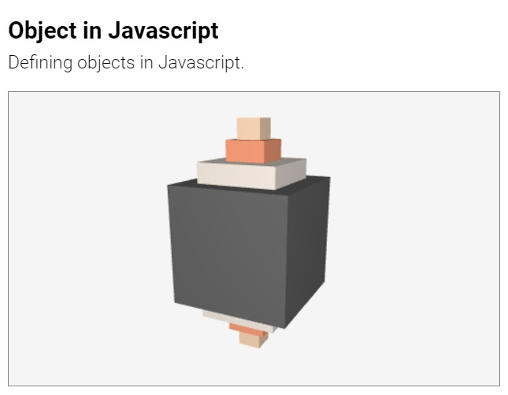
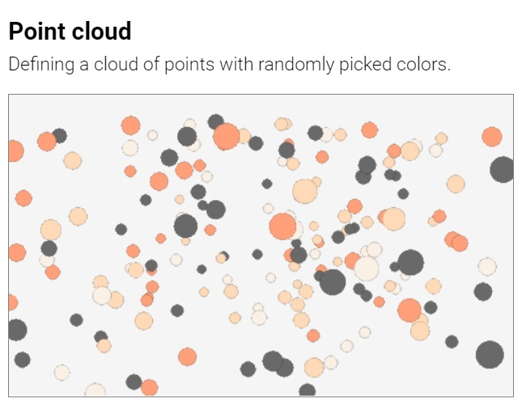

#  Suica User Guide

## Table of contents

- [About](#about) [<small> [Home](../README.md) | [License](../LICENSE) </small>] 
- [Suica canvas](#drawing-canvas) [<small> [&lt;suica&gt;](#tag-suica) | [Background color](#background-color) | [Coordinate system](#coordinate-system) | [Demo mode](#demo-mode) | [Animation loop](#animation-loop) </small>] 
- [Objects](#objects)
    - [Definition](#definition)
    - [Properties](#properties) [<small> [position](#position) | [size](#size) | [orientation](#orientation) | [color](#color) | [image](#image) </small>] 
	- [Common objects](#common-objects) [<small> [point](#point) | [line](#line) | [square](#square) | [square frame](#square-frame) | [cube](#cube) | [cube frame](#cube-frame) | [circle](#circle) | [circle frame](#circle-frame)  | [polygon](#polygon) | [polygon frame](#polygon-frame) </small>]
- [Images and drawings](#images-and-drawings)
- [References](#references) [<small> [Reference guide](reference-guide.md) | [List of examples](examples.md) | [Q&A](#questions-and-answers) </small>] 


## About

**Suica is a JavaScript library** that provides a minimalistic approach to
mobile 3D graphics. Here is a minimal example of a rotating cube in the browser
(*click on the image to run the example*):

[<kbd></kbd>](https://boytchev.github.io/suica/examples/minimal-example.html)

The complete code of this example is:

```html
<!DOCTYPE html>
<script src="suica.js"></script>
<suica>
	<cube>
	<demo>
</suica>
```


Suica is built upon these principles:

- **MINIMAL**<br>Less is more ([details](https://en.wikipedia.org/wiki/Minimalism_(computing))). 

- **DUAL**<br>Objects can be defined as HTML tags or in JS code, and their
properties are defined as tag attributes or function parameters. Using HTML is
a declarative create-and-forget approach, while JS is more suitable for scenes
that require continuous changes.

- **OPTIONAL**<br>All object properties are optional and may be skipped. Due to the
nature of the HTML syntax tag attributes may have any order. However, the order
of function parameters is fixed and only the trailing parameters may be skipped.

- **UNIFORM**<br>Properties are consistent across all objects that share
them. For example, object color is defined and changed in the same way for
points, cubes and spheres.

Browsers have a standard way of reaction on non-standard web pages (e.g. missing
closing tags, unregistered custom tags, etc). This is heavily used in all Suica
examples. Tools that validate HTML pages may complain about Suica HTML code.


## Suica canvas

Suica is distributed as `suica.js` or `suica.min.js` file and is loaded via the
`<script>` tag. Once loaded, the library will look for HTML tags `<suica>` and
use them as drawing canvases for 3D graphics. Suica does not use JS modules in
order to allow easy local development.


### Tag &lt;suica&gt;

The main Suica tag is `<suica>`. It defines a 3D drawing canvas. All other
Suica-specific HTML tags are recognized only if used between `<suica>` and
`</suica>`

```html
<suica>
   <!-- all other Suica tags appear here-->
</suica>
```

The size of the canvas is set via attributes `width` and `height`. Sizes are
measured in pixels. The default size is 500&times;300 pixels. Alternatively,
sizes can be set as CSS properties (either inlined or not), which may use any
CSS unit.

Example of creating drawing canvases with different sizes:

```html
<suica width="400" height="300">
<suica style="width:15em; height:300px;">
```
[<kbd></kbd>](https://boytchev.github.io/suica/examples/tag-suica.html)

The orientation of the coordinate system is set via attribute `orientation`.
More information is available in section [Coordinate system](#coordinate-system).


### Background color

The background color of the drawing canvas can be set as HTML attribute, CSS
style (both inlined and non-inlined), HTML tag and JS function. By default the
background color is [white smoke](https://www.color-hex.com/color/f5f5f5).

```html
HTML/CSS:
<suica background="linen">
<suica style="background: linen;">
<background color="linen">
```
```js
JS:
background( 'linen' );
```

[<kbd></kbd>](https://boytchev.github.io/suica/examples/background.html)


### Coordinate system

The coordinate system in Suica is important as it controls how objects
[positions](#position) and [sizes](#size) are defined. Suica uses Cartesian
3D coordinate system. The tag `<suica>` accepts attribute `orientation` with
values `XYZ`, `XZY`, `YXZ`, `YZX`, `ZXY` and `ZYX` (these are all possible
permutations of the letters *X*, *Y* and *Z*. Each orientation defines a
coordinate system in the following manner:

- the first axis points to the right
- the second axis points upwards
- the third axis point towards the viewer


The default orientation in Suica is *XYZ*. All examples in this user guide use
this orientation, unless explicitely stated that other orientations are used.

```html
HTML:
<suica orientation="xyz">
```
[<kbd></kbd>](https://boytchev.github.io/suica/examples/suica-orientation.html)

The coordinate system is an abstract object and it has no graphical
representation. The command `oxyz`, however, visualizes the system as three
segments with custom size and color. By default the size is 30 and the color
is [black](https://www.color-hex.com/color/000000).

```html
HTML:
<oxyz size="30" color="black">
```
```js
JS:
oxyz( 30, 'black' );
```

[<kbd></kbd>](https://boytchev.github.io/suica/examples/oxyz.html)


### Demo mode

The command `demo` turns on *demo mode* &ndash; atomatic scene rotation. The
parameters define the viewpoint position as distance from the origin of the
the coordinate system and altitude. By default the distance is 100 and the
altitude is 30.

```html
HTML:
<demo distance="100" altitude="30">
```
```js
JS:
demo( 100, 30 );
```

[<kbd></kbd>](https://boytchev.github.io/suica/examples/demo.html)


### Animation loop

The animation approach of Suica is to react every time when the browser is ready
to update the image on the canvas. The command `onTime` registers a user-defined
JS function that adjusts the 3D scene whenever a new frame is required. 

```html
HTML:
<ontime src="loop">
```
```js
JS:
onTime( loop ); // register a new ontime function
onTime( );      // unregister the current ontime function
```

This user-defined function has two parameters &ndash; elapsed times since the
start of Suica *t* and since the previous frame *td*. Both times are measured in
seconds.

```js
JS:
function loop( t, dt )
{
   // code that sets objects properties 
   // depending on times t and dt
}
```

[<kbd></kbd>](https://boytchev.github.io/suica/examples/ontime.html)


## Objects

This section describes the graphical objects in Suica.


### Definition

In Suica object may be created as HTML tag or via JavaScript function. Each
object has properties, however, they are all optional. In HTML the properties
are provided as tag attributes in no specific order. In JavaScript the
properties are provided as function parameters and the order is fixed.

```html
HTML:
<object attribute1="value1" properties2="value2" ...>
```
```js
JS:
object( value1, value2, ... );
```

Objects with names are created as JavaScript variables. In HTML the name is
taken from the `id` attribute. 

```html
HTML:
<point id="p" center="25,0,15">
```
```js
JS:
p = point( [25,0,15] );
```

[<kbd></kbd>](https://boytchev.github.io/suica/examples/object-html.html)
[<kbd></kbd>](https://boytchev.github.io/suica/examples/object-js.html)


### Properties

Most Suica objects share the same basic properties, like position, orientation,
size, color and so on. Some objects have specific properties

#### Position

The position of a Suica object in 3D space is maintained via the property
`center` &ndash; an array of three numbers [*x*, *y*, *z*] for the *x*, *y* and
*z* coordinates (in this order). The actual visual position depends on the
orientation of the (coordinate system](#coordinate-system). All coordinates are
optional. Default values are 0.

```html
HTML:
<point center="25,0,15">
```
```js
JS:
point( [25,0,15] );

p = point( );
p.center = [25, 0, 15];
```

There are alternative properties `x`, `y` and `z` that provide individual access
to the elements of the position. 

```html
HTML:
<point x="25">
```
```js
JS:
p = point( );
p.x = 25;
```

_**Note**: The object [line](#line) is an exception. It has `from` as synonym of
`center`, and it has no `x`, `y` and `z`._

An object as be passed as a center of another object. In this case its center
is used. 

```html
HTML:
<cubeFrame id="a" x="-20">
<cubeFrame id="b" x="20">
<line from="a" to="b">
```
```js
JS:
a = cubeFrame( [20,0,0] );
b = cubeFrame( [-20,0,0] );
line( a, b );
```
[<kbd></kbd>](https://boytchev.github.io/suica/examples/object-as-position.html)

#### Size

The size of a Suica object in 3D space is maintained via the property `size`
that defines how big is the objects along its dimensions. If size is a single
number, that the object if uniformly big. If object's size varies than the
property is an array of three numbers for object's *width*, *height* and
*depth*. The order *width*, *height* and *depth* is fixed and does not depend on
the [orientation of the coordinate system](#coordinate-system). Thus height
corresponds to the axis that is upwards.


Flat objects like squares and circles have no depth.

_**Note <small><sup>1</sup></small>**: Omitting the depth property of a 3D object makes its depth the same
as its width. This maintains uniform horizontal size._

_**Note <small><sup>2</sup></small>**: The object [line](#line) has no size,
width, height and depth._

```html
HTML:
<cube size="25">
<cube size="25,10">
<cube size="25,10,15">
```
```js
JS:
cube( [0,0,0], 25 );
cube( [0,0,0], [25,10] );
cube( [0,0,0], [25,10,15] );
```


[<kbd></kbd>](https://boytchev.github.io/suica/examples/sizes.html)
[<kbd></kbd>](https://boytchev.github.io/suica/examples/sizes-orientation.html)


Alternative access to the size is with the properties `width`, `height` and
`depth`. 

```html
<cube size="3,15,40">
<cube width="3" height="15" depth="40">
```
```js
cube( [0,0,0], [3,15,40] );
a = cube( [0,0,0] );
a.width = 3;
a.height = 15;
a.depth = 40;
```

#### Orientation

TBD


#### Color

Color in Suica can be expressed in a variety of ways. The [RGB scheme](https://www.w3schools.com/colors/colors_rgb.asp) represents colors as three
components *red*, *green* and *blue*, while the
[HSL scheme](https://www.w3schools.com/colors/colors_hsl.asp) components are
*hue*, *saturation* and *lightness*.


| Context | Descriptive<br>name | Hexadecimal<br>number | Normalized<br>RGB array | RGB<br>function | HSL<br>function |
|---|:---:|:---:|:---:|:---:|:---:|
| | <small>[List of color names](https://www.w3schools.com/colors/colors_names.asp)</small>| *RRGGBB*<br><small>*RR*,*GG*,*BB* &isin; [00,FF]</small> | *r*,*g*,*b*<br><small>*r*,*g*,*b* &isin; [0,1]</small> | rgb(*r*,*g*,*b*)<br><small>*r*,*g*,*b* &isin; [0,255] | hsl(*h*,*s*,*l*)<br><small>*h* &isin; [0,360], *s*,*l* &isin; [0,100]</small> |
| Tag<br>attribute | [crimson](https://www.color-name.com/crimson.color) | 0xDC143C | 0.86,&nbsp;0.08,&nbsp;0.24 | rgb(&nbsp;220,&nbsp;20,&nbsp;60&nbsp;) | hsl(&nbsp;348,&nbsp;91,&nbsp;86&nbsp;) |
| CSS<br>property | crimson | #DC143C | | rgb( 220, 20, 60 ) | hsl( 348, 91, 86 ) |
| JS<br>code | "crimson" | 0xDC143C | [0.86,&nbsp;0.08,&nbsp;0.24] | rgb(&nbsp;220,&nbsp;20,&nbsp;60) | hsl(&nbsp;348,&nbsp;91,&nbsp;86) |


#### Image

Images can be stamped onto Suica object via the property `image`. The property
accepts a drawing or a texture image. For more information of how to generate a
drawing or use an image see section [Images and drawings](#images-and-drawings).

When an object has both `color` and `image`, the resulting color is the product
of the RGB normalized colors (i.e. components r,g,b&isin;[0,1]) of the color and
the image pixels. If the object color is [R,G,B] and the image color is [r,g,b],
then the combined color is [R,G,B]&times;[r,g,b] = [R&times;r,G&times;g,B&times;b].
The following tabel shows some combinations of colors:

| Object color | Image color | Resulting color |
|---|---|---|
| White<br><small>[1,1,1]</small> | Any<br><small>[r,g,b]</small> | Image color<br><small>[1,1,1]&times;[r,g,b] = [r,g,b]</small> |
| Black<br><small>[0,0,0]</small> | Any<br><small>[r,g,b]</small> | Black<br><small>[0,0,0]&times;[r,g,b] = [0,0,0]</small> |
| Any<br><small>[R,G,B]</small> | White<br><small>[1,1,1]</small> | Object color<br><small>[R,G,B]&times;[1,1,1] = [R,G,B]</small> |
| Any<br><small>[R,G,B]</small> | Black<br><small>[0,0,0]</small> | Black<br><small>[R,G,B]&times;[0,0,0] = [0,0,0]</small> |
| Red<br><small>[R,0,0]</small> | Any<br><small>[r,g,b]</small> | Only the red component of the image color<br><small>[1,0,0]&times;[r,g,b] = [r,0,0]</small> |
| Yellow<br><small>[1,1,0]</small> | Cyan<br><small>[0,1,1]</small> | Green<br><small>[1,1,0]&times;[0,1,1] = [0,1,0]</small> |


## Common objects

The common objects represents simple shapes, like points, square, cubes, spheres
and so on. Their constructions requires to set just a few properties. Some of
the objects have framed variants, where only their edges are drawn with lines.
The width of the lines is 1 pixels and this limitation is set in the underlying
technology.


### Point

The object `point` represents a point. Its properties are `center` (or `x`, `y`
and `z`), `size`, `color` and `image`. By default a point is drawn as a small
cirlce, but it can be changed with custom [drawing](#images-and-drawings).

```html
HTML:
<point center="25,0,15">
<point center="25,0,15" size="10" color="red">
<point x="25" y="0" z="15" size="10" color="red">
```
```js
JS:
point( [25,0,15] );
point( [25,0,15], 10, 'red' );
```

[<kbd></kbd>](https://boytchev.github.io/suica/examples/point.html)&emsp;[<kbd></kbd>](https://boytchev.github.io/suica/examples/point-cloud.html)


### Line

The object `line` represents a segment. Its properties are `center` (or `from`),
`to`, `color` and `image`. The properties `center` and `from` are synonyms and
they set the starting point of the segment, while `to` sets the ending point. By
default a line is drawn as solid line, but it can be changed with custom
[drawing](#images-and-drawings).

```html
HTML:
<line center="25,0,15" to="100,-20,35">
<line from="25,0,15" to="100,-20,35">
```
```js
JS:
line( [25,0,15], [100,-20,35] );
point( [25,0,15], [100,-20,35], 'red' );
```

[<kbd></kbd>](https://boytchev.github.io/suica/examples/line.html)

_**Note**: Lines have no properties x, y, z, size, width, height and depth._


### Square

The object `square` represents a solid square or rectangle. Its properties are
`center` (or `x`, `y` and `z`), `size` (or `width` and `height`), `color` and
`image`. 

```html
HTML:
<square center="25,0,15">
<square x="25" y="0" z="15" size="10">
```
```js
JS:
square( [25,0,15] );
square( [25,0,15], 10, 'red' );
```

[<kbd></kbd>](https://boytchev.github.io/suica/examples/square.html)
[<kbd></kbd>](https://boytchev.github.io/suica/examples/rectangle.html)


### Square frame

The object `squareFrame` represents a wireframed square or rectangle. Its
properties are `center` (or `x`, `y` and `z`), `size` (or `width` and `height`),
`color` and `image`.

```html
HTML:
<squareFrame center="25,0,15">
<squareFrame x="25" y="0" z="15" size="10">
```
```js
JS:
squareFrame( [25,0,15] );
squareFrame( [25,0,15], 10, 'red' );
```

[<kbd></kbd>](https://boytchev.github.io/suica/examples/square-frame.html)
[<kbd></kbd>](https://boytchev.github.io/suica/examples/rectangle-frame.html)


### Cube

The object `cube` represents a solid cube or cuboid. Its properties are `center`
(or `x`, `y` and `z`), `size` (or `width`, `height` and `depth`), `color` and
`image`. 

```html
HTML:
<cube center="25,0,15">
<cube x="25" y="0" z="15" size="10">
```
```js
JS:
cube( [25,0,15] );
cube( [25,0,15], 10, 'red' );
```

[<kbd></kbd>](https://boytchev.github.io/suica/examples/cube.html)
[<kbd></kbd>](https://boytchev.github.io/suica/examples/cuboid.html)


### Cube frame

The object `cubeFrame` represents a wireframed cube or cuboid. Its properties
are `center` (or `x`, `y` and `z`), `size` (or `width`, `height` and `depth`),
`color` and `image`.

```html
HTML:
<cubeFrame center="25,0,15">
<cubeFrame x="25" y="0" z="15" size="10">
```
```js
JS:
cubeFrame( [25,0,15] );
cubeFrame( [25,0,15], 10, 'red' );
```

[<kbd></kbd>](https://boytchev.github.io/suica/examples/cube-frame.html)
[<kbd></kbd>](https://boytchev.github.io/suica/examples/cuboid-frame.html)


### Circle

The object `circle` represents a solid circle or ellipse. Its properties are
`center` (or `x`, `y` and `z`), `size` (or `width` and `height`), `color` and
`image`. 

```html
HTML:
<circle center="25,0,15">
<circle x="25" y="0" z="15" size="10">
```
```js
JS:
circle( [25,0,15] );
circle( [25,0,15], 10, 'red' );
```

[<kbd></kbd>](https://boytchev.github.io/suica/examples/circle.html)
[<kbd></kbd>](https://boytchev.github.io/suica/examples/ellipse.html)


### Circle frame

The object `circleFrame` represents a wireframed circle or ellipse. Its
properties are `center` (or `x`, `y` and `z`), `size` (or `width` and `height`),
`color` and `image`.

```html
HTML:
<circleFrame center="25,0,15">
<circleFrame x="25" y="0" z="15" size="10">
```
```js
JS:
circleFrame( [25,0,15] );
circleFrame( [25,0,15], 10, 'red' );
```

[<kbd></kbd>](https://boytchev.github.io/suica/examples/circle-frame.html)
[<kbd></kbd>](https://boytchev.github.io/suica/examples/ellipse-frame.html)


### Polygon

The object `polygon` represents a solid regular polygon. Its properties are
`count`, `center` (or `x`, `y` and `z`), `size` (or `width` and `height`),
`color` and `image`. The property `count` defines the number of sides of the
polygon.

```html
HTML:
<polygon count="3" center="25,0,15">
<polygon count="5"  x="25" y="0" z="15" size="10">
```
```js
JS:
polygon( 3, [25,0,15] ); // triangle
polygon( 5, [25,0,15], 10, 'red' ); // pentagon
```

[<kbd></kbd>](https://boytchev.github.io/suica/examples/polygon.html)

_**Note:** Properties size, width and height refer to the polygon circumscribed
circle, rather than the polygon itself._


### Polygon frame

The object `polygonFrame` represents a wireframed regular polygon. Its
properties are `count`, `center` (or `x`, `y` and `z`), `size` (or `width` and
`height`, `color` and `image`. The property `count` defines the number of sides
of the polygon.

```html
HTML:
<polygonFrame count="3" center="25,0,15">
<polygonFrame count="5" x="25" y="0" z="15" size="10">
```
```js
JS:
polygonFrame( 3, [25,0,15] ); // triangle
polygonFrame( 5, [25,0,15], 10, 'red' ); // pentagon
```

[<kbd></kbd>](https://boytchev.github.io/suica/examples/polygon-frame.html)

_**Note:** Properties size, width and height refer to the polygon circumscribed
circle, rather than the polygon itself._


## Images and drawings

TBD

[<kbd></kbd>](https://boytchev.github.io/suica/examples/point-image.html)&emsp;[<kbd></kbd>](https://boytchev.github.io/suica/examples/cube-image.html)


## References

### Reference guide

A reference guide and code templates are collected [here](reference-guide.md)

### List of examples

All examples are collected in a single page [here](examples.md)

### Questions and answers

#### How to change the attribute of an object created in HTML?

The prefered way is to create the object with a name in attribute `id`. Suica
will create a global variable with that name, which can be modified. The
alternative way is to modify the attribute itself with a string value.

```html
HTML:
<cube id="a">
```
```js
JS:
// using object properties
a.size = 10;

// using tag attributes
cube = document.getElementsByTagName( 'cube' )[0];
cube.setAttribute( 'size', 10 );
```

[<kbd></kbd>](https://boytchev.github.io/suica/examples/qa-property-modification.html)
[<kbd></kbd>](https://boytchev.github.io/suica/examples/qa-attribute-modification.html)
[<kbd></kbd>](https://boytchev.github.io/suica/examples/qa-attribute-modification-button.html)


---

February, 2022