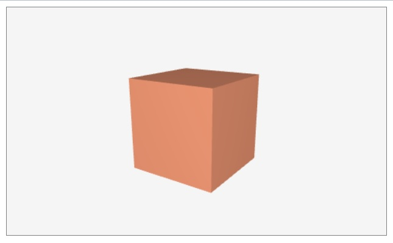

# Suica Examples

Click on an image to run the example.

[<kbd></kbd>](https://boytchev.github.io/suica/examples/minimal-example.html)

[<kbd></kbd>](https://boytchev.github.io/suica/examples/tag-suica.html)

[<kbd></kbd>](https://boytchev.github.io/suica/examples/suica-orientation.html)

[<kbd></kbd>](https://boytchev.github.io/suica/examples/background.html)

[<kbd></kbd>](https://boytchev.github.io/suica/examples/oxyz.html)

[<kbd></kbd>](https://boytchev.github.io/suica/examples/demo.html)

[<kbd></kbd>](https://boytchev.github.io/suica/examples/ontime.html)

[<kbd></kbd>](https://boytchev.github.io/suica/examples/point.html)

[<kbd></kbd>](https://boytchev.github.io/suica/examples/point-cloud.html)

[<kbd></kbd>](https://boytchev.github.io/suica/examples/point-image.html)

[<kbd></kbd>](https://boytchev.github.io/suica/examples/cube.html)

[<kbd></kbd>](https://boytchev.github.io/suica/examples/cube-image.html)

[<kbd></kbd>](https://boytchev.github.io/suica/examples/cubeFrame.html)

